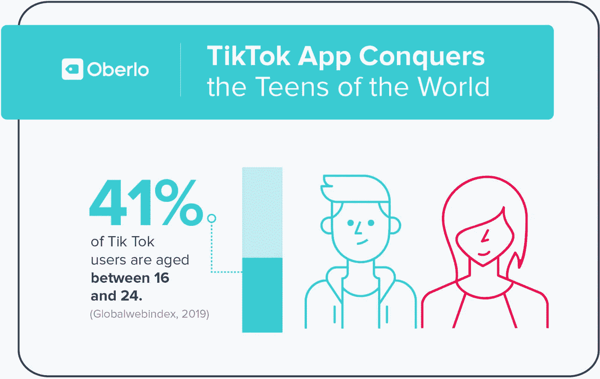

# 作为政治武器的抖音教

> 原文：<https://towardsdatascience.com/tiktok-as-a-weapon-2f0d33b2d0cd?source=collection_archive---------27----------------------->

Photo: Merzmensch

  T 嘿对口型。他们做出夸张的面部表情。他们爱自己。他们在寻求恭维。**虚荣的一代。这至少是我对 **Musical.ly** 背后的随机表演者的第一印象。我的第二印象是。甚至是我的第三个。**

**一方面**——很高兴看到这么多年轻人想要做一些有创意的事情，进行数字交流，寻找新的想法和合作项目。(单看设置和视频剪辑就不明显了)。
*数字能力！*

**另一方面**——大部分表演都在重复其他的表演。这不仅仅是一场比赛——看起来整个完美学习的刻板手势库比应用程序内的音乐库要有限得多。喜欢你的默认角色动画集从*堡垒之夜*。

Just random one of zillions samples (without music). I mean, they try and have fun, and it’s fine and all.

# 但后来中国开始发挥作用。

**停止。假新闻。**由 **Alex Zhu** 和**杨鲁豫**、 ***上海-* 基地团队**开发并于 2014 年发布[(哦，我猜是评论中即将出现的地缘政治讨论)，他们最初想将其用于教育需求(实际上是个很酷的想法)。然后重点转向娱乐和音乐短片，增长令人印象深刻:](https://variety.com/2016/digital/news/musically-lively-bigger-than-periscope-1201875105/)

**2015**—1000 万用户
**2016**—9000 万用户
**2017** — 200 万用户

**2018** 被**字节跳动**以**10 亿美元**收购，并与自己的 App——**musical . ly 合并成为抖音**。目前全球有 **5 亿活跃用户**。

# 平台的大陆漂移——和心态。

我们无时无刻不在经历着。脸书不再是 T2 了。**推特**是为*老年人*准备的。 **LinkedIn** 是*专业*网络。 **Snapchat** 显然是新的，但是*仍然不能令人信服*，基本上是由于易腐的内容。但是**抖音**！每个人都在谈论抖音。

这不仅仅是你在校园里流行的另一款青少年应用。

加里·维纳查克正在为抖音向世界传福音。

 [## 为什么抖音(前 Musical.ly)应用如此重要| GaryVaynerchuk.com

### 几年来，我一直在密切关注抖音的应用程序(以前的 Musical.ly ),我看到了它的进步…

www.garyvaynerchuk.com](https://www.garyvaynerchuk.com/why-tiktok-formerly-musical-ly-app-is-important/) 

他指出了这款应用背后的创造力:

> 1.抖音的应用程序是未来有影响力的人和内容创作者的“训练轮”2。他们抓住了一个新的人口统计数据
> 3。它可以为其他平台铺平道路，给创作者一个“创造”的框架

事实上，这个应用程序有潜力孵化新的人才，教育他们，并在病毒的翅膀上提供新的可能性。已经提到的编辑技能变得更加训练有素，每一个新的复杂的 AR 滤镜更新。在一个非常短的视频剪辑中结合视频片段和音乐是一个挑战——正如**Anton echov**曾经说过的:

> Краткость — сестра таланта.//“简洁是才华的姐妹。”

# 抖音是“国家安全威胁”(对任何国家而言)

另一方面，抖音被美国彼得森国际经济研究所称为“对西方的国家安全威胁”，因为世界范围内(但主要是美国)的个人和生物数据暴露在中国服务器上。嗯，筒仓不好。所有数据都已经保存在 Fort Meade 中——现在又多了一个无法控制的利益相关者。它有另一个议程。有人认为，ISIS 用肮脏的信息占领了抖音，这和谷歌在 YouTube 上遇到的问题是一样的。

然后我们还有几个**有趣的事件**。它们令人大开眼界。他们展示了什么是可能的。它们显示了抖音的破坏性影响。

# Feroza Aziz 和#ChinaCables

What begins as a usual make-up video tutorial becomes an urgent political message to followers:

> I’m going to teach you guys how **to get long lashes**. The first thing you need to do is get your lash curler, curl your lashes — obviously — then you’re going to put them down and **use your phone that you’re using right now to search what’s happening in China**.

She [raises awareness](https://edition.cnn.com/2019/11/27/tech/tiktok-xinjiang-eyelash-curling-scli-intl-hnk/index.html) about a disastrous ongoing situation with Uyghur Muslims in China. This is also in focus by the #ChinaCables, leaked papers ([published by New York Times](https://www.nytimes.com/interactive/2019/11/16/world/asia/china-xinjiang-documents.html)) documenting more than the questionable state of being in the so-called “Re-education camps”. Actually, the apparent infringement of human rights.

Her video was blocked, account temporarily disabled, now it’s online again (officially by TikTok due to [some admin issues](https://www.dazeddigital.com/science-tech/article/46980/1/tiktok-reinstates-banned-teen-feroza-aziz-criticised-china-uighur-muslims)).

It was not the first time for TikTok to confront political issues. Recently BuzzFeedNews reported about apparent censoring of pro-HongKong democracy messages by TikTok users.

 [## TikTok Users Are Finally Posting About Hong Kong, But Only To See If They'll Get Censored

### The short-form video app TikTok can't shake an air of suspicion that surrounds it in the United States. On Thursday…

www.buzzfeednews.com](https://www.buzzfeednews.com/article/ryanhatesthis/tiktok-users-are-finally-posting-about-hong-kong-but-only) 

At the same time, a TikTok spokesperson answered to BuzzFeedNews:

> “Our content and moderation policies are led by our US-based team and are not influenced by any foreign government. […] The Chinese government does not request that TikTok censor content. To be clear: We do not remove videos based on the presence of Hong Kong protest content.” ([Source](https://www.buzzfeednews.com/article/ryanhatesthis/tiktok-users-are-finally-posting-about-hong-kong-but-only))

The messages *didn’t have the virality, sufficient to be upvoted and get viral within the TikTok network*, they said. Other than dancing teens.

[According to the Guardian report](https://www.theguardian.com/technology/2019/sep/25/revealed-how-tiktok-censors-videos-that-do-not-please-beijing), there were previously strict guidelines (restricting topics like political demonstrations etc.).

 [## Revealed: how TikTok censors videos that do not please Beijing

### TikTok, the popular Chinese-owned social network, instructs its moderators to censor videos that mention Tiananmen…

www.theguardian.com](https://www.theguardian.com/technology/2019/sep/25/revealed-how-tiktok-censors-videos-that-do-not-please-beijing) 

但是[在字节跳动发表官方声明后](https://www.theguardian.com/technology/2019/sep/25/revealed-how-tiktok-censors-videos-that-do-not-please-beijing)这些指导方针在 2019 年 5 月就已经过时了，远在香港示威游行之前:

> 正在讨论的旧准则已经过时，不再使用。如今，我们采取本地化的方法，包括本地版主、本地内容和审核政策、全球政策的本地细化等等。([来源](https://www.theguardian.com/technology/2019/sep/25/revealed-how-tiktok-censors-videos-that-do-not-please-beijing)

也就是说，中国政府没有直接命令审查视频——现在这是当地团队的任务([那些团队，他们最近禁止了亲 LGBT 内容 btw](https://www.theguardian.com/technology/2019/sep/26/tiktoks-local-moderation-guidelines-ban-pro-lgbt-content) )。).

# 但不仅仅是关于中国。

还有**梅奥皮特案**。这是抖音青少年对民主党 2020 年皮特·布蒂吉格总统候选人的绰号。他们批评他所有的失礼和失态。这不仅仅是关于网络欺凌(有趣的是，这个故事开始于 Reddit，但在抖音变得活跃)。

《麻省理工技术评论》确信:

即使在选举期间，抖音仍然被政客们忽视。最常见的误解是:由于抖音的普通用户是青少年，不具备选举资格(18 岁为法定投票年龄)，所以这没关系。

不对。

([Source](https://www.oberlo.com/blog/tiktok-statistics))

**常见的危险是:**忽视这种新的养育社交网络会导致，嗯，后果。

> 不在那里是危险的。

并不是说要追随每一次炒作。这不是偷偷进入每一个小应用程序。这是关于识别有影响力的平台并采取行动。

应该采取什么行动？麻省理工学院评论建议:

> 抖音帮助迷因像病毒一样传播，它可以很容易地在对话中注入一个候选人。最终，这不就是一个候选人想要的吗？

的确，**唯一的办法就是——参与**。来回答。来回复。不是芭芭拉·史翠珊式的。但频率相同。这也会像病毒一样传播开来。

# 和艾

作为一个人工智能用例，病毒式传播对这款应用至关重要。字节跳动(抖音背后的公司)正在广泛使用人工智能:

*   CBInsight 将该公司列入其 2018 年度人工智能 100 强名单
*   BuzzFeed 的新闻头条竞争对手“[今日头条](https://en.wikipedia.org/wiki/Toutiao)”正在向其 1.2 亿用户发布与*相关的*新闻。日常用户借助 AI。
*   自 2016 年以来，字节跳动正在运行自己的[人工智能实验室](https://ailab.bytedance.com/)。

Bernard Marr 描述了[字节跳动](https://bernardmarr.com/default.asp?contentID=1769)的人工智能算法(无可否认，抖音视频交付算法可以应用这些算法):

> 该公司的智能机器使用计算机视觉和自然语言处理技术来理解和分析书面内容、图像和视频。然后，基于机器对每个用户的了解，它们会提供它认为每个用户想要的内容。

如果我们走远一点，你会怎么想，这种基于人工智能的交付会有政治偏见吗？比方说，如果人工智能获得了避免特定话题的“警报触发器”？

脸书/推特/领英对抖音的选择性算法？

欢迎在评论中分享你的观点。