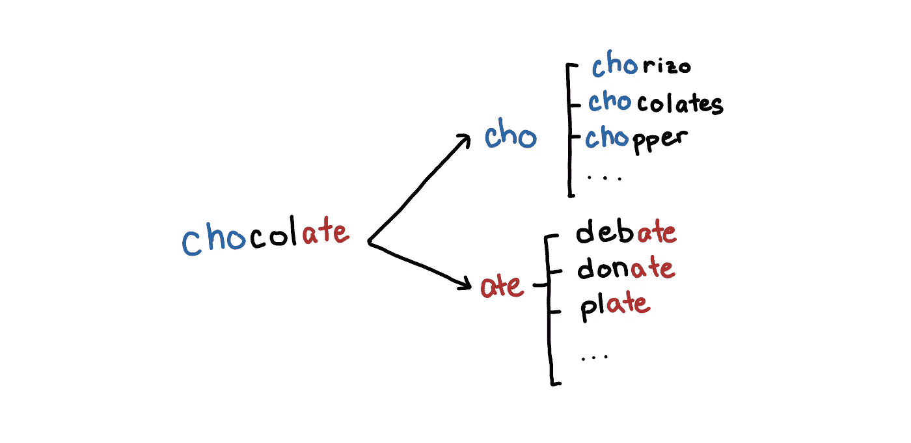

# 数据科学家的时间复杂性

> 原文：<https://towardsdatascience.com/time-complexity-for-data-scientists-664d00e57724?source=collection_archive---------13----------------------->


[Pixabay](https://www.pexels.com/@pixabay?utm_content=attributionCopyText&utm_medium=referral&utm_source=pexels) from [Pexels](https://www.pexels.com/photo/altitude-clouds-cold-daylight-417173/?utm_content=attributionCopyText&utm_medium=referral&utm_source=pexels)

大数据是硬的，大数据的挑战体现在推理和计算两个方面。随着我们向更精细和个性化的推理发展，我们面临着在个人层面产生**、可信和透明的推理和决策的挑战[1]。现在，我们将关注“及时性”的挑战，并尝试获得关于某些算法如何扩展以及它们是否可用于处理大规模数据集的直觉。**

*在推论中，**永远没有“足够”的数据**。随着你获得越来越多的数据，你可以开始细分数据，以获得更好的群体洞察力，如年龄组，性别，或社会经济阶层[2]。*

> *n 永远不够，因为如果它“足够”的话，你就已经开始下一个需要更多数据的问题了。—安德鲁·盖尔曼*

*这种对数据无法满足的需求带来了计算(和成本)方面的挑战。这些问题中的一部分可以通过并行化使用大量的计算资源用“*蛮力*来解决。如果没有合适的方法，其他问题在计算上是很难处理的。*

*简单地说，数据的大小对我们可以使用的算法和方法提出了物理约束。因此，作为数据科学家和问题解决者，重要的是我们要意识到我们的某些模型、算法和数据结构是如何工作的，以及它们在大规模下是如何表现的。这意味着我们应该熟悉我们可用的工具以及何时使用它们。*

## *期待什么*

*这是一篇相当长的文章，有 4 个部分。在第 1 部分和第 2 部分中，我试图对算法和时间复杂性进行深入(希望是直观的)介绍。如果你对时间复杂性相当熟悉，那么你可以跳到第 3 部分和第 4 部分。*

1.  *[**时间复杂度入门:**](#9c29) 什么是时间复杂度，它对我有什么影响，我该如何看待它？*
2.  *[**从慢到快算法**](#1a44) **:** 什么让一个算法变快？同一个问题的两个解决方案怎么会有完全不同的速度？*
3.  *[**基本操作**](#0036) **:** 我做的一些常规事情有多快/慢？*
4.  *[**两两距离问题**](#f650) **:** 如何快速找到最近邻？如何快速找到相似和近似重复的文档？我的聚类算法有多快？*

# *时间复杂性入门*

**

*让我们从一些例子开始，让您了解如何考虑算法和时间复杂性。如果你对时间复杂性相当熟悉，你可以跳过这一节。*

## *两个列表的交集*

*几年前，我的一个同事被要求对他们平台的*常客进行描述性统计。他首先获得了本月的客户名单，并将其与上个月的客户进行比较。他有两个 python 列表`curr_cust`和`prev_cust`，他的代码看起来像这样:**

```
*common_cust = 0
for cust in curr_cust:
    if cust in prev_cust:
        common_cust += 1*
```

*他从每月大约 4000 名客户的样本列表开始，这段代码片段运行了大约 30 秒。当这用于大约 300 万客户的完整列表时，这几行代码似乎会永远运行下去。*

*是因为 Python 就是慢吗？我们是否应该转向 C/Go 进行优化？我们需要为此使用分布式计算吗？答案是否定的。这是一个非常简单的问题，修复更简单，只需 1 秒钟左右。*

```
*common_cust = 0
**prev_cust_set = set(prev_cust)** for cust in curr_cust:
    if cust in **prev_cust_set**:
        common_cust += 1*
```

*对于具有计算机科学或一般编程背景的人来说，这个修正应该是相当明显的。但是可以理解的是，来自不太重视计算的背景的人可能看不出上面两个代码片段有什么不同。*

*简而言之，这种差异可以归结为 python `list`和`set`之间的差异。一个`set`被设计用来快速完成这些`"is this element in"`操作。**即使您将** `**prev_cust_set**` **中的元素数量增加一倍，操作** `**cust in prev_cust_set**` **也需要同样长的时间。***

*另一方面，**如果将** `**prev_cust**` **的大小增加一倍，那么** `**cust in prev_cust**` **的运行时间就会增加一倍**。如果您想知道`set`是如何做到这一点的，它使用了类似于*散列表/散列表集、*的数据结构，这也可以用某种版本的二叉查找树来实现。*

## *时间复杂性和大 O*

*我们知道代码片段之间存在差异，但是我们如何表达这种差异呢？这就是大 O 符号的由来。*

*虽然大 O 有正式的定义，但你主要可以把它看作是一台机器完成算法所做的“运算”次数的估计。操作的数量与“运行时间”密切相关，它通常与数据的大小有关。您可能会听到类似于*“经典的 SVD 分解具有立方复杂度。”以及你在所用算法的文档中可能遇到的一些东西。**

**

*Big O’s in scikit-learn’s documentation*

*如果我们查看 [python 关于时间复杂度](https://wiki.python.org/moin/TimeComplexity)的文档，我们可以读到具有形式`x in s`的操作:*

*   *O(n)如果`s`是一个`list`*
*   *O(1)如果`s`是一个`set`*

**

*我们从`list`的例子开始看，它是 O(n)，其中`n`是每月的客户数。*

**

*一般步骤是:*

*   *我们遍历`curr_cust`中的每个客户，这里有`n`个客户*
*   *对于每个客户`cust`，我们检查它是否在列表`prev_cust`中。根据文档，这是 O(n ),但直觉上，要做到这一点，我们可能需要检查`prev_cust`中的每个客户，看看`cust`是否是其中之一。`prev_cust`中有`n`个客户，所以这最多需要`n`次操作*
*   *添加号码只需 1 步。*

*循环的每次迭代大约需要 O(n) + O(1)步，循环中有 n 次迭代，所以把所有的 n(O(n) + O(1)) = O(n)。*

*你可以把 0 相加相乘，当你有几项时，你只需要去掉低阶项和系数。O(n +n) = O(n)。*

*我们可以使用`set`对代码做同样的事情，唯一的区别是`cust in prev_cust_set`运行时间为 O(1 )(平均)。*

**

*一般步骤是:*

*   *有一个预处理停止来创建集合。我们就当这是 O(n)吧*
*   *我们循环遍历`curr_cust`中的每个客户，这里有`n`个客户*
*   *对于每个客户`cust`，我们检查其是否在列表`prev_cust_set`中。这需要 O(1)*
*   *添加号码只需 1 步。*

*综合起来:O(n) + n(O(1) + O(1)) = O(2n) = O(n)。与`list`实现相比，`set`快得惊人。*

## *解读大 O*

*所以我们有一个 O(n)的算法和另一个 O(n)的算法。你对此如何解读？*

*看待这个问题的一种方式是通过插入数据集的估计值 n 来估计问题的大小。如果我们的数据大小为 300 万，那么对于 O(n)算法将有大约 3000000 次操作，大约为 900000000000，这是一个很大的数目。*

*相同的数据集，但是使用 O(n)算法，将有大约 3000000 次操作，这更容易管理。*

*回想一下，在计算大 o 时，我们忽略了低阶项和系数，因此精确值在这里并不重要。我们只看问题的严重性。百万次运算算法比十万亿次运算算法好得多。*

*看待这个问题的另一种方式是获得两个数据集大小之间的相对比率。如果有每种算法的经验基准，并希望在扩大规模时进行推断，这将非常有用。*

*假设在`40000`的客户那里，`list`算法花费了 30 秒。如果我们将数据量增加一倍，需要多长时间？所以我们现在有一个大小为 2n 的数据集。那么运行时间将是大约*

*O((2n) ) = O(4n)*

*这意味着将 O(n)的数据集大小加倍会使运行时间增加 4 倍。我们预计它将运行 120 秒左右。*

*另一方面，对于`set`算法来说等于 O(2n)这就意味着数据集翻倍只是运行时间翻倍。*

**

*性能上的大差异来自于`cust in prev_cust`和`cust in prev_cust_set`的细微差别。当我们使用的很多代码都是从我们使用的模块中抽象出来的时候，这些差异就很难注意到了。*

*大 O 符号为我们提供了一种方式来总结我们对上述两种算法如何扩展的见解。我们可以比较 O(n)和 O(n ),而不知道每个算法是如何实现的。这正是我们在使用`x in prev_cust_set`是 O(1)这一事实时所做的，而没有描述`set`是如何实现这一点的。大 O 给我们的是一种通过描述运行时间相对于输入大小的一般形状来抽象算法的方法。*

*意识到这些差异有助于我们判断一个只有少量数据样本的特定方法在生产中是否可以扩展。你不希望发生在你身上的事情是，在一个小样本上做一个实验或概念验证，展示好的结果，从利益相关者那里得到一个行动信号，却发现你的算法不能处理所有的数据。*

*另一方面，如果您知道数据集不是海量的，那么您可以选择使用较慢的算法和模型，这些算法和模型要么给出更好的结果，要么实现和维护更简单。*

# *从慢速算法到快速算法*

**

*在我们开始探索我们在数据科学中使用的不同工具和技术的时间复杂性之前，我将首先介绍解决一个简单得多的问题的方法，即**范围查询**问题。对于每种算法，我们简要讨论它是如何工作的，以及随之而来的特性。希望在经历了这一系列算法之后，你会对算法和时间复杂性有更好的感觉。*

## *范围查询问题*

*假设我们有一个大小为 n 的数组。*

```
*arr = [443, 53, 8080, 420, 1989, 42, 1337, 8008]*
```

*在上面的示例中，索引从 0:*

*   *`arr[0] = 443`*
*   *`arr[1] = 53`*
*   *`arr[4] = 1989`*

*您的任务是为某个查询`query(a, b).`获取索引`a`和`b`之间所有数字的总和*

*假设查询是`query(2, 5)`。那么答案应该是`10531`*

```
*arr[2] + arr[3] + arr[4] + arr[5] 
8080 + 420 + 1989 + 42 
10531*
```

*另一个可能的可选操作是更新数组中的元素`update(idx, new_val)`*

```
*update(3, 88)
query(2, 5)# arr[2] + arr[3] + arr[4] + arr[5] 
# 88 + 420 + 1989 + 42 
# 3539*
```

## *天真的解决方案*

*最简单的解决方案是遍历列表并得到总和。*

```
*def query(a, b): 
    return sum(arr[a: b+1])*
```

*上面的代码虽然代码很少，但实际上已经在做很多事情了。为了清楚起见，我们将把`sum(arr[a: b+1])`分解为以下查询:*

```
*def query(a, b):
    ret = 0
    for i in range(a, b+1):
        ret += arr[i]
    return ret*
```

*`query(.)`的总复杂度基于查询范围内有多少元素。这取决于`a`和`b`，元素总数之和为`b — a + 1`，在处理大 O 记法时，我们看这个值的最坏情况，在查询整个数组的和时，这个值最高可达`N`。*

**

*要更新数组，我们只需更新特定索引上的元素:*

```
*def update(idx, new_val):
   arr[idx] = new_va*
```

*这个`update(.)`函数显然是在 O(1)时间内运行的，或者是在常数时间内运行的。无论数组有多大，这个函数都运行相同数量的操作。*

*对于简单的解决方案，我们有以下时间复杂性:*

*   ***查询:** O(N)*
*   ***更新:** O(1)*

*这样做的问题是，如果数组被查询很多次，那么对于每个查询，都有一个 O(N)操作。对于`q`查询，你总共会有 O(qN)个解。*

*这可以接受吗？看情况。如果你有一个大的数组和大量的查询，那么这是不可接受的。想象一下，对于一个规模为 1，000，000 的阵列，您有大约 1，000 个查询。*

*如果数据很小，那么像这样的问题就变得微不足道了。*

## ***前缀总和***

*为了解决简单解决方案的缺点，我们引入使用一个**前缀和。我们转换了原始数组，这样查询速度会更快。***

*前缀 some `arr_sum`是一个数组，其中特定索引处的值是原始数组中直到该索引的所有元素的总和。*

```
*arr = [443, 53, 8080, 420, 1989, 42, 1337, 8008]arr_sum[0] = 0
arr_sum[1] = arr[0]
arr_sum[2] = arr[0] + arr[1]
arr_sum[3] = arr[0] + arr[1] + arr[2]
...
arr_sum[8] = arr[0] + arr[1] + arr[2] ... + arr[7]*
```

*然而，前缀和的这种特殊构造是缓慢的。构建`arr_sum`需要 O(N)个时间，因为`arr_sum`中有 N 个单元要填充，每个单元加起来有 N 个`arr`的元素。*

*我们可以通过注意到`arr_sum[3]`和`arr_sum[2]`之间唯一的区别是`arr[2]`来更有效地构造`arr_sum`*

```
*arr_sum[2] = arr[0] + arr[1]
arr_sum[3] = arr[0] + arr[1] + arr[2]
arr_sum[3] = arr_sum[2] + arr[2]*
```

*因此，`arr_sum`的一个更好的结构如下*

```
*arr_sum[0] = 0
arr_sum[1] = arr_sum[0] + arr[0]
arr_sum[2] = arr_sum[1] + arr[1]
arr_sum[3] = arr_sum[2] + arr[2]
...
arr_sum[8] = arr_sum[7] + arr[7]*
```

*这需要 O(N)时间，因为仍然有 N 个单元，但是每个单元只需要计算 2 个值。如果操作正确，`arr_sum`将导致:*

```
*arr_sum = [0, 443, 496, 8576, 8996, 10985, 11027, 12364, 20372]*
```

*现在我们如何使用它？如果我们有一个对`2`和`5`的查询，那么我们可以使用从 0 到 5 的前缀总和，并从中减去从 0 到 1 的前缀总和，得到从 2 到 5 的总和。*

```
*def query(a, b):
    return arr_sum[b+1] - arr_sum[a]*
```

**

*Getting the sum of index 2 to 5*

*在某种程度上，我们拥有任何查询答案的*缓存*。我们预计算了一些在查询中对我们有帮助的值。需要明确的是，无论`query(a, b)`的范围有多大，函数只需要查找 2 个值，所以查询时间是常数，O(1)。*

*如果需要`update`操作怎么办？那么更新单个元素将意味着包含该元素的所有前缀总和也需要被更新。这意味着我们可能需要重建前缀和，这需要 O(N)时间。*

*对于前缀和算法，我们有以下时间复杂度:*

*   ***查询:** O(1)*
*   ***更新:** O(N)*

*我们看到了优化查询和更新之间的权衡。如果我们优化查询，那么它要求我们维护一个数据结构(我们拥有的前缀总和数组是一个数据结构)，并且当涉及到更新原始数组的元素时，这有开销。但是，我们不想维护数据结构，那么每个查询都需要我们遍历查询范围内的每个元素。*

## *分割树*

*我们构建的能够平衡查询和更新的特定数据结构是段树。这是一棵二叉树，其中每个节点代表一个段。*

*在下图中，我们有一个从`arr`构建的细分树。底部的叶节点是原始数组的元素，每个节点的值只是其子节点的总和。*

```
*arr = [443, 53, 8080, 420, 1989, 42, 1337, 8008]*
```

**

*Segment tree constructed from arr*

*我们重新标记了上面的树，以突出每个节点所代表的部分。最顶端的节点包含从索引 0 到 7 的整个数组的总和。*

**

*The number beside the node represents the range of indices of the segment it represents*

*那么，我们如何从中查询呢？这个概念类似于前缀 sum，我们可以使用预先计算好的数组片段来计算查询的范围。这里的区别在于，段树在它所能表示的段上更加灵活。*

*假设我们想找到`query(2, 5)`。获得突出显示的节点的总和将得到正确的答案。虽然证明并不简单，但是与原始数组的实际大小相比，您需要访问的节点数量自然非常少。此操作需要 O(log n)时间。*

**

*Getting the sum from elements 2 to 5*

*下面是另一个查询示例。比方说我们`query(3, 7)`*

**

*Getting the sum from elements 3 to 5*

*由于段树的制作方式，当我们更新一个叶节点时，唯一需要更新的节点是叶节点和根节点之间的节点。下面我们看到，如果我们在 5 更新元素，需要更新哪些节点。这个操作也需要 O(log n)时间，因为树上的每个节点都将所表示的段的大小加倍。*

**

*Nodes that need to be updated when updated element 5*

*对于分段树数据结构，我们有以下时间复杂性:*

*   ***查询:** O(登录号)*
*   ***更新:** O(登录号)*

*有了更复杂的数据结构，我们能够平衡查询和更新之间的权衡。然而，这种数据结构实现起来要复杂得多。这里将不讨论段树的确切实现。*

***注:**通常在段树之前讨论的一个常用算法是[芬威克树](https://en.wikipedia.org/wiki/Fenwick_tree)。虽然 Fenwick 树更容易实现，但我觉得 segment 树更直观。所以我选择不讨论这个。*

## *甚至更快的算法？*

*如你所见，我们处理问题的方式可以极大地改变我们算法的性能(从二次到对数线性性能)。这可能需要做一些巧妙的预处理，找到一种更有效地表示数据的方法，或者使用数据的一些属性。*

*减轻这种情况的一种方法是投入更多的计算资源。然而，我们拥有的一些算法是在你拥有这台强大机器的时代设计的。这些可能不适合并行化。*

*然而，有一些问题，找到更快的算法可能非常困难，最快的算法仍然不够快。在这种情况下，找到更快解决方案的一种方法是放松问题。上面讨论的解决方案给出了精确的解决方案，但有些时候我们不需要最佳答案。我们需要的是足够好的答案。*

*我们可以通过以下几种方式之一来实现这一点:*

*   *求解近似解(从*最短路径到最短路径，*或 k- *最近邻居*到*k-足够近邻居)**
*   *使用使用概率过程的算法，在大多数情况下你可能会得到正确的答案(*位置敏感散列和近似基数)**
*   *使用收敛的迭代方法(*随机梯度下降*或*幂迭代*)*
*   *使用在一般情况下表现良好的算法( *KD 树**
*   *(重新)设计可并行的算法*

*当我们学习不同的算法时，会遇到一些这样的问题*

# *基本操作*

**

*为了完整起见，我们来看一些基本操作的笔记。您可以在下一节跳过这一部分，这可能更有趣。*

## *基本数据结构*

*   ***集合:**添加、删除和测试一个`set`中的成员平均为 **O(1)***

```
*set.add('alice')
set.remove('alice')
'bob' in set*
```

*   ***字典**:添加、删除和测试键-值对，a `dict`平均为 **O(1)***

```
*dict['alice'] = 1
del dict['alice']
print(dict['alice'])*
```

*   ***列表:**在一个`list`的最后一个元素添加和删除的是 **O(1)** 。在特定索引处获取一个值是 O(1)。在列表中间插入和删除元素是 **O(n)** 。*
*   ***排序:**任何好的排序算法都应该是 **O(n log n)***

```
*arr = [3, 2, 1]
arr.sort()*
```

## *描述性统计*

*   ***均值、方差、相关、最小值、最大值:**这是 **O(n)** 并且可以使用它们的计算形式以分布式方式高效地实现。*
*   ***中位数，分位数:**一个简单的实现需要 O(n log n)的时间，因为它涉及到对所有的观察值进行排序，O(n log n)，并在特定的索引处查找值。使用像 [*introselect*](https://en.wikipedia.org/wiki/Introselect) 这样的智能算法，我们可以将其降低到由 [numpy.partition](https://docs.scipy.org/doc/numpy/reference/generated/numpy.partition.html) 使用的 **O(n)** 性能*
*   ***近似分位数:**设计分布式算法来寻找分位数很难，因为它们需要数据的整体视图。这就是为什么在 BigQuery 和 Apache Spark 中只能得到大约的分位数。这些算法的时间和空间复杂度可以根据你愿意容忍的误差来调整，它允许我们以分布式的方式计算分位数。你可以在 data bricks【3】的博客文章中读到更多。*
*   ***近似基数:**如果我们想知道有多少个不同的元素，那么我们有一个在 O(n)中使用`set`的方法。然而，这需要 O(n)空间，因为它必须存储我们遇到的每个唯一值。类似于近似分位数，我们可以使用[超对数](https://en.wikipedia.org/wiki/HyperLogLog)来估计基数，其中有**运行时和准确性之间的明确权衡**。这就是 [BigQuery 的](https://cloud.google.com/bigquery/docs/reference/standard-sql/approximate-aggregation) `[APPROX_COUNT_DISTINCT](https://cloud.google.com/bigquery/docs/reference/standard-sql/approximate-aggregation)`和 [Elasticsearch](https://www.elastic.co/guide/en/elasticsearch/reference/current/search-aggregations-metrics-cardinality-aggregation.html) 用来获得唯一值的计数。*

## *向量乘法和距离*

**

*   ***余弦相似性、欧几里德距离和曼哈顿距离/范数:**获得 d 维向量的 Ln 范数或点积需要 **O(d)** 时间，因为它需要遍历每个维度。*
*   ***汉明距离:**如果有 d 位，那么汉明距离的计算需要 **O(d)** 时间。但是如果你能把它放入一个 64 位的数中，那么你就可以用按位运算得到一个 O(1)运算。*
*   ***Jaccard 距离:**这涉及到获取两个集合的交集。虽然使用一个`set`来做这件事的平均时间是 O(m ),但是这里会有开销，这使得它比库做的要慢。像 [numpy.in1d](https://docs.scipy.org/doc/numpy/reference/generated/numpy.in1d.html) 这样的函数通过对两个集合的元素进行排序来做到这一点， **O(m log m)** ，当你有两个排序后的列表时，它们会在线性时间内获取它们的交集。*
*   ***编辑距离:**又称， [Levenshtein 距离](https://en.wikipedia.org/wiki/Levenshtein_distance)，用于 [fuzzywuzzy](https://github.com/seatgeek/fuzzywuzzy) 等库。这个问题的解决方案使用了动态编程，对于两个各有大约 *m* 个字符的字符串，需要 **O(m )** 的时间。这是距离度量中最昂贵的。*

## *矩阵运算*

*对于矩阵运算，时间复杂度可能有点棘手，因为对这些运算的优化可以在非常低的级别完成，我们设计的算法可以感知缓存。在这一级别的优化中，大 O 符号可能会产生误导，因为我们会丢弃系数，并找到微调算法，这些算法可能渐进地更慢，但根据经验表现得更好。在 numpy 使用的 BLAS 和 LAPACK 等高性能库中会发生这种情况。*

**

*   ***矩阵乘法:**如果你是两个矩阵，(n，p)和(p，m)相乘，那么这个的一般复杂度是 **O(nmp)** ，当两个大小为 n 的方阵相乘时是 O(n)，numpy 等库使用 BLAS，所以矩阵乘法的具体实现取决于你使用的 BLAS 库。见此 [stackoverflow 螺纹](https://stackoverflow.com/questions/17716565/matrix-multiplication-time-complexity-in-matlab)。*
*   ***解线性方程和矩阵求逆:**如 [LAPACK 基准文档所述，这需要 O(n)时间。](http://www.netlib.org/lapack/lug/node71.html)我认为 numpy 解线性方程组也是解矩阵逆。*
*   ***(截断)SVD:** 经典的 SVD 分解是 **O(nm)或 O(n m)** 取决于 n 和 m 哪个更大，但是如果你只需要得到前 k 个主特征向量，那么这个可以下到 **O(nmk)***
*   ***随机化 SVD:** 当`svd_solver='randomized'`根据[文档](https://scikit-learn.org/stable/modules/decomposition.html#pca-using-randomized-svd)为 **O(n k)但原始论文说 O(nm log k)**【4】时，这已经在 sklearn PCA 中实现。*
*   ***使用 OLS 求解线性回归**:这在 O(nd)中求解，因为在求解 hat 矩阵时需要矩阵乘法[6]*

## *成对距离*

*这是一个简单的问题，似乎没有简单的解决方法。*

*如果你有一个矢量 **v** ，并且你想要得到一个 **n** 矢量列表中的“最近的”矢量，那么最简单的实现将通过比较 **v** 和每个 **n** 矢量来花费 **O(n)** 时间。*

*更一般的，如果你有一个 **m** 向量的列表，对于每个向量，你想得到一个 **n** 向量的列表中“最近”的向量，这需要 **O(nm)** 时间。 **O(n)如果 m 和 n 相等。***

*如果 **n** 和 **m** 很大，那么这种成对的距离对于很多用例来说太慢了。到目前为止，我找到的解决方案如下:*

*   ***空间索引树:**平均能执行 O(log n)次搜索，最坏情况下能执行 O(n)次搜索。例如*球树和 K-D 树。**
*   ***随机投影和位置敏感散列:**这有助于我们用更快的算法获得近似的最近邻居。*
*   ***NN-Descent:** 这构建了一个 K-Nearest Neighbors 图，他们已经看到该图在 O(n^1.14 周围运行[5]*

# *成对距离的问题*

**

*让我们进一步讨论一些您可能遇到的用例，以及在这个过程中有哪些数据结构和技巧可以帮助我们。*

## *最近点*

*对于地理空间特征工程，例如[风水先生](https://github.com/thinkingmachines/geomancer)，对于特定坐标，我们通过回答诸如“*到最近的 _____ 的距离是多少？”的问题来构建特征*和“*1 公里半径内有多少个 ______？”**

*在这两种情况下，你可能天真地要检查你所有的点，这是 O(n)。为什么？为了让你断定一个点是*、*“最近的”，你必须有一些保证，所有其他的点都更远。对于只有几千个搜索点的情况，这可能是可以接受的。但是，如果您想要在数百万个点中进行搜索，或者减少每个查询的搜索时间，该怎么办呢？我们该如何着手呢？*

***一维中最近的点***

*首先，我们处理特殊情况，我们假设我们的点只有一个维度。作为预处理步骤，我们对数组进行排序。假设我们想寻找最接近 42 的数字。我们看看 42“适合”在哪里，在下面的例子中，这是在 37 和 50 之间。这可以很容易地使用二分搜索法，O(log n)来完成。*

**

*Looking for the number to 42\. No point in searching before 37 or after 50.*

*请注意，因为我们知道 42 适合 37 和 50 之间。我们只需要找到 37 和 50 中最接近的数字；向左和向右的每个点都必须比这两个点更远。*

***空间索引树***

*我们如何概括这两个二维？这就是像 K-D 树和球树这样的数据结构的用武之地。*

*K-D 树将空间映射成矩形，其中在欧几里得空间中接近的矩形在树空间中也是接近的。*

**

*K-D Trees visualized: Mapping a space using a tree*

*有了 K-D 树，我们首先能够询问包含我们的查询点的区域是什么。第一个区域的点很少，大概在 O(log n)附近。在得到这个初始区域中所有点的距离之后，我们得到最近点的距离的一个上界。*

**

*Only visit regions that intersect with the upper bound that we found*

*我们使用这个上限来消除那些没有选择包含离我们的查询点最近的点的邻近区域。视觉上，我们将搜索空间限制在那些与灰色圆圈相交的区域。*

*这样，我们能够消除许多不必要的距离，帮助我们实现平均 O(log n)的搜索查询。我们还可以进行“k-最近邻”和“半径内的点”查询。*

*这些是在 PostGIS 的[最近邻搜索中实现的数据结构，你也可以在这个 Mapbox](https://postgis.net/workshops/postgis-intro/knn.html) [博客文章中读到更多。](https://blog.mapbox.com/a-dive-into-spatial-search-algorithms-ebd0c5e39d2a)你也可以阅读更多关于[最近邻居-Scikit-learn](https://scikit-learn.org/stable/modules/neighbors.html#k-d-tree)*

## *最相似的文档/近似重复的文档*

*我们拥有的其他使用案例有:*

*   *寻找与给定单词嵌入最相似的文档或单词*
*   *在记录数据库中查找近似重复项，其中记录如果“足够接近”(小于 3 个编辑距离)，就可以被视为重复项*

*如果我们只是找到完全相同的副本，这就容易多了。既然我们可以使用一个`set`来寻找这些重复，但是因为我们寻找的是近似的重复，那么我们必须找到一个不同的方法。*

*K-D 树很好，但是对于其他用例，比如 NLP 中的用例，它可能不太有用。K-D 树和球树的一些问题是:*

*   *不支持余弦距离/相似度*
*   *可能不适用于高维数据*

*记住 K-D 树平均运行 O(log n)。然而，这并不能保证，只是根据经验证明是正确的。它最差的情况是 O(n)，这在高维数据中更常见。*

*为了理解，回想一下上面的插图，我们将探索的区域限制在与灰色圆圈相交的区域。在三维空间中，我们的区域是立方体，对于更多的维度，我们有超立方体。**随着维数的增加，我们增加了超立方体区域的邻居数量**，这意味着我们限制必须探索的区域数量的能力下降，因为越来越多的区域“接近”每一个其他区域。*

*随着维数的增加，**K-D 树对于单个查询的平均运行时间从 O(log n)漂移到 O(n)。***

***近似最近邻居***

*因此，与其尝试给出最近的邻居，我们不如瞄准得到一个“足够近”的邻近邻居。一种简单的方法是尝试使用 K-D 树，但是我们跳过了对邻近区域的探索，而只是在包含查询点的区域中进行搜索。或者我们也可以限制为只探索一定数量的邻近区域。这将保证一个 O(log n)，但当然，这影响了整体精度。*

*如果你增加一点随机性，我们就会得到类似于 [Spotify 的 asury](https://github.com/spotify/annoy)的东西，它使用随机超平面来划分空间，而不仅仅是超平面通过轴。*

**

*[Random regions partitioned by random hyperplanes by annoy](https://github.com/spotify/annoy)*

*这种方法可以用于 K-D 树中不可用的距离度量，例如余弦相似度。这对于快速查找 [gensim](https://radimrehurek.com/gensim/similarities/index.html) 中描述的最相似的单词非常有用。*

***“蛮力”枚举***

*在寻找近似重复或相似的单词时有一种特殊情况。例如，在您想要解决拼写错误的地方进行搜索。特殊情况是当查询词很短并且您愿意容忍的最大编辑距离很小时。*

*在这种情况下，**您可以通过枚举查询词的所有可能的变体，将问题转化为寻找精确匹配。***

**

*Enumerate all words with edit distance 1 to “choriso”*

*对于列举的单词，我们只需使用`set`在单词列表中查找。对于上面的例子，这样做的总成本是单词“choriso”的可能突变的数量，编辑距离最多为 1。*

```
*for word in enumerate_mutations('choriso', max_edit_distance=1):
   if word in word_set:
       do_something(word)*
```

*快速计算一下，我粗略估计的时间复杂度大约是 **O((n52)^k)** 以最多编辑距离 k 来枚举一个长度为 n 的单词的所有可能的突变。所以它相对于 *k* 是指数的。*

*这就是为什么 [Elasticsearch 的模糊搜索](https://www.elastic.co/guide/en/elasticsearch/reference/7.4/common-options.html#fuzziness)只允许最多编辑距离 2，以及为什么这种方法只适用于 k 非常小，而 n 又不是大得离谱的情况。*

***区分位置哈希***

*LSH 是处理这个问题的一般方式，而在某种程度上，这个*惹怒*的一揽子计划是 LSH 某些想法的一种实现。*

*LSH 的主题是，我们希望将我们查找的元素限制在那些与我们的查询向量*可能*相似的元素。假设我们有单词“*巧克力”*，并想在列表中查找与“巧克力”相近的单词。*

**

*Maybe compare chocolate to words that share the same prefix or suffix*

*如果一个单词接近“巧克力”,那么它们很有可能共享相同的前缀。当然，如果我们把单词限制在那些有相同前缀的单词上，我们可能会漏掉那些只有前缀不同的单词。我们也可以包括共享相同后缀的单词。所以类似于“巧克力”的单词不太可能有不同的前缀和后缀。*

*在这种情况下，我们的单词的*“哈希”*是前缀和后缀，在哈希中有冲突的单词成为比较的候选。对于向量，你可以使用列的随机子集或随机项目进行哈希运算，并使用 MinHashes，你可以在[第三章挖掘海量数据集【7】中读到更多。](http://infolab.stanford.edu/~ullman/mmds/ch3.pdf)*

*python 的实现有 [datasketch](http://ekzhu.com/datasketch/lsh.html) 、[脸书 faiss](https://github.com/facebookresearch/faiss) 和 [NearPy](https://github.com/pixelogik/NearPy)*

*如果您对这方面的更多内容感兴趣，您还可以使用粗略结构查看这些关于*大数据的博客文章*、[第 1 部分](/big-data-with-sketchy-structures-part-1-the-count-min-sketch-b73fb3a33e2a)和[第 2 部分](/big-data-with-sketchy-structures-part-2-hyperloglog-and-bloom-filters-73b1c4a2e6ad)。*

## *聚类算法*

**

*在这里，我们将简单介绍几种聚类技术，以及它们的时间复杂度。*

***K-表示***

*在 K-Means 中，每个点被分配到它最接近的质心。同样，这需要比较每个质心到当前点的距离。如果有 n 个点和 k 个质心，那么每次迭代需要 **O(nk)。**这有一个隐藏的系数，是我们在算法收敛之前期望的迭代次数。*

*如果你想通过迭代 k 的可能值对 k 做一些超参数搜索，那么我们预计整体复杂度为 O **(nk)。***

***小批量 K-Means***

***Mini Batch K-means 对原始数据集的随机样本而不是整个数据集进行每次迭代。这意味着我们不必将整个数据集加载到内存中来进行一次迭代，当你遍历大型数据集时，质心可以开始移动到局部最优。这与我们在随机梯度下降中发现的主题相似。我们期望总的复杂度现在是 **O(mk)，**其中 m 是批量大小。***

***层次凝聚聚类***

*您有多种风格，如沃德、单个、完整和平均链接，但它们都有一个共同点，**它们需要创建一个距离矩阵*。***

*这意味着经典 HAC 算法保证至少有ω(n)的运行时间，根据 [scipy 的文档](https://docs.scipy.org/doc/scipy/reference/generated/scipy.cluster.hierarchy.linkage.html)，链接方法运行在 **O(n )** 时间。*

**除非你自己提供一个距离矩阵，否则 sklearn 内部调用的[sk learn . cluster . agglomerate clustering](https://scikit-learn.org/stable/modules/generated/sklearn.cluster.AgglomerativeClustering.html#sklearn.cluster.AgglomerativeClustering)和[scipy . cluster . hierarchy .](https://docs.scipy.org/doc/scipy/reference/generated/scipy.cluster.hierarchy.ward.html#scipy.cluster.hierarchy.ward)*等库最终会使用[scipy . spatial . distance . pdist](https://docs.scipy.org/doc/scipy/reference/generated/scipy.spatial.distance.pdist.html)创建一个距离矩阵。*

***HDBSCAN***

*[HDBSCAN](https://hdbscan.readthedocs.io/en/latest/index.html) 是 DBSCAN 的迭代，是一种很好的算法，它使用几个超参数对数据进行聚类，没有对数据分布的强假设，并且对噪声的存在具有鲁棒性。*

*在高层次上，HDBSCAN 尝试估计点周围的密度，并将高密度区域中的点组合在一起。*

*对于某些距离度量 *m* ，HDBSCAN 有两个主要步骤，这两个步骤都可能很昂贵:*

*   ***计算核心距离:**对于每个点，基于 *m* 得到 k 个最近邻。*
*   ***构建最小生成树:**从全连通图中构建一个最小生成树，其中边的权重基于核心距离和度量 *m.**

*对于一般情况，这两个任务的复杂度都可能是 O(n ), hdb 的作者可以尝试在[8]中解决这个问题。然而，这里的一个关键细节是，我们正在处理一个距离度量，例如欧几里德距离，我们可以做一些优化来加快这两项任务。*

*核心距离的计算需要 K-最近邻，我们已经讨论过可以使用 K-D 树或球树来加速。这意味着这一步平均在 O(n log n)和 O(n)之间。*

*有效地构造最小生成树超出了这篇博文的范围，但是简单地说，改进的双树 Boruvka 算法使用了一个空间树，比如 K-D 树，并使用它来寻找连接的组件之间的最近邻居。作者说这平均运行时间为 O(n log n)。*

*这样，HDSCAN 的平均运行时间大约为 O(n log n ),但是这个性能实际上取决于数据..根据数据的维数和数据的底层分布，仅核心距离的计算就可以达到 O(n)。*

*我应该喝杯咖啡吗？*

*为了总结不同的集群性能，HDBSCAN 文档的[基准测试部分有一个我们可以使用的简洁表格。](https://hdbscan.readthedocs.io/en/latest/performance_and_scalability.html#but-should-i-get-a-coffee)*

**

*HDBSCAN for 1000000 samples? Let’s get lunch first!*

# *大数据很难*

**

*正如您所看到的，像获取成对距离这样的问题对于小数据集来说是微不足道的，但是随着我们对数据集进行扩展，这些问题变得越来越严重。*

*然而，如果我们能够利用问题的某些特性，比如有一个度量距离度量，那么我们就可以使用数据结构 K-D 树来减少运行时间。*

*另一种方法是概率算法和数据结构，如 LSH 和随机化 SVD，以在运行时间内获得加速，从而降低准确性。*

*对于更特殊的问题，解决方案不太明确。这是一个关于不同算法和设计选择的计算成本的好背景。*

# *参考*

*[1]迈克尔·乔丹[《论计算思维、推理思维与数据科学》](https://www.youtube.com/watch?v=IK2Wccl6q6w)。IST 讲座，2017 年 11 月。*

*[2]安德鲁·盖尔曼。[“N 永远不大”](https://statmodeling.stat.columbia.edu/2005/07/31/n_is_never_larg/)。2005 年 7 月*

*[3]蒂姆·亨特、侯赛因·法拉奇和约瑟夫·布拉德利。[《Apache Spark 中的近似算法:超对数和分位数》](https://databricks.com/blog/2016/05/19/approximate-algorithms-in-apache-spark-hyperloglog-and-quantiles.html)。Databricks 工程博客。2017 年 5 月。*

*[4]哈尔科、内森、佩尔-贡纳尔·马丁森和乔尔·特罗普。"寻找具有随机性的结构:构造近似矩阵分解的概率算法."*暹罗评论*53.2(2011):217–288。*

*[5]董、魏、夏利卡尔·摩西和。“通用相似性度量的有效 k-最近邻图构造。”*第 20 届万维网国际会议论文集*。美国计算机学会，2011 年。*

*[6]谢卓瑞。 [STA141C:大数据&高性能统计计算](http://www.stat.ucdavis.edu/~chohsieh/teaching/STA141C_Spring2017/lecture7.pdf)。加州大学戴维斯分校。*

*[7] Leskovec、Jure、Anand Rajaraman 和 Jeffrey David Ullman。 [*海量数据集的挖掘*](http://infolab.stanford.edu/~ullman/mmds/ch3.pdf) 。第三章。剑桥大学出版社，2014 年。*

*[8]麦金尼斯，利兰和约翰希利。"加速分层密度聚类." *arXiv 预印本 arXiv:1705.07321* (2017)。*

***照片:** [Pixabay](https://www.pexels.com/@pixabay?utm_content=attributionCopyText&utm_medium=referral&utm_source=pexels) 来自 [Pexels](https://www.pexels.com/photo/altitude-clouds-cold-daylight-417173/?utm_content=attributionCopyText&utm_medium=referral&utm_source=pexels) ， [Krivec Ales](https://www.pexels.com/@dreamypixel?utm_content=attributionCopyText&utm_medium=referral&utm_source=pexels) 来自 [Pexels](https://www.pexels.com/photo/adventure-alps-backpack-backpacker-554609/?utm_content=attributionCopyText&utm_medium=referral&utm_source=pexels) ， [Guduru Ajay bhargav](https://www.pexels.com/@ajaybhargavguduru?utm_content=attributionCopyText&utm_medium=referral&utm_source=pexels) 来自 [Pexels](https://www.pexels.com/photo/people-hiking-on-mountain-1043574/?utm_content=attributionCopyText&utm_medium=referral&utm_source=pexels) ， [SplitShire](https://www.pexels.com/@splitshire?utm_content=attributionCopyText&utm_medium=referral&utm_source=pexels) 来自 [Pexels](https://www.pexels.com/photo/alpes-cliff-exploration-hiking-1607/?utm_content=attributionCopyText&utm_medium=referral&utm_source=pexels) ， [David Geib](https://www.pexels.com/@david-geib-1265112?utm_content=attributionCopyText&utm_medium=referral&utm_source=pexels) 来自 [Pexels](https://www.pexels.com/photo/scenic-photo-of-man-standing-on-cliff-edge-2476358/?utm_content=attributionCopyText&utm_medium=referral&utm_source=pexels)*