# TPOT 时间预报

> 原文：<https://towardsdatascience.com/time-forecast-with-tpot-b2d87eaba59c?source=collection_archive---------9----------------------->


Photo credit: Pixabay

## 自动化机器学习管道，找到性能最佳的机器学习模型

我的同事向我推荐了几个很棒的机器学习库，其中一些对我来说是新的。因此，我决定一个一个地尝试。今天是轮到 TPOT 的日子。

该数据集是关于[预测戴姆勒梅赛德斯-奔驰汽车测试系统速度的工程师，目的是减少汽车花费在测试上的时间，拥有超过 300 个功能](https://www.kaggle.com/c/mercedes-benz-greener-manufacturing)。坦白地说，我对汽车行业没有什么专业知识。无论如何，我会尽我所能做出最好的预测，使用 [TPOT](https://epistasislab.github.io/tpot/) ，这是一个 Python 自动化机器学习工具，使用遗传编程优化机器学习管道。

# 数据

这个数据集包含一组匿名的变量，每个变量代表一辆奔驰汽车的定制功能。

目标特性被标记为“y ”,代表汽车通过每个变量测试所用的时间(秒)。数据集可以在[这里](https://www.kaggle.com/c/mercedes-benz-greener-manufacturing/data)找到。

```
train = pd.read_csv('mer_train.csv')
print('Train shape: ', train.shape)
```


我们知道我们有什么问题:太多的特性(列)和不够的行。

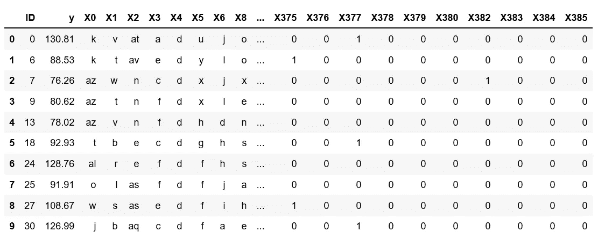

Figure 1

另外，除了“y”和“ID”，我们不知道那些特征是什么。

# 目标特征

目标特征“y”是汽车通过每个变量测试所用的时间(秒)。我们来看看它的分布。

```
plt.figure(figsize = (10, 6))
n, bins, patches = plt.hist(train['y'], 50, facecolor='blue', alpha=0.75)
plt.xlabel('y value in seconds')
plt.ylabel('count')
plt.title('Histogram of y value')
plt.show();
```

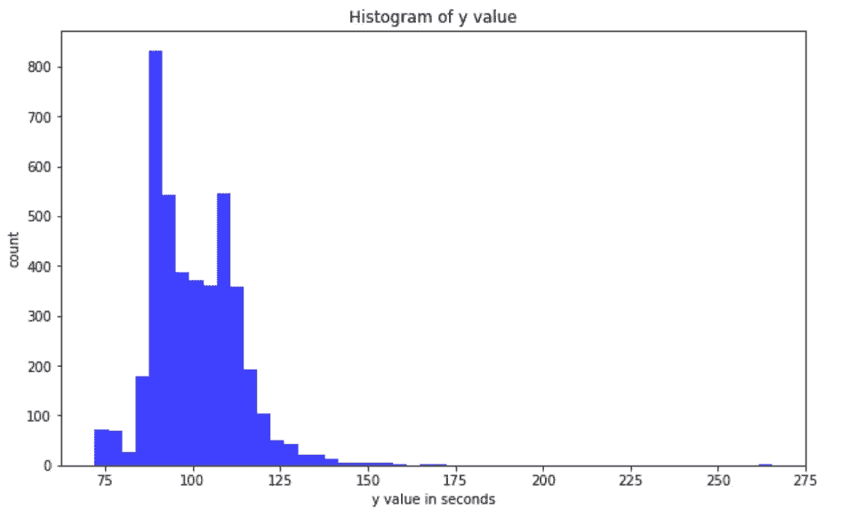

Figure 2

```
train['y'].describe()
```

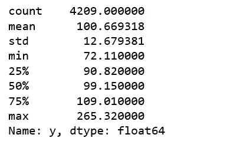

Figure 3

```
plt.figure(figsize = (10, 6))
plt.scatter(range(train.shape[0]), np.sort(train['y'].values))
plt.xlabel('index')
plt.ylabel('y')
plt.title("Time Distribution")
plt.show();
```

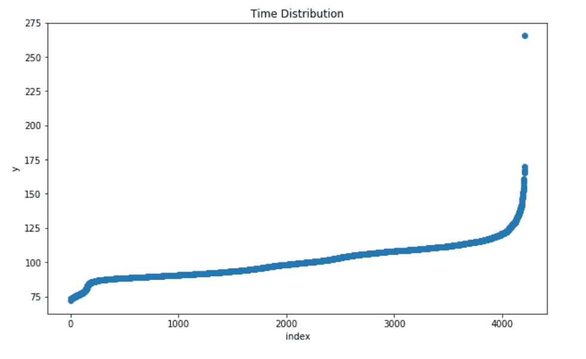

Figure 4

有一个异常值，最大时间为 265 秒。

# 功能探索

```
cols = [c for c in train.columns if 'X' in c]
print('Number of features except ID and target feature: {}'.format(len(cols)))
print('Feature types :')
train[cols].dtypes.value_counts()
```

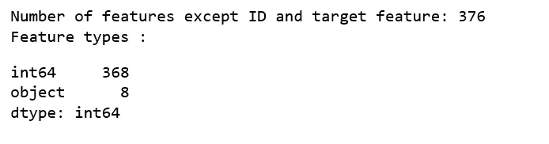

Figure 5

在所有特征中，我们有 8 个分类特征和 368 个整数特征。特性的基数呢？以下想法和剧本来自米克尔·鲍勃·伊里扎尔[。](https://www.kaggle.com/anokas/mercedes-eda-xgboost-starter-0-55)

```
counts = [[], [], []]
for c in cols:
    typ = train[c].dtypes
    uniq = len(train[c].unique())
    if uniq == 1:
        counts[0].append(c)
    elif uniq == 2 and typ == np.int64:
        counts[1].append(c)
    else:
        counts[2].append(c)
print('Constant features: {} Binary features: {} Categorical features: {}\n'.format(*[len(c) for c in counts]))
print('Constant features: ', counts[0])
print()
print('Categorical features: ', counts[2])
```

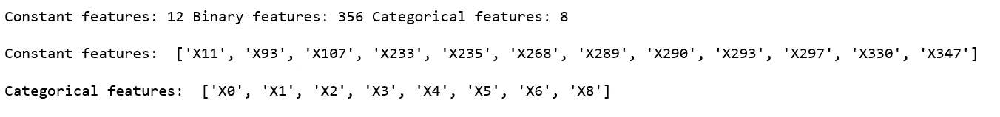

Figure 6

有 12 个特征只包含一个值(0)，这些特征对于监督算法是没有用的，我们稍后将删除它们。

我们数据集的其余部分由 356 个二元特征和 8 个分类特征组成。让我们首先探索分类特征。

## 分类特征

```
for cat in ['X0', 'X1', 'X2', 'X3', 'X4', 'X5', 'X6', 'X8']:
    print("Number of levels in category '{0}': \b {1:2}".format(cat, train[cat].nunique()))
```

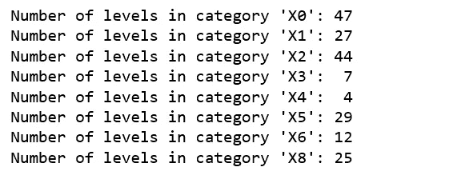

Figure 7

**特征 X0**

```
sort_X0 = train.groupby('X0').size()\
                    .sort_values(ascending=False)\
                    .index
plt.figure(figsize=(12,6))
sns.countplot(x='X0', data=train, order = sort_X0)
plt.xlabel('X0')
plt.ylabel('Occurances')
plt.title('Feature X0')
sns.despine();
```

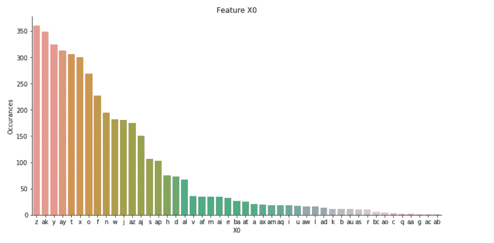

Figure 8

**X0 对目标特征 y**

```
sort_y = train.groupby('X0')['y']\
                    .median()\
                    .sort_values(ascending=False)\
                    .index
plt.figure(figsize = (14, 6))
sns.boxplot(y='y', x='X0', data=train, order=sort_y)
ax = plt.gca()
ax.set_xticklabels(ax.get_xticklabels())
plt.title('X0 vs. y value')
plt.show();
```

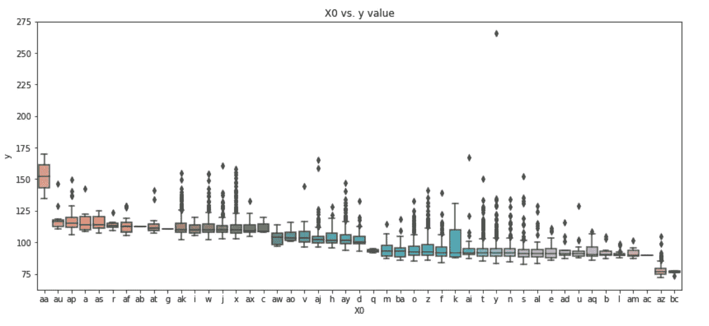

Figure 9

**特征 X1**

```
sort_X1 = train.groupby('X1').size()\
                    .sort_values(ascending=False)\
                    .index
plt.figure(figsize=(12,6))
sns.countplot(x='X1', data=train, order = sort_X1)
plt.xlabel('X1')
plt.ylabel('Occurances')
plt.title('Feature X1')
sns.despine();
```

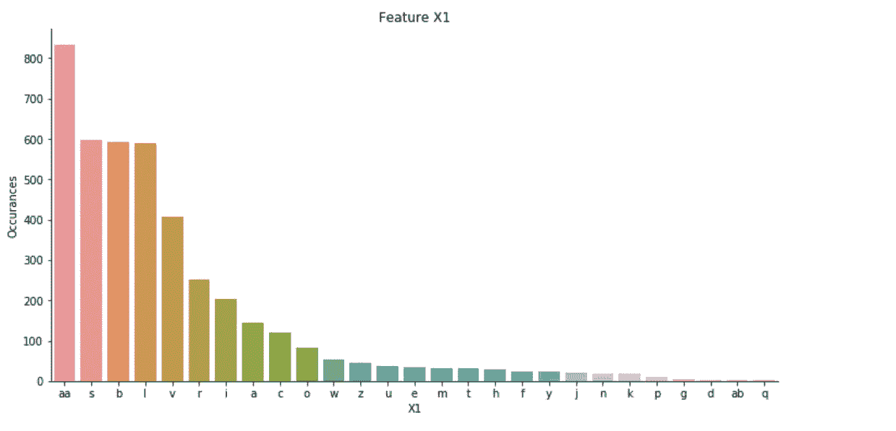

Figure 10

**X1 对目标特征 y**

```
sort_y = train.groupby('X1')['y']\
                    .median()\
                    .sort_values(ascending=False)\
                    .index
plt.figure(figsize = (10, 6))
sns.boxplot(y='y', x='X1', data=train, order=sort_y)
ax = plt.gca()
ax.set_xticklabels(ax.get_xticklabels())
plt.title('X1 vs. y value')
plt.show();
```

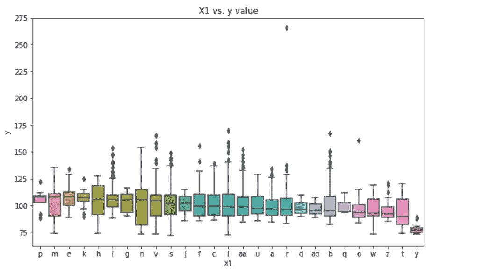

Figure 11

**特写 X2**

```
sort_X2 = train.groupby('X2').size()\
                    .sort_values(ascending=False)\
                    .index
plt.figure(figsize=(12,6))
sns.countplot(x='X2', data=train, order = sort_X2)
plt.xlabel('X2')
plt.ylabel('Occurances')
plt.title('Feature X2')
sns.despine();
```

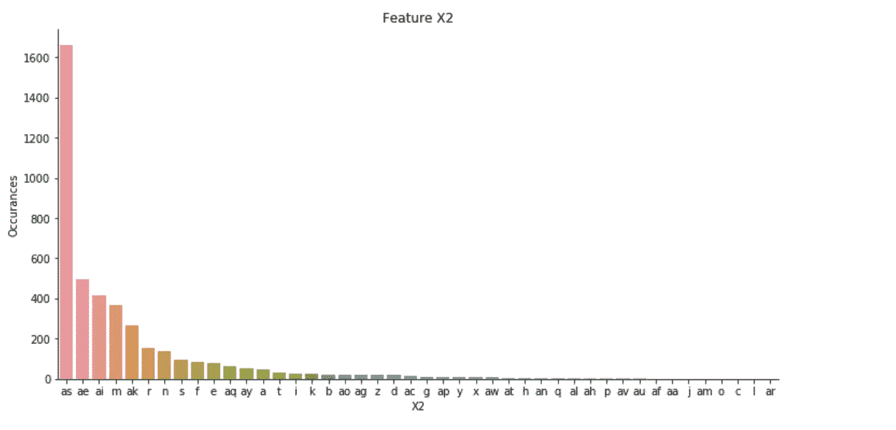

Figure 12

**X2 对目标特征 y**

```
sort_y = train.groupby('X2')['y']\
                    .median()\
                    .sort_values(ascending=False)\
                    .index
plt.figure(figsize = (12, 6))
sns.boxplot(y='y', x='X2', data=train, order=sort_y)
ax = plt.gca()
ax.set_xticklabels(ax.get_xticklabels())
plt.title('X2 vs. y value')
plt.show();
```

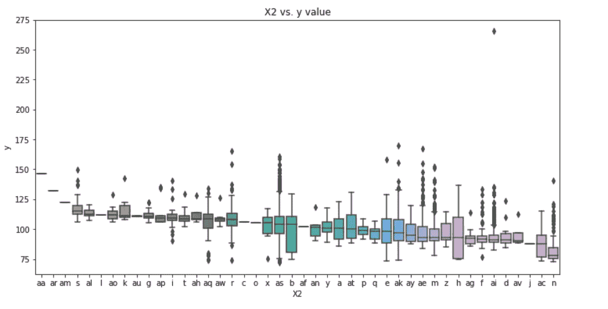

Figure 13

**特写 X3**

```
sort_X3 = train.groupby('X3').size()\
                    .sort_values(ascending=False)\
                    .index
plt.figure(figsize=(12,6))
sns.countplot(x='X3', data=train, order = sort_X3)
plt.xlabel('X3')
plt.ylabel('Occurances')
plt.title('Feature X3')
sns.despine();
```

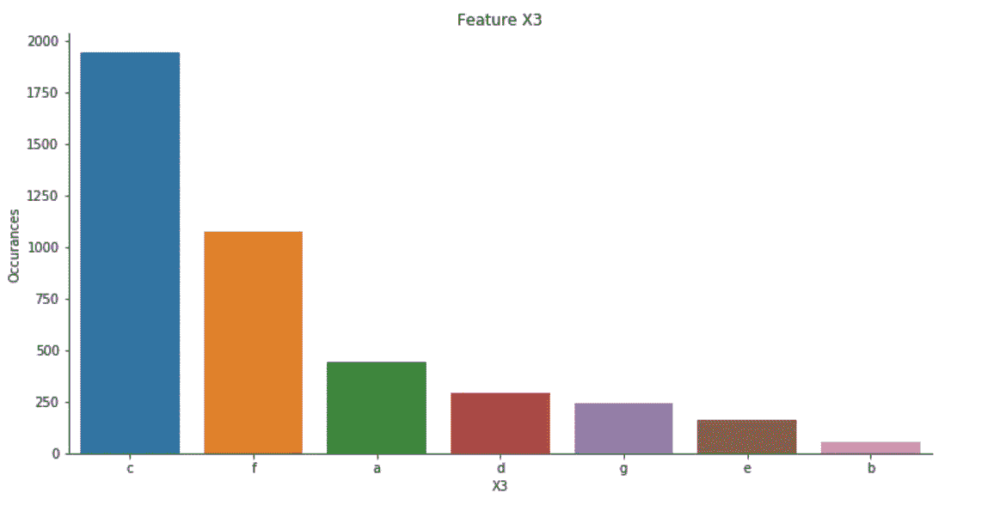

Figure 14

**X3 对目标特征 y**

```
sort_y = train.groupby('X3')['y']\
                    .median()\
                    .sort_values(ascending=False)\
                    .index
plt.figure(figsize = (10, 6))
sns.boxplot(y='y', x='X3', data=train, order = sort_y)
ax = plt.gca()
ax.set_xticklabels(ax.get_xticklabels())
plt.title('X3 vs. y value')
plt.show();
```

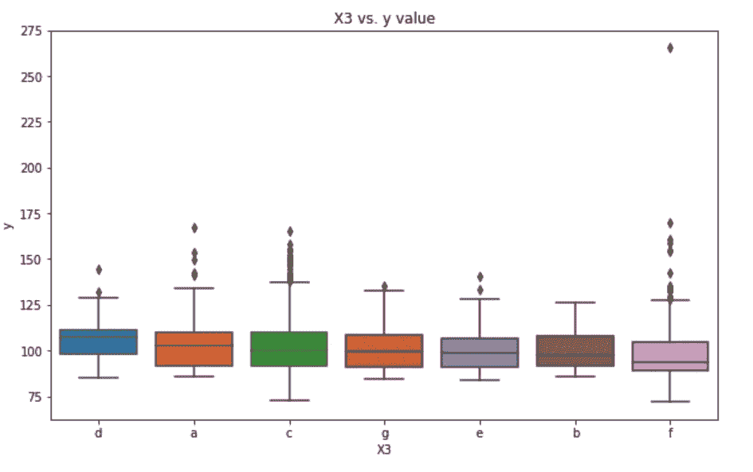

Figure 15

**功能 X4**

```
sort_X4 = train.groupby('X4').size()\
                    .sort_values(ascending=False)\
                    .index
plt.figure(figsize=(12,6))
sns.countplot(x='X4', data=train, order = sort_X4)
plt.xlabel('X4')
plt.ylabel('Occurances')
plt.title('Feature X4')
sns.despine();
```

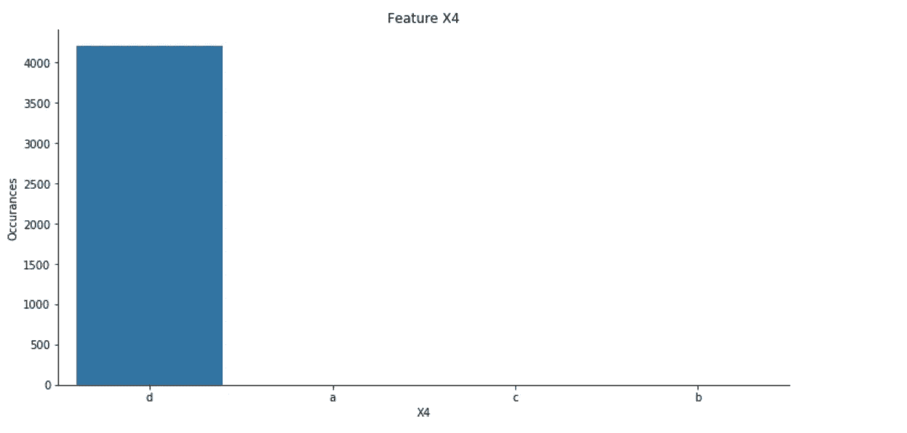

Figure 16

**X4 对目标特征 y**

```
sort_y = train.groupby('X4')['y']\
                    .median()\
                    .sort_values(ascending=False)\
                    .index
plt.figure(figsize = (10, 6))
sns.boxplot(y='y', x='X4', data=train, order = sort_y)
ax = plt.gca()
ax.set_xticklabels(ax.get_xticklabels())
plt.title('X4 vs. y value')
plt.show();
```

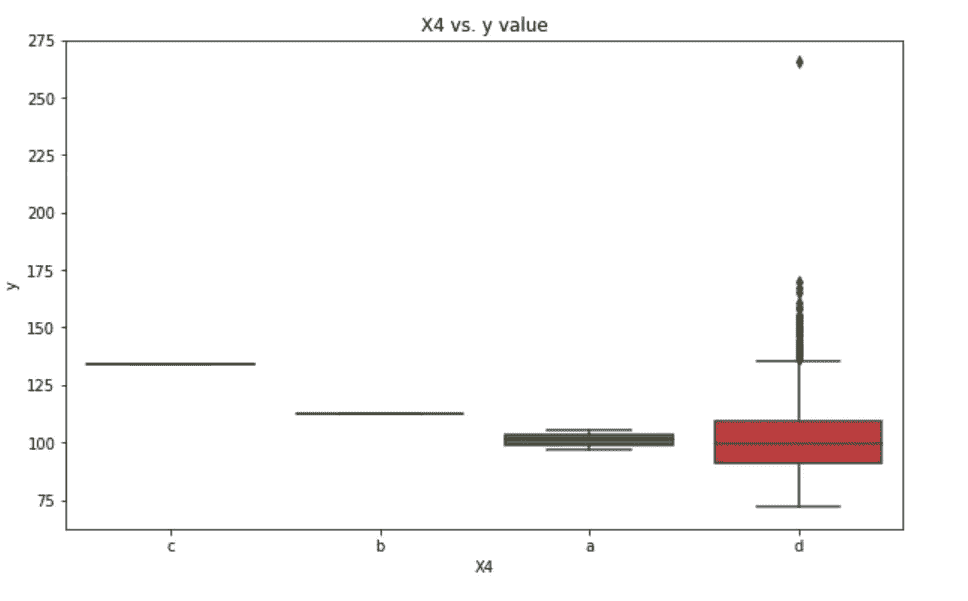

Figure 17

**功能 X5**

```
sort_X5 = train.groupby('X5').size()\
                    .sort_values(ascending=False)\
                    .index
plt.figure(figsize=(12,6))
sns.countplot(x='X5', data=train, order = sort_X5)
plt.xlabel('X5')
plt.ylabel('Occurances')
plt.title('Feature X5')
sns.despine();
```

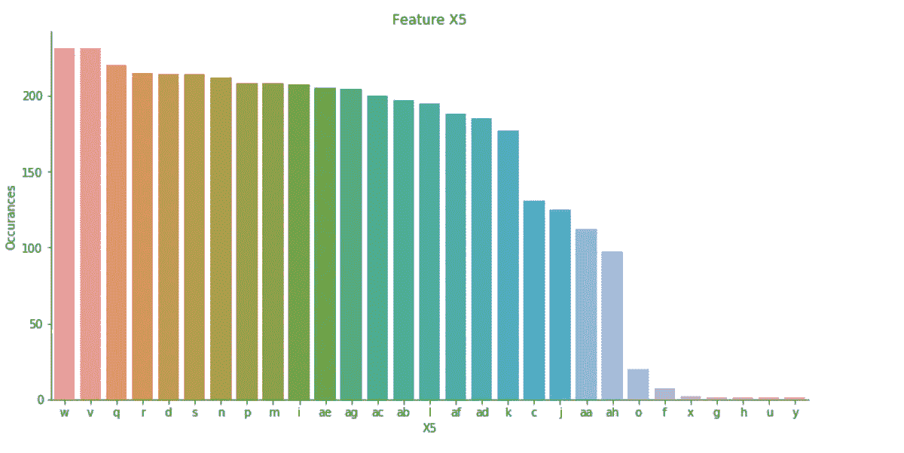

Figure 18

**X5 对目标特征 y**

```
sort_y = train.groupby('X5')['y']\
                    .median()\
                    .sort_values(ascending=False)\
                    .index
plt.figure(figsize = (12, 6))
sns.boxplot(y='y', x='X5', data=train, order=sort_y)
ax = plt.gca()
ax.set_xticklabels(ax.get_xticklabels())
plt.title('X5 vs. y value')
plt.show();
```

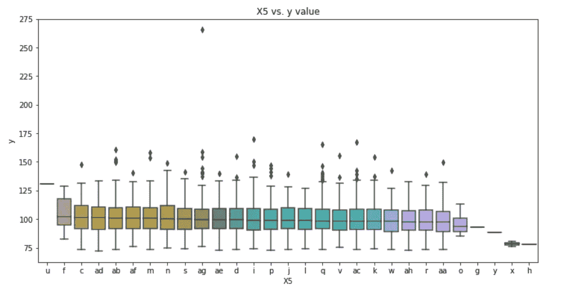

Figure 19

**功能 X6**

```
sort_X6 = train.groupby('X6').size()\
                    .sort_values(ascending=False)\
                    .index
plt.figure(figsize=(12,6))
sns.countplot(x='X6', data=train, order = sort_X6)
plt.xlabel('X6')
plt.ylabel('Occurances')
plt.title('Feature X6')
sns.despine();
```

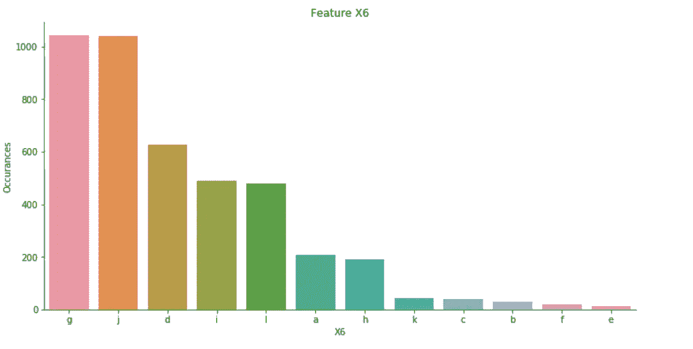

Figure 20

**X6 与目标特征 y 的对比**

```
sort_y = train.groupby('X6')['y']\
                     .median()\
                     .sort_values(ascending=False)\
                     .index
plt.figure(figsize = (12, 6))
sns.boxplot(y='y', x='X6', data=train, order=sort_y)
ax = plt.gca()
ax.set_xticklabels(ax.get_xticklabels())
plt.title('X6 vs. y value')
plt.show();
```

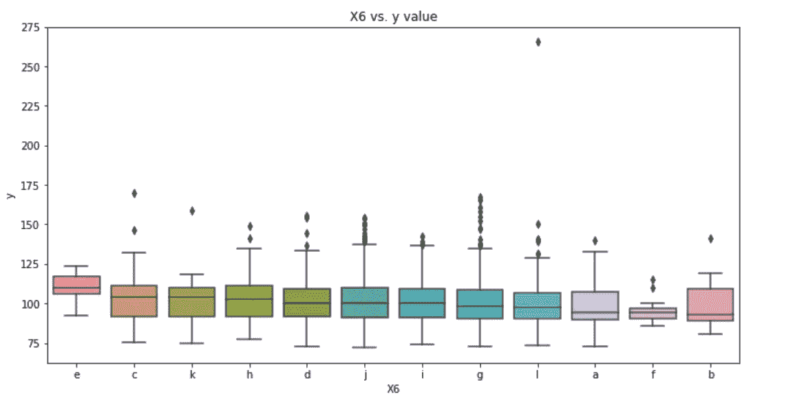

Figure 21

**功能 X8**

```
sort_X8 = train.groupby('X8').size()\
                    .sort_values(ascending=False)\
                    .index
plt.figure(figsize=(12,6))
sns.countplot(x='X8', data=train, order = sort_X8)
plt.xlabel('X8')
plt.ylabel('Occurances')
plt.title('Feature X8')
sns.despine();
```

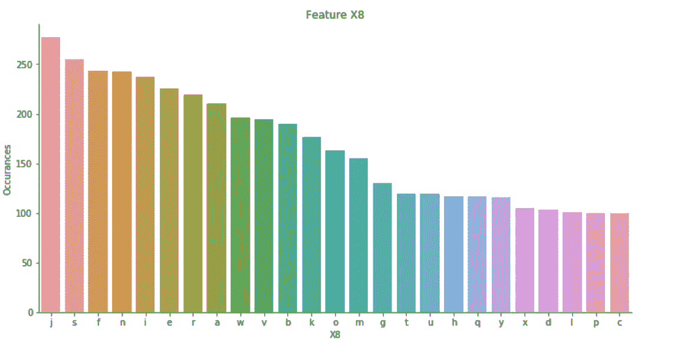

Figure 22

**X8 对目标特征 y**

```
sort_y = train.groupby('X8')['y']\
                    .median()\
                    .sort_values(ascending=False)\
                    .index
plt.figure(figsize = (12, 6))
sns.boxplot(y='y', x='X8', data=train, order=sort_y)
ax = plt.gca()
ax.set_xticklabels(ax.get_xticklabels())
plt.title('X8 vs. y value')
plt.show();
```

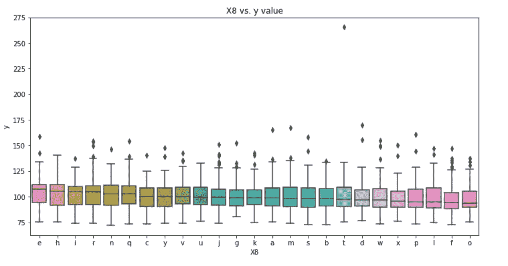

Figure 23

遗憾的是，我们并没有从上面的 EDA 中学到太多东西，这就是生活。然而，我们确实注意到一些分类特征对“y”有影响，而“X0”似乎影响最大。

在探索之后，我们现在将使用 Scikit-learn 的 MultiLabelBinarizer 将这些分类特征的级别编码为数字，并将它们视为新特征。

encode_cat.py

然后，我们丢弃已经编码的恒定特征和分类特征，以及我们的目标特征“y”。

```
train_new = train.drop(['y','X11', 'X93', 'X107', 'X233', 'X235', 'X268', 'X289', 'X290', 'X293', 'X297', 'X330', 'X347', 'X0', 'X1', 'X2', 'X3', 'X4', 'X5', 'X6', 'X8'], axis=1)
```

然后，我们添加编码的特征以形成用于 TPOT 的最终数据集。

```
train_new = np.hstack((train_new.values, X0_trans, X1_trans, X2_trans, X3_trans, X4_trans, X5_trans, X6_trans, X8_trans))
```

最终数据集以 numpy 数组的形式出现，形状为 *(4209，552)。*

# TPOT

是时候构建和安装 TPOT 回归器了。完成后，TPOT 将显示“最佳”模型(在我们的例子中，基于测试数据 MSE)超参数，并将管道输出为可执行的 Python 脚本文件，供以后使用或我们的调查。

TPOT_Mercedes_regressor.py

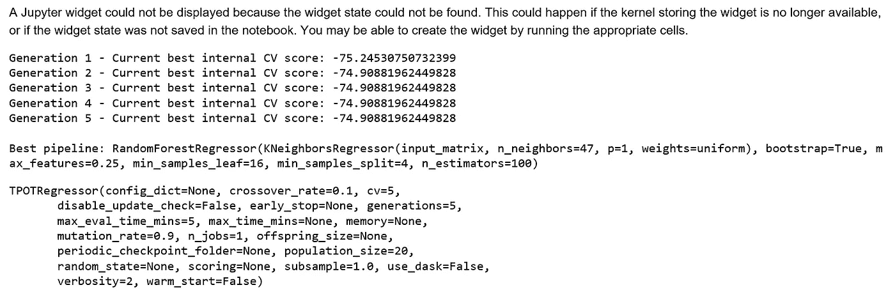

Figure 24

运行上述代码将发现一个管道作为输出，在测试集上实现 56 均方误差(MSE ):

```
print("TPOT cross-validation MSE")
print(tpot.score(X_test, y_test))
```

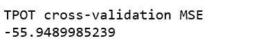

你可能已经注意到 MSE 是一个负数，根据[这个线程](https://github.com/EpistasisLab/tpot/issues/675)，TPOTRegressor 的`neg_mean_squared_error`代表均方误差的负值。让我们再试一次。

```
from sklearn.metrics import mean_squared_error
print('MSE:')
print(mean_squared_error(y_test, tpot.predict(X_test)))
```


```
print('RMSE:')
print(np.sqrt(mean_squared_error(y_test, tpot.predict(X_test))))
```


所以，我们预测的时间和实际时间之间的差异大约是 7.5 秒。那是一个相当好的结果！而产生这一结果的模型是一个在数据集上符合与 KNeighborsRegressor 算法堆叠的 RandomForestRegressor 的模型。

最后，我们将导出此管道:

```
tpot.export('tpot_Mercedes_testing_time_pipeline.py')
```

tpot_Mercedes_testing_time_pipeline.py

我喜欢学习和使用 TPOT，希望你也一样。 [Jupyter 笔记本](https://github.com/susanli2016/Machine-Learning-with-Python/blob/master/TPOT%20Mercedes.ipynb)可以在 [Github](https://github.com/susanli2016/Machine-Learning-with-Python/blob/master/TPOT%20Mercedes.ipynb) 上找到。周末愉快！

参考: [TPOT 教程](https://github.com/EpistasisLab/tpot/blob/master/tutorials/Portuguese%20Bank%20Marketing/Portuguese%20Bank%20Marketing%20Stratergy.ipynb)