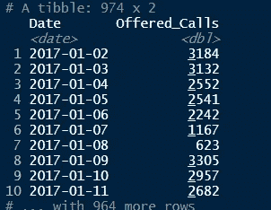
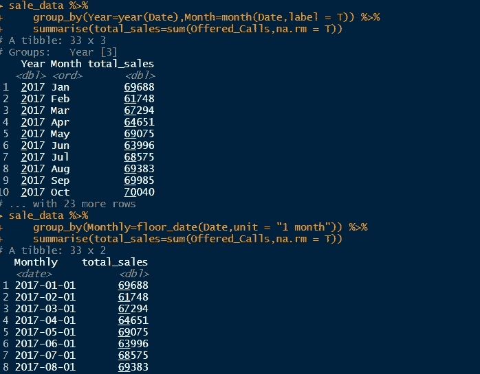

# R 中的时间智能计算

> 原文：<https://towardsdatascience.com/time-intelligence-in-r-1216e4a3c547?source=collection_archive---------28----------------------->

## 什么是时间智能？

# 什么是时间智能？

时间智能只是在日期或时间周期内进行计算。例如，您可能会收到一个常见的请求，即获取一年中按月汇总的总销售额，或者计算产品的 YTD 总销售额和去年同期的销售额，以比较和计算增长。根据我自己的实践经验，我将分享一些在 R 中使用 **tidyverse** 和 **lubridate** 包进行这些计算的方法

## 阅读和准备我们的数据集

在本练习中，我在 Excel 中创建了一个虚拟数据集。该数据集包含从 2017 年 1 月 2 日到 2019 年 9 月 30 日的销售额

```
library(tidyverse) #Data manipulation
library(lubridate) #For working with date and time sale_data <- read_xlsx("C:\\Users\\ACER\\Desktop\\regression_test.xlsx") %>% 
    mutate(Date = ymd(Date))
```

*   使用 **read_xlsx** 函数读入我们的数据集
*   在 **mutate** 函数中，我们传递了 **ymd** 函数来将我们的 **Date** 列转换为 Date 类型



*   这是我们数据集的样子

## 一些基本计算

让我们从一些基本的时间智能计算开始。您可能会收到的一个常见请求是显示每月的总销售额

```
sale_data %>% 
    group_by(Year=year(Date),Month=month(Date,label = T)) %>% 
    summarise(total_sales=sum(Offered_Calls,na.rm = T))
```

*   在 **group_by** 之后，我创建了**年**和**月**列，之后使用**summary**函数得到 **total_sales** 。还有另一种方法也是一样

```
sale_data %>% 
    group_by(Monthly=floor_date(Date,unit = "1 month")) %>% 
    summarise(total_sales=sum(Offered_Calls,na.rm = T))
```

*   基本上，我使用 lubdridate 的 **floor_date** 函数将日期列四舍五入到最近的月份，然后计算**总销售额**



Code output

如果有人要求 2019 年 1 月至 6 月的总销售额，并与去年同期进行比较以查看变化，会怎么样？

```
sale_data %>%
    **summarise**(sales_2019 = **sum**(Offered_Calls[Date **%within% interval**("2019-01-01","2019-06-30")],na.rm = T),
              sales_2018 = **sum**(Offered_Calls[Date **%within%** **interval**("2018-01-01","2018-06-30")],na.rm = T))
```

所以基本上我使用了 **lubridate** 包中的**%**

## 更高级的计算

但是，如果您正在处理一个实时数据集呢？您不希望每次运行定期报告时都要更新代码，以考虑最新的日期参数。对此我也有一个很好的解决方案

```
sale_data %>%
    **summarise**(sales_current_mtd = **sum**(Offered_Calls[Date **%within% interval**(**cut**(**Sys.Date()**,"month"),**Sys.Date()**)],na.rm = T),
              same_period_last_year = sum(Offered_Calls[Date **%within% interval**(**cut**(**Sys.Date()-years(1),"month"**),**Sys.Date()-years(1)**)],na.rm = T))
```

这和之前的公式是一样的。唯一的变化是，我将 **interval** 函数中的日期参数替换为在您运行报告或刷新数据时自动计算所需日期间隔的函数。让我们来分解一下:

*   **切割(系统。Date()，" month")** 将销售日期与最接近的月份相加，这样您将总是得到每个月的第一天
*   **Sys。Date()** 基本上只是获取当前日期。因此，在 **interval** 函数中输入这两个参数，您将获得从每个月的月初到月末的时间间隔，从而得出 MTD 的总数
*   要获得去年同期的总数，只需添加一个额外的参数。将两个时间间隔的**年(-1)** 函数相加，将得到相同的时间间隔，但是是去年的时间间隔，从而得到去年 MTD 的总数

我将展示另一个例子，在这个例子中，您必须按年度粒度(如 YTD)进行计算，这将展示这种计算的灵活性

```
sale_data %>%
    **summarise**(sales_ytd = **sum**(Offered_Calls[Date **%within% interval(cut(Sys.Date()**,"year"),**Sys.Date()**)],na.rm = T),
              same_period_last_year = **sum**(Offered_Calls[Date **%within% interval(cut(Sys.Date()-years(1)**,"year"),**Sys.Date()-years(1))**],na.rm = T))
```

*   这里唯一的不同是我在 **cut** 函数中把参数从“月”改成了“年”。这将日期推至年初。这使我们能够计算当前和去年的 YTD

# 结论

这些是我在工作中用来在 r 中进行“时间智能”计算的一些解决方案。我展示了用于一次性特别请求的手动过程和用于定期报告的自动解决方案。虽然我的例子只包括每年、每月的计算，但是通过遵循我所展示的相同原则，您可以在任何级别上进行计算，如每周、每天和每季度。我发现这个解决方案对于计算必须在我们的周/月/季度报告中定期更新/报告的 KPI 非常有用。它允许我只刷新报告，而不必每次都手动计算它们。