# 时间序列分析 1

> 原文：<https://towardsdatascience.com/time-series-analysis-1-9f4360f43110?source=collection_archive---------8----------------------->

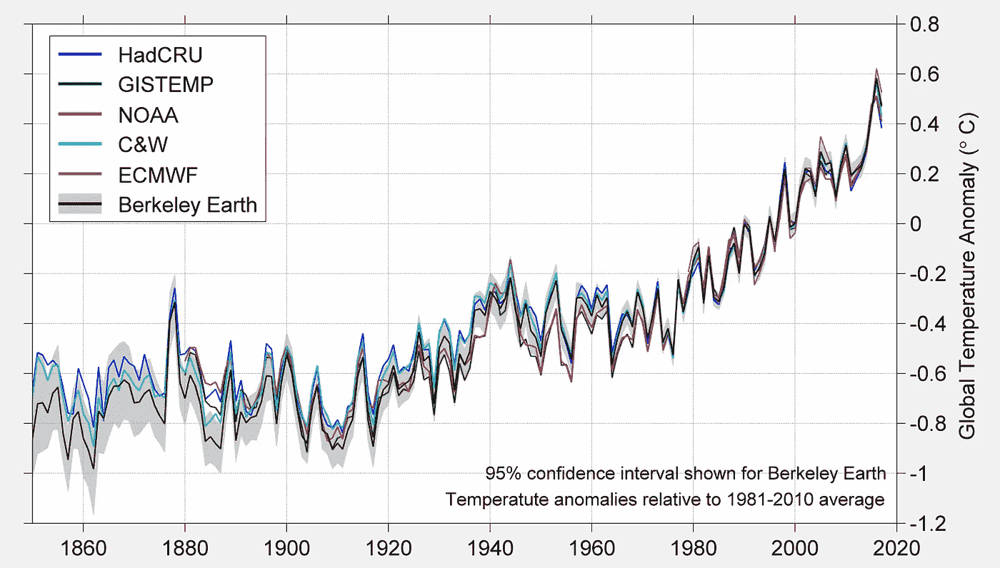

时间序列数据的分析是任何数据科学家工作不可或缺的一部分，在量化交易领域更是如此。金融数据是时间序列数据中最令人费解的，而且经常看起来不稳定。然而，在这几篇文章中，我将建立一个分析这种时间序列的框架，首先使用成熟的理论，然后深入研究更奇特的现代方法，如机器学习。所以让我们开始吧！

## ARIMA 模型

我们要讨论的第一个模型是 ARIMA 模型。它代表自回归综合移动平均模型。是的，有很多需要理解。然而，它本质上只是结合了两个更简单的模型，自回归模型和移动平均模型，这两个模型我们将在下面详细说明。在此之前，我们需要建立平稳性的概念，因为它对于能够准确地建模和预测时间序列至关重要。

## 平稳性

平稳性的概念来源于随机过程，有时这些随机过程的结果就是白噪声。以下是平稳性的广义定义:

> 平稳时间序列是其统计特性(如均值和标准差)不依赖于时间的时间序列。

对于那些有统计学和随机学经验的人来说，下面是一个更正式的定义

设{Xt}是一个随机过程，并且

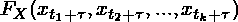

是{Xt}的无条件联合分布的累积分布函数。那么，{Xt}是严格平稳的，当且仅当，

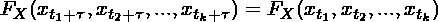

然而，在大多数应用程序中，我们不会使用随机方法手动检查平稳性。我们使用的测试，如迪基-富勒和扩大迪基-富勒测试。

还有一个较弱的平稳性概念，在大多数情况下足以满足。这种弱平稳性被定义为时间序列的期望值和协方差不随时间变化。

## 自回归模型

自回归模型在概念上很简单:它使用滞后值作为当前/下一时间步的简单线性回归模型的回归量。形式上，它是:

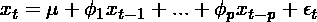

其中:

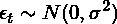

AR 模型可能类似于普通的最小二乘(OLS)回归，其中先前的时间步长是回归量，当前的 x 值是预测变量。我认为我们应该花一点时间来理解 OLS 回归和 AR 模型之间的区别。考虑下面的 OLS 问题:

您有数据 X 和 Y，并希望找到以下形式的回归公式的 OLS 估计:

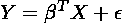

OLS 的目标是找到一个最小化误差平方和的β估计值。换句话说，找到的最小值

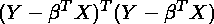

展开它，对方程求导，我们可以找到驻点，结果是

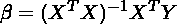

这是对 OLS 估计的解决办法。然而，将这种方法应用于 AR 模型的关键问题是，数据 X 和 Y 不是在好的矩阵中，并且每次我们处理数据时很难将它们整合到这样的矩阵中。因此，我们使用另一种方法来寻找 AR 模型中滞后变量的系数。在我们研究寻找系数的方法之前，我们先来看看 ARIMA 模型的其他部分。

## 移动平均模型

移动平均模型考虑了以前的误差项，并使用它来模拟时间序列的当前值。形式上，

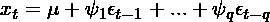

MA 模型看起来与 ar 模型非常相似。然而，有几个关键的区别需要注意:

1.  MA 模型中的误差项直接影响时间序列的当前值，而在 AR 模型中，来自先前时间步长的误差项只是隐含地存在。
2.  MA 模型中的误差项只影响未来 q 步的时间序列，而 AR 模型中的误差项影响未来无限时间的时间序列。

这种关键的差异给了我们一个自然的扩展模型。这正是 ARMA 模型。ARMA 模型和 ARIMA 模型的区别在于积分。就时间序列而言，整合是指使时间序列成为平稳时间序列所需的差异程度。因此，如果我们有一个时间序列 y，我们把它差 d 倍，并把它叫做 x，我们只需要把上面的两个模型一起应用，就可以得到下面的 ARIMA 模型:

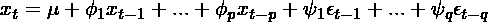

既然我们理解了 ARIMA 模型，我们可以继续探索如何估计系数。

## 估计系数

有几种方法可以计算模型的系数，我们来看看其中的两种。第一种方法是使用一组称为 Yule-Walker 方程的方程。尤尔-沃克方程源于统计学中的矩方法。我们将首先考虑 AR 模型，因此考虑 AR(p)模型的自协方差:

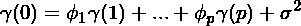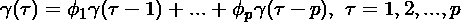

我们可以将它写成矩阵形式，得到:

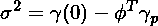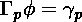

现在我们可以用样本自协方差替换总体自协方差来获得系数:

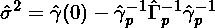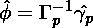

使用相关矩阵也可以得到同样的结果，但我将把它留给读者做练习。

注意:Yule-Walker 方程是线性方程，但是 MA 模型实际上是非线性的，因为前面的误差项不能容易地观察到以形成可以求解的矩阵。

接下来，更常用的估计系数的方法是最大似然估计(MLE)。MLE 是统计分布中估计参数的一种常用方法。MLE 背后的核心原则是最大化可能性的概念(它可以简单地是概率的乘积，但通常是总概率的对数)。关于 MLE 的介绍，请查看我关于 [MLE](/maximum-likelihood-estimation-how-it-works-and-implementing-in-python-b0eb2efb360f) 的另一篇文章。结果表明，如果 ARMA 是高斯型的，则存在 MLE 的解析表示:

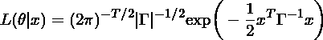

最大化这个，我们将获得参数的估计。

## 选择模型

现在我们已经知道了模型的工作原理和拟合方式，在使用模型时需要做出一个重要的决定:选择参数 p 和 q 的值。p 和 q 的值不仅会极大地影响模型所需的计算能力，还会影响构建模型时使用的信息量。决定这些值的常用方法是考虑一些信息标准，并选择具有最佳信息的参数。换句话说，计算 Akaike 信息标准或贝叶斯信息标准，然后选择最小化信息标准的参数值。

## 在 Python 中实现

现在我们可以尝试用 python 实现 ARMA 模型。库 statsmodels 已经实现了 ARMA 模型，因此我们将只使用它。下面的代码将产生预测英国 GDP 的 ARMA 模型。

```
import statsmodels.api as sm
import matplotlib.pyplot as plt
import pandas as pd
import numpy as npdta = pd.read_csv("mgdp.csv", index_col=None)
dta = dta.iloc[:, 1]
res = sm.tsa.ARIMA(dta, (20, 1, 6)).fit()
fig, ax = plt.subplots()
ax = dta.iloc[:].plot(ax=ax)
res.plot_predict(50, 100, dynamic=True, ax=ax,
                 plot_insample=False)
plt.show()
```

以下是估计值:

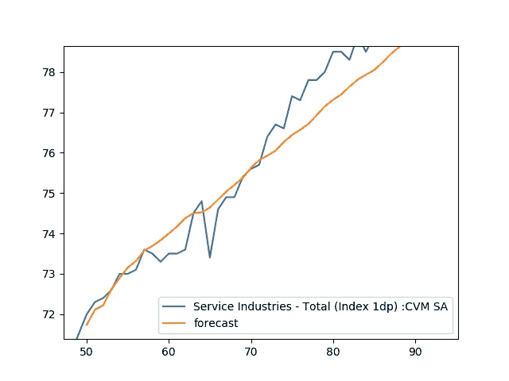

显然，一个简单的 ARIMA 模型不会是最佳的，尤其是当正确的参数没有确定。这只是说明 ARIMA 模型预测能力的一个例子。我鼓励读者尝试使用 statsmodel ARIMA 函数来产生更好的结果。

## 结论

时间序列分析是一个庞大的课题，有许多分析方法。本文是许多探索时间序列模型的文章中的第一篇。概括地说，我们首先定义了平稳性的概念，然后探讨了 AR 和 MA 模型以及它们是如何形成的。随后，我们深入研究了模型的实际参数是如何确定的，研究了 Yule-Walker 方程和 MLE 估计。最后，我们以预测英国 GDP 增长为例说明了 ARIMA 模型的工作原理