# 时间序列分析与气候变化

> 原文：<https://towardsdatascience.com/time-series-analysis-and-climate-change-7bb4371021e?source=collection_archive---------7----------------------->


CREDIT: Graphic by the author using Canva and their library

## 时间序列分析和预测的介绍性实践指南；使用 Python、熊猫和脸书先知库调查气候数据

# 内容——这篇文章的内容

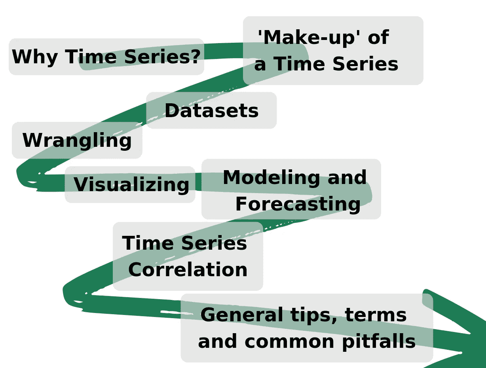

Contents of this Blog Post (CREDIT: Author on [Canva](https://www.canva.com/))

# 为什么是时间序列？

所有的生活场景都被放置在时间的前景中，把她带走，没有一幅我们能理解的画面留下。理解时间本身并不是胆小的人的追求(见这里的和这里的)，我们人类很难将时间理解为一个线性概念。

时间序列分析非常有用，主要有两个原因:

1.  它让我们能够理解和比较事物，而不会失去重要的、共享的“时间”背景
2.  它让我们能够做出预测

# 时间序列的“组成”

时间序列是对同一现象的一组重复测量，按时间顺序进行；因此，这是一种有趣的数据类型变化——它封装了这种时间背景，以及……呃……任何其他东西。

时间(通常)是时间序列中的独立变量，而因变量是“其他东西”。将一个时间序列想象成由不同的成分组成是很有用的——这被称为 [*分解建模*](https://en.wikipedia.org/wiki/Decomposition_of_time_series)*，并且所得到的模型在本质上可以是加法的或者乘法的。*

*四个主要组成部分是:*

1.  *趋势*
2.  *季节性*
3.  *周期性*
4.  *不规则*

*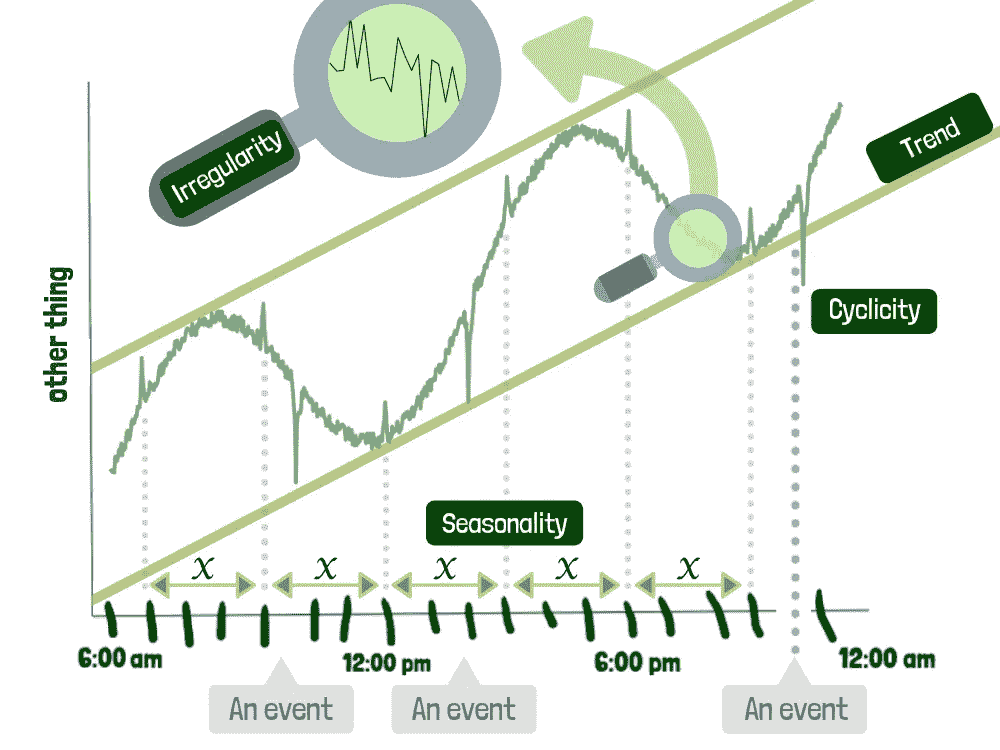*

*The four main components of a time series (CREDIT: Author on [Canva](https://www.canva.com/))*

## *趋势*

*持续时间相对较长的趋势是该时间序列的总体上升或下降。在上图中，我们可以看到这个系列是如何呈现上升趋势的(用两条绿色直线表示)。*

## *季节性*

*季节性是指以特定的规律间隔出现的变化；它是数据和序列的组成部分，在一段固定的时间内经历有规律的和可预测的变化。季节性如上图所示——请注意以 *x* 分钟的固定间隔看到的六个相同的“上下”波动。波峰和波谷也可以说明季节性成分。*

## ***周期性***

*周期性是指由环境引起的变化，它以不规则的间隔重复。季节性行为非常有规律，这意味着在数据的波峰和波谷之间有精确的时间间隔；另一方面，周期性行为会随着时间漂移，因为周期之间的时间并不精确。例如，股票市场倾向于在高值和低值之间循环，但是在这些波动之间没有固定的时间量。循环性如上图所示；在这种情况下，周期性似乎是由于每次事件发生前发生的特定事件。*

## *不规则*

*不规则性是时间序列中不可预测的部分，即“随机性”。这个组成部分不能用任何其他组成部分来解释，它包括由于不可预测的因素而发生的变化，这些因素不会以固定的模式重复出现。上图中；放大镜说明了这种粗糙、随机和不规则的成分。*

# *数据集*

## *提取数据*

*本教程假设您熟悉 Jupyter 笔记本，并且至少有一些关于熊猫的经验。在这一节中，我们将通过获取一些气候数据，并将其放入我们的大熊猫 Jupyter 笔记本中来开始实践。*

*我们将使用两个数据集:*

1.  *全球地表温度变化的估计，来自 [NASA](https://data.giss.nasa.gov/gistemp/) (点击下载*
2.  *来自[世界银行](http://www.worldbank.org/)(点击此处下载)的 CO₂人均排放量估计*

**注意:medium 附加到上面的 URL 会导致 NASA 数据出现“访问被拒绝”的错误，要解决这个问题，请将 URL 明确粘贴到浏览器中([https://data.giss.nasa.gov/gistemp/tabledata_v3/GLB.)Ts+dSST.csv](https://data.giss.nasa.gov/gistemp/tabledata_v3/GLB.Ts+dSST.csv) )。*

**注:为了得到一个更现实的实验，实际上可以做的是随着全球人口的增长，将人均排放量标准化——很想听到这里的任何评论。*

*首先下载 [CSV 格式](https://www.howtogeek.com/348960/what-is-a-csv-file-and-how-do-i-open-it/)的数据集(使用上面的链接)并在使用熊猫:*

*Using Pandas to read in climate data in CSV format*

*请注意，在这些情况下，当读取数据集时，我们必须跳过几行才能得到我们想要的内容，这是由于数据集的结构。*

*请注意，上面给出的 CO₂排放数据集的链接下载了一个包含 3 个文件的压缩文件夹，我们使用的是文件“API_EN”。' ATM . co2e . PC _ DS2 _ en _ CSV _ v2 _ 10515380 . CSV '。我已经将两个原始 CSV 移动到它们自己的名为“data”的文件夹中。*

*让我们来看看我们新获得的数据集:*

*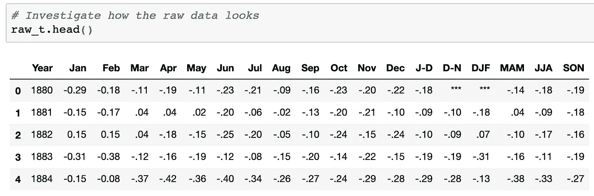*

*GISTEMP temperature anomaly data from NASA*

*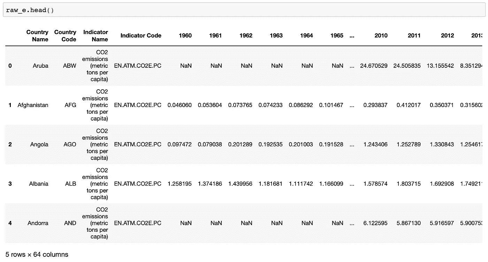*

*CO₂ emissions data, in metric tons per capita, from the World Bank*

## *背景*

*温度数据代表每个月和每个季节(DJF = 12 月-2 月，MAM =月-5 月等)的温度异常(与平均值/期望值的差异)。我们不会使用绝对温度数据，因为在气候变化研究中，异常比绝对温度更重要。正异常表示观察到的温度比基线温度高，而负异常表示温度比基线温度低。*

*CO₂给了我们人均 CO₂排放量(公吨)。数据集按国家和其他类别划分，如“世界”或“中上收入”，在本教程中，我们只对“世界”感兴趣，因为我们是在全球范围内观察事物。*

*有关这两个数据集的更多信息，请参见它们各自的下载页面[这里](https://data.giss.nasa.gov/gistemp/)和[这里](https://data.worldbank.org/indicator/EN.ATM.CO2E.PC)。现在我们有了数据，让我们[稍微争论一下](https://en.wikipedia.org/wiki/Data_wrangling)以便更容易处理。*

# *争论*

> *“数据争论是将数据从一种“原始”数据形式转换和映射为另一种格式的过程，以便使其对下游流程(如分析)更有价值”*

## *争论不休的温度数据*

*我们将首先讨论美国宇航局的温度异常数据。在此过程中，我们将关注几个方面:*

*   *使用日期时间索引*
*   *基本操作和处理缺失值*
*   *重新采样到不同的频率*

****使用日期时间索引:****

*使用[日期时间索引](https://pandas.pydata.org/pandas-docs/stable/reference/api/pandas.DatetimeIndex.html)可以让我们在时间序列操作中更有效率；它将允许我们使用时间戳或时间范围进行选择和切片。*

*对于温度数据，我们将创建一个具有每月频率的日期时间索引的空数据帧，然后我们将使用原始数据来填充这个新的数据帧。空的数据框架将从 1880 年到 2019 年 3 月。*

*Creating a new Pandas DataFrame to hold the temperature anomaly data using a DateTime index*

*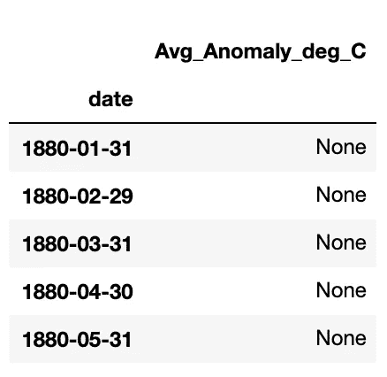*

*Resulting empty DataFrame, with DateTime index*

*好吧。我们有了数据框架，现在需要填充它。这个想法是，每一行将代表该月的异常值——因此我们可以使用“月”的离散索引(或者甚至是“年”的月异常值的平均值)。我选择这样做是因为这是一个关于时间序列分析的教程，我认为这是一个更有用的练习。*

****基本操作和处理缺失值****

*为了填充我们的数据框架，我们将基本上遍历我们感兴趣的原始数据的一部分(即年和月列)，并将相应的异常值分配给我们的新数据框架。*

*让我们首先只选择我们想要的数据，为此我们使用 Pandas 的[选择功能](https://pandas.pydata.org/pandas-docs/stable/indexing.html)。我们只需要年列和月列，将省略季节列。*

```
*raw_t = raw_t.iloc[:,:13]
raw_t.head()*
```

*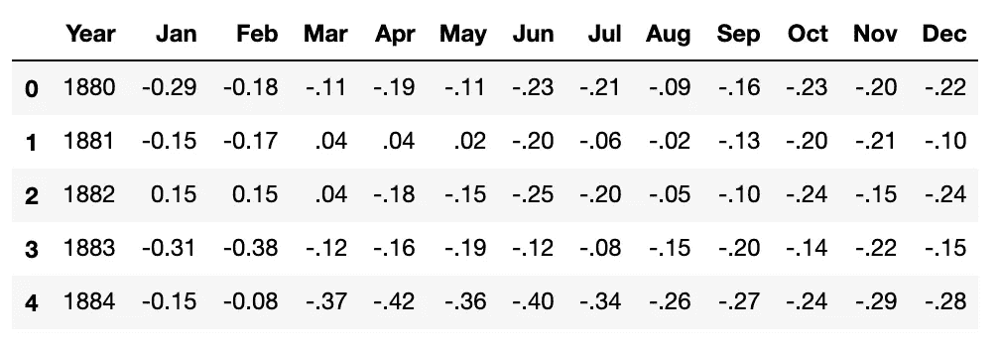*

*Slice of raw temperature data*

*我们现在将使用 Pandas 的[应用](https://pandas.pydata.org/pandas-docs/stable/reference/api/pandas.DataFrame.apply.html)函数来“遍历”原始数据的行(axis=1 表示行，0 表示列)。我们还将使用几个额外的库，即:*

*   *[日期时间](https://docs.python.org/3.7/library/datetime.html)*
*   *[日历](https://docs.python.org/3.7/library/calendar.html)*

*Python 的日期时间“库”将会很有用，因为它可以帮助我们解析各种格式的日期和时间(见[这里](https://docs.python.org/2/library/datetime.html#strftime-and-strptime-behavior))。日历库用于获取每个月的最后一天。*

*Using NASA data to populate our DataFrame using DateTime index*

*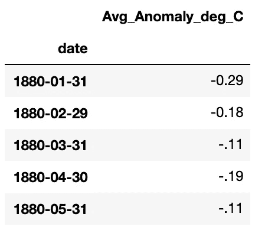*

*Now populated DataFrame*

*你可能已经注意到，异常值似乎有点乱，它们是字符串和浮点的混合——在(2019)中混合了一些不可用的' *** '值。让我们把它们清理干净。*

*Cleaning up anomaly values, and dealing with NaNs using Panda’s ‘Foward Fill’*

**

*Final temperature DataFrame, after wrangling*

*太好了！我们已经成功地将 NASA 的温度异常数据转换成了一种很好的、可用的形式。我们将在后面更详细地介绍数据的绘制，但与此同时，您可以使用 Matplotlib 在笔记本中绘制一个简单的图:*

*Code to plot our temperature anomaly data using Matplotlib*

*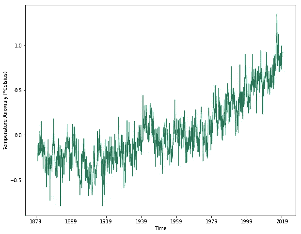*

*Resulting plot of temperature anomaly data using Matplotlib (CREDIT: Author on [J](https://www.canva.com/)upyter Notebook)*

****重采样到不同的频率:****

*现在这一切都很好，但上面的图看起来有点乱——似乎在这么长的时间内，数据太细了，无法很好地可视化。Pandas 提供了一个非常方便的功能，称为'[重采样](https://pandas.pydata.org/pandas-docs/stable/reference/api/pandas.DataFrame.resample.html)'，它可以将我们的频率从几个月改变为几年(这在以后与 CO₂的数据进行比较时也会有所帮助)。*

*让我们将温度数据向下采样为年，字符串“A”代表“日历年末”。对于所有的频率字符串，见[这里](http://pandas.pydata.org/pandas-docs/stable/user_guide/timeseries.html)。*

```
*t.resample('A').mean().head()*
```

*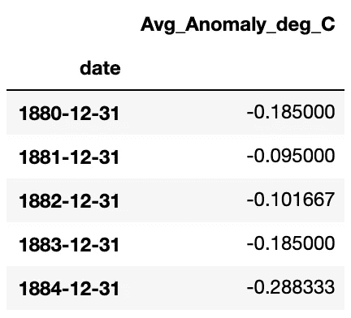*

*Resulting DataFrame after resampling to yearly frequency (end-of-year)*

*最终的情节更加清晰:*

*Code to plot resampled temperature anomaly data*

*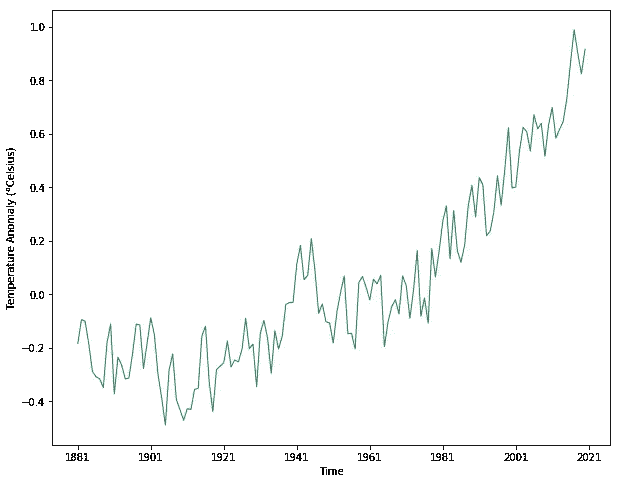*

*Resulting plot of resampled temperature anomaly data (CREDIT: Author on Jupyter Notebook)*

*好了，我想我们已经把我们的温度数据争论到一个我们能够有效利用它的状态——让我们继续讨论 CO₂的排放数据。*

## *CO₂排放数据的争论*

*这一部分将解决我们二氧化碳排放数据的争论。我们将使用上面使用的一些相同的技术，并研究一些新的技术:*

*   *切片和搜索*
*   *有用的功能*

****熟悉的技法****

*在我们的数据框架中，我们将只使用代表全球 CO₂排放量的行。像以前一样，我们将创建一个使用日期时间索引的新数据帧，然后使用原始数据填充它。*

*Creating a DataFrame — and populating it — with world emissions data*

*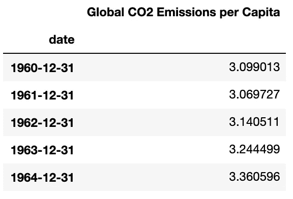*

*Resulting emissions DataFrame*

****切片搜索****

*日期时间索引便于数据切片，让我们选择 2011 年以后的所有数据:*

```
*e[e.index.year>2011]*
```

*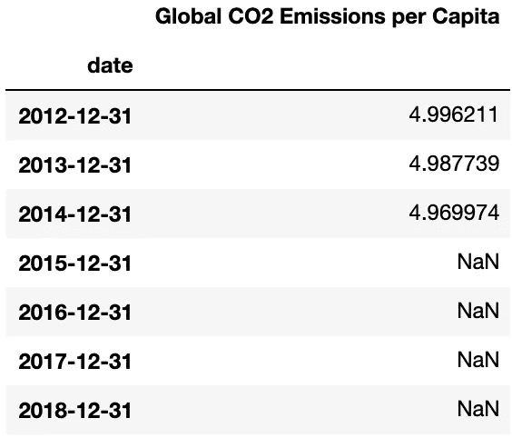*

*Slice of emissions data after the year 2011 (notice the missing data) (CREDIT: Author on Jupyter Notebook)*

*嗯。在我们数据的末尾似乎有一些 NaN 让我们使用 Panda 的 *fillna* 方法来处理这个问题。*

```
*e.fillna(method='ffill', inplace=True)
e[e.index.year>2011]*
```

*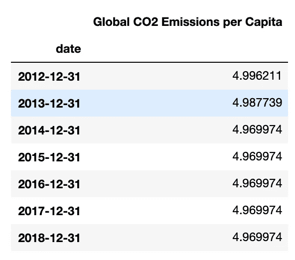*

*Slice of emissions data after the year 2011 (no missing data)*

*好多了！我们还可以利用日期时间索引来搜索特定范围内的值:*

```
*e['1984-01-04':'1990-01-06']*
```

*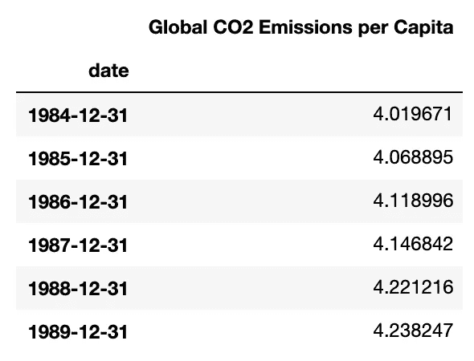*

*Resulting slice of emissions data within the specified range*

*对于更细粒度的基于时间的数据，这种功能开始变得非常有用——在我们的例子中，我们有年，因此范围索引可能已经足够了。*

****有用的功能****

*Pandas 提供了一系列其他函数，在处理时间序列数据时非常有用——我们无法在本教程中一一介绍，但下面列出了一些:*

*   *数据框。[滚动](https://pandas.pydata.org/pandas-docs/stable/reference/api/pandas.DataFrame.rolling.html) →提供滚动窗口计算*
*   *pandas . to _ datetime→datetime . datetime 的 *strptime* 函数的替代，它更有用，因为它可以推断格式*
*   *TimSeries。[shift](https://pandas.pydata.org/pandas-docs/stable/reference/api/pandas.Series.shift.html#pandas.Series.shift)Tim series。 [tshift](https://pandas.pydata.org/pandas-docs/stable/reference/api/pandas.Series.tshift.html#pandas.Series.tshift) →允许时间序列的值在时间上前后移动或滞后*

*欲了解更多信息和功能，请参见时间序列中的[大熊猫页面。](https://pandas.pydata.org/pandas-docs/stable/user_guide/timeseries.html#time-series-related-instance-methods)*

# *肉眼观察*

*现在我们已经很好地讨论了数据集，让我们看看如何绘制它们。我们将使用两个绘图库，即:*

*   *Matplotlib*
*   *Plotly*

## *使用 Matplotlib 绘图*

*Matplotlib 是一个非常流行的 Python 2D 绘图库，可以使用 pip 轻松下载。*

*让我们使用 Matplotlib 再次绘制我们的温度数据，这一次我们将做得更好——添加轴标签和标题等。：*

*Code to plot temperature anomalies using Matplotlib*

*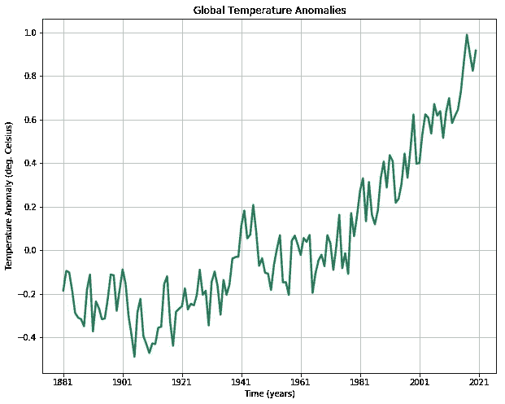*

*Resulting temperature plot using Matplotlib (CREDIT: Author on Jupyter Notebook)*

*我们的 CO₂排放数据:*

*Code to plot emissions using Matplotlib*

*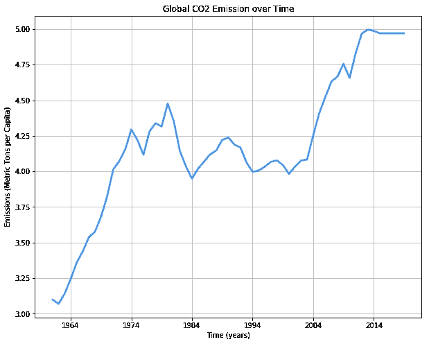*

*Resulting emissions plot using Matplotlib (CREDIT: Author on Jupyter Notebook)*

## *用 Plotly 绘图*

*Plotly 是一个很棒的库，用于生成既交互式又适合网络的图。 [Plotly Python 包](https://plot.ly/python/)是一个构建在 [plotly.js](https://plot.ly/javascript/) 上的开源库——后者又构建在 [d3.js](https://d3js.org/) 上。在本教程中，我们将使用名为[袖扣](https://github.com/santosjorge/cufflinks)的包装——这使得它很容易与熊猫数据框一起使用。*

*Importing Plotly and Cufflinks correctly for offline mode*

*现在我们已经正确导入了库，让我们再次绘制两个数据集，这次使用 Plotly 和袖扣:*

*Plotting temperature data using Plotly*

*Plotting emissions data using Plotly*

*结果图看起来更好，而且是交互式的:*

*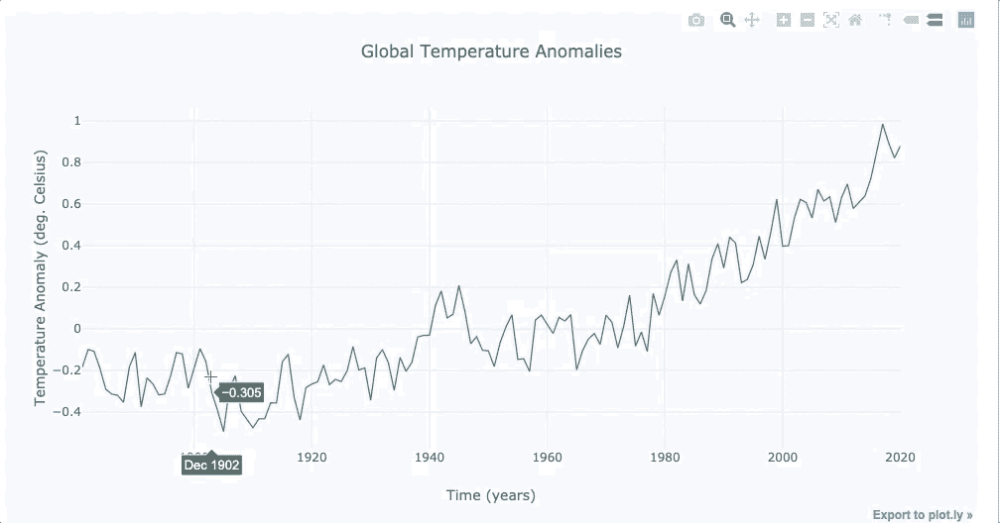*

*Resulting temperature plot using Plotly (CREDIT: Author on [J](https://www.canva.com/)upyter Notebook)*

*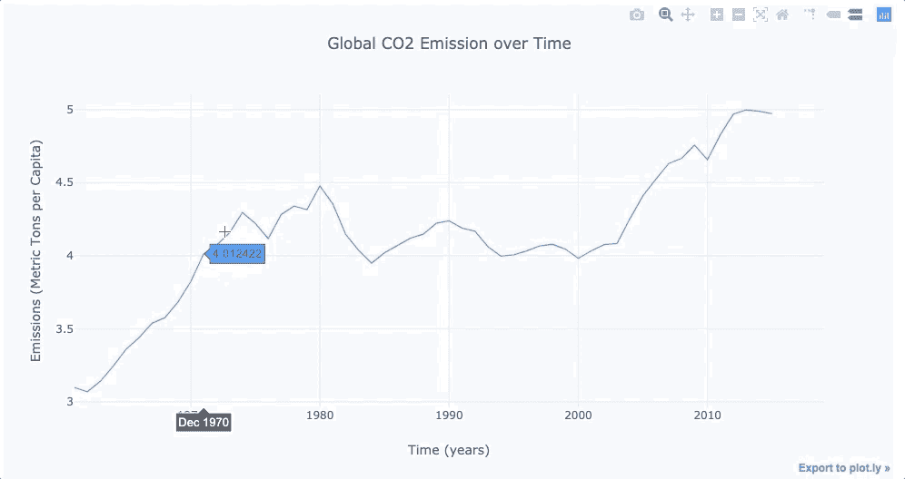*

*Resulting emissions plot using Plotly (CREDIT: Author on [J](https://www.canva.com/)upyter Notebook)*

# *时间序列相关性*

*虽然看起来相对明显的是两个系列都呈上升趋势，但我们实际上想做的是确定温度变化是否是 CO₂排放的结果。*

## *格兰杰因果关系*

*现在，证明因果关系实际上非常困难——仅仅因为两件事是相关的，并不意味着一件事导致另一件事(任何统计学家都会认真地告诉你！).相反，我们要做的是确定 CO₂排放数据在预测温度数据方面有多大帮助；为此，我们将使用格兰杰因果关系测试。*

*不要被这个名字所迷惑，格兰杰因果关系并不测试真正的因果关系。实际上，称之为格兰杰*可预测性*或者类似的名称更合适。*

*总之，这个测试的目的是确定一个时间序列是否有助于预测另一个时间序列。*

## *动态时间扭曲*

*我们人类已经开发了许多聪明的技术来帮助我们测量时间序列之间的相似性——动态时间弯曲(DTW)就是这样一种技术。DTW 特别擅长的是测量“速度不同”的系列之间的相似性。*

*例如，引用维基百科:*

> *“即使一个人走得比另一个人快，或者在观察过程中有加速和减速，用 DTW 也能检测出行走的相似性。”*

*由于这篇博客文章非常长，**我决定把格兰杰因果关系和动态时间扭曲的东西分开，放到一篇单独的文章中**。*

# *建模和预测*

*好的，我们可以提取、争论和可视化我们的数据——我们可以做格兰杰因果检验，以确定一个时间序列是否可以用来预测另一个；但是预测呢？*

*预测很有趣，因为它让我们尝试预测未来。*

*在这一节中，我们将使用一个库，即脸书的先知库来看预测。*

*我们还将简要地看一下 ARIMA 模型——尽管为了避免这篇博文变得冗长，我们不会过多地讨论 ARIMA(至少在这篇博文中不会)。*

## *使用脸书的先知进行预测*

*我们的蓝色霸主——脸书——发布了一个极其强大且用户友好的库，名为“先知”。Prophet 使那些很少或没有经验的人能够预测时间序列，同时提供易于调整的直观参数。该库的工作方式类似于`sklearn`中的模型——实例化`Prophet`的一个实例，然后调用`fit`和`predict`方法。这对机器学习爱好者来说可能是一股新鲜空气，对我来说确实如此。*

****创建、拟合并绘制温度模型****

*我们将首先导入 Prophet，然后创建一个单独的数据帧，我们将以正确的格式将数据复制到该数据帧中——Prophet 采用一个具有两列的数据帧，一列用于日期，一列用于值。日期列必须称为“ds”，而值列必须称为“y”。您可以通过修改原始数据帧来实现这一点，但是我选择了创建一个新的数据帧:*

*Python code to train a temperature anomaly model using Prophet*

*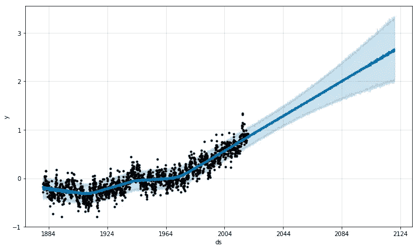*

*Resulting forecast for temperature anomalies (CREDIT: Author on [J](https://www.canva.com/)upyter Notebook)*

*这就是我们对未来 100 年全球气温异常的预测！注意那个浅蓝色的区域，它随着我们进一步向未来移动而变宽？这就是预测的不确定性；它随着我们在时间上的进一步前进而增长。*

*请记住，这种预测只考虑过去的异常数据，不考虑其他因素。在现实中，这可能被证明是有问题的，因为保留的热量实际上可能随着大气中 CO₂的增加而呈指数增加。下图是 NASA 目前对未来不同水平排放的全球地表温度预测(嘿，我们做得还不算太差！).*

*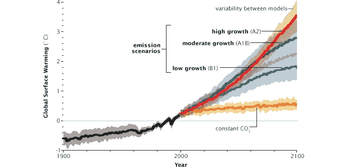*

*NASA’s forecast (CREDIT: [Nasa](https://www.nccs.nasa.gov/services/climate-data-services) forecast)*

****分解****

*正如本文开头所述，将时间序列看作由几个部分组成是有用的；幸运的是，Prophet 可以帮助我们将模型分解成这些组件，这样我们就可以直观地看到它们。*

*我们已经实例化了上面的模型，将模型分割成组件—运行下面的代码:*

```
*# Plot the forecast components
m.plot_components(forecast);*
```

*默认情况下，您将看到时间序列的趋势和年度季节性。如果你包括假期，你也会在这里看到。(使用更精细的数据，也会显示每周的季节性)。*

*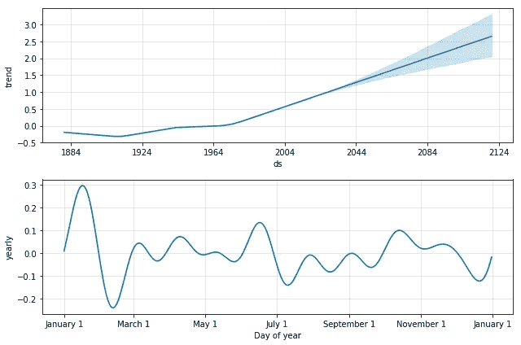*

*(CREDIT: FB Prophet, and author on Jupyter Notebook)*

*看部件能看出什么？请在下面留下您的评论。*

## *使用 ARIMA 进行预测*

*自回归综合移动平均(或 ARIMA)是一种预测技术，能够预测一个序列的未来值。*

*ARIMA 是更广泛的时间序列模型的一部分，所有这些模型都非常有用，因为它们 ***提供了一种方法，通过它我们可以对非平稳数据使用线性回归类型的模型。****

*平稳性基本上意味着您的数据不随时间演变(参见下一节的解释)。线性模型要求平稳性；他们擅长处理和预测平稳数据。*

*因此，基本的直觉是，我们希望获得一个平稳的时间序列，我们可以对其进行线性回归，而 ARIMA 只是用一些术语“强迫”你的时间序列平稳的线性回归。*

*由于这篇博文越来越长，我已经决定把自回归综合移动平均建模留到另一天，另一篇博文。现在，请看[这篇文章](https://machinelearningmastery.com/time-series-forecasting-methods-in-python-cheat-sheet/)对各种预测方法(包括 ARIMA)的精彩介绍。*

# *一般提示、术语和常见陷阱*

## *条款*

****自相关****

*自相关是进行时间序列分析时需要理解的一个重要概念；该术语指的是给定时间序列与其自身在连续时间间隔内的滞后版本之间的相似程度(并且是其数学表示)。将自相关视为时间序列与其自身的相关性，因此有时也称为滞后相关性(或序列相关性)。如果你有兴趣做 ARIMA 模型(见下文)，理解自相关是加倍重要的。*

****乱真关联****

*在统计学中，虚假相关实际上并不罕见；虚假相关是一种数学关系，其中两个或多个事件或变量相关，但没有因果关系。这可能是由于巧合或第三个看不见的因素(有时称为“共同反应变量”、“混杂因素”或“潜伏变量”)的存在。*

****平稳性****

*平稳时间序列是指几个统计属性(即均值、方差和协方差)不随时间变化的序列**。这意味着，尽管这些值会随时间而变化，但序列本身随时间变化的方式不会随时间而变化。***

*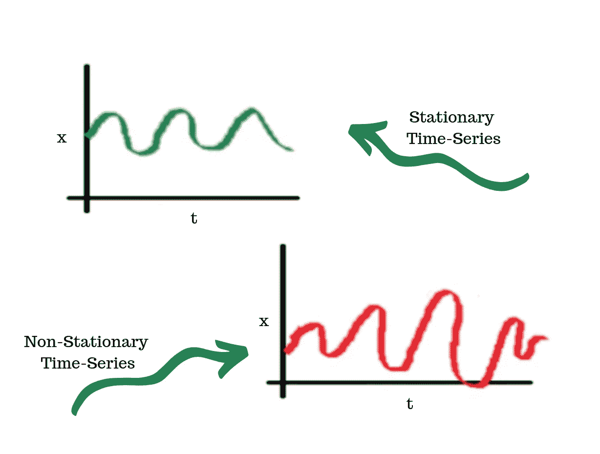*

*Stationary vs. Non-Stationary Time Series (CREDIT: Author on [Canva](http://canva.com))*

*关于这方面的更多信息，请看这里的[和这里的](/stationarity-in-time-series-analysis-90c94f27322)。我们不会深入探讨平稳性——但是我们会在**这篇文章中讨论如何测试平稳性，以及如何让我们的两个序列平稳(为了格兰杰因果关系测试的目的)。***

## *技巧*

****相关不是因果****

*在统计领域，相关性并不等于因果关系，这已经成为一个基本原则。这意味着，仅仅因为两件事看起来相互关联，并不意味着一件事会导致另一件事。这是一个值得尽早学习的课程。*

**

*Correlation does not have to equal causation (Credit: [original](https://www.explainxkcd.com/wiki/index.php/552:_Correlation))*

****提防趋势****

*趋势出现在许多时间序列中，在开始探索两个不同时间序列之间的关系之前，您应该首先尝试测量和控制这种趋势。这样做，你将减少遇到虚假相关性的机会。但是，即使去除时间序列的趋势也不能保护你免受所有虚假相关性的影响——季节性、周期性和自相关性等模式也可以。*

****注意你如何应对趋势****

*天真地去趋势化是可能的。如果您正在寻找滞后效应，尝试使用(例如)一阶差分方法实现平稳性可能会破坏您的数据。*

**

*Thanks for reading! (CREDIT: Author)*

*我希望这篇文章对那些刚开始时间序列分析的人有所启发——我真的很喜欢写它，并且学到了很多。*

*所有的源代码都可以在 [Github](https://github.com/peter-stuart-turner/time-series-analyses-and-climate-change) 上找到。请在下面张贴反馈或问题。*

# *参考*

*   *[https://climate.nasa.gov/evidence/](https://climate.nasa.gov/evidence/)*
*   *[https://www . svds . com/TBT-避免-常见错误-时间序列-分析/](https://www.svds.com/tbt-avoiding-common-mistakes-time-series-analysis/)*
*   *[https://medium . com/@ shachiakyaagba _ 41915/dynamic-time-warping-with-time-series-1 f 5c 05 FB 8950](https://medium.com/@shachiakyaagba_41915/dynamic-time-warping-with-time-series-1f5c05fb8950)*
*   *[https://www . machinelingplus . com/time-series/time-series-analysis-python/](https://www.machinelearningplus.com/time-series/time-series-analysis-python/)*
*   *[https://towards data science . com/basic-time-series-manipulation-with-pandas-4432 afee 64 ea](/basic-time-series-manipulation-with-pandas-4432afee64ea)*
*   *[https://machine learning mastery . com/time-series-forecasting-methods-in-python-cheat-sheet/](https://machinelearningmastery.com/time-series-forecasting-methods-in-python-cheat-sheet/)*
*   *[https://towards data science . com/end-to-end-time-series-analysis-and-modeling-8 c 34 f 09 a 3014](/end-to-end-time-series-analysis-and-modelling-8c34f09a3014)*
*   *[https://machine learning mastery . com/time-series-data-stationary-python/](https://machinelearningmastery.com/time-series-data-stationary-python/)*
*   *[https://www . quora . com/ARIMA 的直观解释是什么](https://www.quora.com/What-is-the-intuitive-explanation-of-ARIMA)*