# Web 服务度量的时间序列分析和预测

> 原文：<https://towardsdatascience.com/time-series-analysis-and-forecasting-of-web-service-metrics-1e15d7fb72c2?source=collection_archive---------7----------------------->

## 讨论用于分析和预测 Web 服务度量及其应用的各种机器学习技术。

# 概观

在本文中，我们将 ***讨论用于分析和预测 web 服务指标的各种机器学习技术及其应用*** 。 *Auto-scaling* 就是一个很好的应用，预测技术可以用来估计 web 服务的请求率。类似地，预测技术可以应用于服务指标，以*预测警报和异常*。

在本文中，我将首先讨论**时间序列**数据及其在预测技术中的作用。稍后，我将举例说明一个用于预测 web 服务请求率的预测模型。本文提供了对时间序列预测技术的基本理解，这些技术可以应用于服务度量或任何时间序列数据。

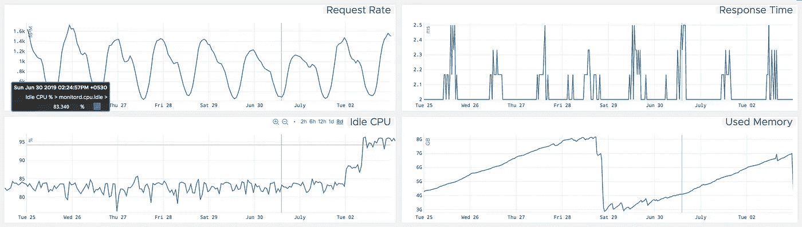

# 开始使用…

## 什么是时间序列？

**时间序列**是以恒定的时间间隔收集的数据点的集合。**时间序列数据的示例**可以从应用程序指标(如 RPM 中的请求率)到系统指标(如以固定时间间隔获取的空闲 CPU 百分比)不等。

为了用机器学习技术解决预测问题，需要将数据转换成时间序列格式。时间序列数据具有自然的时间顺序。时间序列分析可以应用于实值、连续数据、离散数字数据或离散符号数据。

为了说明，我使用了 *Python* 。 ***Numpy，Pandas，Matpoltlib*** 模块用于*转换&分析*，S ***tatsmodel*** 用于*预测模型*。

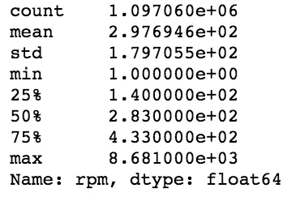

Statistics of Request Rate data

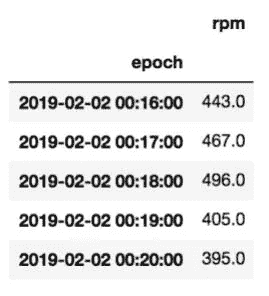

Few data points of time series

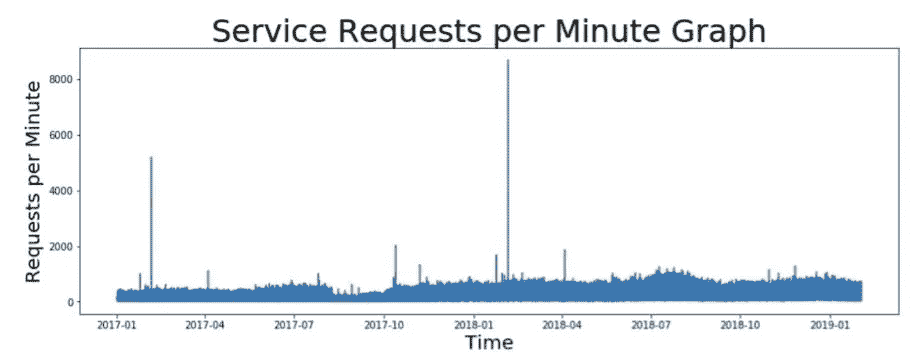

Time series graph representing request rates (in RPM) for a web service taken at every minute of interval.

> ***预处理数据***
> 
> 查看上面以 RPM 为单位的请求率图表，您是否发现数据存在任何挑战？
> 
> 在上图中，您可以观察到**有太多的数据点和峰值**需要处理。
> 
> 如何处理这个问题？
> 
> ***重采样**:所有的数据点都是以一分钟为间隔采集的。每小时、每天或每周重新采样数据有助于减少要处理的数据点数量。在本例中，我们将使用**日平均重采样**值。
> 
> ***变换**:可以应用对数、平方根或立方根等变换来处理图形中的尖峰。在本例中，我们将对时间序列执行**对数转换**。

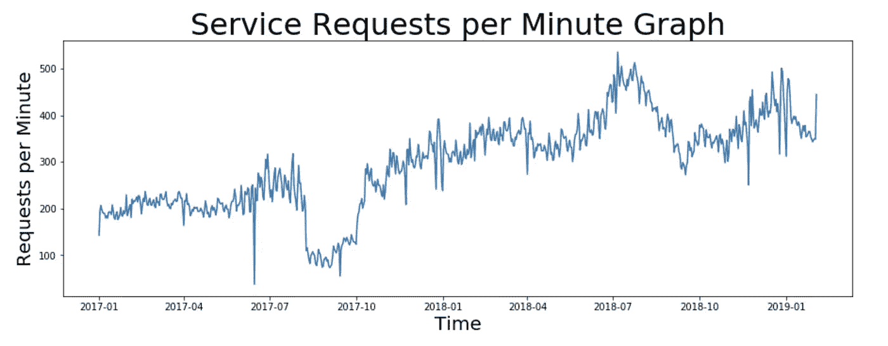

Observe that large number of data points have reduced and the graph looks smoother as a result of daily resampling.

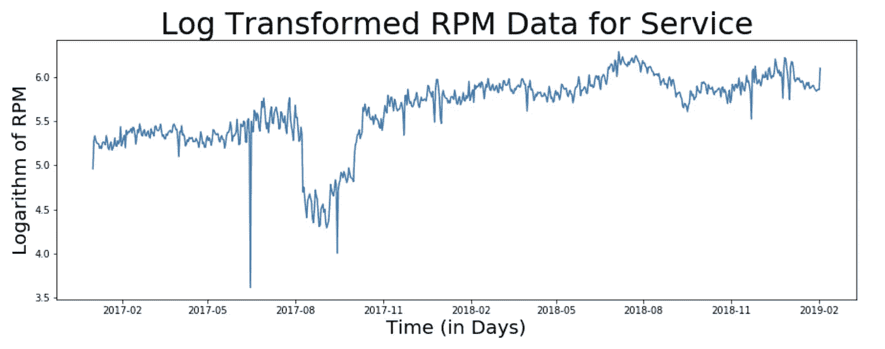

Observe the values on the y-axis as a result of log transformation

## 时间序列基本

**单变量与多变量时间序列** *单变量时间序列数据只包含一个变量。单变量分析是最简单的数据分析形式，其中被分析的数据只包含一个变量。因为它是一个单一的变量，它不处理原因或关系。这种单变量时间序列的一个例子可以是请求速率度量。
当时间序列由两个变量组成时，称为*二元时间序列*。对这类数据的分析涉及原因和关系，分析的目的是找出两个变量之间的关系。例如，web 服务的 CPU 使用率百分比取决于请求率。为了更好地理解数据，这些变量通常绘制在图表的 X 轴和 Y 轴上，其中一个变量是独立的，而另一个是相关的。
*多元时间序列*由三个或更多的变量组成。多变量时间序列的例子可以是依赖于多个变量的股票价格。*

***时间序列的组成部分** 为了想出一个适合预测时间序列的模型，了解时间序列数据的组成部分是很重要的。时间序列数据主要由以下部分组成:*

*   ****趋势*** 趋势显示数据在一段较长时间内增加或减少的总体趋势。趋势是一个平滑的、一般的、长期的、平均的趋势。在给定的时间内，增加或减少并不总是必须在同一方向。对 web 服务的请求率可能会在一段较长的时间内显示出某种类型的移动趋势。*
*   ****季节性*** 这些是由于季节性因素而在数据中出现的短期变动。短期通常被认为是时间序列发生变化的时期。电子商务网络服务在某些月份可能会收到更多的流量。*
*   ****周期*** 这些是时间序列中发生的长期振荡。*
*   ****错误*** 这些是时间序列中的随机或不规则运动。这些是在时间序列中发生的突然变化，不太可能重复。*

> ****加法与乘法模型****
> 
> **简单分解模型可以是:* 加法模型:Y[t] = T[t] + S[t] + e[t]
> 乘法模型:Y[t] = T[t] * S[t] * e[t]*
> 
> **其中，Y[t]为‘T’时刻的预测值，T[t]，S[t]和 e[t]分别为‘T’时刻的趋势分量、季节分量和误差。**

*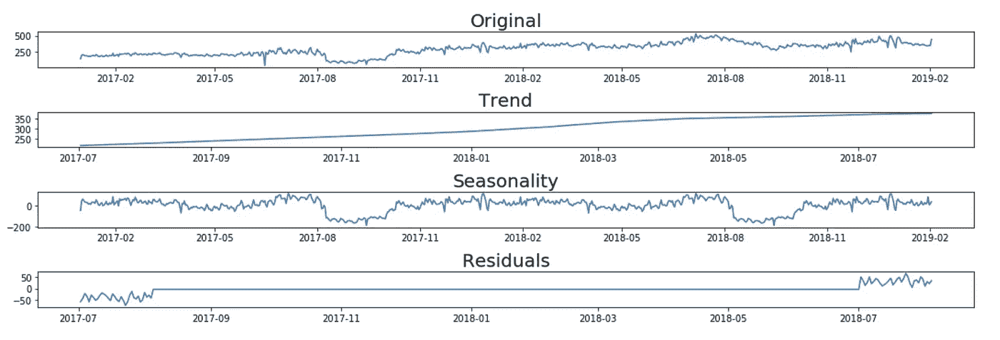*

*Additive Decomposition Model for time series*

*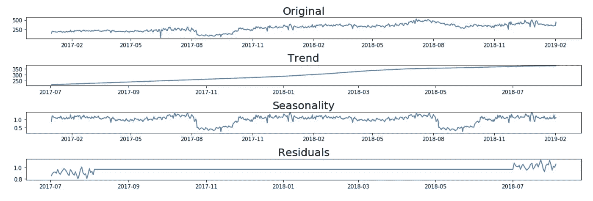*

*Multiplicative Decomposition Model for time series*

## *平稳序列*

*如果时间序列在一段时间内具有恒定的统计特性，即。以下内容:*

*   *常数平均值*
*   *恒定方差*
*   *不依赖于时间的自协方差。*

*大多数时间序列模型要求时间序列是平稳的。*

## *如何检查时间序列的平稳性？*

*以下是检查时间序列平稳性的一些方法:*

*   ***滚动统计** 我们可以 ***绘制移动平均值或移动方差*** 来检查随时间的变化。例如，7 天内每分钟请求的滚动平均值图表。这是一种视觉技术。*
*   ***Dickey-Fuller 检验** 这是用于检查平稳性的 ***统计检验*** 之一。它是 ***单元根测试*** 的一种类型。测试结果由测试统计数据和不同置信水平的一些临界值组成。如果“检验统计量”小于“临界值”，我们可以拒绝零假设，说序列是平稳的。这里的零假设是时间序列是非平稳的。*

*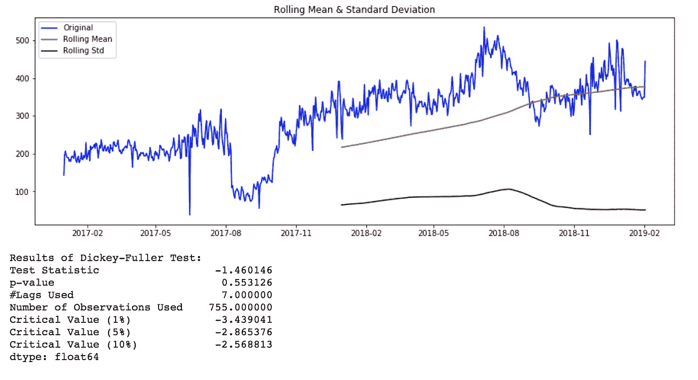*

*Rolling Stats Plot and AD Fuller Test results for original time series*

## *如何让一个时间序列平稳？*

*有多种方法可以使时间序列平稳。其中有 ***求差、去趋势、变换*** 等。*

*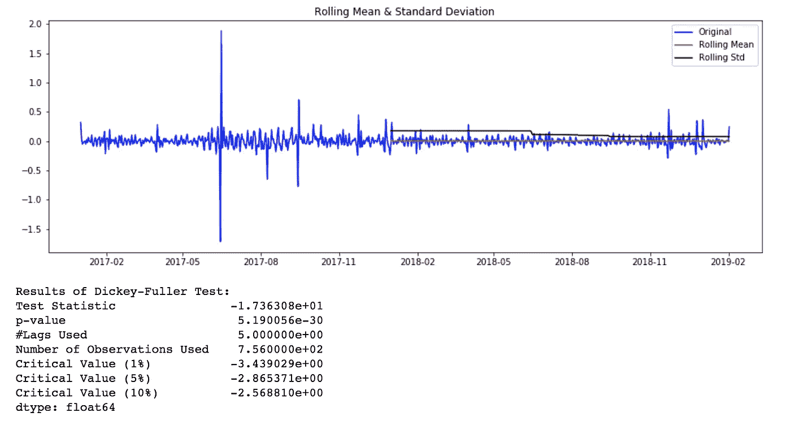*

*Rolling Stats Plot and AD Fuller Test results for log transformed and differenced time series.*

# *模型拟合和评估*

*我大致讲两种预测模型， ***数学模型和人工神经网络*** 。*

*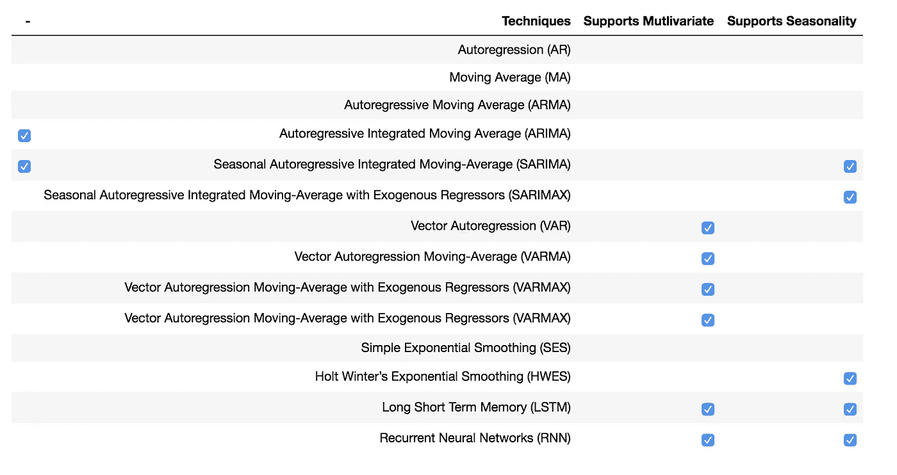*

*Predictive Models*

## *数学模型*

*下面提到一些经典的时间序列预测模型。我将为我们的场景举例说明 **SARIMA** 模型。*

*AR、MA、ARMA、ARIMA 等模型都是萨里玛模型的特例。VAR、VARMA、VARMAX 类似于前面提到的模型，它们在向量数据而不是单变量时间序列的情况下很有用。*

*在某些情况下，Holt-Winter 模型可用于预测带有季节性成分的时间序列。*

***萨里玛型号***

*当时间序列中存在趋势和季节性时，非常流行的方法是使用 S **季节自回归综合移动平均(SARIMA)** 模型，它是 ARMA 模型的推广。*

*萨里玛模型由**萨里玛(P，D，q) (P，D，Q) [S]** 表示，其中*

*   ***p，q** 指 ARMA 模型的自回归和移动平均项*
*   ***d** 是差异度(数据减去过去值的次数)*
*   ***P、D 和 Q** 指的是 ARIMA 模型季节部分的自回归、差分和移动平均项。*
*   ***S** 指每个季节的周期数*

> ***模型参数估计***
> 
> **对于萨里玛 **(p，D，q) (P，D，Q)【S】**模型，我们需要**估计 7 个参数**。*
> 
> **从季节分解中我们看到，时间序列数据具有季节性。因此， **S = 365** ，表示季节变化有 365 天的滞后。*
> 
> **对于 **p，Q，P & Q** 参数，我们可以**绘制 ACF(自相关函数)& PACF(部分自相关函数)**并且对于参数 **d & D** 我们可以尝试在时间序列中具有**差异的相同绘图。***

*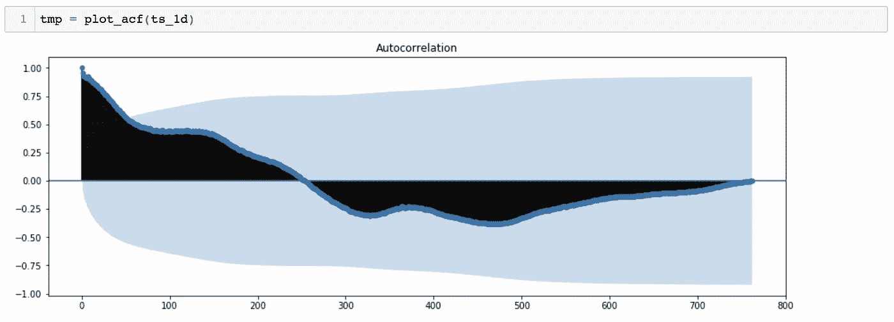*

*ACF Plot suggests a possibility of P = 0 and D = 0*

*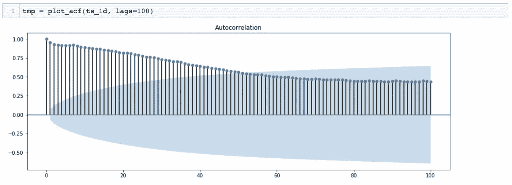*

*ACF Plot suggests a possibility of p ~ 43 and d = 0*

*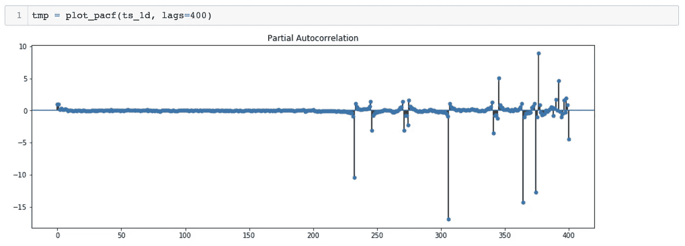*

*PACF Plot suggests a possibility of Q = 0 and D = 0*

*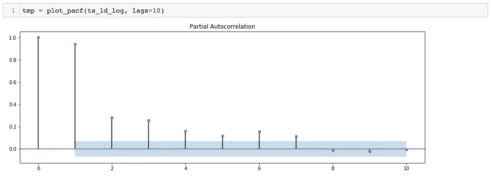*

*PACF Plot suggests a possibility of q ~ 7 and d = 0*

> **估计参数的另一种方法是通过尝试多组值来找到一个模型，对于该模型， **AIC** ( **Akaike 信息准则**)值相对较小。*
> 
> **模型的估计参数是: **SARIMA (2，1，4) (0，1，0)【365】***
> 
> ***训练和测试数据集拆分***
> 
> *就像其他机器学习模型一样，为了评估模型的准确性，我们**将数据集分为训练和测试数据集**。这个比例可以从 60%到 90%不等。在我们的例子中，由于数据点的数量较少，我保持 **95%** 的比率。保持该比率为 95%的另一个原因是，为了使 SARIMA 模型准确预测，训练数据集应该具有足够的 2 个季节的数据点。*

*Model will be trained with 2 years data and tested with 39 days data.*

> ***模型拟合***
> 
> **被拟合的数据是* ***日均重采样和对数变换的时间序列*** *。模型调用估计参数* ***(2，1，4) (0，1，0)【365】****。注意到该型号的* ***AIC 值为-296.90*** *。**

> ***预测***
> 
> *现在模型已经训练好了，我们可以进行预测了。为此，我们可以提供要预测的步数作为参数。*

*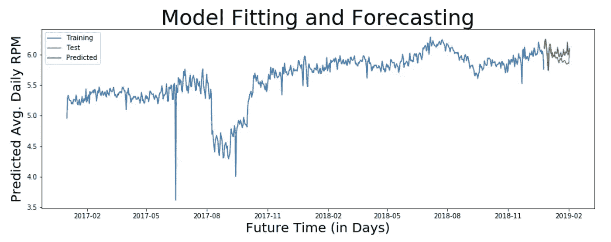*

*Graph showing Training, Test and Predicted values for Average Daily and Log Transformed RPM values for the service.*

***注意**:观察文章开头的原图 和上面提到的预测图中 ***y 轴上的数值。web 服务的 RPM 值大约为 300，而预测值大约为 5，这是因为预测值被转换了。我们需要应用**逆变换**来获得原始刻度上的值。根据我们应用的转换，您能猜出哪个逆转换是合适的吗？****

*基于应用的*对数变换*，我们需要对逆应用*指数变换。这在评估预测之前是必需的，因为我们需要知道*原始标度*上预测值的准确性。**

> ***验证预测***
> 
> *既然我们已经将预测值逆变换回原始比例，我们就可以评估预测模型的准确性了。*
> 
> *为此我们需要找出**原始** & **预测**测试值之间的误差来计算:
> *均方误差(MSE)
> *均方根误差(RMSE)
> *变异系数
> *四分位数离散系数等*

*由于我们的数据集只有 39 个数据点，我们将能够评估 39 天的预测。让我们评估一下 **39 天**和 **20 天**的模型，以比较结果。*

***39 天预测***

*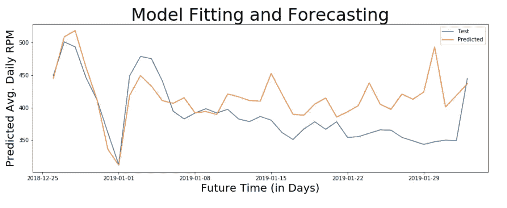*

*Actual and Predicted RPM for 39 days*

***注意**:变异系数为 11.645，这意味着该模型能够以 88%的**准确度预测未来 39 天**的服务的日平均转速。*

***20 天预测***

*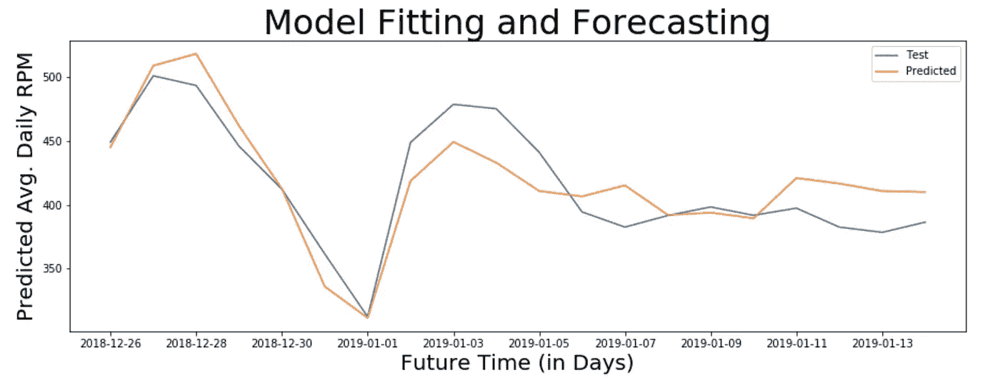*

*Actual and Predicted RPM for 20 days*

***注意**:变异系数为 5.55，这意味着该模型能够以 94%的准确率**预测未来 20 天的服务日平均转速**。*

## *神经网络*

*基于预测的问题的神经网络模型与数学模型的工作方式不同。一个**递归神经网络** ( **RNN** )是一类*人工神经网络*，表现出时间动态行为。*

***LSTM【长短期记忆】**是最合适的 ***RNN*** 。为了发展 LSTM 模型，时间序列预测问题必须重新构造为监督学习问题。*

# *结论*

*   *为了预测 web 服务的某些度量，如*，需要非常高效的模型来预测 ***实时时间序列数据*** 。**
*   **每个指标都有一个合适的 ***粒度的时间步长*** 与之相关联。为了预测响应时间，时间步长的合适粒度应该是秒或分钟。而对于自动缩放，预测每天的 RPM 就足够了。**
*   **在预测涉及 ***多变量时间序列*** 的复杂指标时，如 ***CPU 使用率%或磁盘交换*** ，应选择适当的模型，因为它可能不是单变量时间序列，并且多个变量肯定会影响其值。**
*   **为预测一个指标而开发的预测模型可能不适合另一个指标。**
*   *****模型*** 的精度可以通过用更大的数据集训练它和微调模型的参数来提高。**

# **进一步阅读**

*   **要了解更多关于本文中提到的其他时间序列预测模型，你可以阅读[温特-霍尔特](https://en.wikipedia.org/wiki/Exponential_smoothing)和 [LSTM](https://en.wikipedia.org/wiki/Long_short-term_memory) 。**
*   **要理解多变量时间序列的时间序列分析，请阅读[格兰杰因果关系](https://en.wikipedia.org/wiki/Granger_causality)测试。**
*   **对于 ACF 和 PACF 图，请参考[自相关](https://en.wikipedia.org/wiki/Autocorrelation)和[部分自相关](https://en.wikipedia.org/wiki/Partial_autocorrelation_function)。**