# Python 中从头开始的时间序列分析:第 1 部分

> 原文：<https://towardsdatascience.com/time-series-analysis-from-scratch-in-python-part-1-810dea60327a?source=collection_archive---------19----------------------->

不可否认，时间序列分析在数据科学领域是一件大事，所以我想出了一个主意，创建一个涵盖几乎所有内容的完整系列文章——从基本的日期和时间操作到 **LSTMs** 和深度学习。

Photo by [Lukas Blazek](https://unsplash.com/@goumbik?utm_source=medium&utm_medium=referral) on [Unsplash](https://unsplash.com?utm_source=medium&utm_medium=referral)

我并不是说已经没有太多可用的资源，但我更喜欢由一个作者编写学习资源，因为速度和基调在一开始就设定好了，而且更容易理解——前提是你喜欢作者解释事情的方式。

话虽如此，我认为从小处着手从基础做起是个好主意——那就是使用 Python 的**日期处理**。更准确地说，在本文中，您将学习如何在纯 Python 中处理日期，同时也在 *Numpy* 和 *Pandas* 中处理日期。如果你以前做过数据分析，我肯定你对这些库很熟悉。但是如果你没有，那也没关系，这不是火箭科学。

所以，事不宜迟，让我们进入好东西。

# 用纯 Python 处理日期

要开始，你需要做一个奇怪的导入:

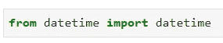

是的，我也不知道为什么要这样设计，但事实就是如此。您现在可以使用 ***日期时间*** 模块来创建 ***日期时间*** 对象。让我们来看看实际情况。今天是 2019 年 11 月 15 日*，所以让我们以某种方式来表示:*

*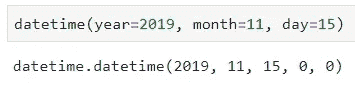*

*注意，如果知道确切的排序，就不需要指定参数名(*年、月、日*)，但是我认为显式总是比隐式好，所以我就这么做。*

*你还可以更进一步，比如指定**小时**和**分钟**:*

*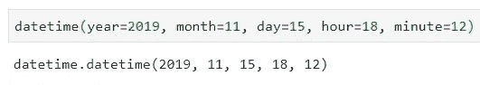*

*太酷了。*

*但是如果我想知道当前的时间呢？ 这也是完全容易实现的:*

*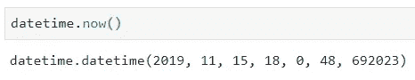*

*请注意这个 ***日期时间*** 对象有以下内容:*

*   *年份= 2019 年*
*   *月份= 11*
*   *天= 15*
*   *小时= 18*
*   *分钟= 0*
*   *秒= 48*
*   *微秒= 692023*

*因此，您可以在任何给定时间轻松提取其中任何一个:*

*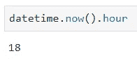*

*这一切都很棒。但是在数据分析的过程中，我也倾向于用 *Numpy* 和 *Pandas* 来处理日期。事不宜迟，让我们探索他们的能力。*

# *嗨，我是 Numpy*

*不先导入 *Numpy* 库，就不能开始使用它:*

*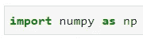*

*好了，现在解决了这个问题，让我展示如何使用 *Numpy* 来创建一个 *datetime* 对象的数组:*

*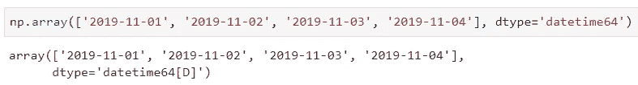*

*您看到您需要指定数据类型， *Numpy* 会自动推断出**正确的‘级别’**，在本例中是日级别。这是可以改变的，尽管，假设你只对年份感兴趣。您不必排除日和月信息，因为有更简单的方法:*

*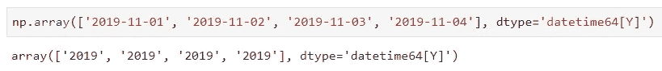*

*派对不止于此。有时，您可能希望在两个日期之间的特定时间间隔提取日期。酷的是你可以使用 ***arange()*** 函数，只是记住你需要指定数据类型:*

*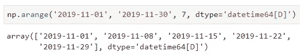*

*您还可以做更多的事情，但是目前这已经足够了，至少对于 *Numpy* 库来说是这样。*

# *以熊猫结束强势*

*熊猫是一个很棒的图书馆——但是我想你现在已经知道了。话虽如此，我也确信你知道如何导入，但只是为了导入:*

*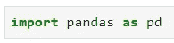*

*现在让我们探索如何从某个开始日期创建一个日期数组。我将在**每日频率**中创建整个*11 月*的日期:*

*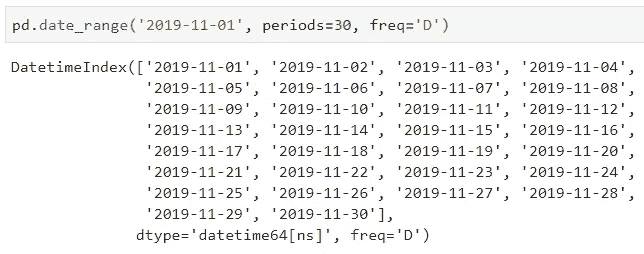*

*好吧，这里没什么特别的，但是让我们看看你能在这里做什么。我将把上面的相同逻辑存储到一个变量中:*

*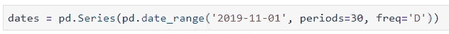*

*酷的是你可以在新创建的变量上使用所有可用的函数。让我们探索其中的几个:*

*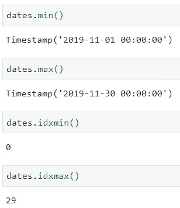*

*我认为就此打住是个好主意——这足够写一篇文章了。*

# *在你走之前*

*我知道这对于你们中的一些人来说是基本的东西，但是偶尔回顾一下也没什么坏处。此外，一些更有趣的帖子即将发布，比如日期转换和重采样(*可能是下一篇文章*的想法)，所以如果你对此感兴趣，请继续关注。*

*感谢阅读，保重。*

*喜欢这篇文章吗？成为 [*中等会员*](https://medium.com/@radecicdario/membership) *继续无限制学习。如果你使用下面的链接，我会收到你的一部分会员费，不需要你额外付费。**

* [## 通过我的推荐链接加入 Medium-Dario rade ci

### 作为一个媒体会员，你的会员费的一部分会给你阅读的作家，你可以完全接触到每一个故事…

medium.com](https://medium.com/@radecicdario/membership)*