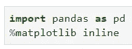
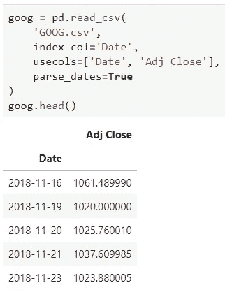
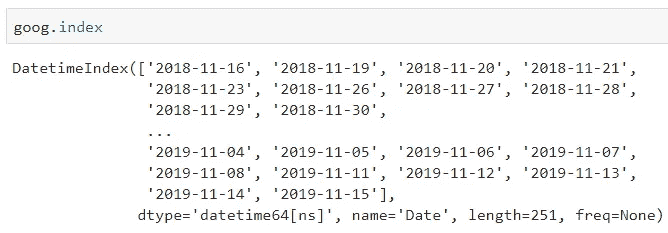
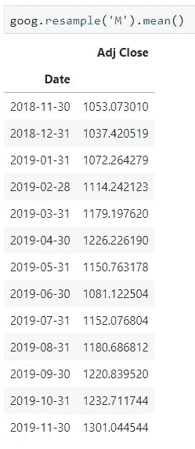
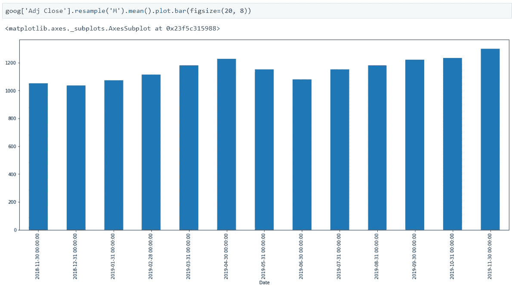
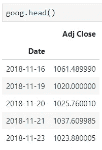
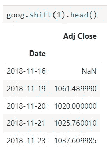
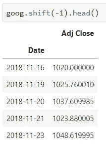

# Python 中从头开始的时间序列分析:第 2 部分

> 原文：<https://towardsdatascience.com/time-series-analysis-from-scratch-in-python-part-2-1408e91e5e02?source=collection_archive---------39----------------------->

这是 Python 中时间序列分析的第二部分，将涵盖比前一部分更有趣的主题。如果您错过了上一篇文章，并且不熟悉 Python 中的日期和时间，[您可以在这里找到它](/time-series-analysis-from-scratch-in-python-part-1-810dea60327a)。

Photo by [Sonja Langford](https://unsplash.com/@sonjalangford?utm_source=medium&utm_medium=referral) on [Unsplash](https://unsplash.com?utm_source=medium&utm_medium=referral)

这一次，我想把重点放在一些更有趣的事情上，你可以用 Python 来处理日期，这些事情包括:

*   重采样
*   改变

因此，如果你还不熟悉你要享受的话题，如果你已经熟悉了，简单回顾一下也无妨。

事不宜迟，我们开始吧。

# 数据采集

在这篇文章中，我选择使用雅虎财经的一些股票数据。但是在我解释如何获得它之前，让我们先做导入。您将需要 Pandas 库，并且需要设置***% matplotlib inline***param 来查看笔记本中的图表。我不会单独导入 ***matplotlib*** ，因为我们将使用熊猫来制作图表。

现在开始收集数据。我选择使用 **Google Inc.** 股票价格数据集，您可以通过[打开此 URL](https://finance.yahoo.com/quote/GOOG/history?p=GOOG) 并点击 ***下载数据*** 按钮下载 CSV 格式的数据集。下载完成后，你可以通过 Pandas 导入它，并且只保留相关的列以供进一步分析。

看看我是如何指定 ***索引*** 列以及如何将 ***parse_dates*** 参数设置为 True 的:

瞧。通过使用 ***index_col*** 和 ***parse_dates*** 参数，数据集自动处于所需的格式，并准备好进行进一步分析。

让我们快速检查一下索引，看看它是否确实是 ***日期时间*** 格式:

一切看起来都很好。我们继续吧。

# 基本重采样

简而言之，重采样意味着聚合数据的一种方式。这里我用***【M’***作为重采样规则，代表月，我用 mean 作为聚合函数。这将执行以下操作:

*   获取给定月份的所有价格
*   通过将所有价格的总和除以该月的日期数来计算平均值

让我们来看看它的实际应用:

不过，您并不局限于每月重新采样，以下是可用的最流行的重新采样方法列表:

Source: [https://pandas.pydata.org/pandas-docs/stable/user_guide/timeseries.html](https://pandas.pydata.org/pandas-docs/stable/user_guide/timeseries.html)

我知道这是一个很长的列表，但是它能让你做任何你想做的事情，所以把它放在你身边。

派对并没有就此结束，因为我现在将使用 Pandas 内置的可视化方法来获得月平均股票价格的条形图:

***看到了吗？*** 非常容易做到，而且你不必使用专用的绘图库。

这是对重采样的基本介绍，我将把进一步的探索留给你(*一旦你掌握了它的要点*，这就不难了)。

# 时间位移

时间转移基本上意味着从一个时间周期转移到另一个时间周期。让我们回顾一下数据集的样子:

在熊猫 DataFrame 对象上，可以使用 ***。*shift()**从一个时间移到另一个时间的方法。让我们来看看实际情况，我将使用这种方法向前移动一段时间:

您可以看到第一个值丢失了，这很明显，因为在第一次观察之前没有关于股票价格的信息。

您也可以通过在整数参数前面加上减号来后退:

如果您想知道这种技术什么时候有用，那么，您可以声明几个列，每个列在过去多移动一天。通过这样做，你可以建立一个模型来预测第二天价格是上涨还是下跌。

# 在你走之前

这又是对一些基本时间序列方法的简短介绍。我更喜欢这种方式，而不是写一篇你会在一分钟内点击离开的长文章。

过几天，我会写一篇文章介绍 ***StatsModels*** 库，稍后会有更多介绍。

感谢阅读。保重。

*喜欢这篇文章吗？成为* [*中等会员*](https://medium.com/@radecicdario/membership) *继续无限制学习。如果你使用下面的链接，我会收到你的一部分会员费，不需要你额外付费。*

 [## 通过我的推荐链接加入 Medium-Dario rade ci

### 作为一个媒体会员，你的会员费的一部分会给你阅读的作家，你可以完全接触到每一个故事…

medium.com](https://medium.com/@radecicdario/membership)