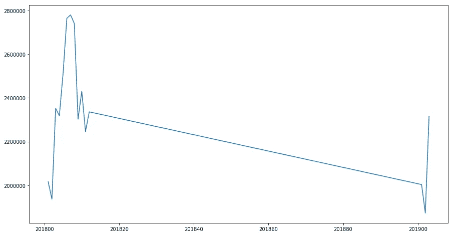
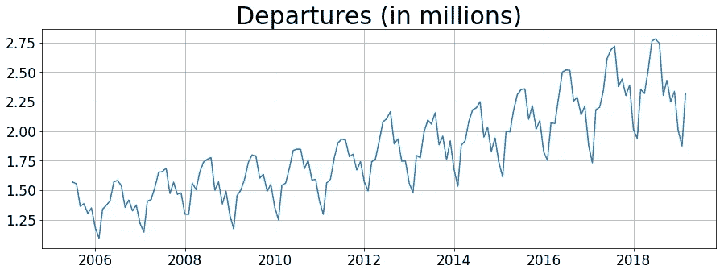
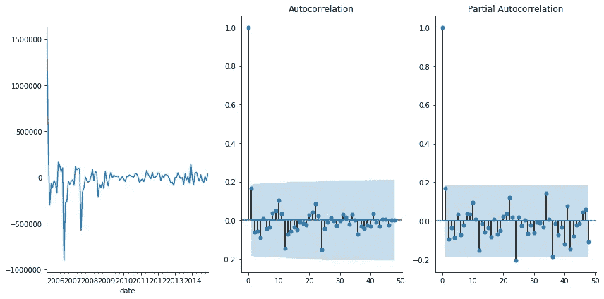
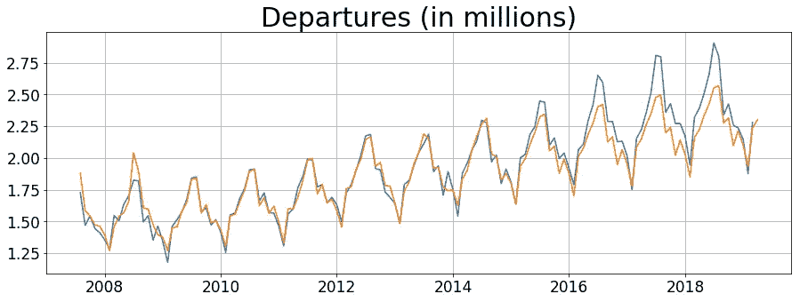
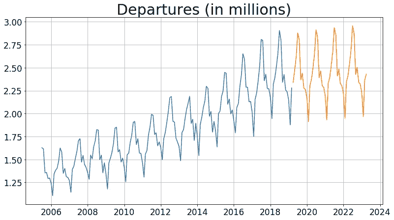
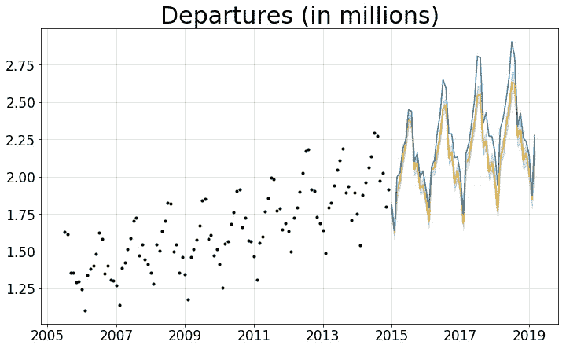
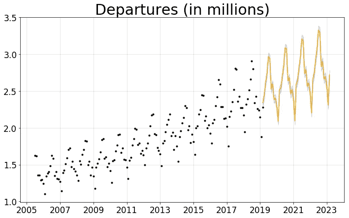
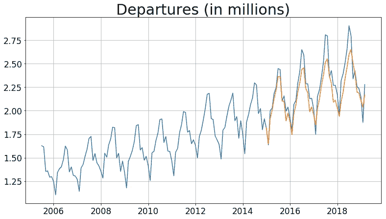
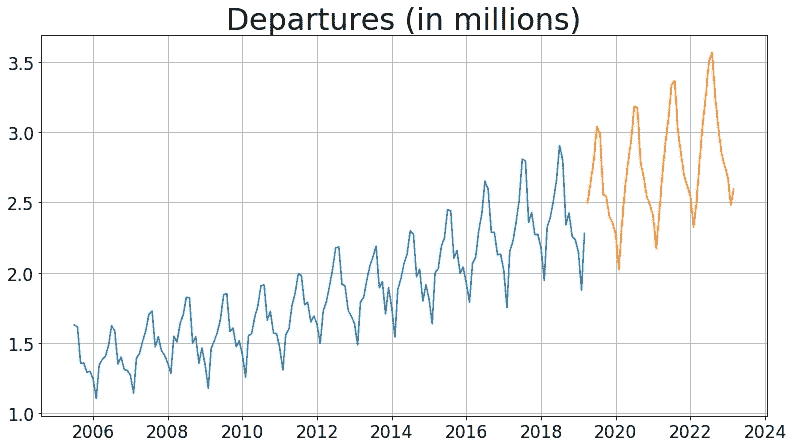

# SFO 流量增长的时间序列分析

> 原文：<https://towardsdatascience.com/time-series-analysis-of-sfo-traffic-growth-5c7d03cf52b2?source=collection_archive---------17----------------------->

Photo by [Ross Parmly](https://unsplash.com/@rparmly?utm_source=medium&utm_medium=referral) on [Unsplash](https://unsplash.com?utm_source=medium&utm_medium=referral)

## [深入分析](https://medium.com/towards-data-science/in-depth-analysis/home)

## 未来 4 年 SFO 的增长速度会有多快？

*这是我完成的一个机器学习项目的文字记录。在这篇文章中，我将介绍我的项目过程，并展示我们对 SFO 未来的期望。*

*这个分析的所有代码都可以在*[*my Github*](https://github.com/Alexandre987/SFO_Time_Series)*上找到。*

随着对科技工作者的需求和科技对商业的影响持续增长，旧金山湾区现在是一个热门的居住市场。

我不想分析更传统的衡量湾区需求的方法，如房价，我想看看进出旧金山的交通流量，看看我们如何预计未来 4 年的交通流量增长。

我从 SFGov 网站[获取了航空交通统计数据，该网站从 2005 年底到 2019 年初，每月都有每个航站楼和航空公司的乘客数据，包括出发和到达的乘客数据。我选择分析整个机场的出发情况，因为这将更准确地衡量大多数人到达机场时关心的交通状况(安检时间有多长，有多少人将在候机楼等待，等等)。](https://data.sfgov.org/Transportation/Air-Traffic-Passenger-Statistics/rkru-6vcg)

# 数据清理

首先，我需要清理我的数据。我确保没有空值，使用 matplotlib 可视化我的数据，并修复了数据的其他小问题。

例如，来自 SFGov 的数据使用整数表示年份和月份值(201801 表示“2018 年 1 月”)。这似乎不是一个问题，直到你看到下面一张特定航空公司的航班起飞时间图:

What is that long line?

上图显示了“2018 12”(2018 年 12 月)和“2019 01”(2019 年 1 月)之间的巨大差距。它将这一差距视为时间上的巨大差距，而不是理解为 2019 年 1 月紧接着 2018 年 12 月。

一旦我将 integer 列转换为 datetime，彻底清理我的数据，并将较小的数据点聚合为我想要分析的格式，时间序列数据的完整版本如下:

Much better — time for actual analysis!

# 通用方法

总的来说，由于我试图预测 SFO 在未来 4 年将会有什么样的流量，我将在我的数据中进行训练/测试分割，测试集为最近 4 年。这样，**当我在测试集**上测量我的模型的平均绝对误差时，它将代表我的实际未来预测中预期的那种误差。

> 列车组:05 年到 14 年
> 
> 测试集:“15 到 19”

# 1.萨里玛

我使用 SARIMA 作为我的时间序列分析的基线模型。萨里玛只是带有季节性成分的 ARIMA(从上图的视觉效果来看，我的数据显然是这样的)。一个很好的使用 ARIMA 的技术资源可以从杜克大学的网站上获得。

SARIMA 的工作原理是将多个更简单的模型结合在一起:

*   **S** :季节性的(数据有一些整体的季节性模式，为下面的所有组件复制一个额外的术语层)
*   **AR** :自回归(使用以前期间的值来预测未来期间)
*   **I** : Integrated(通过使用至少一阶[差分](https://people.duke.edu/~rnau/411diff.htm)使数据平稳化——我不会在这里深入讨论)
*   **MA** :移动平均线(一种滞后指标，使用过去值的窗口来“平滑”数据。这抵消并缓和了 AR 分量的趋势)

我没有手动摆弄上面的组件，而是编写了自己的网格搜索方法，通过参数找到最低的 AIC 分数。

> AIC 平衡拟合优度，同时惩罚模型复杂性以避免过度拟合。返回最低 AIC 的模型给出了模型的拟合和概化的最佳组合。

## 自相关和部分自相关图(相关图)

找到最低的 AIC 后，有必要抽查我的数据的自相关和偏自相关图，以确保我的模型没有任何可以改进的地方。

自相关图显示了在多个时间滞后时与过去值的相关程度(介于-1 和 1 之间)。部分自相关图显示了与过去残差的相关程度。在高水平上，如果我的任何自相关或部分自相关超过蓝色置信带，这意味着存在统计上显著的相关性，我们仍然可以用不同的 SARIMA 模型来解释。

我们可以看到，在滞后为 0 时，存在完美的+1.0 相关性。这是有意义的，因为滞后为 0 的任何时间点的值只是它本身，并且与它本身完美地相关。我们还看到，在大多数情况下，除了在 2 年和 3 年的标记上有一些轻微的负部分自相关(但奇怪的是，不是 1 年标记)，没有任何统计上显著的自相关。这是足够好的考虑这是我们的萨里玛模型的最终版本。

具有最低 AIC 的模型是 SARIMA(1，1，2)(1，1，2，12)。这意味着我的模型最多追溯到 2 年前，以获得预测未来的相关数据。因此，当我对我的 SARIMA 模型评分时，我应该只根据至少有 2 年数据支持的预测来判断它。这就是为什么我的训练预测从 07 年末开始，尽管我的训练数据从 05 年开始。

产生的 SARIMA 低于**(蓝色为实际值，橙色为预测值)**:

你可以看到，我的模型在预测 4 年的测试数据时，开始越来越大幅度地偏离。

> 平均绝对误差:5.5%

在获得 5.5%的 MAE 后，我对所有数据重新训练了我的 SARIMA，以便预测 2019 年至 2023 年的流量。

My SARIMA estimates growth conservatively

为什么我的模型预测如此保守？你可以在过去两年的真实数据(2017-2019)中看到，增长逐渐减弱。因为 SARIMA 只有 AR 季节成分 1 和 MA 成分 2，所以我的模型最远可以追溯到 2 年前。它将过去两年的趋势延续到未来。

> 预计增长(超过 4 年):
> 
> **+3.7%**
> 
> **+26 万人次/年**

最后，我使用 Q-Q 图和残差图来确保我的模型在制作模型时不违反任何线性的[假设(这些图不包括在本文中，但它们在](https://www.jmp.com/en_us/statistics-knowledge-portal/what-is-regression/simple-linear-regression-assumptions.html)[我的 Github](https://github.com/Alexandre987/SFO_Time_Series) 上的笔记本中)。

# 2.脸书先知

接下来，我想用[脸书先知](https://facebook.github.io/prophet/)来进行同样的分析。脸书预言家是脸书团队在 2017 年初[发布的一款开源时间序列工具](https://research.fb.com/prophet-forecasting-at-scale/)。它在后端做更多的计算工作，以生成比 SARIMA 等更传统的方法更高质量的时间序列分析。例如，Prophet 将寻找多个级别的季节性(每小时、每天、每周)。它还设计用于处理异常值、非线性季节性和节假日，这使它比 SARIMA 更灵活。

FB Prophet 还有一个优点就是好用。一旦你的数据是正确的格式，你可以插入数据，看看你得到什么样的预测。

> 平均绝对误差:5.4%

我们看到 Prophet 在预测中的表现与我的 SARIMA 模型大致相同——仍然始终低估了随时间的增长。这让我相信 SFO 流量的增长可能会以一种在我的模型的训练数据中意想不到的方式*加速*。

FB Prophet: Predicted much larger growth than SARIMA

然而，您可以看到，当 Prophet 在所有数据上重新训练时，它的未来预测比 SARIMA 更好地推断了整体趋势。

> 预计增长(超过 4 年):
> 
> **+18%**
> 
> **+130 万人次/年**

# 3.神经网络

最后，我想尝试建立一个比萨里玛和 FB Prophet 更好的神经网络。

神经网络是有用的，因为它们可以通过数百次迭代来捕捉隐藏的模式，而这些模式是设计像 SARIMA 这样的参数化方法的人所遗漏的。

然而，我遇到了一个问题。因为神经网络很容易过度拟合，所以我需要**手动分离一个验证集**，这对于 SARIMA(因为我使用 AIC 分数来确定最佳模型的超参数)或 FB Prophet(因为它运行过一次，并且没有我正在调优的超参数)都是不必要的。

> 列车组:“05 年至 12 年”
> 
> 验证集:“13 至 14 年”
> 
> 测试集:“15 至 19 年”

现在，我们的训练数据离我实际预测的范围越来越远——2019 年至 2023 年。

我也是用*小数据*操作的。我的新训练集只有大约 80 个数据点来训练(每个月一个点)，这比大多数神经网络的有效使用量要小得多。对我的时间序列分析来说，建立精确神经网络的可能性越来越渺茫。

我打算尝试三种不同的神经网络，以便看看哪一种能最有效地处理我的问题。

## 3 种神经网络

1.  **LSTM(长短期记忆):**结合了记忆门来“忘记”可能是旧的数据——对时间序列分析特别有用。对于时间序列分析来说，这是一个老掉牙的好东西，从 90 年代末就有了。
2.  **CNN-LSTM:** 在 LSTM 的基础上增加一个卷积神经网络。尽管 CNN 经常用于图像识别，但在时间序列中，它们可以提取模式(季节性的细粒度类型)，然后可以滚动到 LSTM 中。
3.  **GRU(门控循环单元):**更新的架构，通过将门的数量从 3 个减少到 2 个，简化了 LSTM。适用于小数据。

在训练我的模型时，**我确保在每个时期对我的模型在验证集**上的表现进行评分，以防止过度适应训练集。

我测试了每种架构，GRU 远远胜过其他的。

对于我的问题，最好的 GRU 模型有 2 个 GRU 层，然后是 3 个大小递减的致密层(没有任何脱落层)。这种架构让我怀疑过度拟合。然而，下面的测试预测图(以及我最终的 2019-2023 预测)足够平滑，让我相信我的模型没有过度拟合。

在拟合我的 GRU 之后，在做预测的时候，我给它 12 个月的数据，让它预测下个月。然后，我会将该预测纳入未来 12 个月的数据滑动窗口，并在此基础上做出预测。这意味着经过 12 个月的预测，我的 GRU 完全是根据合成数据进行预测的。

虽然 GRU 的性能看起来类似于萨里玛和 FB 先知，但实际上它的误差比这两者都低得多。

> 平均绝对误差:4.6%

**这意味着我的神经网络比萨里玛和脸书先知的预测误差少 20%,同时用更少的数据训练，自我预测，防止过度拟合。**

当我的 GRU 根据所有可用数据进行重新训练，并根据之前 12 个月的数据进行 1 个月的滚动预测时，它预测到 2023 年的增长如下:

> 预计增长(超过 4 年):
> 
> **+22%**
> 
> **+160 万人次/年**

这些投影的平滑性让我相信，新训练的神经网络不会在整个数据集上过度拟合，尽管在我的神经网络架构中缺乏脱落层。

# 结论

总之，由于我的 GRU 神经网络具有最低的平均绝对误差(超过脸书先知和萨里玛约 20%)，我们可以对它的未来预测最有信心。

我的 GRU 预测，SFO 每年将增加 160 万次出发，到 2023 年，每年的出发总量将增加 22%。

# 未来的工作

将来，我会检查每个航空公司从旧金山出发的和到达的*之间的差异的季节性模式。然后我就可以知道是否有办法预测某个特定月份哪个航空公司可能有最多的空位。*

例如，也许在假日期间，联合航空公司在旧金山的离境乘客通常比抵达乘客多，这表明他们的飞机在离开旧金山的路上将会非常满。但也许捷蓝航空在假日月份有更有利的到达/离开比率，这意味着如果你想最大限度地增加乘坐空飞机的机会，你应该在假日乘坐捷蓝航空旅行。

上述模式可能会随着时间的推移保持不变，也可能会在其他月份发生逆转。然后，我就可以逐月推荐未来乘坐哪家航空公司的飞机，以最大限度地增加空飞机的机会(以便最大限度地增加腿部空间和免费随身行李空间)。

*感谢阅读！如果你想了解我的工作，可以随时查看*[*my Github*](https://github.com/Alexandre987)*。*