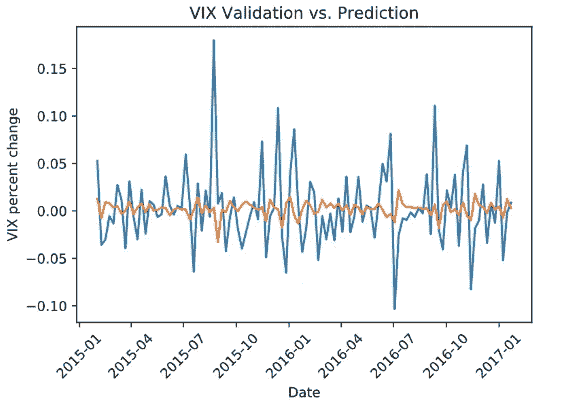
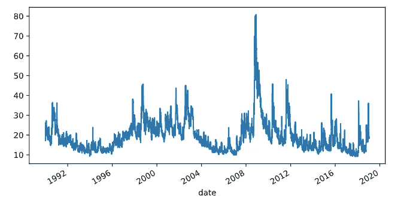
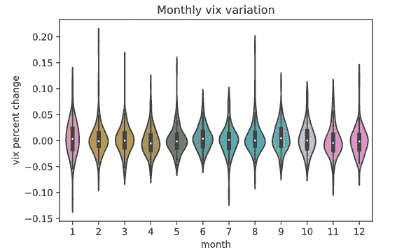
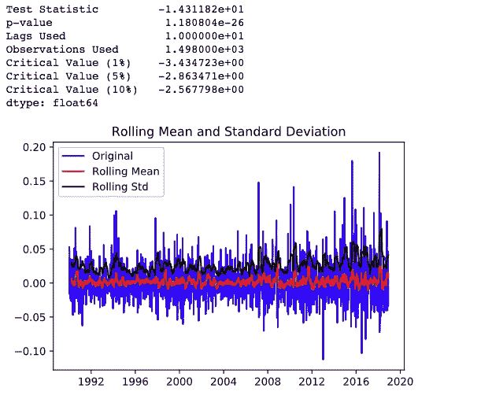
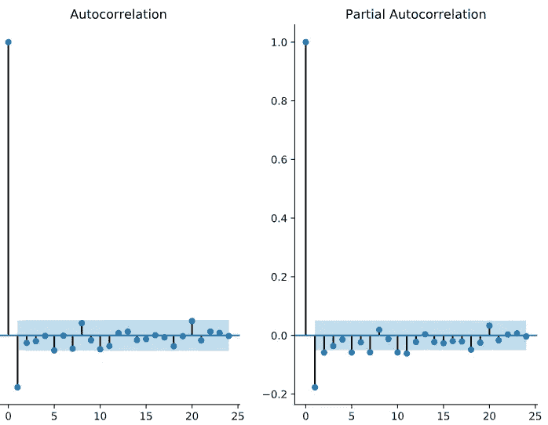
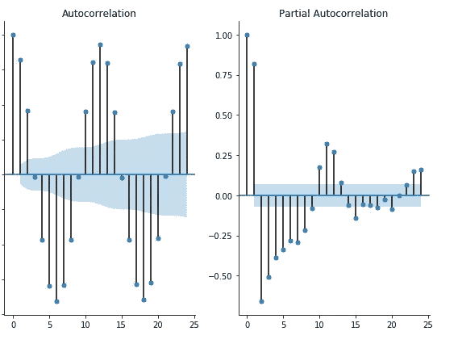
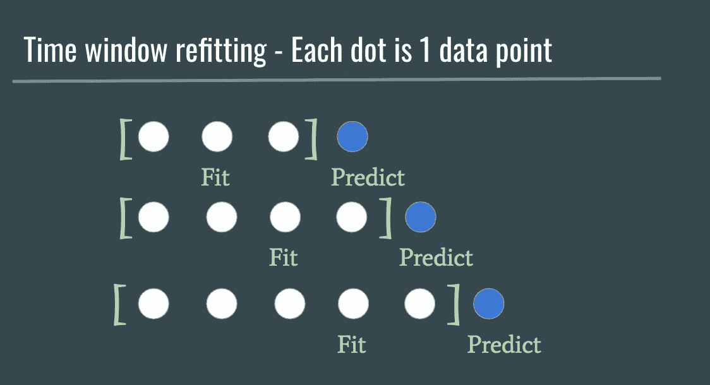
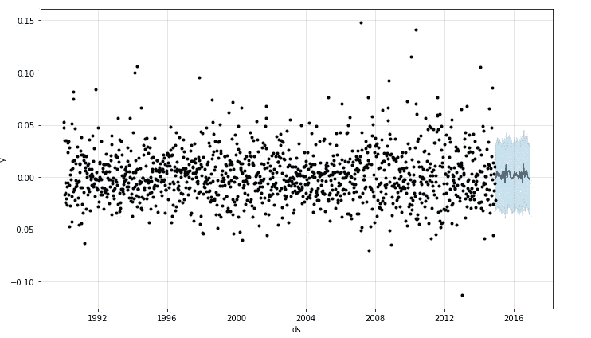
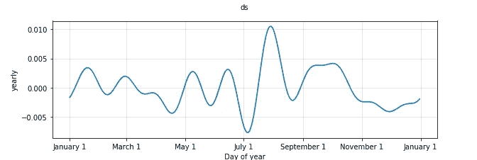
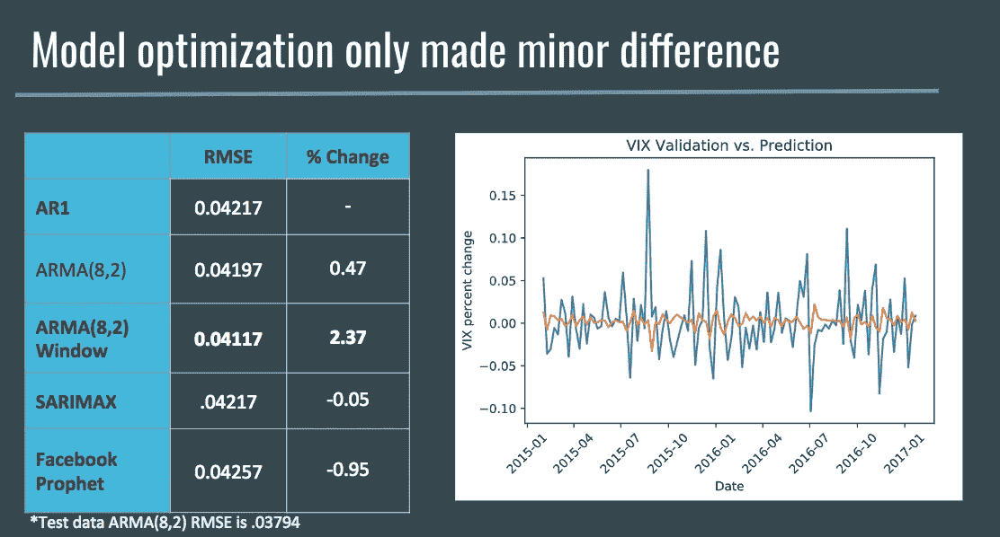

# 使用金融数据的时间序列分析教程

> 原文：<https://towardsdatascience.com/time-series-analysis-tutorial-using-financial-data-4d1b846489f9?source=collection_archive---------13----------------------->



VIX predictions from my ARMA (8,2) time window refitting model

对于我在 Metis 的第二个项目，我创建了一个使用时间序列分析预测 CBOE 波动率指数(VIX)价格的模型。VIX 是热门股票期权价格的综合，它表明了整个市场的波动程度。我还加入了联邦基准利率作为外生数据来源，看看这是否能改善预测。这是一个深入学习如何处理时间序列数据的绝佳机会。看我的项目介绍[这里](https://github.com/NathanMaton/vix_prediction/blob/master/Project_Presentation.pdf)。

这篇文章是学习如何创建你自己的股票时间序列分析的教程。首先，在这里克隆我的代码回购。

本教程将完成以下步骤:

*   探索您的数据
*   检查平稳性
*   使用 ARIMA、萨里马克斯和脸书预言家(3 个流行的时间序列模型)进行模型优化

到本文结束时，您应该有能力将这一过程应用于您认为可能有帮助的任何其他时间序列数据。

# 探索您的数据

对于这个项目，我们将使用 VIX 指数和联邦优惠利率历史。

```
weekly_pct, vix_close = clean_data() #custom function to clean data
vix_close.vix_close.plot(figsize=(8,4)); #raw vix close scores
```



Historical VIX close chart

你可以看到我们有从 1990 年到近 2020 年的数据，在金融危机前后有一个非常大的峰值。如果我们使用 Seaborn 的小提琴图，我们也可以看看每月数据的形状，看看是否有季节性。



您还会想跟随笔记本并尝试。描述()和。info()方法来确保您知道输入的基本最小值和最大值以及一些其他汇总统计数据。这将有助于您稍后尝试进行更改，以便在出现问题时能够及时发现。

# 检查稳定性

在时间序列分析中要检查的最重要的事情之一是确保你的数据是稳定的。这是一个很重要的术语，你可以在这里详细查找，但要注意的是，你要确保你的数据从头到尾都没有一个整体趋势。每日、每周、每月或每年的趋势都很好，我们的模型可以利用这些来做出更好的预测，但如果数据整体趋势向上，我们就需要修正这一点。对于我们的数据，我们将首先把它转换成百分比变化，然后检查它的平稳性。

```
#In the clean_data function we convert the data:
vix_close.vix_close = vix_close.vix_close.pct_change()#Then we call the dftest function on our pandas Series:
dftest(weekly_pct.vix_close)
```



在上表中，我们可以看到 dftest 函数的 p 值低于 0.05。这个函数使用 [Dickey-Fuller](https://en.wikipedia.org/wiki/Dickey%E2%80%93Fuller_test) 测试来确定你的数据是否稳定。小于 0.05 的 p 值允许我们拒绝数据不是静态的零假设，并继续建模。

除此之外，我做了一些数据清理，你可以在笔记本和代码中读到更多。我做的最大的事情包括将原始数据转换成百分比变化格式，并将其转换成两个来源的周数据，以避免周末闭市时的问题。

# 模型优化

所以现在我们已经准备好为我们的数据建模了！我使用了 StatsModels 的 [ARIMA](https://www.statsmodels.org/dev/generated/statsmodels.tsa.arima_model.ARIMA.html) 和 [SARIMAX](https://www.statsmodels.org/dev/generated/statsmodels.tsa.statespace.sarimax.SARIMAX.html) 模型以及流行的[脸书先知](https://facebook.github.io/prophet/docs/quick_start.html)模型。

我首先看的是自相关和偏自相关图。在时间序列中，我们使用之前的数据点(我们称之为滞后)来预测接下来会发生什么。因此，如果我们只看到 1 个滞后，我们将预测今天与明天有一些加权相关性(例如，回归模型可能会说它会大 0.5(beta 值)+一个误差项)。这些图帮助我们确定什么可能是最重要的滞后。以下是我们 VIX 数据的图表:



首先要注意的是，除了它本身之外，任何一点都没有很强的相关性。滞后从与自身完全相关(1.0)跳到下一个滞后大约为-0.2。

第二件要注意的事情是，两个图是相似的。当左边的自相关图中存在来自多个滞后的持久影响时，部分自相关可以显示差异。这不是我们的数据，它似乎不是高度自相关的。

最后，为了便于理解，请看一下两张图中的蓝色阴影区域。每一个点要么伸出去，要么留在里面。这是一个置信区间，所以当点在阴影区域内或附近时，表示它们可能不值得纳入模型。

为了进一步帮助您理解，让我们简单看一下另一个数据集。看看这些 20 年每月温度数据的图表，可以更清楚地看到自相关数据:



Monthly temperature ACF & PACF plots

在自相关图上，您可以看到 12 和 24 附近的峰值。这些都是每年相同的月份，这与我们拥有的 20 年数据中另一年的温度高度相关。

此处的部分自相关图表明，一旦过滤掉每个中间滞后的影响，当值开始接近阴影区时，真正有更大影响的滞后约为 1–12 左右。

如果你想更深入地了解这一点，请阅读这篇[杜克时间序列指南](https://people.duke.edu/~rnau/411arim2.htm)，它提供了更深入的解释。就本教程的目的而言，主要的要点是每年的天气都与前一年相关。VIX 的情况似乎并非如此！

## 自回归模型

因此，对于我们的建模过程，我们将从最简单的模型开始，AR(1)模型，它只是使用回归模型中的最后一个数据点来预测下一个数据点。我们将把我们的数据分成一个训练集、验证集和测试集(只在最后使用测试集一次)。对于时间序列，我们不能使用 KFolds 或其他更好的交叉验证方法，我们必须确保分割的顺序。

```
train_vix, train_prime, validation, validation_prime, test = split_data(weekly_pct)
```

然后，我们将经历正常的 ML 流程:

*   导入 ARIMA 模式
*   用我们的训练数据和参数拟合我们的模型
*   对我们的模型进行评分，看看它与验证数据相比表现如何

这应该和你正在使用的许多其他库一样。你可以看到下面的代码:

```
from statsmodels.tsa.arima_model import ARIMA #import model
model = ARIMA(train, order=(1,0,0)).fit() #fit training data
preds = model.forecast(52*2)[0] #predict
RMSE(validation,preds) #score
```

请注意，我预测 104 周，因为我将验证集设置为 2 年，而不是取 20%的数据，以避免过于接近我们在 2008 年看到的疯狂峰值。我还选择了验证集的长度，这是基于我接下来将使用的一种计算量更大的技术。

第一个模型做得不太好，预测 RMSE 为 0.04217，我们看到数据的标准偏差为 0.028008。所以我们最好猜测一下目前为止的平均值。

## AR 时间窗口重新调整

我尝试的下一项技术计算量更大。我没有预测接下来的 104 个点，而是决定拟合模型，预测出 1 个点，然后重新拟合，重复这个过程 104 次。你走得越远，你的预测能力就越弱，所以我想这会有所帮助。

这是我制作的一个图形，用来帮助解释这项技术:



Loop and fit one more data point before each prediction to improve model

下面是该函数的代码:

```
def window_refitting_model(df,p,q):
    preds = []
    df = list(df)   

    for i in validation:
        model = ARIMA(df, order=(p,0,q)).fit()
        pred = model.forecast()[0][0]
        preds.append(pred)
        df.append(i) plt.plot(validation)
    plt.plot(preds)
    rmse = RMSE(validation,np.array(preds))
    print(rmse)

    return rmse,validation,predswindow_refitting_model(train,1,0)
```

这产生了稍微好一点的分数，RMSE 分数提高了大约 1%。

## ARIMA

那么下一步是什么？到目前为止，我只是在 ARIMA 模型中使用了第一个参数(p ),这使它成为一个自回归模型。接下来，我试图为 ARIMA StatsModel 软件包优化我的 p 和 q 分数。p 参数告诉模型要查看多少滞后(以防我的自相关图不正确)，q 参数查看大量数据点的移动平均值，这可以通过消除噪声变化来改进模型。

经过一些计算后，我发现 ARMA(8，2)模型(p=8，q = 2)比我的 AR(1)模型稍好，提高了 0.047%。这些改进可能不值得在生产中使用，但考虑到我们使用的艰难的财务数据，我继续使用它们，至少是为了找到最好的模型。

当我在 ARMA(8，2)上使用窗口调整技术时，我现在得到了 0.04117 的 RMSE 和 2.37%的改进。

在我们继续之前，有一点需要注意，我没有尝试 ARIMA 模型的中间参数(差异参数)，因为我已经将我的数据转换成了百分比变化。这对其他数据集也尝试优化该参数可能很有用。有关更多信息，请参见文档。

## 萨里马克斯

SARIMAX 模型的想法是做与 ARIMA 相同的事情，但也增加了使用第二组(p，d，q)参数向模型添加季节维度的能力。如果有大量的滞后预测您的数据，但在不同的时间间隔也有一些自相关(例如，滞后 1-5 和滞后 30-50 真的很重要)，这将有所帮助。最后，X 字母代表外源数据，它可以是你认为可以改进模型的任何特征。鉴于我们的数据中缺乏任何季节性指标，我尝试了第二组(p，d，q)参数中的一些参数，但没有看到任何改善。

然后，我继续添加外部数据(我的联邦基准利率数据)并对模型进行评分。

```
import statsmodels.api as sm
validation_prime_df = pd.DataFrame(validation_prime)
sar = sm.tsa.statespace.SARIMAX(train_vix, exog=train_prime, 
        order=(1,0,0), seasonal_order=(0,0,0,12), trend='c').fit()
pred = sar.forecast(52*2,exog=validation_prime_df)
RMSE(validation,pred)
```

你认为优惠利率会有帮助吗？它没有，它与我的基线 AR(1)模型得分相同，RMSE 为 0.04217。

## 脸书先知

脸书有一个非常受欢迎的时间序列库，我从工业界的朋友那里听说过这个库。虽然 ARIMA 和 SARIMAX 需要大量的超参数调整，但 Prophet 模型在引擎盖下完成了所有这些工作。你必须调整你的数据以适应它们的格式，但这并不需要太多的工作，你可以在回购中的脸书先知 Jupyter 笔记本上看到我所有的代码。他们的库的一个优点是它提供了可视化。虽然我的模型最终表现不如脸书先知(-0.95%)，但它确实为这些图表提供了一些可解释性。



Here is a nice graphic of FB’s predictions for my validation dataset

脸书预言家的年度趋势图，显示了我的验证数据集的趋势。



# 摘要

为了完成我的项目，我创建了一个主要模型和结果的汇总表，以及我的最佳模型的预测与实际验证数据集的图表。



然后，我在我的测试集上对我的最佳模型进行评分(最后只使用一次这个集)，并将它作为我的模型中预测误差的指标。我的结论是:我肯定不会用这个模型来交易 VIX！

最后，我确实学到了一些关于金融数据的值得讨论的东西:

*   时间序列分析对于像 VIX 这样高度分析的市场指数是具有挑战性的。
*   我选择联邦最优惠利率是基于它们如何预测市场波动的理论，但对于这种类型的分析来说，它不是一个足够快速的经济指标，而且与固定利率相比变化不频繁，所以对我的模型没有影响。

希望你已经能够在笔记本上学习了，并且学到了很多关于时间序列分析的知识。如果你有任何问题，请不要犹豫，通过 GitHub 或 T2 推特联系我。