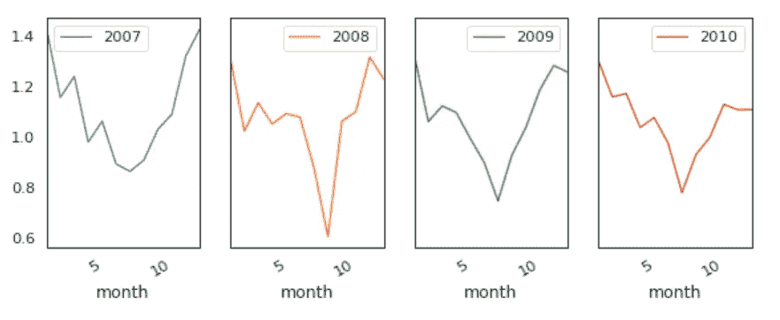

# 利用 LSTM 进行时间序列分析、可视化和预测

> 原文：<https://towardsdatascience.com/time-series-analysis-visualization-forecasting-with-lstm-77a905180eba?source=collection_archive---------1----------------------->


Photo credit: Unsplash

## 统计正态性检验，迪基-富勒平稳性检验，长短期记忆

标题说明了一切。

事不宜迟，我们滚吧！

# 数据

该数据是一个家庭在近 4 年的时间内以一分钟的采样率测量的电力消耗，可从[此处](https://www.kaggle.com/uciml/electric-power-consumption-data-set)下载。

不同的电量和一些分计量值是可用的。然而，我们只对全局有功功率变量感兴趣。

```
import numpy as np
import matplotlib.pyplot as plt
import pandas as pd
pd.set_option('display.float_format', lambda x: '%.4f' % x)
import seaborn as sns
sns.set_context("paper", font_scale=1.3)
sns.set_style('white')
import warnings
warnings.filterwarnings('ignore')
from time import time
import matplotlib.ticker as tkr
from scipy import stats
from statsmodels.tsa.stattools import adfuller
from sklearn import preprocessing
from statsmodels.tsa.stattools import pacf
%matplotlib inlineimport math
import keras
from keras.models import Sequential
from keras.layers import Dense
from keras.layers import LSTM
from keras.layers import Dropout
from keras.layers import *
from sklearn.preprocessing import MinMaxScaler
from sklearn.metrics import mean_squared_error
from sklearn.metrics import mean_absolute_error
from keras.callbacks import EarlyStoppingdf=pd.read_csv('household_power_consumption.txt', delimiter=';')
print('Number of rows and columns:', df.shape)
df.head(5)
```


Table 1

需要完成以下数据预处理和特征工程步骤:

*   将日期和时间合并到一列中，并更改为日期时间类型。
*   将 Global_active_power 转换为数字，并删除缺少的值(1.2%)。
*   创建年、季度、月和日功能。
*   创建工作日特征，“0”是周末，“1”是工作日。

```
df['date_time'] = pd.to_datetime(df['Date'] + ' ' + df['Time'])
df['Global_active_power'] = pd.to_numeric(df['Global_active_power'], errors='coerce')
df = df.dropna(subset=['Global_active_power'])
df['date_time']=pd.to_datetime(df['date_time']) 
df['year'] = df['date_time'].apply(lambda x: x.year)
df['quarter'] = df['date_time'].apply(lambda x: x.quarter)
df['month'] = df['date_time'].apply(lambda x: x.month)
df['day'] = df['date_time'].apply(lambda x: x.day)
df=df.loc[:,['date_time','Global_active_power', 'year','quarter','month','day']]
df.sort_values('date_time', inplace=True, ascending=True)
df = df.reset_index(drop=True)
df["weekday"]=df.apply(lambda row: row["date_time"].weekday(),axis=1)
df["weekday"] = (df["weekday"] < 5).astype(int)print('Number of rows and columns after removing missing values:', df.shape)
print('The time series starts from: ', df.date_time.min())
print('The time series ends on: ', df.date_time.max())
```


去除缺失值后，数据包含 2006 年 12 月至 2010 年 11 月(47 个月)期间收集的 2，049，280 个测量值。

初始数据包含几个变量。这里我们将关注一个单一的值:一所房子的全局有功功率历史，即家庭全局每分钟平均有功功率，单位为千瓦。

# 统计正态性检验

有几个统计测试，我们可以用来量化我们的数据是否看起来像是来自高斯分布。我们将使用[达戈斯蒂诺的 K 检验](https://en.wikipedia.org/wiki/D%27Agostino%27s_K-squared_test)。

在测试的 [SciPy](http://scipy.github.io/devdocs/index.html) 实现中，我们将 p 值解释如下。

*   阿尔法:拒绝 H0 失败，正常。
*   我们还可以计算 [***峰度***](https://en.wikipedia.org/wiki/Kurtosis) 和 [***偏度***](https://en.wikipedia.org/wiki/Skewness) ，来判断数据分布是否偏离正态分布。

```
stat, p = stats.normaltest(df.Global_active_power)
print('Statistics=%.3f, p=%.3f' % (stat, p))
alpha = 0.05
if p > alpha:
    print('Data looks Gaussian (fail to reject H0)')
else:
    print('Data does not look Gaussian (reject H0)')
```


*:描述一个分布的尾部的沉重程度*

```
*sns.distplot(df.Global_active_power);
print( 'Kurtosis of normal distribution: {}'.format(stats.kurtosis(df.Global_active_power)))
print( 'Skewness of normal distribution: {}'.format(stats.skew(df.Global_active_power)))*
```

**

*Figure 1*

*正态分布的峰度接近于 0。如果峰度大于零，那么分布有较重的尾部。如果峰度小于零，则分布为轻尾。我们的峰度大于零。*

****偏斜度*** :测量分布的不对称性*

*如果偏斜度在-0.5 到 0.5 之间，则数据相当对称。如果偏斜度介于-1 和-0.5 之间或介于 0.5 和 1 之间，则数据是中度偏斜的。如果偏斜度小于-1 或大于 1，则数据高度偏斜。我们的偏斜度大于 1。*

*第一时间序列图*

# *显然，这个情节不是一个好主意。不要这样。*

```
*df1=df.loc[:,['date_time','Global_active_power']]
df1.set_index('date_time',inplace=True)
df1.plot(figsize=(12,5))
plt.ylabel('Global active power')
plt.legend().set_visible(False)
plt.tight_layout()
plt.title('Global Active Power Time Series')
sns.despine(top=True)
plt.show();*
```

**

*Figure 2*

*全球年度与季度有功功率的箱线图*

# *当我们并排比较每年的箱线图时，我们注意到 2006 年的全球有功功率中值比其他年份高得多。这有点误导。如果你记得的话，我们只有 2006 年 12 月的数据。而 12 月显然是家庭电力消耗的高峰月。*

```
*plt.figure(figsize=(14,5))
plt.subplot(1,2,1)
plt.subplots_adjust(wspace=0.2)
sns.boxplot(x="year", y="Global_active_power", data=df)
plt.xlabel('year')
plt.title('Box plot of Yearly Global Active Power')
sns.despine(left=True)
plt.tight_layout()plt.subplot(1,2,2)
sns.boxplot(x="quarter", y="Global_active_power", data=df)
plt.xlabel('quarter')
plt.title('Box plot of Quarterly Global Active Power')
sns.despine(left=True)
plt.tight_layout();*
```

**

*Figure 3*

*这与季度全球有功功率中值一致，第 1 和第 4 季度(冬季)较高，第 3 季度(夏季)最低。*

*全球有功功率分配*

# *正态概率图也显示数据远非正态分布。*

```
*plt.figure(figsize=(14,6))
plt.subplot(1,2,1)
df['Global_active_power'].hist(bins=50)
plt.title('Global Active Power Distribution')plt.subplot(1,2,2)
stats.probplot(df['Global_active_power'], plot=plt);
df1.describe().T*
```

**

*Figure 4*

*日、周、月、季度和年的平均全球有功功率重新采样*

# *总的来说，我们的时间序列没有上升或下降的趋势。最高的平均功耗似乎是在 2007 年之前，实际上是因为我们只有 2007 年 12 月的数据，而那个月是高功耗月。换句话说，如果逐年比较，一直是平稳的。*

*timeseries_plot.py*

**********

*Figure 5*

*按年、季度、月和日分组的全球平均有功功率图*

# *以上情节证实了我们之前的发现。到了 2008 年，情况稳定了下来。按季度来看，平均功耗最低的是第三季度。按月份来看，平均用电量最低的是 7 月和 8 月。白天，平均功耗最低的时候是在 8 号左右(不知道为什么)。*

*grouped_plot.py*

**

*Figure 6*

*按年份划分的全球有功功率*

# *这一次，我们去掉 2006。*

*从 2007 年到 2010 年，每年的情况都差不多。*

```
*pd.pivot_table(df.loc[df['year'] != 2006], values = "Global_active_power", 
               columns = "year", index = "month").plot(subplots = True, figsize=(12, 12), layout=(3, 5), sharey=True);*
```

**

*Figure 7*

*工作日与周末的全球有功功耗*

# *2010 年之前，工作日的全球有功功率中值似乎低于周末。2010 年，他们是一模一样的。*

```
*dic={0:'Weekend',1:'Weekday'}
df['Day'] = df.weekday.map(dic)a=plt.figure(figsize=(9,4)) 
plt1=sns.boxplot('year','Global_active_power',hue='Day',width=0.6,fliersize=3,
                    data=df)                                                                                                                                                                                                                                                                                                                                                 
a.legend(loc='upper center', bbox_to_anchor=(0.5, 1.00), shadow=True, ncol=2)
sns.despine(left=True, bottom=True) 
plt.xlabel('')
plt.tight_layout()                                                                                                                  
plt.legend().set_visible(False);*
```

**

*Figure 8*

*按工作日与周末划分的全球有功功率因数图*

# *工作日和周末全年都遵循类似的模式。*

```
*plt1=sns.factorplot('year','Global_active_power',hue='Day',
                    data=df, size=4, aspect=1.5, legend=False)                                                                                                                                                                                                                                                                                                                                             
plt.title('Factor Plot of Global active power by Weekend/Weekday')                                                             
plt.tight_layout()                                                                                                                  
sns.despine(left=True, bottom=True) 
plt.legend(loc='upper right');*
```

**

*Figure 9*

*原则上，当我们使用[](https://en.wikipedia.org/wiki/Long_short-term_memory)*时，我们不需要检查 [***的平稳性***](https://en.wikipedia.org/wiki/Stationary_process) 也不需要对其进行校正。但是，如果数据是静态的，这将有助于提高性能，并使神经网络更容易学习。**

**平稳性**

# **在统计学中， [***迪基-富勒检验***](https://en.wikipedia.org/wiki/Dickey%E2%80%93Fuller_test) 检验自回归模型中存在单位根的零假设。备选假设根据使用的测试版本而不同，但通常是[平稳性](https://en.wikipedia.org/wiki/Stationary_process)或[趋势平稳性](https://en.wikipedia.org/wiki/Trend_stationary)。**

**平稳序列在一段时间内具有恒定的均值和方差。时间序列的滚动平均值和滚动标准差不随时间变化。**

**迪基-富勒试验**

# **[](https://en.wikipedia.org/wiki/Null_hypothesis)*【H0】:暗示时间序列有单位根，意味着它是非平稳的。它有一些依赖于时间的结构。***

***[***交替假设***](https://en.wikipedia.org/wiki/Alternative_hypothesis)【H1】:暗示时间序列没有单位根，意味着它是平稳的。它没有依赖于时间的结构。***

**p 值> 0.05:接受零假设(H0)，数据有单位根，非平稳。**

**p 值< = 0.05:拒绝零假设(H0)，数据没有单位根，是平稳的。**

**从上述结果，我们将拒绝零假设 H0，数据没有单位根，是平稳的。**

**stationarity.py**

****

**Figure 10**

**LSTM**

# **这里的任务是预测一个时间序列的值，给定一个家庭 200 万分钟的电力消耗历史。我们将使用多层 LSTM 递归神经网络来预测值序列的最后一个值。**

**如果您想要减少计算时间，并且还想快速获得测试模型的结果，您可能想要在一个小时内对数据进行重新采样。我会把它记录下来。**

**在构建 LSTM 模型之前，需要进行以下数据预处理和特征工程。**

**创建数据集，确保所有数据都是浮动的。**

*   **将特征标准化。**
*   **分为训练集和测试集。**
*   **将值数组转换为数据集矩阵。**
*   **重塑成 X=t，Y=t+1。**
*   **将输入整形为 3D(样本数，时间步长数，要素数)。**
*   **模型架构**

**lstm_data_preprocessing.py**

# **定义 LSTM，第一个隐层 100 个神经元，输出层 1 个神经元，用于预测全局有功功率。输入形状将是具有 30 个特征的 1 个时间步长。**

*   **退学 20%。**
*   **使用 MSE 损失函数和有效的随机梯度下降的 Adam 版本。**
*   **该模型将适合 20 个训练时期，批量大小为 70。**
*   **做预测**

**lstm_timeseries.py**

# **绘图模型损失**

```
**train_predict = model.predict(X_train)
test_predict = model.predict(X_test)
# invert predictions
train_predict = scaler.inverse_transform(train_predict)
Y_train = scaler.inverse_transform([Y_train])
test_predict = scaler.inverse_transform(test_predict)
Y_test = scaler.inverse_transform([Y_test])print('Train Mean Absolute Error:', mean_absolute_error(Y_train[0], train_predict[:,0]))
print('Train Root Mean Squared Error:',np.sqrt(mean_squared_error(Y_train[0], train_predict[:,0])))
print('Test Mean Absolute Error:', mean_absolute_error(Y_test[0], test_predict[:,0]))
print('Test Root Mean Squared Error:',np.sqrt(mean_squared_error(Y_test[0], test_predict[:,0])))**
```

****

# **比较实际与预测**

```
**plt.figure(figsize=(8,4))
plt.plot(history.history['loss'], label='Train Loss')
plt.plot(history.history['val_loss'], label='Test Loss')
plt.title('model loss')
plt.ylabel('loss')
plt.xlabel('epochs')
plt.legend(loc='upper right')
plt.show();**
```

****

**Figure 11**

# **对我来说，每一个时间步都是一分钟。如果您提前一个多小时重新采样数据，那么每个时间步长就是一个小时。**

**我将比较过去 200 分钟的实际和预测。**

**LSTMs 太神奇了！**

```
**aa=[x for x in range(200)]
plt.figure(figsize=(8,4))
plt.plot(aa, Y_test[0][:200], marker='.', label="actual")
plt.plot(aa, test_predict[:,0][:200], 'r', label="prediction")
# plt.tick_params(left=False, labelleft=True) #remove ticks
plt.tight_layout()
sns.despine(top=True)
plt.subplots_adjust(left=0.07)
plt.ylabel('Global_active_power', size=15)
plt.xlabel('Time step', size=15)
plt.legend(fontsize=15)
plt.show();**
```

****

**Figure 12**

**Jupyter 笔记本可以在 [Github](https://github.com/susanli2016/Machine-Learning-with-Python/blob/master/LSTM%20Time%20Series%20Power%20Consumption.ipynb) 上找到。享受这周剩下的时光吧！**

**参考:**

**Keras 中 LSTMs 的多元时间序列预测**

**[](https://machinelearningmastery.com/multivariate-time-series-forecasting-lstms-keras/) [## 像长短期记忆(LSTM)循环神经网络这样的神经网络能够几乎无缝地模拟…

### machinelearningmastery.com

machinelearningmastery.com](https://machinelearningmastery.com/multivariate-time-series-forecasting-lstms-keras/)**