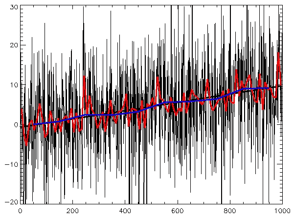
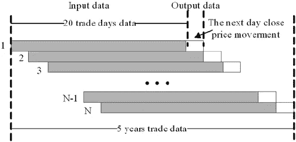
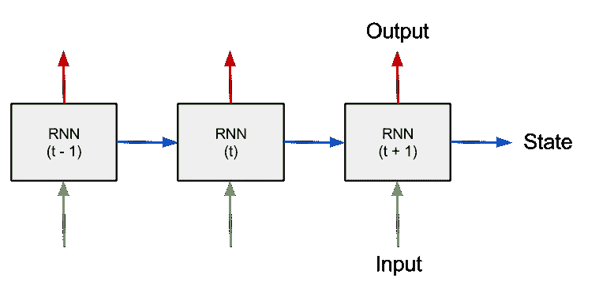
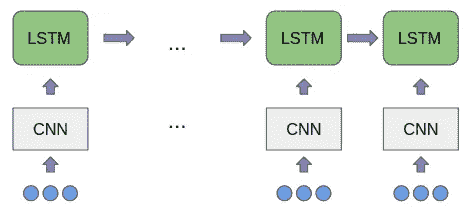
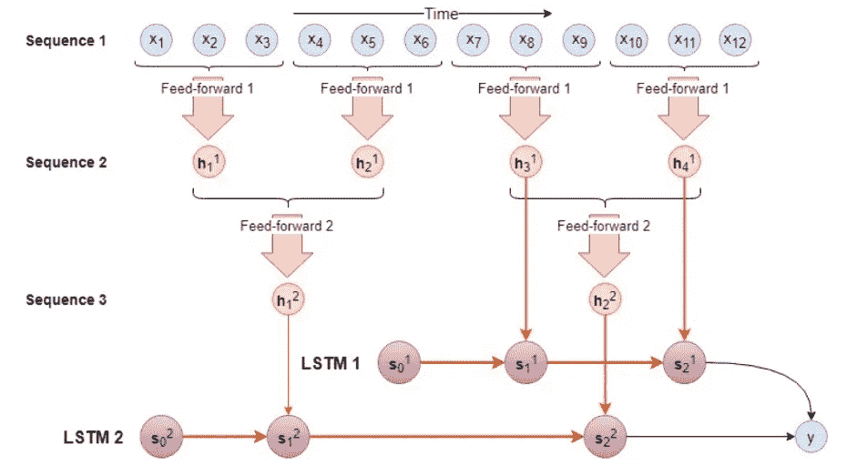

# 深度学习时间序列分析:简化

> 原文：<https://towardsdatascience.com/time-series-analysis-with-deep-learning-simplified-5c444315d773?source=collection_archive---------9----------------------->

参加在时间序列分析中使用深度学习的“为什么”和“什么时候”的速成班。

## 什么是时间序列分析？

时间序列是使用时间戳排序的数据点序列。时间序列分析是..*你猜对了*..时间序列数据分析:P

从你喜欢的水果的每日价格到电路提供的电压输出读数，时间序列的范围是巨大的，时间序列分析的领域也是如此。分析时间序列数据通常集中在**预测**，但也可以包括分类、聚类、异常检测等。例如，通过研究过去价格变化的模式，你可以试着预测你关注已久的手表的价格，以判断什么是购买它的最佳时机！！

## 为什么要深度学习？

时间序列数据可能非常不稳定和复杂。深度学习方法*对数据中的潜在模式*不做任何假设，并且对噪声(这在时间序列数据中很常见)也更加*鲁棒，使它们成为时间序列分析的首选。*

## 数据处理

在我们继续预测之前，首先以数学模型可以理解的形式处理我们的数据是很重要的。通过使用滑动窗口来切割数据点，可以将时间序列数据转化为监督学习问题。每个滑动窗口的期望输出是窗口结束后的时间步长。

## 循环网络

递归网络是深度学习网络*，有一个转折……*它们可以记住过去，因此是序列处理的首选。RNN 细胞是循环网络的骨干。RNN 单元有 2 个输入连接，输入和*先前的状态。*类似地，它们也有 2 个输出连接，即输出和*当前状态。*这种**状态**帮助他们组合来自过去和当前输入的信息。

一个简单的 RNN 单元过于简单，不能统一用于不同领域的时间序列分析。因此，多年来已经提出了大量的变体来使递归网络适应各种领域，*但是核心思想仍然是相同的！！*

## RNNs 上的 LSTMs

LSTM 单元是一种特殊的 RNN 单元，其中有***门****，本质上是 0 和 1 之间的值，对应于状态输入。这些门背后的直觉是忘记或保留过去的信息，这让他们记住的不仅仅是眼前的过去。没有人能比 Colah 的博客更好地解释 LSTMs，所以如果你还没有去过，就去看看吧。*

 *[## 了解 LSTM 网络

### 2015 年 8 月 27 日发布人类不是每秒钟都从零开始思考。当你读这篇文章时，你…

colah.github.io](https://colah.github.io/posts/2015-08-Understanding-LSTMs/)* **

*Complex internal architecture of an LSTM cell. GRU is another variation of gated RNN cells.*

## *美国有线电视新闻网*

*我们讨论过，由于*状态信息*通过每个时间步传播，rnn 只能记住最近的过去。另一方面，像 LSTMs 和 GRUs 这样的门控网络可以处理相对较长的序列，**但即使这些网络也有其局限性！！为了更好地理解这个问题，我们也可以看看*消失和爆炸渐变*。***

**

*那么如何处理非常长的序列呢？？显而易见的解决方案是**缩短它们！！！**但是如何？一种方法是丢弃信号中存在的细粒度时间信息。这可以通过将小组数据点累积在一起并从中创建特征来实现，然后将这些特征传递给 LSTM，*就像一个单独的数据点，*。*

**

## *多尺度分层 LSTMs*

*看着 CNN-LSTM 的架构，我想到了一件事…为什么要用 CNN 来组合那些小团体？？为什么不使用不同的 LSTM 呢！！！多尺度分级 LSTMs 基于相同的理念。*

**

*输入在多个尺度上被处理，每个尺度都致力于做一些独特的事情。对更细粒度的输入起作用的较低等级关注于传递细粒度的(但仅仅是最近的)时间信息。另一方面，上层关注于提供完整的图片(但是没有细粒度的细节)。多种尺度结合在一起可以更好地理解时间序列。*

## *下一步是什么？*

*时间序列分析是一个非常古老的领域，包含各种跨学科的问题陈述，每一个都有自己的挑战。然而，尽管每个领域都根据自己的需求调整模型，但在时间序列分析中仍然有一些需要改进的一般研究方向。例如，从非常基本的 RNN 单元到多尺度分级 LSTM 的每个发展都在某种程度上关注于处理更长的序列，但是即使是最新的 LSTM 修改也有其自身的序列长度限制，并且我们仍然没有能够真正处理超长序列的架构。*

**这个博客是努力创建机器学习领域的简化介绍的一部分。点击此处的完整系列**

* [## 机器学习:简化

### 在你一头扎进去之前就知道了

towardsdatascience.com](/machine-learning-simplified-1fe22fec0fac) 

*或者只是阅读本系列的下一篇博客*

 [## 对象检测:简化

### 让我们来看看计算机视觉中最著名的问题陈述之一

towardsdatascience.com](/object-detection-simplified-e07aa3830954) 

## 参考

*[1]程，闵，等.“MS-LSTM:一种用于 BGP 异常检测的多尺度 LSTM 模型”2016 IEEE 第 24 届国际网络协议大会(ICNP)。IEEE，2016。
[2]阿拉亚、伊格纳西奥·阿、卡洛斯·瓦莱和埃克托尔·阿连德。"基于 LSTM 的多尺度风速预报模式."伊比利亚美洲模式识别大会。施普林格，查姆，2018。
[3] Hochreiter，Sepp，和 Jürgen Schmidhuber。“长短期记忆。”神经计算 9.8(1997):1735–1780。
[4]沃索基、索罗什、普拉尚·维贾亚拉哈万、德布·罗伊。" Tweet2vec:使用字符级 cnn-lstm 编码器-解码器学习 Tweet 嵌入."第 39 届国际 ACM SIGIR 信息检索研究与发展会议录。ACM，2016。
[5]帕斯卡努，拉兹万，托马斯·米科洛夫，约舒阿·本吉奥。"关于训练递归神经网络的难度."机器学习国际会议。2013.**