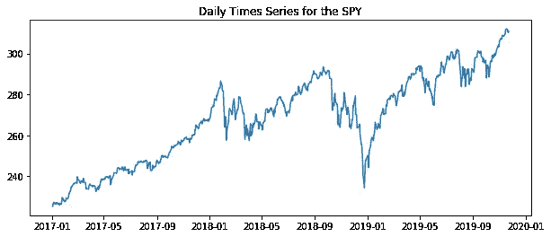
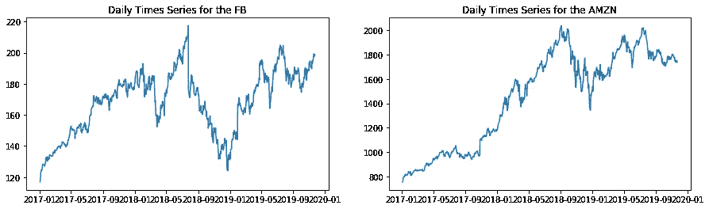
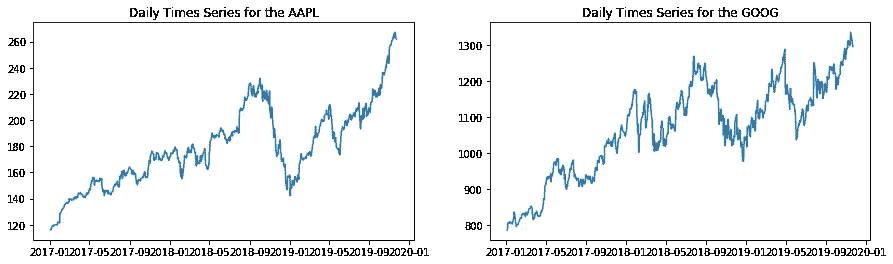
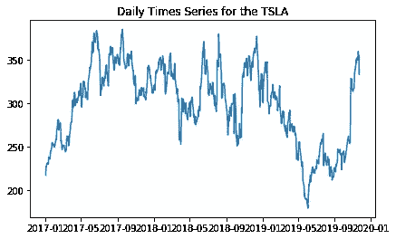

# 使用 Python 实现时间序列和与股票市场数据的相关性

> 原文：<https://towardsdatascience.com/time-series-and-correlations-with-stock-market-data-using-python-e66774e3a16f?source=collection_archive---------16----------------------->

我最近在金融数据服务公司 IEX 云上开了一个账户。由于我一直在学习这种新数据源(对我来说是新的)的特性，并在我的 Jupyter 笔记本上进行试验，我认为下面的内容可能对其他人也有帮助。因此，我正在创建我的第一篇媒体文章，并将它集中在金融时间序列数据上。

关于定义相关性以及相关性和因果关系之间的区别，有相当多的文章和资料来源；因此，下面你会发现，将主要显示一些方法来测试相关性和结果意味着什么。如果你想使用 **IEX 云**，如果你想用 Python 做相关性测试，如果你对时间序列数据感兴趣，你会发现这篇文章很有帮助！

如果你正在遵循这个并且自己编码，去 https://iexcloud.io/[给自己弄一个 API 密匙！接下来你会需要它的！此外，不要忘记安装一个 IEX Python 库:【https://addisonlynch.github.io/iexfinance/】](https://iexcloud.io/)[(林奇，2019)。使用以下方式安装此库:](https://addisonlynch.github.io/iexfinance/)

**$ pip3 安装 iexfinance**

```
**import** **config**
**import** **os***#os.environ['IEX_API_VERSION'] = "iexcloud-sandbox"*
os.environ['IEX_TOKEN'] = config.iex_api_key  *# Replace "config.iex_api_key" with your API Key from IEX Cloud!*
```

我们将加载一些我们接下来需要的库。此外，我们将使用 2017 年 1 月 1 日至 2019 年 11 月 22 日之间的数据。

```
**from** **datetime** **import** datetime
**from** **iexfinance.stocks** **import** get_historical_data
**import** **matplotlib.pyplot** **as** **plt**
%matplotlib inlinestart = datetime(2017, 1, 1)
end = datetime(2019, 11, 22)
```

为了简单起见，我们将**任意**选择‘close’。从这个 API 数据响应中，您还可以选择开盘价、最高价、最低价和成交量。我们将尝试使用“close”

现在，让我们进行一个 API 调用并下载更多数据，“SPDR 标准普尔 500 信托 ETF”，它跟踪标准普尔 500。我们稍后会在一些相关性测试中用到它。

```
SPY = get_historical_data("SPY", start, end, output_format='pandas')plt.figure(figsize=(10, 4))
plt.plot(SPY.index, SPY['close'])
plt.title('Daily Times Series for the SPY');
```



现在，让我们继续通过下载 FAANG 股票(脸书、亚马逊、苹果、网飞和谷歌)(Kenton，2019)的数据来探索 API，并添加我的一个兴趣，Tesla。还有，把这些都记录下来。仔细注意图表，并与上面的间谍图进行比较。其中一些看起来很像间谍图，一些则不像。

```
FAANGT = get_historical_data(["FB","AMZN","AAPL","NFLX","GOOG","TSLA"], start, end, output_format='pandas')
print(FAANGT.head())FB                                      AMZN                  \
              open    high     low   close    volume    open    high     low   
date                                                                           
2017-01-03  116.03  117.84  115.51  116.86  20663912  757.92  758.76  747.70   
2017-01-04  117.55  119.66  117.29  118.69  19630932  758.39  759.68  754.20   
2017-01-05  118.86  120.95  118.32  120.67  19492150  761.55  782.40  760.26   
2017-01-06  120.98  123.88  120.03  123.41  28545263  782.36  799.44  778.48   
2017-01-09  123.55  125.43  123.04  124.90  22880360  798.00  801.77  791.77                                ...    GOOG                                   \
             close   volume  ...    open    high     low   close   volume   
date                         ...                                            
2017-01-03  753.67  3521066  ...  778.81  789.63  775.80  786.14  1657268   
2017-01-04  757.18  2510526  ...  788.36  791.34  783.16  786.90  1072958   
2017-01-05  780.45  5830068  ...  786.08  794.48  785.02  794.02  1335167   
2017-01-06  795.99  5986234  ...  795.26  807.90  792.20  806.15  1640170   
2017-01-09  796.92  3446109  ...  806.40  809.97  802.83  806.65  1274645   TSLA                                    
              open    high     low   close    volume  
date                                                  
2017-01-03  214.86  220.33  210.96  216.99   5923254  
2017-01-04  214.75  228.00  214.31  226.99  11213471  
2017-01-05  226.42  227.48  221.95  226.75   5911695  
2017-01-06  226.93  230.31  225.45  229.01   5527893  
2017-01-09  228.97  231.92  228.00  231.28   3979484 [5 rows x 30 columns]plt.figure(figsize=(15, 4))
#FB
plt.subplot(1, 2, 1)
plt.plot(FAANGT.index, FAANGT['FB']['close'])
plt.title('Daily Times Series for the FB')#AMZN
plt.subplot(1, 2, 2)
plt.plot(FAANGT.index, FAANGT['AMZN']['close'])
plt.title('Daily Times Series for the AMZN'); plt.figure(figsize=(15, 4))
#AAPL
plt.subplot(1, 2, 1)
plt.plot(FAANGT.index, FAANGT['AAPL']['close'])
plt.title('Daily Times Series for the AAPL');#GOOG
plt.subplot(1, 2, 2)
plt.plot(FAANGT.index, FAANGT['GOOG']['close'])
plt.title('Daily Times Series for the GOOG');plt.figure(figsize=(15, 4))
#TSLA
plt.subplot(1, 2, 1)
plt.plot(FAANGT.index, FAANGT['TSLA']['close'])
plt.title('Daily Times Series for the TSLA');
```



现在我们有了 FAANG 股票(和 TSLA)和标准普尔 500 的数据，我们把它们画出来，这样我们就知道它们看起来像什么了；我们来做个实验吧！我们将尝试皮尔逊相关性测试，测试所有这些股票和标准普尔 500 的相关性。你怎么想呢?基于对图表的观察和直觉，它们会有关联吗？

当皮尔逊相关系数在-1 和+1 之间时，将显示相关性。如果接近+1，我们会看到正相关。如果皮尔逊相关性更接近-1，则为负相关(Cheong，2019)。

```
**import** **pandas** **as** **pd
import scipy.stats as stats***# Slice this up to make it easier to work with.*
indx = pd.IndexSlice
df1 = FAANGT.loc[:, (indx[:],'close')]

c, p = stats.pearsonr(df1['FB'].dropna()['close'], SPY.dropna()['close'])
print(f"FB vs SPY Pearson Correlation: **{c}\n**")

c, p = stats.pearsonr(df1['AMZN'].dropna()['close'], SPY.dropna()['close'])
print(f"AMZN vs SPY Pearson Correlation: **{c}\n**")

c, p = stats.pearsonr(df1['AAPL'].dropna()['close'], SPY.dropna()['close'])
print(f"AAPL vs SPY Pearson Correlation: **{c}\n**")

c, p = stats.pearsonr(df1['GOOG'].dropna()['close'], SPY.dropna()['close'])
print(f"GOOG vs SPY Pearson Correlation: **{c}\n**")

c, p = stats.pearsonr(df1['TSLA'].dropna()['close'], SPY.dropna()['close'])
print(f"TSLA vs SPY Pearson Correlation: **{c}**")FB vs SPY Pearson Correlation: 0.7325442525842248

AMZN vs SPY Pearson Correlation: 0.910899729798812

AAPL vs SPY Pearson Correlation: 0.9176098570966427

GOOG vs SPY Pearson Correlation: 0.9485878709468345

TSLA vs SPY Pearson Correlation: -0.26968006350226387
```

截至 2019 年 11 月 22 日，在所有这些选项中，谷歌(Google)的皮尔逊相关系数最高。此外，特斯拉(TSLA)与标准普尔 500 负相关。你可以在上面的图表中找到许多，并将这些图表与标准普尔 500 图表进行比较；但是现在你有了一个定量的关联方法！

现在，为了更深入地探索 API，让我们看看**社交情感**特性是什么样子的。我们来看看昨天(2019 年 11 月 22 日)，对于特斯拉来说。

```
**from** **iexfinance.altdata** **import**  get_social_sentiment, get_ceo_compensation

period='minute'
specDay="20191122"

TSLA_Sent = get_social_sentiment("TSLA", period, specDay, output_format='pandas')
print(TSLA_Sent.head())minute  negative  positive  sentiment  totalScores
0   0000      0.12      0.88   0.084958           26
1   0001      0.12      0.88   0.160624           17
2   0002      0.11      0.89   0.061056           18
3   0003      0.29      0.71  -0.180071           17
4   0004      0.07      0.93   0.066293           15
```

昨天，特斯拉最积极和最消极的社会情绪的最高分是多少？

```
TSLA_Sent_Pos = TSLA_Sent['sentiment'].max()
TSLA_Sent_Neg = TSLA_Sent['sentiment'].min()print("Highest Social Sentiment on 11/22/2019:", TSLA_Sent_Pos)
print("Lowest Social Sentiment on 11/22/2019:", TSLA_Sent_Neg)Highest Social Sentiment on 11/22/2019: 0.9785
Lowest Social Sentiment on 11/22/2019: -0.9487
```

这个 API 还有 CEO 信息！让我们来看看我们之前研究的 FAANG 和 TSLA 股票的 CEO 信息。我们将使用 df1，它是在执行相关性测试时为了简化而创建的。

```
**import** **pprint**

**for** n, q **in** df1:
    pprint.pprint(get_ceo_compensation(n)){'bonus': 0,
 'companyName': 'Facebook Inc. Class A',
 'location': 'Menlo Park, CA',
 'name': 'Mark Zuckerberg',
 'nonEquityIncentives': 0,
 'optionAwards': 0,
 'otherComp': 22554542,
 'pensionAndDeferred': 0,
 'salary': 1,
 'stockAwards': 0,
 'symbol': 'FB',
 'total': 22554543,
 'year': '2018'}
{'bonus': 0,
 'companyName': 'Amazon.com Inc.',
 'location': 'Seattle, WA',
 'name': 'Jeffrey Bezos',
 'nonEquityIncentives': 0,
 'optionAwards': 0,
 'otherComp': 1600000,
 'pensionAndDeferred': 0,
 'salary': 81840,
 'stockAwards': 0,
 'symbol': 'AMZN',
 'total': 1681840,
 'year': '2018'}
{'bonus': 0,
 'companyName': 'Apple Inc.',
 'location': 'Cupertino, CA',
 'name': 'Timothy Cook',
 'nonEquityIncentives': 12000000,
 'optionAwards': 0,
 'otherComp': 682219,
 'pensionAndDeferred': 0,
 'salary': 3000000,
 'stockAwards': 0,
 'symbol': 'AAPL',
 'total': 15682219,
 'year': '2018'}
{'bonus': 0,
 'companyName': 'Netflix Inc.',
 'location': 'Los Gatos, CA',
 'name': 'Reed Hastings',
 'nonEquityIncentives': 0,
 'optionAwards': 35380417,
 'otherComp': 0,
 'pensionAndDeferred': 0,
 'salary': 700000,
 'stockAwards': 0,
 'symbol': 'NFLX',
 'total': 36080417,
 'year': '2018'}
{'bonus': 0,
 'companyName': 'Alphabet Inc. Class A',
 'location': 'Mountain View, CA',
 'name': 'Larry Page',
 'nonEquityIncentives': 0,
 'optionAwards': 0,
 'otherComp': 0,
 'pensionAndDeferred': 0,
 'salary': 1,
 'stockAwards': 0,
 'symbol': 'GOOG',
 'total': 1,
 'year': '2018'}
{'bonus': 0,
 'companyName': 'Tesla Inc',
 'location': 'Palo Alto, CA',
 'name': 'Elon Musk',
 'nonEquityIncentives': 0,
 'optionAwards': 2283988504,
 'otherComp': 0,
 'pensionAndDeferred': 0,
 'salary': 56380,
 'stockAwards': 0,
 'symbol': 'TSLA',
 'total': 2284044884,
 'year': '2018'}
```

还有很多东西需要探索和分析。在下一篇文章中，我计划探索 IEX 云的一些“实时”数据，例如书籍。此外，我可能会继续时间序列分析，并转移到一些基本的预测。我希望您发现这个探索有用！

# 参考

*   西肯顿(2019 年 11 月 18 日)。FAANG 股票是什么？检索于 2019 年 11 月 28 日，发自 https://www.investopedia.com/terms/f/faang-stocks.asp。
*   林奇，A. (2019 年 10 月 24 日)。addisonlynch/iexfinance。检索于 2019 年 11 月 28 日，发自 https://github.com/addisonlynch/iexfinance。
*   Cheong，J. H. (2019 年 5 月 13 日)。量化时间序列数据同步性的四种方法。检索于 2019 年 11 月 28 日，来自[https://towardsdatascience . com/four-way-to-quantify-synchrony-between-time-series-data-b 99136 C4 a9 c 9](/four-ways-to-quantify-synchrony-between-time-series-data-b99136c4a9c9)。