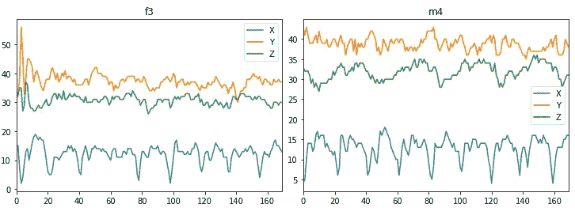
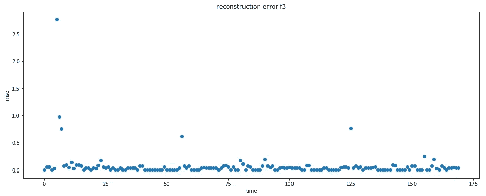
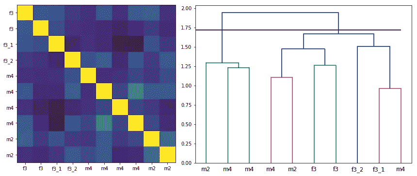
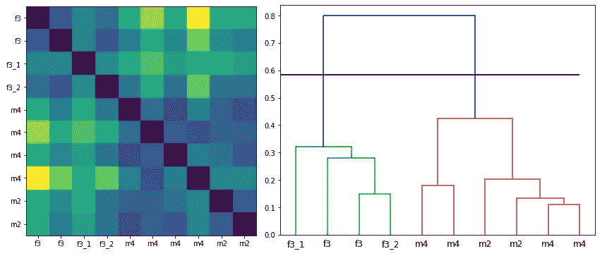

# 时间序列聚类和降维

> 原文：<https://towardsdatascience.com/time-series-clustering-and-dimensionality-reduction-5b3b4e84f6a3?source=collection_archive---------7----------------------->

## 利用 Kolmogorov Smirnov 统计和机器学习对传感器数据进行聚类


Photo by [Igor Ferreira](https://unsplash.com/@igorcferreira?utm_source=medium&utm_medium=referral) on [Unsplash](https://unsplash.com?utm_source=medium&utm_medium=referral)

数据科学家必须小心处理时间序列。这种数据包含关于时间依赖性的内在信息。我们的工作是在可能和有用的地方提取这些黄金资源，以帮助我们的模型发挥最佳性能。

对于时间序列，当我们面对降维或聚类的问题时，我看到了困惑。我们习惯于在更经典的领域中考虑这些任务，而当我们处理时间序列时，它们仍然是一个标签。

在这篇文章中，我试图澄清这些话题，开发一个有趣的解决方案，在这个方案中，我与来自不同个人的多维系列一起工作。我们的目的是利用深度学习，以无监督的方式对它们进行聚类，警惕相关性，并指出每个数据科学家都必须知道的有用技术！

# 数据集

我从 UCI 机器学习知识库中获得数据；我选择了[人体运动基元检测加速度计数据公共数据集](https://archive.ics.uci.edu/ml/datasets/Dataset+for+ADL+Recognition+with+Wrist-worn+Accelerometer)。这些数据是*标记的加速度计数据记录的公共集合，用于创建和验证人类运动原语的加速度模型。*

跟踪不同类型的活动，即喝酒、吃饭、爬山等。对于测量的特定个人的特定活动，我们有 3 个不同的传感器系列可供使用:X 轴(指向手部)、Y 轴(指向左侧)、Z 轴(垂直于手部平面)。

我在这种情况下思考自己，因为它允许在一个单独的案例中执行我们最初的问题**聚类**(多个个体)和**维度缩减**(每个个体的多个序列)。

下面我画了两个数据的例子，分别来自男性和女性。总共，我们有 20 个测量长度相同的个体。



# 降维

首先，我们的攻击计划提供了解决多维度问题。我们希望将存储在传感器数据中的所有信息总结成一个有意义的系列。这一最新步骤将使我们能够轻松地将我们的个人分组。

有很多种技术可以降低数据的维数，但我们的注意力集中在深度学习算法上。一个神经网络结构将允许我们容易地处理我们的初始数据:我记得你，我们有 20 个个体，对于每个个体，我们有 3 个长度为 170 的位置运动序列(用 pythonic 语言来说，我们有一个维数为 20x170x3 的数组)。传统的基于 PCA 的方法不允许我们处理这种问题，所以我们在 Keras 中建立了我们手工制作的自动编码器来处理我们臭名昭著的原始数据结构。

```
inp = Input(shape=(data.shape[1], data.shape[2]))

encoder = TimeDistributed(Dense(200, activation='tanh'))(inp)
encoder = TimeDistributed(Dense(50, activation='tanh'))(encoder)
latent = TimeDistributed(Dense(10, activation='tanh'))(encoder)
decoder = TimeDistributed(Dense(50, activation='tanh'))(latent)
decoder = TimeDistributed(Dense(200, activation='tanh'))(decoder)out = TimeDistributed(Dense(3))(decoder)autoencoder = Model(inputs=inp, outputs=out)
autoencoder.compile(optimizer='adam', loss='mse')
```

上面我已经展示了我使用的架构:时间分布层允许处理 3D 数据，其中索引 1 的维度将被认为是时间维度。对于我们的实验，我们使用前 10 个人来训练我们的自动编码器，并利用其余的人来计算相对预测的误差重构。在输入自动编码器之前，不要忘记标准化你的数据！在我们的例子中，我已经通过单个观察(通过行)对每个人的数据进行了标准化。

我们最终的重建误差看起来类似于下面的这个，当我们有信心并且能够检测到这个被选择的人的活动时，我们有接近零的点；而当我们的模型没有足够的学习，并且没有足够的信心来重建行走活动时，我们有很高的价值。



# 相关聚类

此时，我们已经有了可管理的对象(20 个人的维度为 175x1 ),并且我们已经准备好进行集群。从技术上来说，我们对测试个体的重构误差进行层次聚类。为了捕捉这些系列之间的重要关系，我们尝试了两种不同的工具来组合我们的集群。

在第一阶段，我们的选择包括采用皮尔逊相关指数。不幸的是，这个度量在统计学和机器学习领域非常 [**过度估计和滥用**](https://www.tylervigen.com/spurious-correlations) ，但是我们想给它一个机会…

获得相关矩阵后，我们直接对其进行操作，执行层次聚类。我们应用高阈值(传感器系列之间的最高成对距离的 99%)来形成我们的扁平聚类。这将导致高水平组的创建，数量很少，但是给我们测试数据的第一印象深刻的概述。

```
d = sch.distance.pdist(corr)
L = sch.linkage(d, method='ward')
ind = sch.fcluster(L, d.max(), 'distance')
dendrogram = sch.dendrogram(L, no_plot=True)df = [df[i] for i in dendrogram['leaves']]
labels = [person_id[10:][i] for i in dendrogram['leaves']]
corr = np.corrcoef(df)dendrogram = sch.dendrogram(L, labels=[person_id[10:][i] for i in dendrogram['leaves']])
```



Hierarchical Clustering on Correlation Matrix

查看相关矩阵的颜色强度(我们刚刚对其进行了聚类操作)，我们看不到明显的分组模式。在右边，树状图的切割线(黑线)在一些初始的“不确定性”之后，并没有创造出理性的群体。男女混在一起没有逻辑！

皮尔逊相关指数再次证实了它的不可靠性，我们必须走另一条路…

# KOLMOGOROV SMIRNOV 聚类

最近，我读到了 Kolmogorov Smirnov 的统计数据，这对我产生了双重影响:它让我想起了大学，也让我注意到了它的适应性。这个统计量，加上相对 p 值，用于测量两个样本之间的分布差异。我认为我们的聚类任务是这个杀手级工具的一个很好的应用领域。

使用 python 计算这个统计数据非常简单，为了在我们的例子中使用它，我们只需创建 Kolmogorov Smirnov 矩阵(相当于相关矩阵)并重复上面所做的相同步骤。



Hierarchical Clustering on Kolmogorov Smirnov Matrix

现在，查看我们矩阵的颜色强度(我们刚刚对其进行了聚类操作)，我们可以观察到女性和男性之间存在一种模式。从右边的树状图中可以清楚地看到，我们的分级程序已经创建了两个合理的群体，其中男性和女性都是分开的。集群建立之初的“不确定性”也消失了。

这是我们想要的结果，它证实了 Kolmogorov Smirnov 统计数据在每个数据科学家的武器库中的重要性。

# 摘要

在这篇文章中，我们同时解决了时间序列数据的降维和聚类问题。我们利用自动编码器来总结(以重建误差的形式)加速度计的相关特性。在我们的一维系列中，我们对个体进行了聚类划分。最令人满意的结果来自 Kolmogorov Smirnov 统计和层次聚类的组合，再次证实了必须谨慎处理 Pearson 相关性。

[查看我的 GITHUB 回购 ](https://github.com/cerlymarco/MEDIUM_NoteBook?source=post_page---------------------------)

保持联系: [Linkedin](https://www.linkedin.com/in/marco-cerliani-b0bba714b/?source=post_page---------------------------)