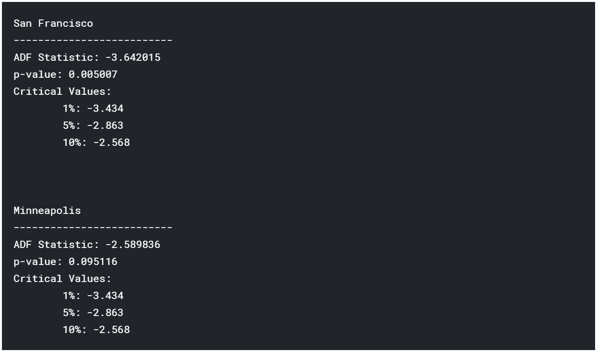
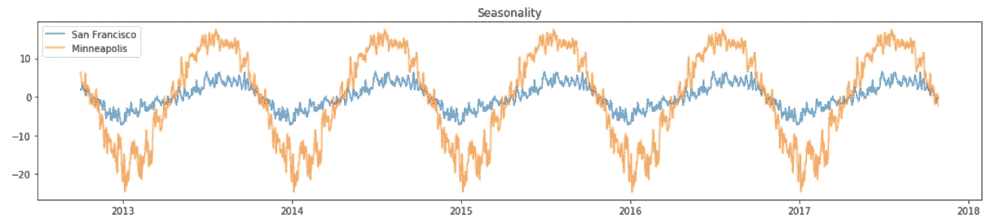

# 时间序列预测(1):初步分析

> 原文：<https://towardsdatascience.com/time-series-forecasting-1-initial-analysis-87e017501e98?source=collection_archive---------12----------------------->

> 所有这些信息都可以在我的 kaggle 个人资料中找到。

让我们从定义什么是时间序列开始这个系列。我选择了最简单的方法，并询问了维基百科，答案如下:

> 时间序列是按时间顺序索引(或列出或绘制)的一系列数据点。最常见的是，时间序列是在连续的等间隔时间点取得的序列。因此，它是一个离散时间数据序列。—维基百科

因此，时间序列基本上与任何其他数据集相似，但具有两个重要特征:

*   数据的顺序很重要，我们不仅关心数据的值，还关心这些值何时出现。
*   我们有观察每个实例的时间信息:我们或者有一个包含日期时间信息的列，或者我们知道数据在时间上是等间距的(例如，每秒一个值)。

在这里，我将介绍时间序列的概念，并对数据进行初步分析和调整；由于 Kaggle 数据通常非常清楚，这项工作比现实生活中容易得多，但其想法是表示过程，而不是编写复杂的代码。我要遵循的流程是这样的:

1.  加载数据并设置子集(我不会在这里使用整个数据集)
2.  可视化数据
3.  清理数据:是否有丢失的值？所有的数据都是期望的格式吗？
4.  查看统计数据:有异常值吗？
5.  寻找平稳性和自相关性
6.  趋势和季节性分解

## 数据

我正在使用来自 Kaggle 知识库的[历史每小时天气数据](https://www.kaggle.com/selfishgene/historical-hourly-weather-data/home)。该数据集包含不同城市大约 5 年的天气信息，包括温度、湿度、压力、风和天气描述等信息。我将把重点放在**温度**数据上，因为我觉得它更直观。

为了举例，我将使用两个城市的温度数据，选择的将是旧金山(因为我喜欢它)和变化最大的城市。

# 加载数据

我将在整个笔记本中使用 Pandas 来处理数据和 matplotlib 进行可视化。

```
import numpy as np
import pandas as pd
import matplotlib.pyplot as plt
```

让我们从加载数据 a 开始，快速浏览一下它的形状和第一个值。因为我已经知道这是一个时间序列，所以我将把 datetime 列设置为索引。

```
temp = pd.read_csv('../input/temperature.csv', parse_dates=['datetime'])
temp = temp.set_index('datetime')
print('Dataset shape: {}'.format(temp.shape))
temp.head()
```


该数据集由 36 列组成，对应 36 个不同的城市，45253 行，给出了从 2012 年末到 2017 年末每小时的温度值。

如我所说，我要使用的城市之一是年气温变化最大的城市。让我们找出是哪一个。

```
all_std = temp.std(axis=0)
max_std = all_std.max()
city_max_std = temp.columns[all_std==max_std][0]print('City with highest temperature variation: {} ({} degrees)'.format(city_max_std,round(max_std,2)))
```


现在让我们对数据进行子集划分，使其仅包含旧金山和明尼阿波利斯的值，并查看一些统计数据。

```
data = temp[['San Francisco','Minneapolis']]
data.describe()
```


我看到的第一件事是两列中都有丢失的数据，我将很快处理这个问题。此外，这个温度值显然不在日常温度的正常范围内。因为我住在欧洲，所以我要将数据从开尔文转换为摄氏度(抱歉，如果你用的是 Farenheit，但是国际系统)。

```
data = data-273.15
data.describe()
```


# 可视化数据

让我们来看看这两个城市历年的气温情况。

```
_=data.plot(
    figsize=(15,5),
    subplots=False,
    title='Temperature',
    alpha=0.7
)
_=plt.xlabel('Date')
_=plt.ylabel('Temperature')
```


还不错，明尼阿波利斯的天气似乎很冷，也许冬天我不会去那里。

此外，数据有明显的季节性，周期为一年。也有更多的变化，我稍后会检查这种变化是否与一些日常季节性有关，或者它更随机。

从这个图中我可以看出，旧金山的数据更少。蓝线距离 2018 年并没有那么近。

# 清理数据

正如我们所看到的，这里明显缺少值，图中引起我注意的一些东西可能是原因之一。正如我提到的，旧金山的数据结束得更早，为了同时处理这两个系列，我将丢失明尼阿波利斯系列的最终值。

为此，我将保留旧金山的所有非缺失值，并查看它们到达的最大日期。然后，我们将删除日期大于该日期的所有数据。

```
SF_non_missing = data['San Francisco'].dropna()
max_date = SF_non_missing.index.max()
data = data[data.index <= max_date]
```

让我们看看我们是否还有丢失的值。

```
print(data.isna().sum())
```


好了，我们还是要处理数据缺失的问题，不过有件事我想先处理一下。我在这里的目的是研究数据的年度行为，我对每日变化不感兴趣，所以我将通过取当天所有温度的平均值、最小值和最大值，将数据重新采样为每日频率。

```
data_mean = data.resample('D').mean()
data_min = data.resample('D').min()
data_max = data.resample('D').max()
print('Resample shape: {}'.format(data_mean.shape))
data_mean.describe()
```


如果每天都有更多没有丢失数据的行，这也可以解决我们丢失数据的问题。让我们检查一下。

```
print('Missing data now?')
print(data_mean.isna().sum())
```


现在没有丢失数据！这意味着我们每天至少有一个值。

如果不是这样，我会使用前一天的值。对于时间序列，我更喜欢这种解决方案，而不仅仅是删除行(最好在所有行之间有相同的时间间隔)或只使用平均值(因为这会扰乱曲线的形状)。

让我们检查一下重采样后数据的外观。

```
_=data_mean.plot(
    figsize=(15,5),
    subplots=False,
    title='Temperature',
    alpha=0.7
)
_=plt.fill_between(
    x=data_mean.index,
    y1=data_min['San Francisco'].values,
    y2=data_max['San Francisco'].values,
    alpha=0.3
)
_=plt.fill_between(
    x=data_mean.index,
    y1=data_min['Minneapolis'].values,
    y2=data_max['Minneapolis'].values,
    color='orange',
    alpha=0.3
)
_=plt.xlabel('Date')
_=plt.ylabel('Temperature')
```


曲线周围的阴影显示当天的最小值-最大值，而主线显示平均值。

现在两条曲线都在同一点结束，我们有更少的每日变化。

# 极端值

有时奇怪的事情会发生，我们最终得到的值会搞乱整个模型。例如，一个传感器可能发生故障，在夏天测量到零下 10 度的温度，这肯定是不正常的。在夏天的其他时候，你可以看到 10，这很低，但可能不是一个错误，有时它会变冷，你不能删除这种类型的值，因为它可能有一些原因。我们必须小心对待异常值，除非我们知道它是一个错误或者是一次性的，不应该影响我们的模型，否则我们不应该删除它。

识别哪些点是异常值以及如何处理它们并不总是很容易，但是一个好的起点是检查数据以查看是否有值非常高或非常低的点。直观地看到这一点的一个好方法是使用直方图。

```
_=plt.hist(data_mean['San Francisco'], alpha=0.5, label='San Francisco')
_=plt.hist(data_mean['Minneapolis'], alpha=0.5, label='Minneapolis')
_=plt.legend()
```


让我们分别来看看每个城市:

*   旧金山的值似乎遵循具有小标准偏差的高斯分布，我们在该数据中看不到任何异常值。
*   明尼阿波利斯的曲线不太完美，向右偏高(负偏)。虽然我们不能说这些点中的任何一个是异常值，因为有相当多的异常值，同样，在温度的可视化表示中，我们可以看到每年都达到非常低的值。

我没有看到任何异常值，也不认为我应该删除任何点。

# 寻找平稳性和自相关性

我们先前绘制的高斯型直方图是时间序列可以是平稳的第一个线索。

另一个线索是计算不同时间范围内的时间序列的一些统计数据，并寻找变化。

```
cut = data_mean.index[int(0.5*len(data_mean))]
print('Mean before {}:'.format(cut))
print(data_mean.loc[:cut].mean())
print('')
print('Mean after {}:'.format(cut))
print(data_mean.loc[cut:].mean())
print('')
print('---------------------------')
print('')
print('Std before {}:'.format(cut))
print(data_mean.loc[:cut].std())
print('')
print('Std after {}:'.format(cut))
print(data_mean.loc[cut:].std())
```


我们可以看到，旧金山的值非常接近，但明尼阿波利斯的值更远，它们仍然足够接近，时间序列是平稳的，因为我们需要考虑标准偏差。

这种方法并不证明或否认我们的时间序列是平稳的，它只是表明它可以是平稳的。

我们还可以使用统计测试来确定是否应该拒绝非平稳性假设**增强的 Dickey-Fuller 测试。**

```
from statsmodels.tsa.stattools import adfullerresult = adfuller(data_mean['San Francisco'])
print('San Francisco')
print('--------------------------')
print('ADF Statistic: %f' % result[0])
print('p-value: %f' % result[1])
print('Critical Values:')
for key, value in result[4].items():
    print('\t%s: %.3f' % (key, value))print('\n\n')

result = adfuller(data_mean['Minneapolis'])
print('Minneapolis')
print('--------------------------')
print('ADF Statistic: %f' % result[0])
print('p-value: %f' % result[1])
print('Critical Values:')
for key, value in result[4].items():
    print('\t%s: %.3f' % (key, value))
```



那么，这些值意味着什么呢？

*   ADF 统计量是扩大的 Dicken-Fuller 评分，该值越负，我们可以拒绝零假设(时间序列是平稳的概率)的确定性越高。
*   p 值是零假设的置信度。这个值的通常阈值是 0.05，这意味着如果 *p 值< = 0.05* ，我们可以拒绝零假设。
*   其余值分别是 99%、95%和 90%置信区间的临界值。

因此，在这种情况下，所有这些意味着我们可以拒绝旧金山的零假设，因为 *p* 低于 0.05，并且 ADF 得分低于 99%置信区间的限制。然而，我们无法拒绝明尼阿波利斯的这一假设，我们可以说它是具有 90%置信区间的平稳性，但是由于阈值是 95% ( *p = 0.05* )，我们不能拒绝它。这意味着我们应该在应用任何模型之前区别数据。

可以在下面找到一些参考资料来理解这些测试:

*   [时间序列预测的平稳数据检验](https://pythondata.com/stationary-data-tests-for-time-series-forecasting/)
*   [如何用 Python 检查时间序列数据是否平稳](https://machinelearningmastery.com/time-series-data-stationary-python/)

# 自相关

最后要检查的是数据是否自相关。我想使用一些自回归方法来预测未来的帖子，我只能在数据自相关的情况下这样做(意味着特定时间点的值取决于以前的值)。

statmodels 库提供了一个很好的工具来检查这一点。阴影区域之外的一切都很有可能是自相关的(超过 95%的置信区间)。

```
import statsmodels.api as sm
print('San Francisco')
_=sm.graphics.tsa.plot_acf(data_mean['San Francisco'])
plt.show()
print('Minneapolis')
_=sm.graphics.tsa.plot_acf(data_mean['Minneapolis'])
plt.show()
```


让我们把重点放在最重要的滞后(更接近要点的)，例如，一年范围的数据。

```
import statsmodels.api as sm
print('San Francisco')
_=sm.graphics.tsa.plot_acf(data_mean['San Francisco'], lags=365)
plt.show()
print('Minneapolis')
_=sm.graphics.tsa.plot_acf(data_mean['Minneapolis'], lags=365)
plt.show()
```


我们还可以检查部分自相关，它计算去除任何其他先前点(更接近新值的点)的影响的相关性。在这里，更远的点失去了重要性，我将重点放在一个月的范围。

```
print('San Francisco')
_=sm.graphics.tsa.plot_pacf(data_mean['San Francisco'], lags=30)
plt.show()
print('Minneapolis')
_=sm.graphics.tsa.plot_pacf(data_mean['Minneapolis'], lags=30)
plt.show()
```


以下是一些关于自相关的参考资料:

*   [Statsmodels 参考 acf 功能](https://www.statsmodels.org/dev/generated/statsmodels.tsa.stattools.acf.html)
*   [Statsmodels 引用 pacf 函数](https://www.statsmodels.org/dev/generated/statsmodels.tsa.stattools.pacf.html)
*   [自相关和偏自相关的简明介绍](https://machinelearningmastery.com/gentle-introduction-autocorrelation-partial-autocorrelation/)

# 趋势-季节性分解

我们可以把时间序列看作趋势、季节性和残差(噪声或其他随机行为)的组合。由这些部分组成的时间序列可以是加法的，也可以是乘法的:

*   加法:*数据=趋势+季节性+残差*
*   乘法:*数据=趋势季节性残差*

Statsmodels 包提供了一个函数来一次提取这 3 个组件:[季节性分解](https://www.statsmodels.org/dev/generated/statsmodels.tsa.seasonal.seasonal_decompose.html)

这里的分解很简单，因为我们知道周期是 365 天。

```
from statsmodels.tsa.seasonal import seasonal_decompose as sd
sd_SF = sd(data_mean['San Francisco'], freq=365)
sd_M = sd(data_mean['Minneapolis'], freq=365)_=plt.figure(figsize=(15,10))
ax1=plt.subplot(311)
_=ax1.plot(sd_SF.trend, label='San Francisco', alpha=0.7)
_=ax1.plot(sd_M.trend, label='Minneapolis', alpha=0.7)
_=plt.legend()
ax2=plt.subplot(312)
_=ax2.plot(sd_SF.seasonal, label='San Francisco', alpha=0.7)
_=ax2.plot(sd_M.seasonal, label='Minneapolis', alpha=0.7)
_=plt.legend()
ax3=plt.subplot(313)
_=ax3.plot(sd_SF.resid, label='San Francisco', alpha=0.7)
_=ax3.plot(sd_M.resid, label='Minneapolis', alpha=0.7)
_=plt.legend()
```



看到这一点，我们可以理解为什么我们发现明尼阿波利斯的数据是不稳定的，温度有明显的上升。

我们还可以通过移动平均来发现趋势，我在这里不会这样做，因为这是季节性分解函数在幕后做的事情。

暂时就这样了。以后的帖子我先说一些预测算法。

希望这能帮助到一些和我一样的初学者，感谢阅读！:)

警察。:我非常希望得到一些反馈

Pd2。:我要感谢 Jason Brownlee 的博客 machinelearningmastery，因为我在这里学到了我所知道的关于时间序列数据的大部分知识，他有许多关于这个主题的帖子，他的解释和例子非常清楚，如果你刚刚开始，或者想扩展你关于这个或任何其他机器学习主题的知识，我完全推荐它