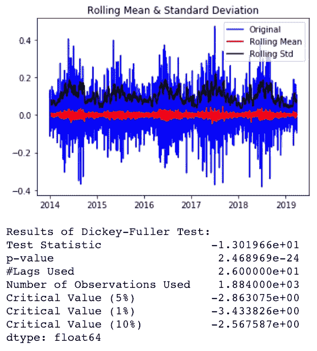

# 时间序列预测—入门指南

> 原文：<https://towardsdatascience.com/time-series-forecasting-a-getting-started-guide-c435f9fa2216?source=collection_archive---------4----------------------->

## 多元时间序列预测导论

# 介绍

当我开始写这篇文章时，我想解释如何用一个“简单”的时间序列(也就是单变量时间序列)进行预测。然而，我所参与的项目中最具挑战性的部分是预测需要结合多个变量。出于这个原因，我决定让这个指南更接近现实，并使用多元时间序列。

## 让我们先搞清楚一些概念…

一个 [**多变量 TS**](https://www.analyticsvidhya.com/blog/2018/09/multivariate-time-series-guide-forecasting-modeling-python-codes/) 是一个具有多个时间相关变量的时间序列。每个变量依赖于它过去的值，但也依赖于其他变量。预测值时会考虑这种依赖性。这些变量可以是内生的，也可以是外生的。在这里，我将重点关注外生变量。

**外生变量**是其值在模型之外确定并强加于模型的变量。换句话说，影响模型而不受其影响的变量。点击阅读更多关于外生变量[的信息。](http://www.businessdictionary.com/definition/exogenous-variable.html)

许多模型可以用来解决这样的任务，但我们将与 **SARIMAX** 合作。SARIMAX 代表带有外生回归量的[季节性自回归综合移动平均线。](https://www.statsmodels.org/dev/generated/statsmodels.tsa.statespace.sarimax.SARIMAX.html)

一切都好！现在，我们将介绍建立销售预测者可以遵循的步骤。

正如我在之前解释的那样，处理时间序列会带来一些挑战，比如让它保持平稳。如果你想知道更多关于我为什么在 dataframe 上执行一些转换的细节，去看看我以前的帖子。本文的重点是预测方法。

在这个机会中，我们有两个文件:一个包含过去销售的数据，另一个包含当地公共假日的信息。可以想象，任务将是通过组合这两个数据集来预测销售额。加载文件后，数据帧看起来像这样:


feriados_df — Holidays dataframe


ventas_df — past sales dataframe

我们的两个数据集的粒度都是在天的级别，也就是说,‘Date’和‘fecha’列都是具有每日频率的索引。如果我们想设置数据集的频率，我们可以运行下面一行:

```
ventas_df = ventas_df.resample(‘D’).mean() # 'D' for daily frequency
```

我们将需要连接这两个数据集，以便用我们拥有的所有数据来拟合我们的模型。' ventas_df '有我们要预测的变量。‘feria dos _ df’包含我们的外生变量。

为了让我们的生活更轻松，最好在加入 feriados_df 之前先站起来 ventas_df。我用来使序列更加平稳的方法包括应用对数变换和[差分](https://otexts.com/fpp2/stationarity.html)。固定化系列存储在“ts_log_diff”数据帧中。

```
test_stationarity(ts_log_diff)
```



现在我们可以加入 feriados_df 和 ts_log_diff，这是我们改造后的 ventas_df。

```
data_df = ts_log_diff.join(feriados_df, how='left')
data_df.head()
```


data_df — joined dataframe

有时在对熊猫进行一些操作后，我们得到的数据帧会丢失频率。为了解决这个问题，我们可以做到:

```
data_df = data_df.asfreq('D')
```

# 是时候来点特色工程了！

人们可以从现有的特性中想出多种创造新特性的方法。为了简单起见，让我们计算下面的列。
-假日 _ 工作日:公共假日是否在工作日
-假日 _ 周末:公共假日是在星期六还是星期天
-是星期几:日期是否在工作日
-是星期几:如果是周末
-在 25 日和 5 日之间:工资通常在这几天发放

```
**data_df['isweekday']** = [1 if d >= 0 and d <= 4 else 0 for d in data_df.index.dayofweek]
**data_df['isweekend']** = [0 if d >= 0 and d <= 4 else 1 for d in data_df.index.dayofweek]
**data_df['inbetween25and5']** = [1 if d >= 25 or d <= 5 else 0 for d in data_df.index.day]
**data_df['holiday_weekend']** = [1 if (we == 1 and h not in [np.nan]) else 0 for we,h in data_df[['isweekend','Holiday']].values]
**data_df['holiday_weekday']** = [1 if (wd == 1 and h not in [np.nan]) else 0 for wd,h in data_df[['isweekday','Holiday']].values]
```

让我们对列“Holiday”也应用一次热编码。

```
data_df = pd.get_dummies(data_df, columns=['Holiday'], prefix=['holiday'], dummy_na=True)
```


feature-engineered data_df

## 请我们已经可以预测了！？

亚斯。有点……首先，我们必须将数据分成训练和测试数据。你知道，为了良好的实践和避免过度拟合的东西；)

我们不能仅仅使用 k-folding 方法来将我们的数据集分成训练和测试。这是因为对于 TS，我们必须考虑时间因素。我们可以应用一些技术，其中包括:

1.  **训练测试分割**尊重观察的时间顺序。
2.  **多重训练测试分割**尊重观察的时间顺序。
3.  **前推验证**，每次收到新数据时更新一个模型。

在这种情况下，将使用 1 号。从系列开始到 2019 年 2 月的数据点将用作训练数据。其余的数据点将用于测试。

# 生成和可视化预测

```
result_daily = my_train_sarimax(data_df[:'2019-02-28'], i_order=(2,1,2), i_freq='D', i_seasonorder=(2, 1, 1, 12))
```

在上面的行中，训练数据点' data _ df[:' 2019–02–28 ']被传递给函数。值得注意的是，dataframe 中的第一列必须包含要预测的值。其余列是我们的外生变量(即假期和工程特征)。数据帧的频率在“i_freq”参数中给出。参数“i_order”和“i_seasonorder”指定训练模型所需的参数，请查看 SARIMAX 的文档以了解有关这些参数的更多信息。

my_train_sarimax()函数定义如下。


现在是时候验证我们的预测了。为此，我们将使用一个函数来检索预测值，然后将它们与测试数据点中的真实值进行比较。

```
ypred, ytruth = compare_pred_vs_real(result_daily, data_df, ‘2019–03–01’, exog_validation=data_df[‘2019–03–01’:].iloc[:,1:])
```

值得一提的是，必须向模型提供要预测的时间范围的外生变量。请记住，这些是模型外部的变量，它需要这些变量来进行预测。

如果我们查看“compare_pred_vs_real()”定义，我们可以看到预测是使用“get_prediction()”函数进行的。可以通过使用“预测平均值”方法来提取这些值。


Performance of our model

我们可以说我们的模型在 MSE 和 RMSE 方面有相当不错的表现。让我们看看我们的预测与实际售出的商品数量*相差有多远。*

```
ypred - ytruth
```


predictions minus true values

但是，等等…为什么我们会看到十进制数值？出售的商品数量必须是整数！

# 预测的(反)转换

请记住，我们进行了对数转换，然后对数据集应用了差分。为了看到我们的模型估计的实际销售数字，我们必须恢复这些转换。

由于差异操作，TS 中的原始第一个日期丢失。我们需要从“data_df”中填充缺失的值。接下来，我们需要将预测之前的所有日期*追加到‘y _ pred’中。这些日期也来自‘data _ df’。完成所有这些后，我们可以用 cumsum()恢复差异，然后应用 exp()恢复对数转换。*

```
#create a series with the dates that were dropped with differencing
restore_first_values = pd.Series([6.008813], index=[pd.to_datetime(‘2014–01–01’)])#get the values that the prediction does not have
missing_part = data_df[‘cantidad’][:’2019–02–28']
rebuilt = restore_first_values.append(missing_part).append(ypred)#revert differencing:
rebuilt = rebuilt.cumsum()#revert log transformation:
rebuilt = np.exp(rebuilt).round() # apply round() to have integers
```

我们终于可以看到我们的预测值，并与实际值进行比较。耶！

```
# Check how far were the predictions from the actual values
rebuilt['2019-03-01':] - ventas_df['cantidad']['2019-03-01':]
```


Looks like we got it right most of the time :)

# 最终意见

请记住，可以使用许多方法来实现 TS 中的平稳性。此外，SARIMAX 不是唯一一个对时间序列进行预测的模型，进一步的参数调整有助于提高模型的准确性。

请随意在我的 github [repo](https://github.com/osbarge/salesforecaster) 上查看该指南的全部代码。

感谢阅读！