# 英国道路交通事故的时间序列预测

> 原文：<https://towardsdatascience.com/time-series-forecasting-for-road-accidents-in-uk-f940e5970988?source=collection_archive---------28----------------------->

在这篇文章中，我们旨在预测英国未来的交通事故数量。使用的数据来自交通部(GB) [1]。该数据提供了 2014 年至 2017 年英国人身伤害道路事故情况的详细道路安全信息。我们将使用 ARIMA 和 Prophet 实现时间序列预测，以找出未来道路交通事故的数量。


Photo by [Stephen Dawson](https://unsplash.com/@srd844?utm_source=medium&utm_medium=referral) on [Unsplash](https://unsplash.com?utm_source=medium&utm_medium=referral)

## 什么是时间序列？

时间序列是变量在不同时间取值的一组观察值。例如销售趋势、股票市场价格、天气预报等。时间序列是用来根据以前的观察值预测未来值的。

## 时间序列的成分

*   趋势:趋势可以显示一个时间序列在很长一段时间内的增长或下降。这种趋势将持续很长一段时间。例如，价格和进出口数据反映出明显的增长趋势。
*   季节性:这些是由于季节性因素而在数据中出现的短期变动。短期通常被认为是随着天气或节日的变化，时间序列发生变化的时期
*   不规则性:这些是在时间序列中发生的不太可能重复的突然变化。它们是时间序列的组成部分，无法用趋势、季节或周期运动来解释。这些变化有时被称为残差或随机分量。
*   周期性的:这些是发生在时间序列中的长期振荡。这些振荡大多在经济数据中观察到，并且这种振荡的周期通常从五年延长到十二年或更长。这些波动与众所周知的商业周期有关。[2]

## 什么是 ARIMA 模式？

ARIMA 代表自回归综合移动平均线。有季节性和非季节性 ARIMA 模型可用于预测。ARIMA 模型的特征在于 3 项:p，d，q，其中 p 是 AR 项的阶，q 是 MA 项的阶，d 是使时间序列稳定所需的差的数量。如果一个时间序列有季节模式，那么你需要添加季节项，它就变成了萨里玛，是“季节性 ARIMA”的缩写。等我们结束 ARIMA 后会有更多的报道。[3]

让我们用所需的库准备好我们的环境，然后导入数据！

```
import numpy as np
import pandas as pd
import matplotlib.pyplot as plt
import seaborn as sns
%matplotlib inline
import matplotlib
plt.style.use('ggplot')
import warnings
import itertools
matplotlib.rcParams['axes.labelsize'] = 14
matplotlib.rcParams['xtick.labelsize'] = 12
matplotlib.rcParams['ytick.labelsize'] = 12
matplotlib.rcParams['text.color'] = 'k'
```

检查数据

```
df = pd.read_csv('~/accident_UK.csv')
df.head()
```

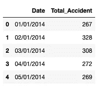

```
df.info()
```


将日期列转换为日期类型

```
df['Date'] = pd.to_datetime(df['Date'])
df.head()
```

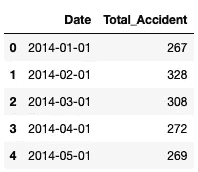

按日期对数据进行排序

```
df = df.sort_values(by=['Date'])
df.head()
```

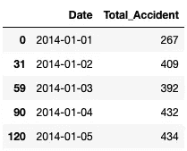

设置索引的日期

```
accident = df.set_index('Date')
accident.index
```

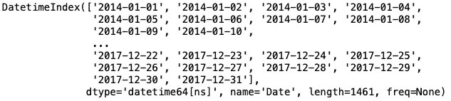

我们来提取一下每个月的平均事故次数。

```
y = accident['Total_Accident'].resample('MS').mean()
y.head()
```

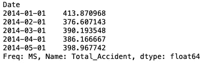

让我们看一下每个月平均事故的数量。

```
y.plot(figsize=(15, 6))
plt.show()
```

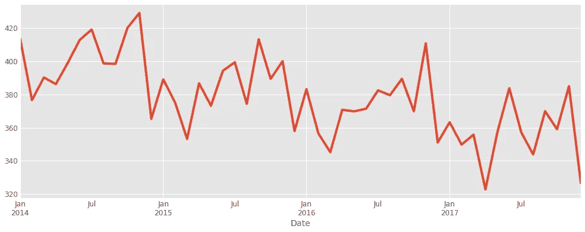

让我们使用时间序列分解来可视化数据，这允许我们将时间序列分解为三个不同的部分:趋势、季节性和噪声。

```
from pylab import rcParams
import statsmodels.api as sm
rcParams['figure.figsize'] = 16, 10
decomposition = sm.tsa.seasonal_decompose(y, model='additive')
fig = decomposition.plot()
plt.show()
```

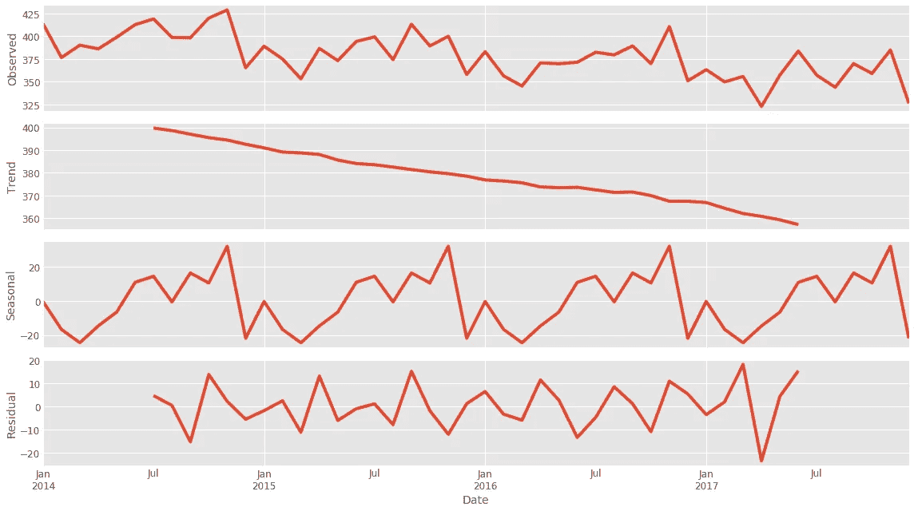

季节性 ARIMA 的参数组合示例

```
p = d = q = range(0, 2)
pdq = list(itertools.product(p, d, q))
seasonal_pdq = [(x[0], x[1], x[2], 12) for x in list(itertools.product(p, d, q))]
print('Examples of parameter combinations for Seasonal ARIMA...')
print('SARIMAX: {} x {}'.format(pdq[1], seasonal_pdq[1]))
print('SARIMAX: {} x {}'.format(pdq[1], seasonal_pdq[2]))
print('SARIMAX: {} x {}'.format(pdq[2], seasonal_pdq[3]))
print('SARIMAX: {} x {}'.format(pdq[2], seasonal_pdq[4]))
```

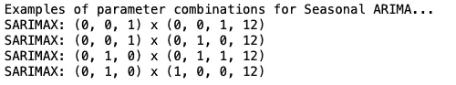

这一步是为我们的 ARIMA 时间序列模型选择参数。我们在这里的目标是使用“网格搜索”来找到为我们的模型产生最佳性能的最佳参数集。

```
for param in pdq:
    for param_seasonal in seasonal_pdq:
        try:
            mod = sm.tsa.statespace.SARIMAX(y,
                                            order=param,
                                            seasonal_order=param_seasonal,
                                            enforce_stationarity=False,
                                            enforce_invertibility=False)

            results = mod.fit()

            print('ARIMA{}x{}12 - AIC:{}'.format(param, param_seasonal, results.aic))
        except:
            continue
```

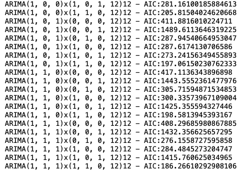

上述输出表明，SARIMAX (1，1，1)x(1，1，0，12)产生的 AIC 值最低，为 186.26。因此，我们应该认为这是一个最佳选择。

## 拟合 ARIMA 模型

```
mod = sm.tsa.statespace.SARIMAX(y,
                                order=(1, 1, 1),
                                seasonal_order=(1, 1, 0, 12),
                                enforce_stationarity=False,
                                enforce_invertibility=False)
results = mod.fit()
print(results.summary().tables[1])
```

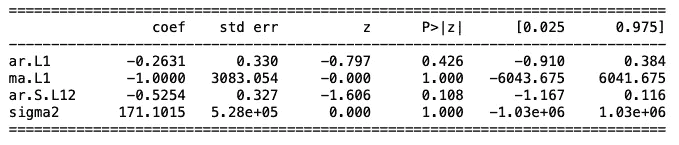

我们需要始终运行模型诊断来调查任何不寻常的行为。

```
results.plot_diagnostics(figsize=(16, 8))
plt.show()
```

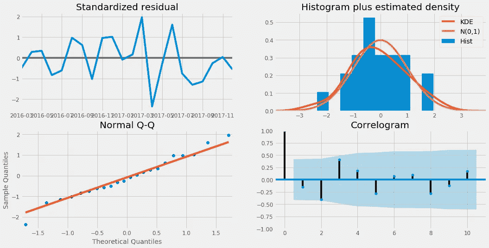

## 预测评估

为了了解我们预测的准确性，我们将预测的事故数量与时间序列的实际事故数量进行比较，我们将预测从 2017 年 1 月 1 日开始到数据结束。

```
pred = results.get_prediction(start=pd.to_datetime('2017-01-01'), dynamic=False)
pred_ci = pred.conf_int()
ax = y['2014':].plot(label='observed')
pred.predicted_mean.plot(ax=ax, label='One-step ahead Forecast', alpha=.7, figsize=(14, 7))
ax.fill_between(pred_ci.index,
                pred_ci.iloc[:, 0],
                pred_ci.iloc[:, 1], color='k', alpha=.2)
ax.set_xlabel('Date')
ax.set_ylabel('Furniture Sales')
plt.legend()
plt.show()
```

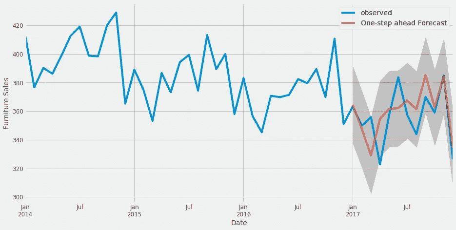

让我们找出 MSE 来看看我们模型的准确性。均方误差(MSE)主要用作确定算法性能的度量。此外，MSE 是一个变量的观察值和预测值之差的平方的平均值。

```
y_forecasted = pred.predicted_mean
y_truth = y['2017-01-01':]
mse = ((y_forecasted - y_truth) ** 2).mean()
print('The Mean Squared Error of our forecasts is {}'.format(round(mse, 2)))
```

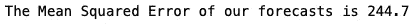

## 可视化预测

正如我们在下面的图表中所看到的，英国的交通事故数量在未来几年将会下降。

```
pred_uc = results.get_forecast(steps=100)
pred_ci = pred_uc.conf_int()
ax = y.plot(label='observed', figsize=(14, 7))
pred_uc.predicted_mean.plot(ax=ax, label='Forecast')
ax.fill_between(pred_ci.index,
                pred_ci.iloc[:, 0],
                pred_ci.iloc[:, 1], color='k', alpha=.25)
ax.set_xlabel('Date')
ax.set_ylabel('Furniture Sales')
plt.legend()
plt.show()
```

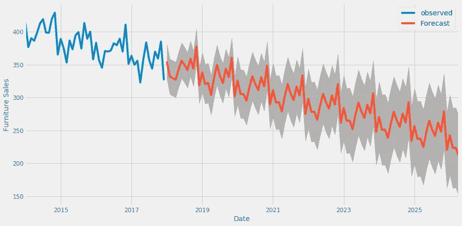

## 什么是先知模型？

Prophet 是一个来自脸书的开源时间序列预测算法，它的设计是为了在没有时间序列预测或统计方面的专家知识的情况下易于使用。时间序列预测通过寻找最佳平滑线来建立模型，该最佳平滑线可以表示为以下分量的总和:

*   总体增长趋势
*   早期季节性
*   每周季节性
*   节日影响

先知方法的好处:

*   数据之间不均匀的时间间隔不是问题
*   天娜不是问题
*   默认情况下，会处理多个期间(周和年)的季节性
*   默认设置下工作良好，参数易于解释

让我们按日期对值进行排序

```
df = df.sort_values(by=['Date'])
df.head()
```

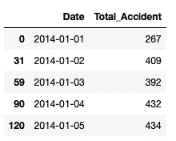

Prophet 要求时间序列中的变量名为:

*   y-目标
*   ds —日期时间

因此，下一步是根据上述规范转换数据帧

```
df = df.rename(columns={'Date': 'ds',
                        'Total_Accident': 'y'})
df.head()
```

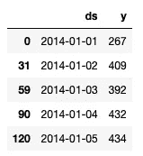

让我们想象一下每天的交通事故数量

```
ax = df.set_index('ds').plot(figsize=(15, 8))
ax.set_ylabel('Total Accident')
ax.set_xlabel('Date')

plt.show()
```

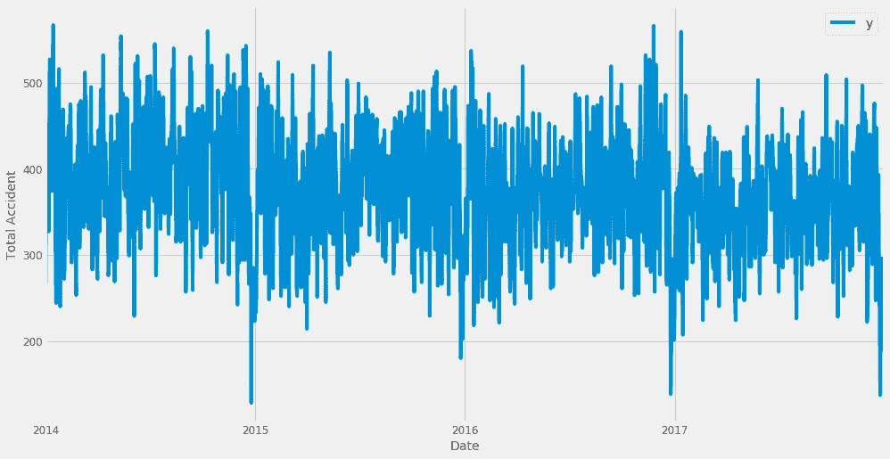

## 拟合先知模型

将不确定性区间设置为 95%(Prophet 默认为 80%)

```
from fbprophet import Prophet
my_model = Prophet(interval_width=0.95)
my_model.fit(df)
```

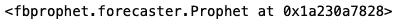

要使用我们的模型创建预测，我们需要创建一些未来日期。Prophet 为我们提供了一个辅助函数，叫做 make_future_dataframe。我们传入未来周期的数量和频率。以上是我们对未来 36 个月或 3 年的预测。

```
future_dates = my_model.make_future_dataframe(periods=36, freq='MS')
future_dates.tail()
```

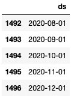

正如我们在下表中看到的，yhat 是我们的预测值。

```
forecast = my_model.predict(future_dates)
forecast[['ds', 'yhat', 'yhat_lower', 'yhat_upper']].tail()
```

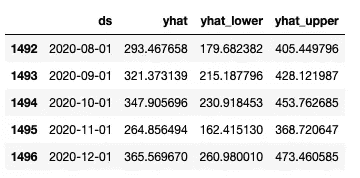

让我们创建一个实际值和预测值的图表

```
plt.figure(figsize=(10,8))
my_model.plot(forecast,
              uncertainty=True)
```

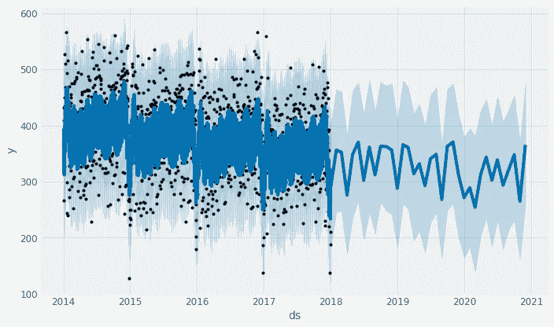

plot_components 为我们提供了趋势和季节性的图表

```
my_model.plot_components(forecast)
```

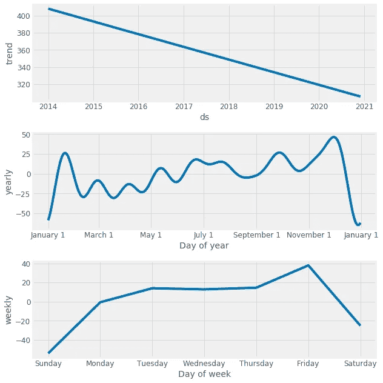

## 模型评估

```
from fbprophet.diagnostics import cross_validation
df_cv = cross_validation(my_model, initial='730 days', period='180 days', horizon = '365 days')
df_cv.head()
```

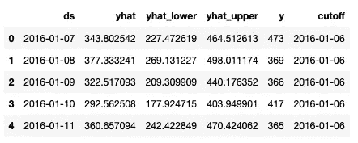

```
from fbprophet.diagnostics import performance_metrics
df_p = performance_metrics(df_cv)
df_p.head()
```

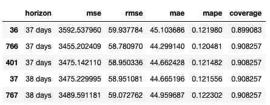

非常感谢你阅读我的文章！！！

## 参考资料:

[1].[https://data . gov . uk/dataset/CB 7 AE 6 f 0-4be 6-4935-9277-47 E5 ce 24 a 11 f/road-safety-data](https://data.gov.uk/dataset/cb7ae6f0-4be6-4935-9277-47e5ce24a11f/road-safety-data)

[2].克利夫兰，R. B .，克利夫兰，W. S .，麦克雷，J. E .，&特彭宁，国际法院(1990)。STL:基于黄土的季节趋势分解过程。*官方统计杂志*， *6* (1)，3–33。

[3].Hyndman，R. J .，& Khandakar，Y. (2008 年)。自动时间序列预测:R. *统计软件学报*， *27* (1)，1–22 的预测包。

[4].[https://www . analyticsvidhya . com/blog/2018/05/generate-accurate-forecasts-Facebook-prophet-python-r/](https://www.analyticsvidhya.com/blog/2018/05/generate-accurate-forecasts-facebook-prophet-python-r/)