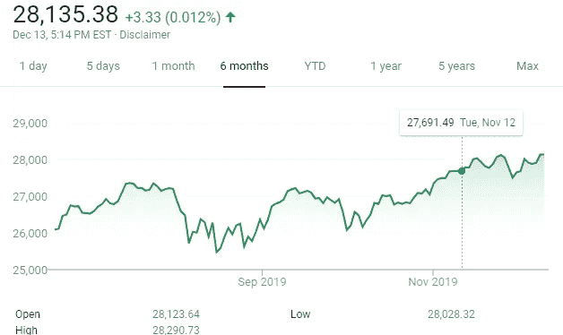
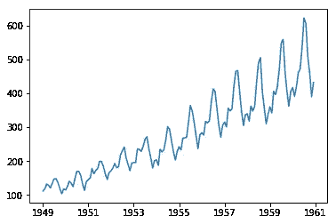
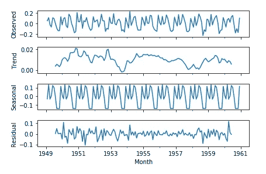
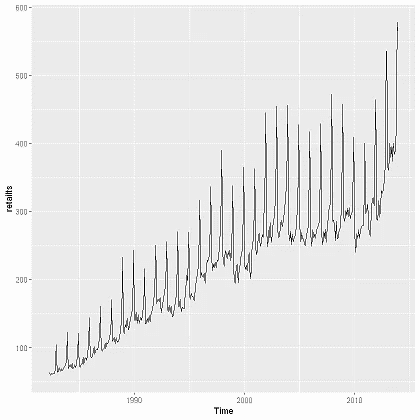
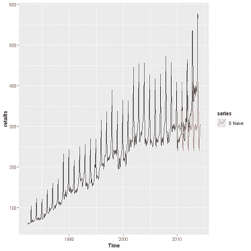
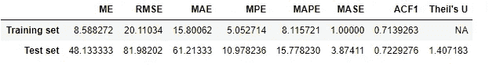
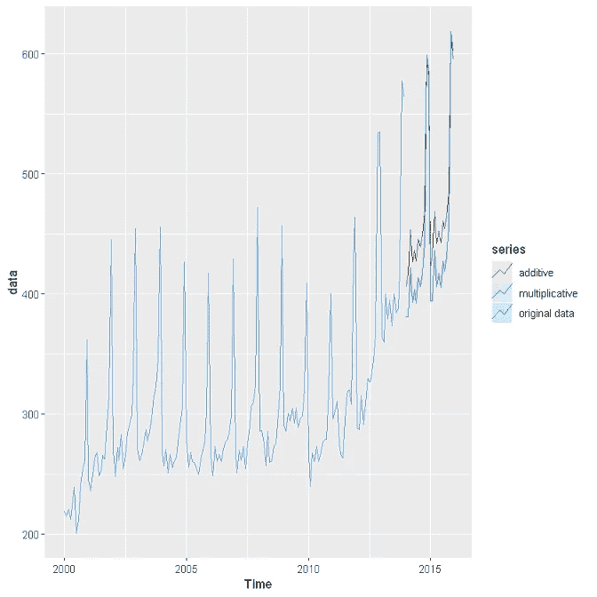
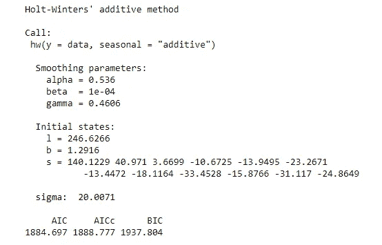
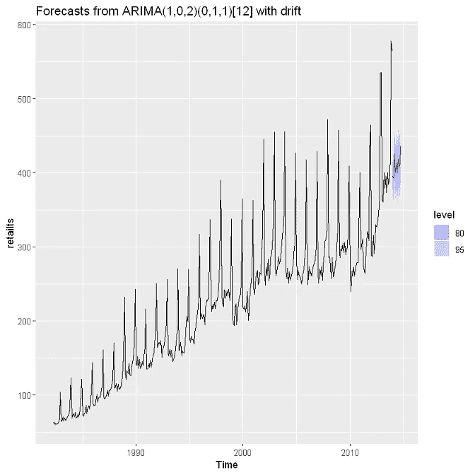
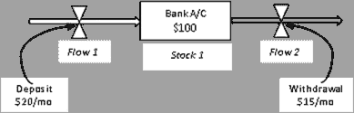

# 时间序列预测:从天真到 ARIMA 及以后

> 原文：<https://towardsdatascience.com/time-series-forecasting-from-naive-to-arima-and-beyond-ef133c485f94?source=collection_archive---------7----------------------->

## 简单和复杂的商业决策预测技术


Photo by [Aron Visuals](https://unsplash.com/@aronvisuals?utm_source=medium&utm_medium=referral) on [Unsplash](https://unsplash.com?utm_source=medium&utm_medium=referral)

*   在未来五年内再建一座发电厂需要预测未来的需求；
*   下周在呼叫中心安排员工需要预测下周的呼叫量；
*   储存零售存货需要预测存货需求。

事实上，短期和中期预测是各行各业商业决策的重要组成部分。历史数据是这一预测过程的重要输入。

时间序列数据集是*在任何业务中最广泛生成和使用的数据。它们既用于理解过去，也用于预测未来。在本文中，我将通过相关的案例研究和示例来讨论如何将各种预测方法应用于时间序列数据集。这篇文章的目的不是评价哪个模型是好是坏，而是展示我们在实践中可以做预测的许多不同的方法。本文分为两大部分:*

> (1)首先，我将概述时间序列数据以及如何分解不同的时间序列成分；
> 
> (2)然后我将提供不同预测技术的例子以及相关的实现方法

## **理解和分解时间序列数据**

那么什么是时间序列数据呢？时间序列是在离散时间点记录的一系列观察值。它们可以以每小时(如气温)、每天(如 DJI 平均)、每月(如销售额)或每年(如国内生产总值)的时间间隔记录。时间序列广泛应用于所有学科，包括统计学、数学、天文学和工程学。时间序列绘图是在数据科学和分析的探索性数据分析(EDA)阶段实施的最基本的绘图练习之一。



Time series data: Daily Dow Jones Industrial (DJI) averages over 6 months

我们来看看下图。



即使用肉眼也很少有明显的特性:

1.  这是一个时间序列图
2.  有上升的趋势
3.  观察值具有季节性(在固定的时间间隔内起伏)

事实上，如果我们分解这些数据，我们会看到这些组件，如下所示。



## 时间序列数据的预测技术

预测未来可以简单到外推历史观察的趋势，应用复杂的算法。在这里，我介绍了商业应用程序中最常用的不同技术。我使用两个统计和可视化包在 R 环境中演示这些技术:

```
# install packages
library("forecast")
library("ggplot2")
```

在导入数据(零售销售数据集)并将其转换为时间序列对象后，它看起来是这样的。

```
# import dataset
retaildata = readxl::read_excel("../retail.xlsx", skip=1)# convert dataset into a time series object
retailts = ts(retaildata, start = c(1982,4), frequency = 12 )# plot the time series object with autoplot() function that comes with forecast() package
autoplot(retailts)
```



首先我将解释一些简单的技术来预测这个时间序列对象。虽然这些简单的技术在实践中不经常使用，但知道它们是如何产生的是很好的，然后我们将进入更复杂的技术。

## 简单的预测技术

简单的预测技术被用作基准。它们提供了对历史数据的一般理解，并建立直觉，在此基础上增加额外的层复杂性。几种这样的技术在文献中很常见，如:均值模型、简单预测、随机游走、漂移法等。例如，均值模型采用以前观察值的均值，并将其用于预测。那就是:

> 预测值=训练数据的平均值

另一方面，随机游走将预测下一个值，ŷ(t，它等于前一个值加上一个常数变化。

ŷ(t)= y(t-1)+α

初始预测的值是基于最后一次观察的值设置的。和其他简单的方法一样，它提供了一个大概的数字作为初步估计，直到进一步的研究完成。下面是季节性朴素预测模型的实现。

```
# subsetting train and test data using window()function 
retailtstrain = window(retailts, end = c(2010,3))
retailtstest = window(retailts, start = c(2010,4))# model building
retailtstrain_snaive = snaive(retailtstrain, h=50)# ploting
autoplot(retailts)+
autolayer(retailtstrain_snaive, series = "S Naive", PI = FALSE)
```



```
# Accuracy test
accuracy(retailtstrain_snaive, retailtstest)
```



## 指数平滑法

根据数据类型的不同，指数平滑几乎没有变化。简单的指数平滑法用于没有明确趋势的非季节性数据，而霍尔特-温特法用于有趋势和季节性的数据。它应用于平稳时间序列，其中平滑由参数 alpha (0~1)控制，其中较低的值意味着对最近观察值的较低权重。下面是使用相同数据集的霍尔特-温特指数平滑的实现。

```
# Holt Winter Exponential Smoothing
# Two variations: additive for roughly constant seasonal variation, otherwise multiplicative methoddata = window(retailts, start=2000)
data_add = hw(data, seasonal="additive")
data_mult = hw(data, seasonal="multiplicative")autoplot(data, series = "original data")+
autolayer(data_add, series = "additive", PI=FALSE)+
autolayer(data_mult, series = "multiplicative", PI=FALSE)
```



```
# model summary and performance
data_add[["model"]]
```



## ARIMA 家族

自回归综合移动平均(ARIMA)可以说是最流行和最广泛使用的统计预测技术。顾名思义，这个技术家族有 3 个组成部分:a)一个“自回归”部分，它模拟序列和它的滞后观测值之间的关系；b)将预测建模为滞后预测误差的函数的“移动平均”模型；和 c)使系列静止的“集成”组件。

该模型采用以下参数值:

> 定义滞后数量的 p；
> 
> *d* 指定使用的差异数；和
> 
> *q* 定义了移动平均窗口的大小

使用时序对象进行预测的 ARIMA 模型的实现如下:

```
# implementing auto.arima() to forecast
retailts_arima = auto.arima(retailts, seasonal=TRUE, stepwise = FALSE, approximation = FALSE)
retailts_arima %>% forecast(h=10) %>% autoplot()
```



## 更先进的技术

最后，还有一些盒子外的技术，如[基于代理的](https://en.wikipedia.org/wiki/Agent-based_model)和[系统动态](https://www.systemdynamics.org/what-is-sd)建模。系统动力学是 20 世纪 50 年代由麻省理工学院[斯隆管理学院](https://mitsloan.mit.edu/faculty/academic-groups/system-dynamics/about-us)开发的，是一种模拟复杂系统行为的方法，其中一个组件的变化会导致其他组件的变化。这种方法广泛应用于医疗保健、疾病研究、公共交通、商业管理和收入预测等行业。系统动力学最著名的应用可能是罗马俱乐部的增长极限模型。

一个系统动态模型代表了一个复杂的系统，通过反馈循环来预测系统的行为。假设一个银行账户有 100 美元的“股票”。每月存入 20 美元(由“流程”1 表示)，每月提取 15 美元(由“流程”2 表示):



System dynamic modeling workflow

在这个例子中，股票的未来价值(即账户存款)被建模为未来流量(即存款和取款)的函数。[本文](https://mpra.ub.uni-muenchen.de/27323/1/MPRA_paper_27323.pdf)提供了在建筑行业实施系统动态预测模型的案例研究。

## 额外资源

1.  罗布·海德曼的网站[https://robjhyndman.com/](https://robjhyndman.com/)是 R 中所有预测问题的一站式解决方案。也可以查看开放存取书籍[https://otexts.com/fpp2/](https://otexts.com/fpp2/)中的理论讨论以及 R 实施示例。
2.  *《R 对于时间序列的一个小本子》*什么都有简化形式。*[http://www . Calvin . edu/~ stob/courses/m344/S15/a-little-book-of-r-for-time-series . pdf](http://www.calvin.edu/~stob/courses/m344/S15/a-little-book-of-r-for-time-series.pdf)*
3.  *如果你喜欢 Python，请点击下面的链接。还有一本关于时序的 python 实现的书的参考。[https://machinelementmastery . com/time-series-forecasting-methods-in-python-cheat-sheet/](https://machinelearningmastery.com/time-series-forecasting-methods-in-python-cheat-sheet/)*