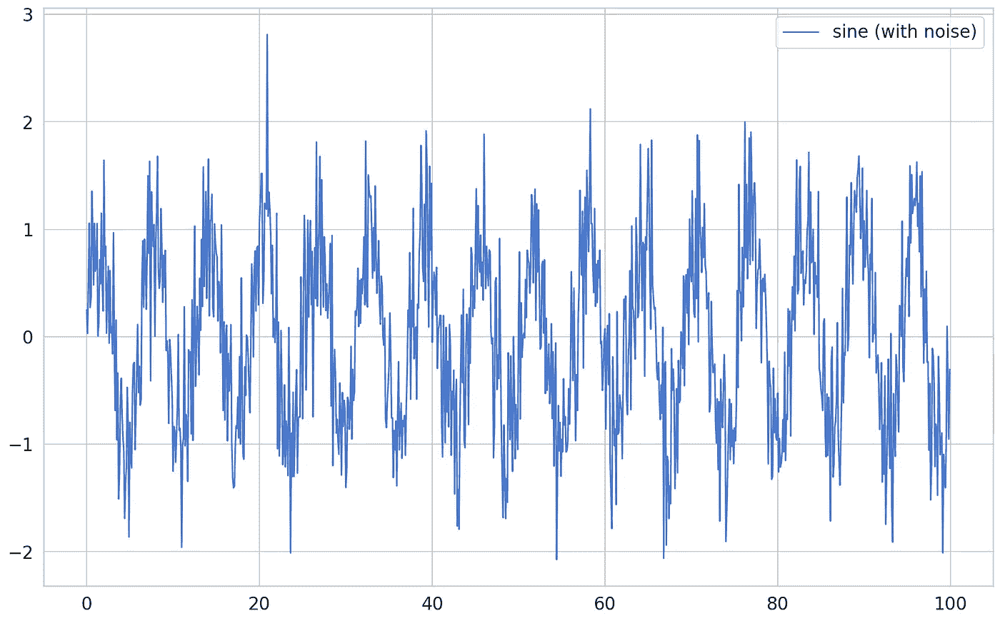
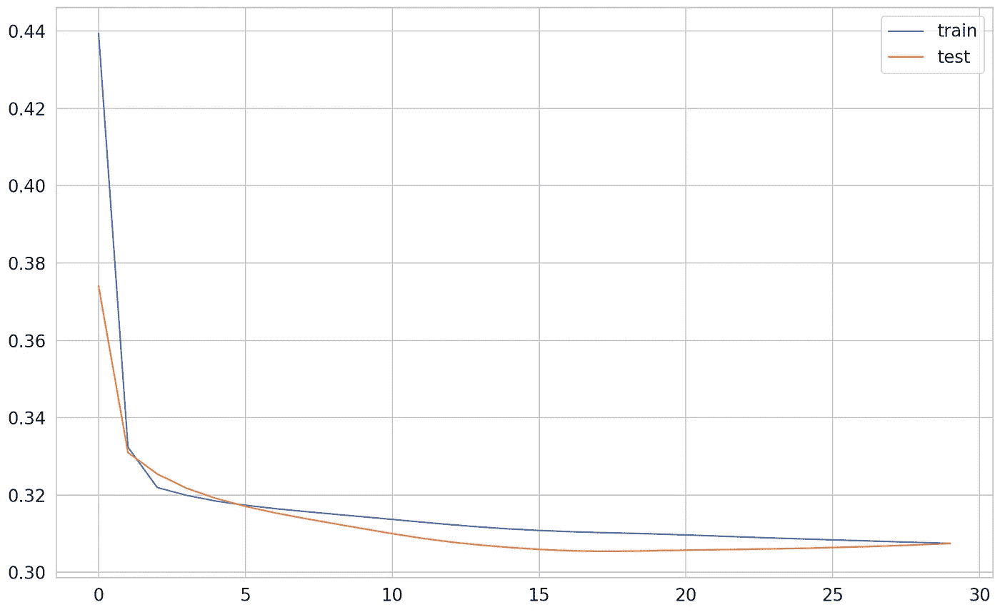
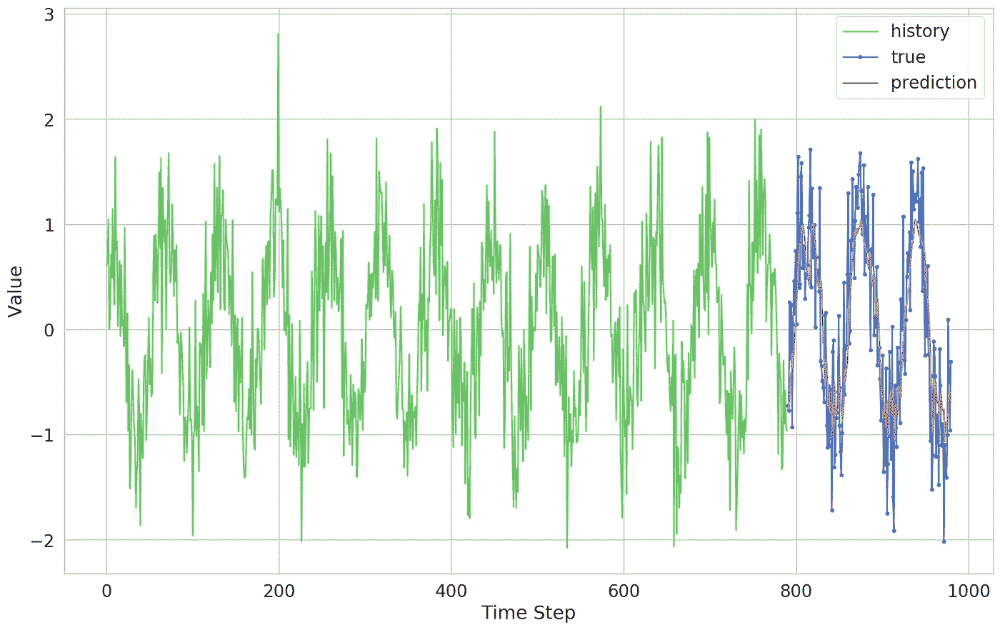
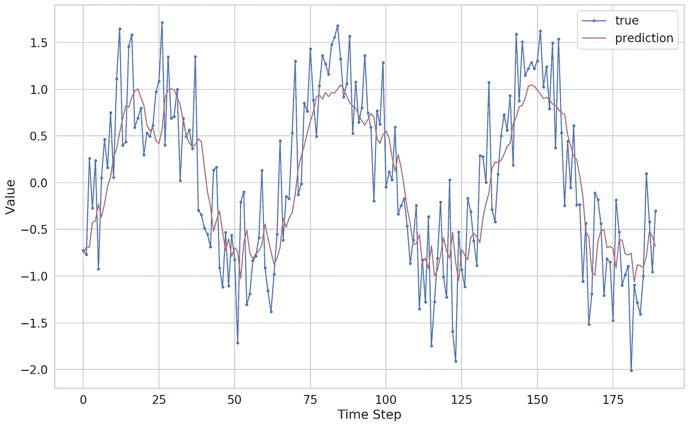

# 使用 TensorFlow 2 和 Keras 在 Python 中使用 LSTMs 进行时间序列预测

> 原文：<https://towardsdatascience.com/time-series-forecasting-with-lstms-using-tensorflow-2-and-keras-in-python-6ceee9c6c651?source=collection_archive---------1----------------------->

## 利用 LSTMs 进行时间序列预测的数据准备和预测介绍


> *TL；DR 了解时间序列，并使用递归神经网络进行预测。准备序列数据并使用 LSTMs 进行简单预测。*

想学习如何使用多元时间序列数据？阅读下一部分:

[](/demand-prediction-with-lstms-using-tensorflow-2-and-keras-in-python-1d1076fc89a0) [## 使用 TensorFlow 2 和 Keras 在 Python 中使用 LSTMs 进行需求预测

### 了解如何通过深度学习从多元时间序列数据中预测需求

towardsdatascience.com](/demand-prediction-with-lstms-using-tensorflow-2-and-keras-in-python-1d1076fc89a0) 

通常，您可能不得不处理包含时间成分的数据。不管你怎么眯眼，都很难做出你喜欢的数据独立性假设。似乎数据中的新值可能依赖于历史值。你怎么能使用这种数据来建立模型呢？

本指南将帮助您更好地理解时间序列数据，以及如何使用深度学习(递归神经网络)建立模型。您将学习如何预处理时间序列，构建一个简单的 LSTM 模型，训练它，并使用它来进行预测。以下是步骤:

1.  理解什么是时间序列
2.  了解递归神经网络
3.  在 Keras 中用 LSTMs 预测时间序列数据
4.  评估模型

[**在浏览器中运行完整的笔记本**](https://colab.research.google.com/drive/1lUwtvOInzoaNC5eBMljRMVk1K9zcKD-b)

[**GitHub 上的完整项目**](https://github.com/curiousily/Deep-Learning-For-Hackers)

# 时间序列

[时间序列](https://en.wikipedia.org/wiki/Time_series)是数据点的集合，根据它们被收集的时间进行索引。大多数情况下，数据是以固定的时间间隔记录的。时间序列数据的特殊之处是什么？

预测未来时间序列值是实践中一个相当常见的问题。预测下一周的天气、明天的比特币价格、圣诞节期间你的销售数量以及未来的心脏衰竭都是常见的例子。

时间序列数据引入了对先前时间步长的“硬依赖”,因此观测值独立性的假设不成立。时间序列可以具有哪些属性？

**平稳性**、**季节性**和**自相关性**是您可能感兴趣的时间序列的一些属性。

当均值和方差随时间保持不变时，称时间序列为**平稳**。如果平均值随时间变化，那么时间序列具有**趋势**。通常，您可以通过应用对数变换来消除它并使序列平稳。

**季节性**是指特定时间范围内的变化现象。人们在圣诞节期间购买更多的圣诞树(谁会想到)。消除季节性的一种常见方法是使用[差异](https://www.quora.com/What-is-the-purpose-of-differencing-in-time-series-models)。

[**自相关**](https://en.wikipedia.org/wiki/Autocorrelation) 指当前值与前一时间(滞后)的拷贝值之间的相关性。

为什么我们想要季节性、趋势性和平稳的时间序列？这是用经典方法如 [ARIMA 模型](https://en.wikipedia.org/wiki/Autoregressive_integrated_moving_average)进行时间序列预测所需的数据预处理步骤。幸运的是，我们将使用递归神经网络进行建模。

# 递归神经网络

递归神经网络(RNNs)可以预测序列中的下一个值或对其进行分类。一个序列被存储为一个矩阵，其中每一行都是一个描述它的特征向量。自然，矩阵中行的顺序很重要。

rnn 非常适合解决自然语言处理(NLP)任务，其中文本中的单词形成序列，它们的位置很重要。也就是说，前沿 NLP 使用变压器来完成大多数(如果不是全部)任务。

你可能已经猜到了，时间序列只是序列的一种类型。我们必须将时间序列切割成更小的序列，这样我们的 RNN 模型就可以用它们进行训练。但是我们如何训练 rnn 呢？

首先，让我们对递归的含义有一个直观的理解。rnn 包含循环。每个单元都有一个状态，并接收两个输入-来自前一层的状态和来自前一时间步的该层的统计数据。

[反向传播算法](https://en.wikipedia.org/wiki/Backpropagation)在应用于 RNNs 时会因为循环连接而失效。展开网络可以解决这个问题，在网络中，具有循环连接的神经元的副本被创建。这将 RNN 转换成常规的前馈神经网络，并且可以应用经典的反向传播。该修改被称为通过时间的[反向传播。](https://en.wikipedia.org/wiki/Backpropagation_through_time)

## 经典 rnn 的问题

展开的神经网络会变得非常深(他就是这么说的)，这给梯度计算带来了问题。权重可以变得非常小([消失梯度问题](https://en.wikipedia.org/wiki/Vanishing_gradient_problem))或者非常大([爆炸梯度问题](https://www.curiousily.com/posts/time-series-forecasting-with-lstms-using-tensorflow-2-and-keras-in-python/(https://en.wikipedia.org/wiki/Vanishing_gradient_problem)))。

经典的 rnn 也有记忆问题(长期依赖性)。由于最近状态的压倒性影响，我们用于训练的序列的乞求倾向于被“遗忘”。

在实践中，这些问题可以通过使用门控 rnn 来解决。它们可以存储信息以备后用，就像有一个内存一样。阅读、写作和从记忆中删除都是从数据中学习的。两种最常用的门控 rnn 是[长短期记忆网络](https://en.wikipedia.org/wiki/Long_short-term_memory)和[门控复发性单位神经网络](https://en.wikipedia.org/wiki/Gated_recurrent_unit)。

# 用 LSTMs 进行时间序列预测

我们将从一个简单的例子开始，使用简单的 LSTM 网络预测[正弦函数](https://en.wikipedia.org/wiki/Sine)的值。

# 设置

让我们从库导入和设置种子开始:

# 数据

我们将从正弦函数中生成 *1，000* 值，并将其作为训练数据。但是，我们会添加一点*精加工*:



从正态分布中提取的随机值被添加到每个数据点。那会让我们模型的工作变得有点困难。

# 数据预处理

对于我们的模型，我们需要将数据“切碎”成更小的序列。但首先，我们将把它分为训练和测试数据:

```
800 200
```

为时间序列预测(尤其是 LSTMs)准备数据可能很困难。直观地说，我们需要利用历史( *n* 时间步长)来预测当前时间步长的值。这里有一个通用函数可以完成这项工作:

该函数的妙处在于它可以处理单变量(单特征)和多变量(多特征)时间序列数据。让我们用 10 个时间步骤的历史来制作我们的序列:

```
(790, 10, 1) (790,)
```

我们有形状为`(samples, time_steps, features)`的序列。我们怎么用它们来做预测呢？

# 建模

在喀拉斯培养 LSTM 模式很容易。我们将使用序列模型中的 [LSTM 层](https://www.tensorflow.org/api_docs/python/tf/keras/layers/LSTM)进行预测:

LSTM 图层期望时间步长数和要素数能够正常工作。模型的其余部分看起来像一个常规的回归模型。我们如何训练一个 LSTM 模特？

# 培养

训练时间序列模型时要记住的最重要的事情是不要打乱数据(数据的顺序很重要)。其余的都很标准:



我们的数据集非常简单，包含了我们采样的随机性。经过大约 15 个时期后，模型已经基本完成了学习。

# 估价

让我们从我们的模型中选取一些预测:

我们可以根据时间序列的真实值绘制预测图:



我们的预测在这个尺度上看起来非常好。让我们放大:



该模型似乎在捕捉数据的一般模式方面做得很好。它未能捕捉到随机波动，这是一件好事(它概括得很好)。

# 结论

恭喜你！你做了你的第一个递归神经网络模型！您还了解了如何预处理时间序列数据，这是一件让很多人感到困惑的事情。

我们只是触及了时间序列数据和如何使用递归神经网络的表面。一些有趣的应用是时间序列预测、(序列)分类和异常检测。有趣的部分才刚刚开始！

想学习如何使用多元时间序列数据？阅读下一部分:

[](/demand-prediction-with-lstms-using-tensorflow-2-and-keras-in-python-1d1076fc89a0) [## 使用 TensorFlow 2 和 Keras 在 Python 中使用 LSTMs 进行需求预测

### 了解如何通过深度学习从多元时间序列数据中预测需求

towardsdatascience.com](/demand-prediction-with-lstms-using-tensorflow-2-and-keras-in-python-1d1076fc89a0) 

[**在浏览器中运行完整的笔记本**](https://colab.research.google.com/drive/1lUwtvOInzoaNC5eBMljRMVk1K9zcKD-b)

[**GitHub 上的完整项目**](https://github.com/curiousily/Deep-Learning-For-Hackers)

# 参考

*   [张量流—时间序列预测](https://www.tensorflow.org/tutorials/structured_data/time_series)
*   [了解 LSTM 网络](https://colah.github.io/posts/2015-08-Understanding-LSTMs/)

[](https://leanpub.com/Hackers-Guide-to-Machine-Learning-with-Python) [## 用 Python 进行机器学习的黑客指南

### Scikit-Learn、TensorFlow 和 Keras 深度学习实践指南了解如何解决现实世界的机器学习…

leanpub.com](https://leanpub.com/Hackers-Guide-to-Machine-Learning-with-Python) 

*原载于*[*https://www.curiousily.com*](https://www.curiousily.com/posts/time-series-forecasting-with-lstms-using-tensorflow-2-and-keras-in-python/)*。*