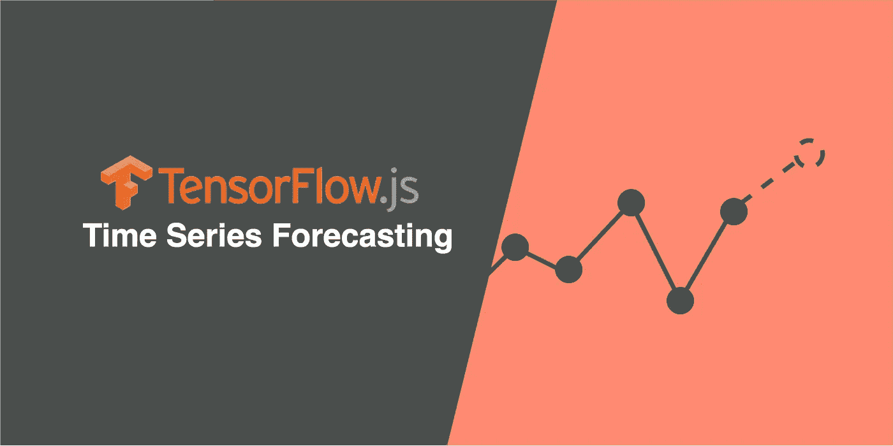
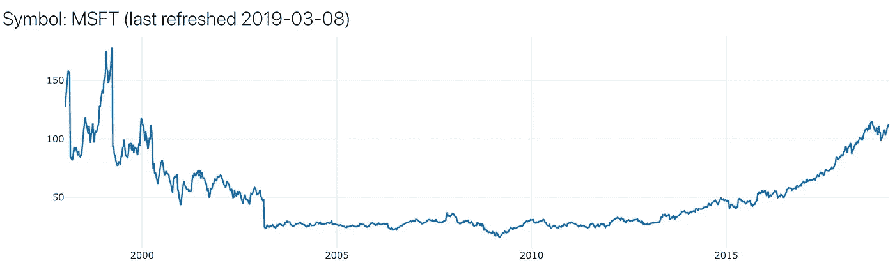
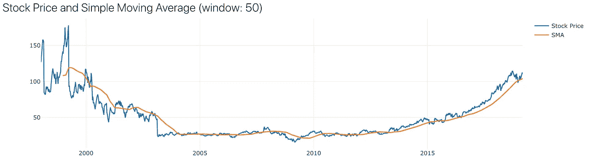
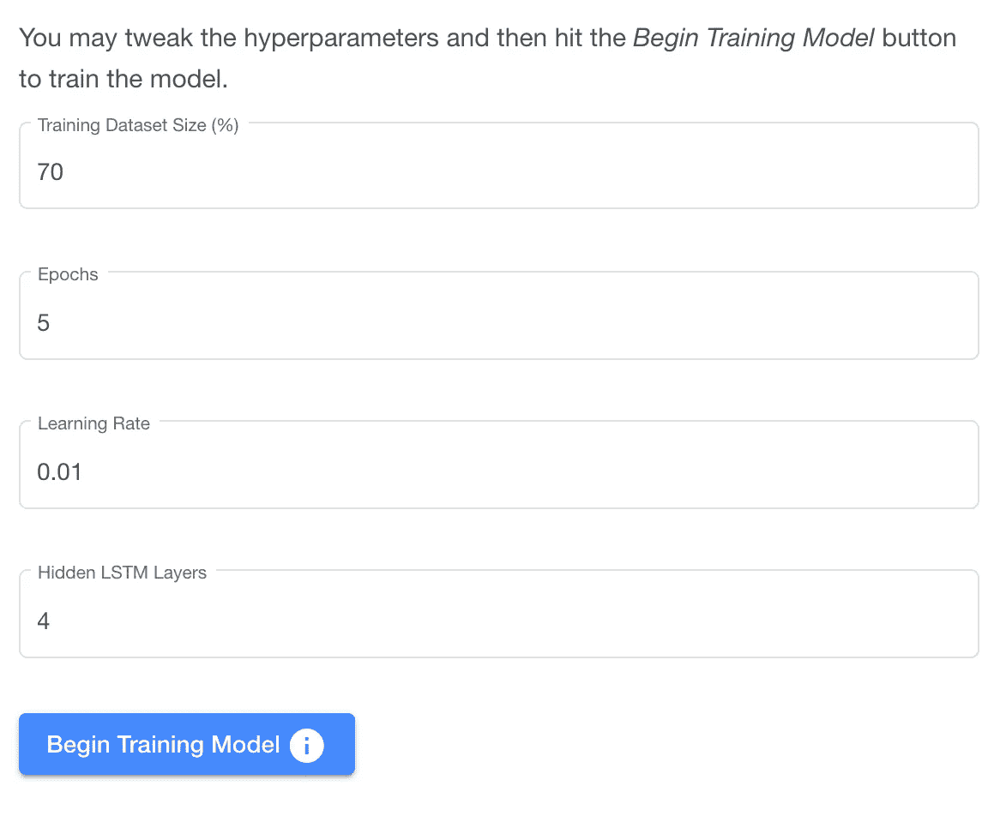
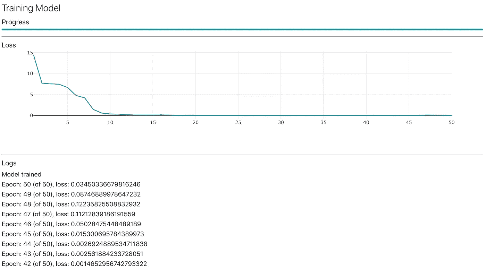
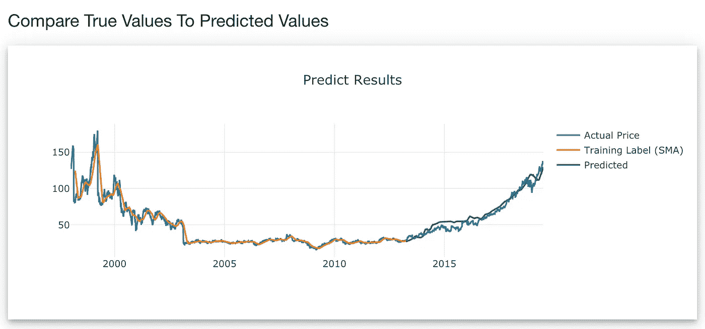
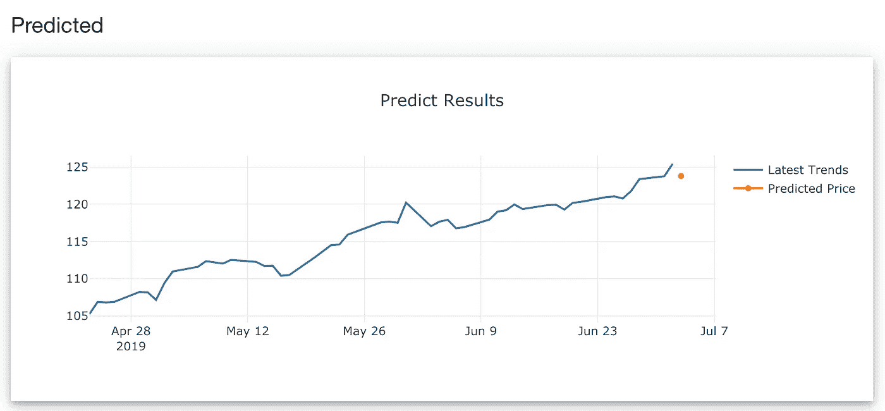

# 使用 TensorFlow.js 进行时间序列预测

> 原文：<https://towardsdatascience.com/time-series-forecasting-with-tensorflow-js-1efd48ff2201?source=collection_archive---------6----------------------->

## 从在线 API 获取股票价格，并使用递归神经网络和长短期记忆(LSTM)以及 **TensorFlow.js** 框架进行预测

如今，机器学习变得越来越受欢迎，世界上越来越多的人将它视为一个神奇的水晶球:预测未来何时会发生什么。该实验使用人工神经网络来揭示股票市场趋势，并展示了时间序列预测根据过去的历史数据预测未来股票价格的能力。

免责声明:由于股票市场波动是动态的和不可预测的，由于多种因素，这个实验是 100%的教育，绝不是一个交易预测工具。

[探索演示](https://jinglescode.github.io/time-series-forecasting-tensorflowjs)。

## 项目演练

本项目演练分为 4 个部分:

1.  从在线 API 获取股票数据
2.  计算给定时间窗口的简单移动平均值
3.  训练 LSTM 神经网络
4.  预测并将预测值与实际值进行比较

## 获取股票数据

在我们可以训练神经网络并做出任何预测之前，我们首先需要数据。我们正在寻找的数据类型是时间序列:按时间顺序排列的数字序列。获取这些数据的好地方是 alphavantage.co 的。这个 API 允许我们检索过去 20 年中特定公司股票价格的时序数据。

该 API 生成以下字段:

*   公开价格
*   那天的最高价
*   当天的最低价
*   收盘价(本项目中使用)
*   卷

为了给我们的神经网络准备训练数据集，我们将使用收盘股票价格。这也意味着我们将致力于预测未来的收盘价。下图显示了微软公司 20 年来的每周收盘价。

20 years of Microsoft Corporation weekly closing prices data from alphavantage.co

## 简单移动平均线

对于这个实验，我们使用[监督学习](https://en.wikipedia.org/wiki/Supervised_learning)，这意味着将数据输入到神经网络，它通过将输入数据映射到输出标签来学习。准备训练数据集的一种方法是从时序数据中提取移动平均值。

[简单移动平均线(SMA)](https://www.investopedia.com/terms/s/sma.asp) 是一种通过查看某个时间段内所有值的平均值来确定该时间段趋势方向的方法。时间窗口中的价格数量是通过实验选择的。

例如，假设过去 5 天的收盘价是 13，15，14，16，17，那么 SMA 就是(13+15+14+16+17)/5 = 15。因此，我们的训练数据集的输入是单个时间窗口内的一组价格，其标签是这些价格的计算移动平均值。

让我们计算微软公司每周收盘价数据的 SMA，窗口大小为 50。

这是我们得到的，蓝色的是每周股票收盘价，橙色的是 SMA。因为 SMA 是 50 周的均线，比周线价格平滑，周线价格可以波动。

Simple Moving Average of Microsoft Corporation closing prices data

## 培训用数据

我们可以用每周股票价格和计算出的 SMA 来准备训练数据。假设窗口大小为 50，这意味着我们将使用每连续 50 周的收盘价作为我们的训练特征(X)，并将这 50 周的 SMA 作为我们的训练标签(Y)。看起来是这样的…

接下来，我们将数据分成两组，训练集和验证集。如果 70%的数据用于训练，那么 30%用于验证。API 返回给我们大约 1000 周的数据，因此 700 周用于训练，300 周用于验证。

## 训练神经网络

既然训练数据已经准备好，是时候为时间序列预测创建一个模型了，为此我们将使用 [TensorFlow.js](https://www.tensorflow.org/js) 框架。TensorFlow.js 是一个用 JavaScript 开发和训练机器学习模型的库，我们可以在 web 浏览器中部署这些机器学习能力。

[选择顺序模型](https://js.tensorflow.org/api/latest/#sequential)，它简单地连接每一层，并在训练过程中将数据从输入传递到输出。为了让模型学习时序数据，创建了[递归神经网络](https://js.tensorflow.org/api/latest/#layers.rnn) (RNN)层，并在 RNN 中增加了多个 [LSTM 细胞](https://js.tensorflow.org/api/latest/#layers.lstmCell)。

该模型将使用[亚当](https://js.tensorflow.org/api/latest/#train.adam) ( [研究论文](https://arxiv.org/abs/1412.6980))进行训练，这是一种流行的机器学习优化算法。[均方根误差](https://js.tensorflow.org/api/latest/#losses.meanSquaredError)将决定预测值和实际值之间的差异，因此模型能够在训练过程中通过最小化误差进行学习。

下面是上面描述的模型的代码片段，[Github 上的完整代码](https://github.com/jinglescode/time-series-forecasting-tensorflowjs)。

这些是可在[前端](https://jinglescode.github.io/time-series-forecasting-tensorflowjs)中调整的[超参数](https://en.wikipedia.org/wiki/Hyperparameter_(machine_learning))(训练过程中使用的参数):

*   训练数据集大小(%):用于训练的数据量，剩余数据将用于验证
*   时期:数据集用于训练模型的次数([了解更多信息](https://machinelearningmastery.com/difference-between-a-batch-and-an-epoch/)
*   学习率:每一步训练中的重量变化量([了解更多](https://machinelearningmastery.com/learning-rate-for-deep-learning-neural-networks/))
*   隐藏 LSTM 层:增加模型的复杂性，以便在更高维度的空间中学习([了解更多](https://machinelearningmastery.com/how-to-configure-the-number-of-layers-and-nodes-in-a-neural-network/))

[Web frontend](https://jinglescode.github.io/time-series-forecasting-tensorflowjs), showing parameters available for tweaking

单击“开始培训模型”按钮…

[User interface](https://jinglescode.github.io/demos/tfjs-timeseries-stocks) showing training model progress

该模型似乎在大约 15 个历元处收敛。

## 确认

既然模型已经定型，就该用它来预测未来值了，对于我们的情况，它是移动平均值。我们将使用 TFJS 中的 *model.predict* 函数。

数据被分成两组，训练组和验证组。训练集已用于训练模型，因此将使用验证集来验证模型。由于模型尚未看到验证数据集，如果模型能够预测接近真实值的值，那就太好了。

因此，让我们使用剩余的数据进行预测，这可以让我们看到我们的预测值与实际值有多接近。

The green line denotes the prediction of the validation data, from [web demo](https://jinglescode.github.io/time-series-forecasting-tensorflowjs)

看起来模型预测的价格(绿线)与实际价格(蓝线)非常接近。这意味着该模型能够预测该模型看不到的最后 30%的数据。

可以应用其他算法，并使用[均方根误差](https://www.statisticshowto.datasciencecentral.com/rmse/)来比较 2 个或更多模型的性能。

## 预言；预测；预告

最后，模型已经过验证，预测值与其真实值非常接近，我们将使用它来预测未来。我们将应用相同的 *model.predict* 函数，并使用最后 50 个数据点作为输入，因为我们的窗口大小是 50。由于我们的训练数据每天都在增加，我们将使用过去 50 天作为输入，来预测第 51 天。

Predict the 51st day

## 为什么我的模特不表演了？

**该模型过去从未出现过类似的数据**。2020 年 3 月，市场下跌，并在一两个月内恢复，这在历史上从未发生过。该模型很可能无法预测这些时期股票价格的剧烈变化。

**我们可以添加更多的功能**。一般来说，更多的功能往往会使模型性能更好。我们可以包括交易指标，如移动平均线收敛背离(MACD)，相对强弱指数(RSI)，或布林线。

**增加更多功能**。Alpha Vantage API 提供的另一个惊人的 API 是基础数据。这意味着您还可以包括感兴趣的公司的年度和季度损益表和现金流。谁知道呢，这些功能可能会有用。

模型无法学习和预测的原因可能还有很多。这是机器学习的挑战；建立好的表演模型是一门艺术也是一门科学。

## 结论

除了使用简单的移动平均线，还有许多方法可以进行时间序列预测。未来可能的工作是利用来自各种来源的更多数据来实现这一点。

有了 TensorFlow.js，在网络浏览器上进行机器学习就成为可能，而且这实际上非常酷。

[探索 Github 上的演示](https://jinglescode.github.io/time-series-forecasting-tensorflowjs)，这个实验是 100%教育性的，绝不是交易预测工具。

[在 Github 上查看源代码](https://github.com/jinglescode/time-series-forecasting-tensorflowjs)

 [## 数据科学家:21 世纪最肮脏的工作

### 40%的吸尘器，40%的看门人，20%的算命师。

towardsdatascience.com](/data-scientist-the-dirtiest-job-of-the-21st-century-7f0c8215e845) 