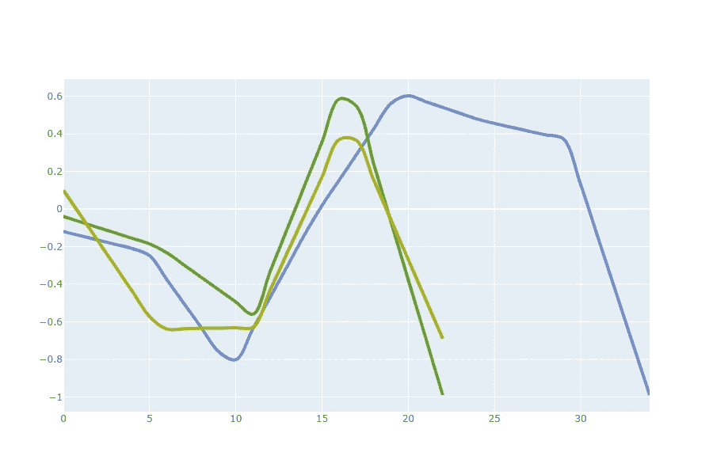
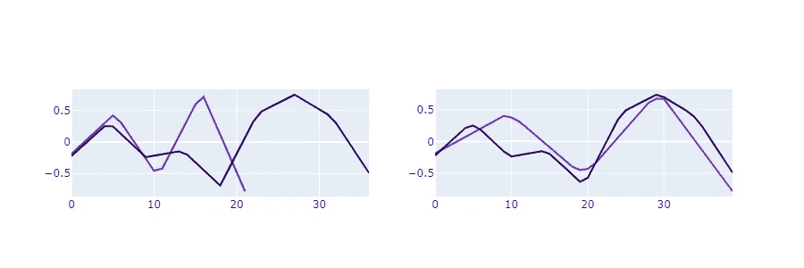
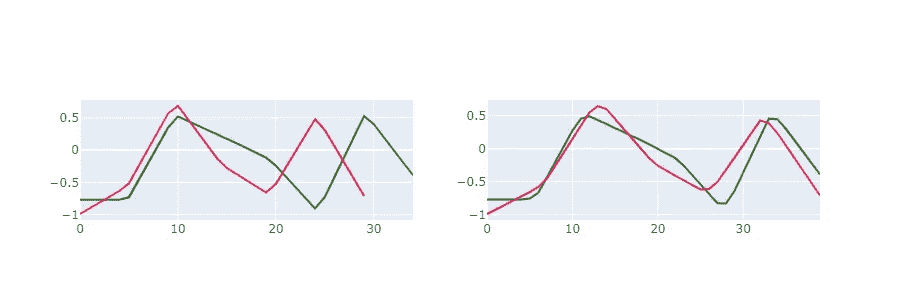
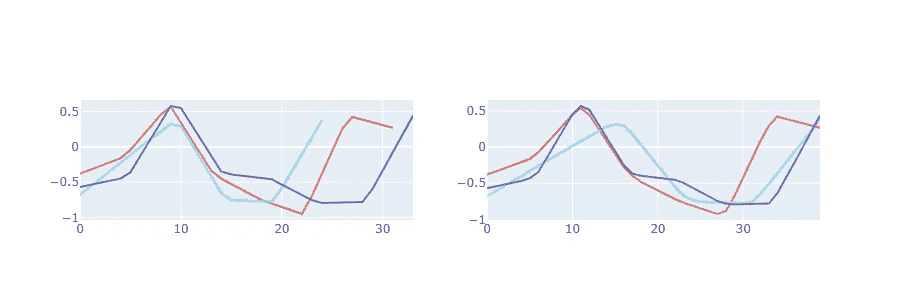
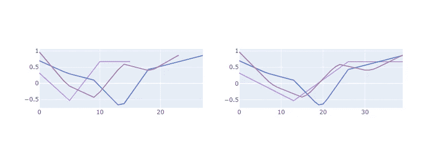
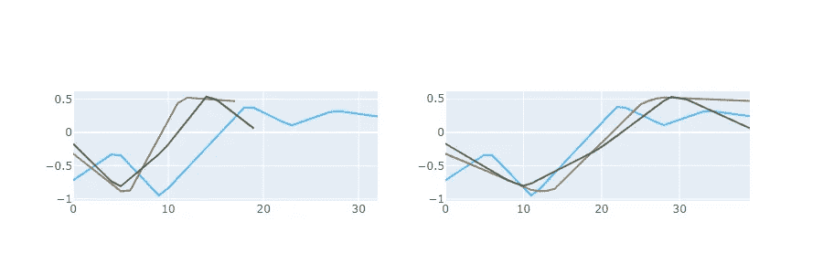

# Python 中使用动态时间弯曲的时间序列层次聚类

> 原文：<https://towardsdatascience.com/time-series-hierarchical-clustering-using-dynamic-time-warping-in-python-c8c9edf2fda5?source=collection_archive---------5----------------------->

**让我们考虑下面的任务**:我们有一堆均匀分布的不同长度的时间序列。目标是通过定义数据中呈现的一般模式来对时间序列进行聚类。

在这里，我想介绍一种解决这个问题的方法。我们将使用层次聚类和 DTW 算法作为时间序列的比较度量。该解决方案在人力资源数据(员工历史得分)上运行良好。对于其他类型的时间序列，DTW 函数可能比其他指标更差，如 CID(复杂性不变距离)，MAE 或相关性。

我将跳过对层次聚类和 DTW 算法的理论解释，而专注于我为什么选择这样的组合:

1.  层次聚类简单、灵活、可调(链接标准),并允许我们不聚类所有轨迹
2.  DTW 方法让我们可以比较不同长度的时间序列，根据我的经验，它非常适用于不频繁的时间序列

好了，我们开始吧！我们的进口:

```
import random
from copy import deepcopy
from scipy import interpolate
import numpy as np
from dtaidistance import dtwimport matplotlib.pyplot as pltfrom _plotly_future_ import v4_subplots
import plotly.graph_objects as go
from plotly.subplots import make_subplots
```

时间序列生成的一些参数和我们的阈值:

*   *轨迹数量*我们必须聚类的轨迹数量
*   *最小轨迹长度*和*最大轨迹长度*任何轨迹的长度下限和上限
*   *门槛*我们 DTW 的门槛

```
NUM_OF_TRAJECTORIES = 200
MIN_LEN_OF_TRAJECTORY = 16
MAX_LEN_OF_TRAJECTORY = 40THRESHOLD = 0.50
```

为简单起见，我们所有的轨迹将位于-1 和 1 之间。此外，我添加了一些平滑。

```
for item in range(NUM_OF_TRAJECTORIES):
   length = random.choice(list(range(MIN_LEN_OF_TRAJECTORY, MAX_LEN_OF_TRAJECTORY + 1)))
   tempTrajectory = np.random.randint(low=-100, high=100, size=int(length / 4)).astype(float) / 100

   oldScale = np.arange(0, int(length / 4))
   interpolationFunction = interpolate.interp1d(oldScale, tempTrajectory)

   newScale = np.linspace(0, int(length / 4) - 1, length)
   tempTrajectory = interpolationFunction(newScale)

   trajectoriesSet[(str(item),)] = [tempTrajectory]
```

注意，所有轨迹都存储为列表类型的字典值(为了方便，我们将开始把它们组合成组)。出于同样的原因，轨迹的名称存储为元组。

我们的算法如下:

1.  我们找到一对最接近的实体(轨迹-轨迹或轨迹-簇或簇-轨迹或簇-簇)
2.  如果它们的距离低于*阈值*，则将它们分组到单个簇中
3.  重复步骤 1
4.  如果我们在步骤 2 失败或者我们得到一个大的集群，我们就停止我们的算法(所以我们所有的轨迹都进入其中——这意味着我们的*阈值*非常大)

算法的第一部分:

```
trajectories = deepcopy(trajectoriesSet)
distanceMatrixDictionary = {}iteration = 1
while True:
   distanceMatrix = np.empty((len(trajectories), len(trajectories),))
   distanceMatrix[:] = np.nan

   for index1, (filter1, trajectory1) in enumerate(trajectories.items()):
      tempArray = []

      for index2, (filter2, trajectory2) in enumerate(trajectories.items()):

         if index1 > index2:
            continue

         elif index1 == index2:
            continue

         else:
            unionFilter = filter1 + filter2
            sorted(unionFilter)

            if unionFilter in distanceMatrixDictionary.keys():
               distanceMatrix[index1][index2] = distanceMatrixDictionary.get(unionFilter)

               continue

            metric = []
            for subItem1 in trajectory1:

               for subItem2 in trajectory2:
                  metric.append(dtw.distance(subItem1, subItem2, psi=1))

            metric = max(metric)

            distanceMatrix[index1][index2] = metric
            distanceMatrixDictionary[unionFilter] = metric
```

字典*距离矩阵字典*帮助我们保持已经计算好的距离。

Numpy 数组 *distanceMatrix* 在每一步开始时用 *np.nan* 填充。只需要保持索引对和计算的距离之间的表示。向 *distanceMatrixDictionary 添加相同功能后，可能会被删除。*

这部分代码允许我们比较所有可能的选项——轨迹-轨迹或轨迹-簇或簇-轨迹或簇-簇:

```
metric = []
for subItem1 in trajectory1:

   for subItem2 in trajectory2:
      metric.append(dtw.distance(subItem1, subItem2))metric = max(metric)
```

上面最后一行— *metric = max(metric)* —是称为“完全关联”的关联标准。它对我来说更好，但你可以尝试其他标准，甚至定制它。

好了，距离已经计算好了，让我们继续分组。

我们找到最低的距离和一对提供这个距离的指数。

这里为了简单起见，我们将只使用一对(第一对)。甚至，如果我们对于相同的距离有两个、三个或更多对，其余的将在下一次迭代中逐步处理。

```
minValue = np.min(list(distanceMatrixDictionary.values()))if minValue > THRESHOLD:
   breakminIndices = np.where(distanceMatrix == minValue)
minIndices = list(zip(minIndices[0], minIndices[1]))minIndex = minIndices[0]
```

获得一对索引后，我们只需定义实体名称和值，组合它们，将组合放入字典中，并从字典中删除这些单个实体:

```
filter1 = list(trajectories.keys())[minIndex[0]]
filter2 = list(trajectories.keys())[minIndex[1]]trajectory1 = trajectories.get(filter1)
trajectory2 = trajectories.get(filter2)unionFilter = filter1 + filter2
sorted(unionFilter)trajectoryGroup = trajectory1 + trajectory2trajectories = {key: value for key, value in trajectories.items()
                if all(value not in unionFilter for value in key)}distanceMatrixDictionary = {key: value for key, value in distanceMatrixDictionary.items()
                            if all(value not in unionFilter for value in key)}trajectories[unionFilter] = trajectoryGroup
```

之后，我们重复上一步，直到我们没有任何集群。

我已经描述了一般的方法，但是这个算法可以被简化、增强和修改以避免任何重新计算。

结果，我们得到这样的分组:



在这个集群中，我们看到 3 个不同长度的时间序列。它们都有相同的一般模式:前三分之一是局部最小值，后半部分是全局峰值，最后是全局最小值。

更多结果(此处，对于每个聚类，左边的子图表示原始轨迹长度，右边的子图——重新缩放到 *MAX_LEN_OF_TRAJECTORY* 用于比较):



Cluster #1–2 items



Cluster #2–2 items



Cluster #3–3 items



Cluster #4–3 items



Cluster #5–3 items

根据*阈值*的值，我们可以使我们的集群更大(更一般化)或更小(更详细)。

如果当前方法在另一个数据集上表现不佳，我们可以改进什么？

1.  我们可以尝试用另一种距离度量来代替 DWT
2.  我们可以尝试对时间序列进行额外的处理:缩放/重新缩放、平滑或去除异常值
3.  我们可以尝试使用不同的阈值
4.  我们可以尝试改变联系标准

找到最佳超参数后，可以重构代码并加快计算速度。

这里有可以使用的代码:
[https://github . com/avchauzov/_ articles/blob/master/1.1 . trajectoriesclustering . ipynb](https://github.com/avchauzov/_articles/blob/master/1.1.trajectoriesClustering.ipynb)