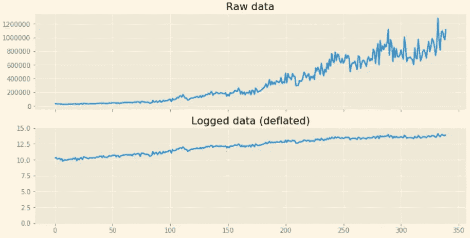
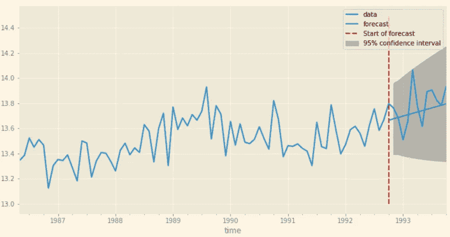

# Python 中的时间序列—指数平滑和 ARIMA 过程

> 原文：<https://towardsdatascience.com/time-series-in-python-exponential-smoothing-and-arima-processes-2c67f2a52788?source=collection_archive---------0----------------------->

*TL；DR:在这篇文章中，你将学习执行时间序列分析的基本步骤，以及趋势、平稳性、移动平均线等概念。您还将探索指数平滑方法，并学习如何在非平稳数据上拟合 ARIMA 模型。*

# 时间序列随处可见

*场景 1:你负责一家披萨配送中心，你想知道你的销售是否遵循特定的模式，因为你觉得每周六晚上你的订单数量都会增加……*

*场景 2:你的公司正在销售一种产品，而你负责预测，或者说预测，在未来某个特定时刻，这种产品所需的供应……*

*情况 3:您正在监控一个数据中心，并且想要检测任何异常情况，比如可能导致服务器停机的异常 CPU 使用情况。您跟踪 CPU 使用率的曲线，并想知道何时出现异常…*

在每一种情况下，你都在处理时间序列。分析序列是一项迷人的工作，因为尽管有所有的数学模型(包括神经网络)，我们人类仍然无法预测未来，并且必须处理不确定性。让我们仔细看看什么是时间序列，可以用哪些方法来分析它们。在本文中，我们将广泛依赖于用 Python 编写的[***【stats models】***](https://www.statsmodels.org/stable/index.html)*库。*

> *时间序列是按时间排序(或索引)的数据序列。它是离散的，每个点之间的间隔是常数。*

# *系列的性质和类型*

****趋势*** :数据的长期增减。这可以被看作是粗略穿过数据的斜率(不必是线性的)。*

****季节性*** :当一个时间序列受到季节性因素(一天中的某个小时、一周、一月、一年等)的影响时，称之为季节性的。).季节性可以通过固定频率的良好循环模式来观察。*

****周期性*** :当数据呈现非固定频率的上升和下降时，出现一个周期。这些波动通常是由经济条件造成的，而且往往与“商业周期”有关。这些波动的持续时间通常至少为两年。*

****残差*** :每个时间序列可以分解成两部分:
-一个预测，由一个或几个*预测值*
-残差。它们是每个时间步的观测值和预测值之间的差值。记住这一点*

> ***t 时刻序列值= t 时刻预测值+t 时刻残差***

****

***Left**: Series with a **trend**. **Right**: Series exhibiting **seasonal** behavior*

****

***Left**: **Cyclical** series. **Right**: **Random walk***

# *时间序列的分解*

*每个时间序列都可以看作是几个部分的混合:*

*   *趋势(曲线长期向上或向下移动)*
*   *季节性成分*
*   *残差*

*下面是我们的时间序列分解成上述部分后的样子:*

**

*我们的时间序列显示出明显的上升趋势。它不是季节性的，你可以看到季节性的部分看起来很难看。残差的方差似乎随着时间的推移而增加，表明序列在结束时表现出更多的随机行为。*

# *黄金法则:平稳*

*在我们进一步分析之前，我们的系列必须使 ***静止。
平稳性*** 是展现恒定统计性质(均值、方差、自相关等)的性质。).如果时间序列的平均值随着时间的推移而增加，那么它就不是稳定的。*

## *用于静态化数据的转换:*

*   ****去趋势*** :我们去除序列中的*潜在趋势*。这可以通过多种方式实现，具体取决于数据的性质:
    - *指数化*数据:以货币计量的数据与价格指数挂钩或与通货膨胀相关。因此，将序列除以该指数(即**缩减**)是去除数据趋势的解决方案。
    - *非指数型*数据:是否需要估计趋势是常数、线性还是指数型。前两种情况很容易，对于最后一种情况，有必要估计增长率(通货膨胀或通货紧缩),并应用与指数化数据相同的方法。*
*   ****差分*** :可以通过减去周期值来去除季节性或周期性模式。如果数据是 12 个月的季节性数据，用 12 个滞后的差值序列减去该序列将得到一个“更平”的序列*
*   ****日志*** :在趋势中的复合率不是由于某个价格指数(即序列不是以货币计量的)的情况下，日志可以帮助*线性化*一个具有指数趋势的序列(回想一下 log(exp(x)) = x)。与通缩不同，它并没有消除任何最终趋势。*

# *检查平稳性*

## *绘制滚动统计数据*

*绘制滚动平均值和方差是直观检查我们系列的第一个好方法。如果滚动统计显示出明显的趋势(向上或向下)并显示出变化的方差(增加或减少幅度)，那么您可能会得出结论，该序列很可能不是平稳的。*

**

## *扩充迪基-富勒试验*

*该检验用于评估时间序列是否是平稳的。不必深入假设检验的太多细节，你应该知道这个检验将给出一个叫做“检验统计”的结果，根据这个结果，你可以用不同的置信水平(或百分比)来判断时间序列是否平稳。*

**

## *KPSS*

*KPSS(科维亚特科夫斯基-菲利普斯-施密特-申)检验测试的是序列是趋势平稳的零假设。换句话说，如果检验统计量的 p 值低于 X%置信度阈值，这意味着我们可以拒绝这个假设，并且序列不是具有 X%置信度的趋势平稳序列。高于阈值的 p 值将使我们接受这一假设，并得出序列是趋势平稳的结论。*

## *自相关图(ACF 和 PACF)*

**自相关* (ACF)图表示具有自身滞后的序列的自相关。
*偏自相关* (PACF)图表示一个序列和其自身滞后之间的相关量，该相关量不能用所有更低阶 *-* 滞后的相关来解释。理想情况下，我们不希望序列与其自身的滞后之间存在相关性。从图形上来说，我们希望所有的尖峰都落在蓝色区域。*

**

*正如我们所见，蓝色区域上方有几个尖峰，这意味着在滞后 1、2、3 和 4 处存在相关性。*

# *选择模型*

*指数平滑法适用于非平稳数据(即具有趋势的数据和季节性数据)。*

*ARIMA 模型应该只用于静态数据。因此，应该去除数据的趋势(通过缩减或记录)，然后查看有差异的序列。*

# *平滑方法*

*平滑方法作为加权平均值工作。预测是过去观察的加权平均值。权重可以是统一的(这是一个移动平均值)，或者遵循指数衰减-这意味着给予最近的观察更多的权重，给予旧的观察更少的权重。更高级的方法包括预测中的其他部分，如季节性成分和趋势成分。*

*我们将使用数学方程的分量形式。 *y* 表示我们的时间序列， *p* 表示我们的预测， *l* 表示水平， *s* 表示季节性成分， *b* 表示趋势成分*

## *简单指数平滑*

**>什么时候使用？*
数据点少，数据无规律，无季节性或趋势性。*

**>数学背后* 只要记住 SES 只有一个组件叫做 *level* (下面用“alpha”表示平滑参数)*。*是前一级和当前观测值的加权平均值:*

**

## ***霍尔特线性平滑***

**>什么时候使用？* 数据中的趋势，无季节性。*

**数学背后* 预测由一个*水平*分量和一个*趋势*分量组成。：*

****

## *霍尔特阻尼趋势*

*霍尔特的线性趋势法的问题是，趋势在未来是恒定的，无限增加或减少。对于长期预测来说，这可能是个问题。因此，阻尼趋势法是一种添加阻尼参数的方法，以便趋势在未来收敛到恒定值(它使趋势变平)。参数𝑏由𝜙𝑏代替*

**>什么时候使用？*
数据有趋势。使用乘法版本，除非之前已经记录了数据。在这种情况下，使用附加版本*

**

*Notice how the green curve flattens at the end of the forecast*

## *霍尔特-温特季节平滑法*

*这将在下一篇文章的[中讨论。但你要知道，这种方法就像霍尔特的线性平滑，除了我们增加了一个季节的成分！](https://medium.com/@benjamin_47408/time-series-in-python-part-2-dealing-with-seasonal-data-397a65b74051)*

# *ARIMA*

*ARIMA 模型(包括 ARMA、AR 和 MA 模型)是预测**平稳**时间序列的一类通用模型。ARIMA 模型由三部分组成:*

*   *序列(*(***AR***)部分)的滞后 ***值*** 的加权和**
*   **序列(*(***)MA***)的滞后 ***预测误差*** 的加权和***
*   **一个 ***差*** 的时间序列(*(***I***)部分)***

**一个 ARIMA 模型通常被标注为**【p，d，q】**其中 ***p*** 表示 ***AR*** 部分、 ***d*** 差分的顺序(**I**部分)，而 q 表示 ***MA*** 项的顺序。**

## **1)选择差分阶数**

**拟合 ARIMA 模型的第一步是确定差分阶数以平稳化序列。为此，我们来看看 ACF 和 PACF 图，并记住这两条规则:**

> **”—规则 1:如果序列对大量滞后具有正自相关，那么它可能需要更高阶的差分。
> —规则 2:如果 lag-1 自相关为零或负值，或者自相关都很小且无模式，则序列不需要高阶差分。如果滞后-1 自相关为-0.5 或更负，则该系列可能有过度差异。 **(**[罗伯特·诺](http://www.fuqua.duke.edu/faculty_research/faculty_directory/nau/)，统计预测)**

**我们从记录数据开始，因为原始数据呈现指数趋势:**

****

**记录的序列似乎更平坦，但它是平稳的吗？让我们计算一个 KPSS 测试来检验这一点:**

****

**检验统计量高于临界值，我们拒绝零假设，我们的序列是*而不是*趋势平稳的。然而，为了使这篇文章简短，我们将继续好像它是。**

**(—为了得到一个趋势稳定的序列，我们可以考虑线性回归我们的对数序列，并用回归系数除我们的序列...— )**

**现在让我们来看看记录的一阶差分数据的 ACF 图:**

****

**“ACF —记录的数据”图表显示了非平稳数据，其特征是峰值缓慢线性衰减(参见上述规则 1)。添加一阶差会在滞后值 1 处产生单个负尖峰。根据规则 2，我们不需要进一步区分这个系列。让我们通过比较(0，0，0)和(0，1，0) ARIMA 模型来检查我们的结果:**

********

**ARIMA(0，1，0)的阿凯克信息标准(AIC)较低，这意味着该模型的表现优于 ARIMA(0，0，0)。让我们看看残差并检查它们的方差:**

****

**Which residuals do you think look better ?**

## **2)选择移动授权订单**

**现在我们知道我们必须在模型中包含一阶差分，我们需要选择移动平均阶。这是通过查看差分序列来完成的(因为我们刚刚看到一阶差分序列是平稳的)。同样，我们看看我们的 ACF 和 PACF 图，记住这条规则:**

> **“如果差分序列 **ACF** 的滞后-1 自相关为负，和/或存在锐截止，则选择顺序为 1 的 **MA** ”。**

**问:为什么选择 1 阶而不是更高阶的移动授权？因为我们会一步一步来。如果我们在更高的滞后下观察自相关，并且通过查看我们的(1，1，0)模型的自相关残差，我们仍然观察到这些尖峰，我们可以增加我们的 MA 阶数，尽管通常不建议超过 2！**

************

**注意 AIC 是如何再次下降的，残差方差是如何减小的。这表明我们的(1，1，0) ARIMA 比(0，1，0)模型表现得更好！**

## **3)选择应收账款订单**

**现在你可能会想:我们有必要添加一个 AR 术语吗？答案是否定的。事实上，在以下情况下，您应该添加一个 AR 术语:**

> **如果差分序列 **PACF** 的滞后-1 自相关为负，和/或有一个锐截止，那么选择一个为 1 的 **AR** 阶。**

**在我们的例子中，我们在 ACF 和 PACF 中都观察到负的滞后-1 自相关。请注意，差分序列的 PACF 在滞后 1 和滞后 2 处显示了两个负峰值，这意味着理论上我们可以将 AR 阶数提高到 2。**

****

**这是我们通过拟合(1，1，1) ARIMA 得到的结果:**

********

**添加 AR 项降低了 AIC，方差从 0.155 降到了 0.145，我们做得很好！我们应该增加一个 AR 项并选择一个(2，1，1) ARIMA 吗？让我们来看看 ARIMA(1，1，1)残差的 ACF & PACF:**

****

**图中没有显著的自相关滞后值，我们的模型似乎不需要任何额外的 AR 项。你可能会指出第 12 阶段的峰值:这可能是季节性的迹象。我们将在[的下一部分](https://medium.com/@benjamin_47408/time-series-in-python-part-2-dealing-with-seasonal-data-397a65b74051)中与萨里玛和萨里马克斯一起探讨这个问题。**

# **绘制预测**

**幸运的是，statsmodels 有一个很好的 API，允许我们从 ARIMA 过程中绘制预测。我强烈建议您将数据放在带有 DateTimeIndex 的 DataFrame 中，因为 *plot_predict()* 方法确实喜欢日期…
在这种情况下，我们将选择 12 个预测步骤，并将 dynamic 关键字设置为 True:这将强制算法使用其自己的预测值作为未来预测的滞后值:**

****

**让我们看看更大的预测窗口(34 个预测步骤):**

****

**那都是乡亲们！在下一部分的[中，我将讨论季节性 Holt-Winter 和季节性 ARIMA。希望你喜欢:)](https://medium.com/@benjamin_47408/time-series-in-python-part-2-dealing-with-seasonal-data-397a65b74051)**

****附加讲座**:**

**如果你对时间序列预测和分析感兴趣，我强烈推荐下面两个:**

*   **[*预测、原理与实践*](https://otexts.com/fpp2/)*(Hyndman&Athanasopoulos)***
*   ****【罗伯特·诺】****

*****你也可以查:*****

*   **[***本条***](https://medium.com/@benjamin_47408/neural-turing-machines-an-artificial-working-memory-cd913420508b) ***关于神经图灵机*****
*   **[***本文***](https://medium.com/@benjamin_47408/attention-seq2seq-with-pytorch-learning-to-invert-a-sequence-34faf4133e53) ***关于基于注意力的神经网络*****

*****如果你想知道 2019 年哪支球队真的是最好的 NBA 球队，请查看*** [***这篇文章***](/bayesian-basketball-were-the-toronto-raptors-really-the-best-team-during-nba-2019-season-e524a26b43a1) ***！*****