# Python 中的时间序列—第 2 部分:处理季节性数据

> 原文：<https://towardsdatascience.com/time-series-in-python-part-2-dealing-with-seasonal-data-397a65b74051?source=collection_archive---------4----------------------->

*在* [*第一部分*](/time-series-in-python-exponential-smoothing-and-arima-processes-2c67f2a52788) *中，你学习了趋势和季节性、平滑模型和 ARIMA 过程。在这一部分中，您将学习如何处理季节性模型，以及如何实现季节性 Holt-Winters 和季节性 ARIMA (SARIMA)。*

# 获取数据

我们将使用“每月牛奶产量”数据:

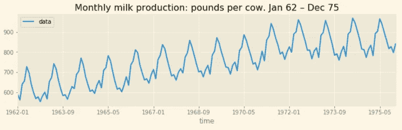

## 季节分解

在[上一篇](/time-series-in-python-exponential-smoothing-and-arima-processes-2c67f2a52788)中，我简单讲过季节分解。季节性分解的思想是，任何序列都可以分解为三个部分的总和(或乘积):趋势、季节性成分和残差。

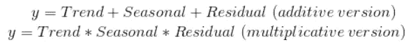

在我们的例子中，我们将使用 statsmodels 提供的*季节性分解*函数:

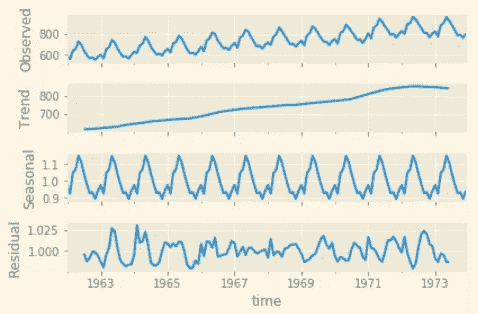

趋势分量是一条增长曲线，似乎达到了一个平稳状态，并最终在终点下降。这是一个有用的信息，当我们将消除趋势，以稳定的数据。

# 将数据固定化

## 应对趋势

基于我们的分解，我们看到趋势是跟随一个向上的运动，然后在最后达到稳定状态(或者下降)。为了消除这种趋势，我们将尝试一种新颖的方法，即回归 STL 分解给出的趋势。然后，如果回归令人满意，我们将尝试通过从原始序列中减去获得的回归来“缩小”序列。

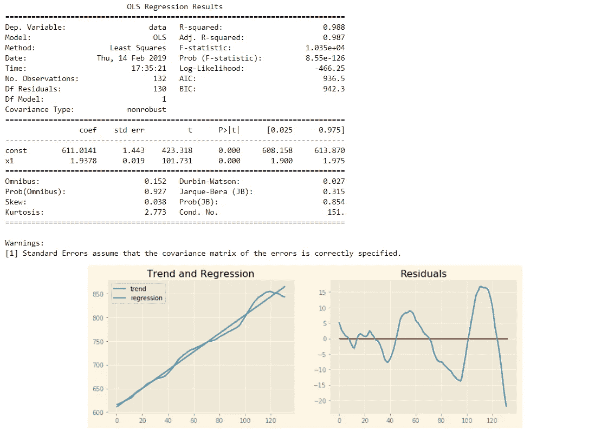

我们回归的 r 平方系数相当好(0.988)，但是查看残差，我们注意到它们的方差从左到右增加。这是异方差的标志。您可以自己查找确切的定义，只要记住这并不好，我们的模型中缺少了一些东西。我们将放弃回归趋势的想法，因为它现在需要太多的努力。

## 应对趋势，第 2 页

我们的系列仍然需要站化，我们将回到基本方法，看看我们是否可以消除这种趋势。我们将分几个步骤操作:

*   对原始数据进行 ADF 测试以检查平稳性
*   12 个月差异的 ADF 测试
*   对记录数据的 12 个月差异进行 ADF 检验
*   对减去 12 个月移动平均值的数据进行 ADF 测试

*如果您需要代码，请参考第一部分，了解如何进行 ADF 测试*

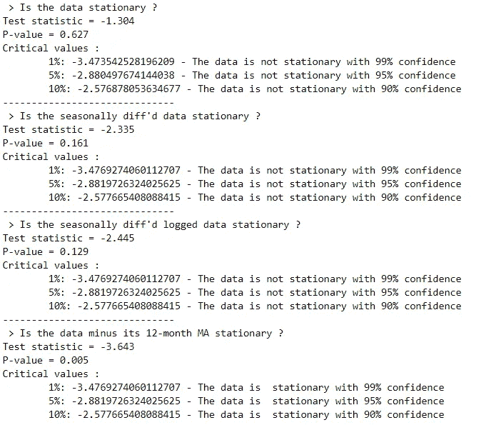

让我们用 KPSS 检验来确认数据减去 12 个月的均线是平稳的:

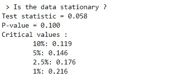

测试统计低于阈值，因此**我们的序列是平稳的**(回想一下，对于 KPSS 测试，零假设是序列是平稳的)。

# 霍尔特-温特季节平滑模型的拟合

记得从[第一部分](/time-series-in-python-exponential-smoothing-and-arima-processes-2c67f2a52788)得知，霍尔特-温特的模型有几个部分:一个 ***水平*** ，一个 ***趋势*** ，在季节性平滑的情况下，一个 ***季节性*** 成分。这背后的数学有点难，所以我不会把它放在这里，只要记住上面的三个组成部分。以下是我们拟合模型后得到的结果:

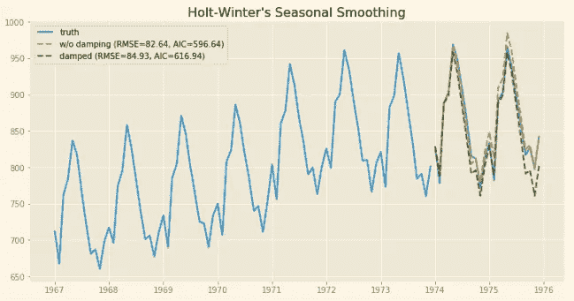

没有阻尼的模型似乎表现更好，因为 AIC 更低。

# 季节性 ARIMA

老 ARIMA 又回来了，但这一次我们将为它添加季节性元素！SARIMA 模型由两部分组成:非季节性部分和季节性部分。如果你还记得[上一部分](/time-series-in-python-exponential-smoothing-and-arima-processes-2c67f2a52788)，非季节性部分由 AR(p)项、MA(q)项、I(d)项组成，我们写 ARIMA (p，d，q)。季节性的部分也是一样的！
我们的舍利玛是指 ARIMA (p，D，q)x(P，D，Q)。

***问题:我们如何确定所有这些 P，D，Q，P，D，Q？***

> 每当你听到“ARIMA”，就想到“ACF/PACF”。

有了 ACF 和 PACF 图，我们将能够猜测我们的参数的合理值。让我们绘制我们的静态化数据的 ACF 和 PACF 图:

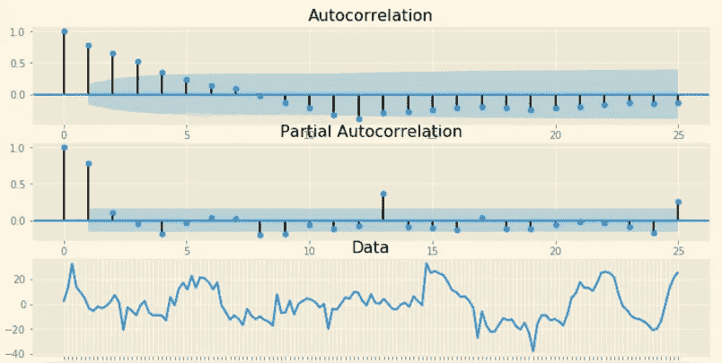

鉴于在 ACF 中观察到的尖峰信号的缓慢衰减，数据显然不是稳定的。这是一个信号，表明我们应该对 *x:* 取一个额外的差值

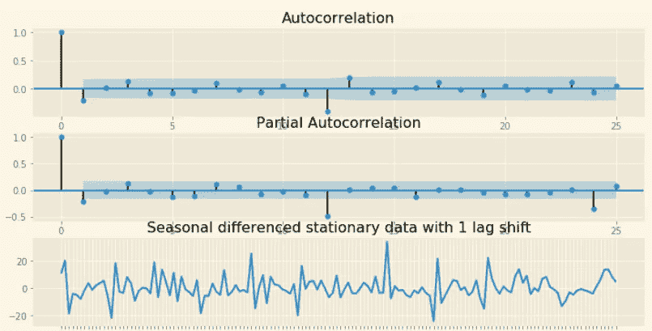

我们的系列现在是静止的。总而言之，我们有:

*   取平稳序列的 12 个滞后差。这相当于“一个季节滞后”的差异。
*   取 12 滞后差分序列的 1 滞后差分。这对应于 1 的非季节性差序。

这给了我们一个萨里玛(？, 1, ?)x(？, 1, ?).

***AR 和 MA 术语呢？***

嗯，我们知道在 ACF 和 PACF 中仍然有显著的峰值，所以我们可以决定添加 AR 术语和 MA 术语。我们应该从哪一个开始？这一次，我们将使用网格搜索 AR 和 MA 术语的可能组合(最大顺序限制为 2)…

当运行不同的配置时，使用 SARIMA(0，1，2)x(0，1，2)可以获得最低的 AIC。

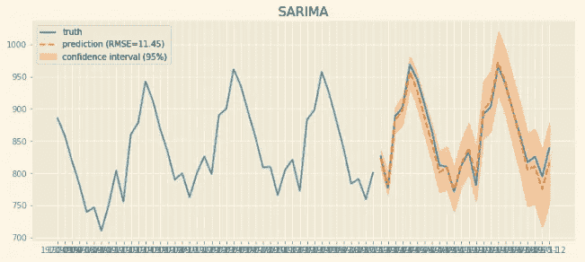

使用*plot _ diagnotis()*命令，我们可以显示残差并检查它们的正态性(记住，残差应该是正态分布的(零均值和一元方差)并且不相关)。

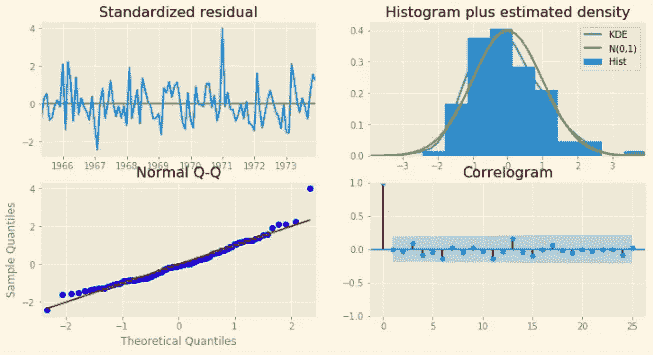

请注意正态 Q-Q 图和直方图如何显示我们的残差遵循正态分布(我们可以使用额外的测试来测试正态性，如 Ljung-Box)。相关图还显示残差是不相关的！

**附加讲座**:

如果你对时间序列预测和分析感兴趣，我强烈推荐下面两个:

*   [*预测、原理与实践*](https://otexts.com/fpp2/) *(海德曼& Athanasopoulos)*
*   **(罗伯特·诺)**

****你还可以查看*** [***这篇文章***](https://medium.com/@benjamin_47408/neural-turing-machines-an-artificial-working-memory-cd913420508b) ***关于神经图灵机和*** [***这篇文章***](https://medium.com/@benjamin_47408/attention-seq2seq-with-pytorch-learning-to-invert-a-sequence-34faf4133e53) ***关于基于注意力的神经网络！****