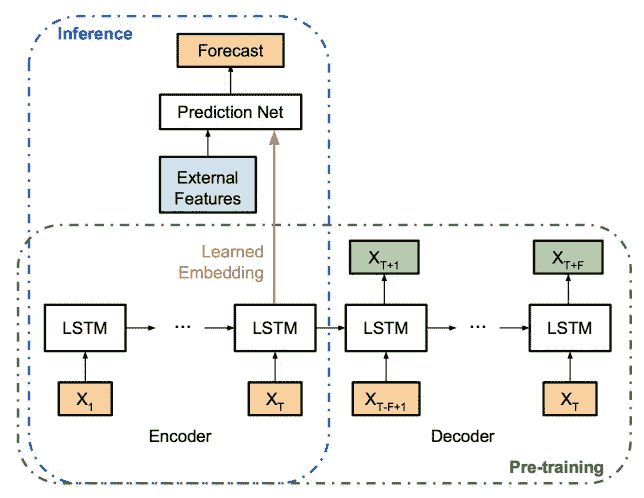
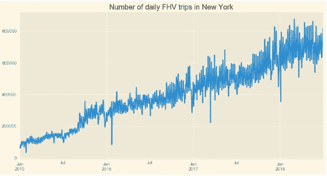
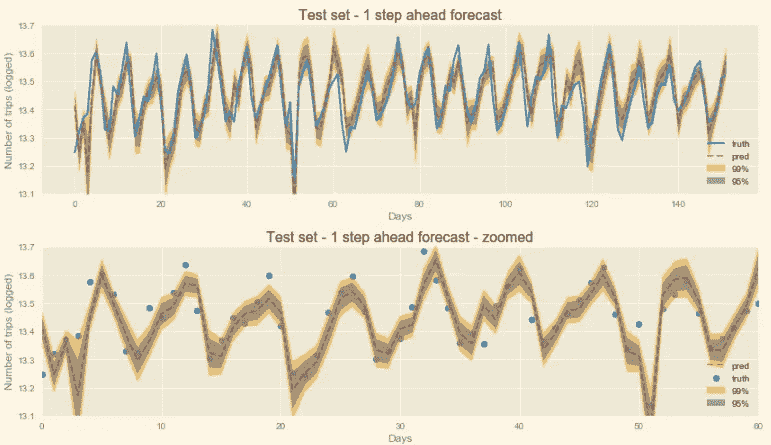

# Python 中的时间序列第 3 部分:用 LSTMs 预测出租车出行

> 原文：<https://towardsdatascience.com/time-series-in-python-part-3-forecasting-taxi-trips-with-lstms-277afd4f811?source=collection_archive---------2----------------------->

*在本文中，我们将使用 LSTMs 预测纽约的 FHV 数量(如优步出租汽车)。我们将学习如何使用蒙特卡洛法将置信区间添加到我们的预测中。*


Photo by [Lexi Anderson](https://unsplash.com/@lexianderson?utm_source=medium&utm_medium=referral) on [Unsplash](https://unsplash.com?utm_source=medium&utm_medium=referral)

# 介绍

LSTM(Long Short Memory)是一种 a 型递归神经网络(RNN)架构，由 [Sepp Hochreiter](https://en.wikipedia.org/wiki/Sepp_Hochreiter) 和 [Jürgen Schmidhuber](https://en.wikipedia.org/wiki/J%C3%BCrgen_Schmidhuber) 于 1997 年提出。rnn 是专门设计用于通过递归机制处理顺序数据的深度神经网络。它们以一种自回归的方式表现，因为它们通过内部状态来跟踪过去(因此是“记忆”部分)。它们被广泛用于语音识别、机器翻译、语音合成等。但是当用于时间序列时，LSTMs 值多少呢？假设可用数据的规模足够大，它们可以被证明对非线性关系的建模非常有用..

# 优步用例:贝叶斯预测

在找用 LSTMs 实现时间序列预测的论文时，找到了优步 2017 年写的一篇论文，[*优步*](https://arxiv.org/pdf/1709.01907.pdf)对时间序列的深度自信预测。这篇论文背后的基本问题是:**我们有多大信心(*即我们如何量化不确定性*)用 LSTMs 进行预测？**

优步开发的方法是编码器-解码器(用作自动编码器)和完全连接的前馈网络的混合，用于根据以前的数据预测城市的出行次数，或实时检测异常。



The Uber LSTM forecasting architecture (Zhu & Laptev, 2017)

优步的论文是最先使用贝叶斯方法进行时间序列预测的论文之一。如果你想了解更多关于贝叶斯神经网络和贝叶斯推理的知识，可以看看下面的链接:

*   [*让你的神经网络说不知道*](/making-your-neural-network-say-i-dont-know-bayesian-nns-using-pyro-and-pytorch-b1c24e6ab8cd)
*   [*辍学为贝叶斯近似*](https://arxiv.org/pdf/1506.02142.pdf)
*   [*深度贝叶斯神经网络*](https://medium.com/@joeDiHare/deep-bayesian-neural-networks-952763a9537)
*   *黑客的贝叶斯方法*，卡梅隆·戴维森-皮隆

## 贝叶斯神经网络

简而言之，贝叶斯神经网络估计每个权重的概率分布，而经典神经网络试图找到每个权重的最佳值。听到“贝叶斯”，就想到“概率分布”。

***——但是预测不确定性和贝叶斯网络有什么联系呢？***

想象两个气象专家，鲍勃和爱丽丝。你们都知道他们很擅长预测天气温度，但有时他们也会弄错。你问他们明天早上 8 点的温度是多少，这样你就可以知道你是否需要穿上外套。
鲍勃说:“将会是 15.6 摄氏度”。爱丽丝说:“我有 95%的把握气温会在 16 到 18 摄氏度之间”。虽然他们似乎不同意，但你会相信谁呢？

就我个人而言，我相信爱丽丝有两个原因:

*   她给了我一个信心区间。当有人能够告诉我一些事情以及他/她对这些信息有多自信时，我会感到更加放心。
*   我并不在乎确切的温度，因为 1 摄氏度的温差不会影响我穿上外套的决定。

然而，如果 Alice 告诉我“*我 95%确定温度将在 0°C 到 18°C 之间*，我会说虽然她给了我一个信心水平，但这个区间太大了，无法提供信息……

## BNN 框架下的不确定性

我们通常将不确定性分为 3 类: ***模型不确定性*** ， ***固有噪声*** ， ***模型误设定*** 。前两个是最著名的，通常被称为*和 ***任意*** 不确定性。
模型(或*认知*)不确定性是关于我们的模型参数的不确定性。数据越多，就越能解释(即“减少”)这种不确定性。噪声(或*任意性*)不确定性是指观测值中的噪声。如果所有样本的噪声不确定度都是常数，我们称之为 ***同方差*** 不确定度。否则，如果一些样本比其他样本更不确定，我们将使用术语 ***异方差随机变量*** 。噪声不确定性不能随着更多的数据而减少。*

*在优步的论文中，使用了第三种不确定性:模型设定错误。这种不确定性旨在“*在预测与训练数据集*有很大不同的模式的未知样本时捕捉不确定性”。*

***— *现在为什么要区分所有这些不确定性*** *？**

*嗯，正是因为有些可以用更多的数据(模型/认知)来对抗，而有些不能。因此，一些研究人员认为，考虑到即使有更多的数据也无法减少随机不确定性，关注随机不确定性更有意义( [Kendall & Gal，2017](https://arxiv.org/pdf/1703.04977.pdf) )*

**在本文中，为了简单起见，我们将只关注模型的不确定性。优步使用不同的算法来评估另外两种不确定性，但是研究它们超出了本文的范围。**

# *获取和准备数据*

*论文中的作者使用美国 8 个城市 4 年的数据来训练他们的模型。3 年用于培训，1 年用于测试。不幸的是，优步还没有发布这个数据，但是为了重现他们论文的结果，我们将使用纽约开放数据[门户](https://www1.nyc.gov/site/tlc/about/tlc-trip-record-data.page)上的可用数据。我们选取了三年的数据，时间跨度从 2015 年初到 2018 年年中。每天对数据进行重新采样。这是完整数据的样子*

**

## *平稳性*

*如果你习惯于分析时间序列，我们可以注意到一些你应该熟悉的东西:*

1.  *我们观察到明显的上升趋势*
2.  *均值和方差随时间增加*
3.  *我们还观察到可能由外部事件(节假日和天气)引起的峰值。)*

*前两个要点表明我们的系列显然不是一成不变的。后者表明我们可能需要将外部数据合并到我们的系列中。平稳性可以用扩展的迪基-富勒测试或 KPSS 测试来检验。那么我们应该像对 ARIMA 模型那样进行这些测试吗？
—答案是:不一定。*

*当我们平稳化一个序列时，我们想要的是在整个时间内均值和方差不变。这保证了如果你取一个 N 点样本进行预测，并用另一个 N 点不同的样本重复这一过程，那么你的 N 点样本和你试图预测的 N+1 点之间的关系是相同的(即它们来自相同的分布)。如果均值和方差不相等，那么您是从不同的分布中抽取样本来进行预测，您的模型肯定无法进行概括。*

*与 ARIMA 不同，rnn 能够模拟数据中的非线性关系。
rnn，尤其是 LSTM 和 GRU，能够捕捉长期依赖关系(前提是你有足够多的数据！).因此，去趋势化和去季节性之类的问题不那么重要，但你应该经常问自己:*

> *我用于测试的数据是否遵循与我用于训练的数据相同的行为(即来自相同的分布)？*

## *假期和天气*

*添加假日指示非常简单。我们使用 Python 中的 *holidays* 库来获取 2015 年到 2018 年的假期日期。
在我们的系列中添加了一个假日布尔之后，我们仍然观察到无法解释的峰值…
在互联网上快速浏览显示，其中几天实际上是纽约州遭受暴风雪等极端天气事件袭击的日子。
我们在下面的图表中用红色标出了节假日，绿色标出了极端天气事件:*

**

*因此，在我们的数据框架中，我们有一个“*计数*”列，一个“*是 _ 假日*”列，一个“*是 _ 恶劣天气*”列。但是，假设我们要进行预测，我们需要“预测”这些日期，就像我们对未来预测一样，因此我们将创建两个额外的列，指示第二天是假日或第二天预计会出现极端天气:*

```
*weather = [datetime.datetime.strptime(date, "%Y-%m-%d") for date in ['2018-01-04', '2018-03-21','2017-03-14','2017-02-09','2016-01-23']]holidays = [date for y in range(2015, 2019) for date, _ in sorted(holidays.US(years=y).items())]df['is_holiday'] = np.where(df.index.isin(holidays), 1, 0)
df['bad_weather'] = np.where(df.index.isin(weather), 1, 0)
df['next_is_holiday'] = df.is_holiday.shift(-1)
df['next_bad_weather'] = df.bad_weather.shift(-1)*
```

## *选择窗口大小和回测*

*做时间序列预测时，你可能会听说 ***回测*** 。回溯测试是在训练过程中使用的一个程序，它包括以递增的方式将数据分割成块。在每一次迭代中，一个块被用作你的训练集。然后你试着在你的块之前预测一个或多个值。可以使用两种方法，*展开*和*滑动*窗口:*

**

*source: [https://www.datapred.com/blog/the-basics-of-backtesting](https://www.datapred.com/blog/the-basics-of-backtesting)*

*在我们的案例研究中，作者使用由步长等于 1 的 28 天滑动窗口组成的样本，用于预测下一个值(提前 1 步预测)。*

## *记录和缩放*

*在论文中，作者首先采用数据的对数来“*减轻指数效应*”。然后，他们在每个窗口中减去窗口的第一个值，以消除趋势，并根据窗口第一个值的波动来训练网络(*等式(1)* )。也可以想到其他方法，例如减去第一值并除以第一值(*等式(2)* ):*

**

# *构建数据集*

*我们的数据集将是一个生成器，产生一批滑动窗口(每一批都是在未来移动 1 个值的前一批)。为了遵循论文的说明，我们还将在每一批中从所有其他值中减去第一个值。然后，每批样本被分为 28 天样本和 1 天目标样本。*

# *定义模型*

*我们将使用 PyTorch 来定义我们的模型。一个简单的原因是，我们将在推理过程中使用 dropout，并且它很容易在 PyTorch 中实现。我们将从使用一个简单的 LSTM 网络开始，如论文中所定义的:1 个具有 128 个单元的 LSTM 层，1 个具有 32 个单元的 LSTM 层，以及一个具有 1 个输出的全连接层。在每一层之后添加漏失。*

****——中途辍学者*** 中途辍学可以被看作是做贝叶斯推理的一种方式(尽管围绕这一点还有争论)。从技术上讲，退出是神经网络中使用的过程，包括随机退出单元(以及它们的连接)。
随机打开和关闭神经元的事实大致相当于执行伯努利分布的采样，因此“模拟”了贝叶斯神经网络的机制(其中权重是分布，而不是单个值)。应用 dropout 有点像我们从网络中“取样”。如果我们在推理过程中多次重复这个过程，我们将得到不同的预测，用这些预测我们可以估计一个分布，最终，不确定性！总而言之:*

**

*现在，让我们通过在每个 LSTM 层之间添加下降层来定义模型(注意 *train* 如何设置为 True，以便在训练和测试期间使用下降)*

## *培养*

*我们用 Adam 优化器和学习率设置为 0.001，batch_size 为 1，训练 5 个时期。*

*结果:*

**

*Fitted values on the train set*

## *测试— 1 天预测范围*

*本文的主要兴趣之一是不确定性的估计。*

> *具体而言，在每个隐藏层之后应用随机漏失，并且模型输出可以近似地视为从后验预测分布生成的随机样本。**因此，可以通过几次重复的模型预测的样本方差来估计模型的不确定性。***

*因此，本文背后的想法是用随机漏失运行几次模型，这将产生不同的输出值。然后，我们可以计算输出的经验均值和方差，以获得每个时间步长的置信区间！*

*对于每一步，我们预测 100 个值。所有的值都是不同的，假设我们保持辍学集。这使我们能够模拟从我们的网络中采样(事实上，辍学与贝叶斯神经网络密切相关，因为通过随机断开权重，它模拟了一种概率分布)。我们将这 100 个值的平均值作为我们的预测平均值，并将这 100 个值的标准偏差用于我们的置信区间。假设我们的预测来自正态分布 *N* ( *μ* ，*σ*)——均值 *μ* 等于我们的经验均值，标准差 *σ* 等于我们的经验标准差——那么我们可以估计置信区间。在我们的例子中，它由下式给出:*

****

*Predicted values and uncertainty intervals*

*预测和测试曲线似乎非常接近！然而，我们需要找到一个度量标准来查看我们的模型表现如何。*

*如果我们查看 95%预测区间的经验覆盖率(即预测的 95%置信区间中包含的真实测试值的数量)，我们会获得 28.51%的值，与论文中测试集上获得的值相差甚远……当我们取 99% CI 时，该值会上升到 44%覆盖率。这不是一个很好的结果，但请记住，我们的置信区间很小，因为我们只预测模型的不确定性…*

## *测试— 7 天预测范围*

*单日预测的结果对于预测模型来说并不太好，而且我们对模型的要求并不高，因为我们要求的是一个非常短的预测范围。如果我们训练我们的模型来预测更大范围的预测会怎么样？*

# *结论*

***lstm 因其捕捉长时间相关性的能力而显示出建模时间序列的有趣前景，但应仅用于大型数据集**。永远不要期望你的 RNN 在 100 个样本的数据集上给出好的结果！神经网络中的参数数量和可用数据大小之间的平衡对于避免过度拟合非常重要。优步论文的作者之一尼古拉·拉普捷夫总结说:*

> ***经典模型**最适合:
> ○短的或不相关的时间序列
> ○已知的世界状态*
> 
> ***神经网络**最适合:
> ○大量时间序列
> ○长时间序列
> ○隐藏交互
> ○解释不重要*

****在*** [***第一部分***](/time-series-in-python-exponential-smoothing-and-arima-processes-2c67f2a52788) ***和*** [***第二部分***](/time-series-in-python-part-2-dealing-with-seasonal-data-397a65b74051) ***中了解有关时间序列的更多信息！****