# 时间序列机器学习分析和需求预测与 H2O 和 TSstudio

> 原文：<https://towardsdatascience.com/time-series-machine-learning-analysis-and-demand-forecasting-with-h2o-tsstudio-b21cd58749b1?source=collection_archive---------22----------------------->

## 我如何使用机器学习来实现每周收入的时间序列预测


Photo by [Ben Elwood](https://unsplash.com/@benelwood?utm_source=medium&utm_medium=referral) on [Unsplash](https://unsplash.com?utm_source=medium&utm_medium=referral)

传统的时间序列分析和预测方法，如[](https://en.wikipedia.org/wiki/Linear_regression)**、 [**霍尔特-温特斯指数平滑**](https://en.wikipedia.org/wiki/Exponential_smoothing) 、[**ARMA/ARIMA/萨里玛**](https://en.wikipedia.org/wiki/Autoregressive%E2%80%93moving-average_model) 和 [**ARCH/GARCH**](https://en.wikipedia.org/wiki/Autoregressive_conditional_heteroskedasticity) ，已经建立了几十年，并在**商业和金融**(例如预测股票价格和分析金融市场的趋势)**

****最近，开源框架的普及和更广泛的可用性，如 [**Keras**](https://keras.io/) 、 [**TensorFlow**](https://www.tensorflow.org/) 和 [**scikit-learn**](https://scikit-learn.org/) 帮助机器学习方法，如 [**【随机森林】**](https://en.wikipedia.org/wiki/Random_forest) 、 [**极端梯度提升**、](https://en.wikipedia.org/wiki/XGBoost) [**时间延迟神经网络**](https://en.wikipedia.org/wiki/Time_delay_neural_network) 这些技术允许通过一组时间延迟将历史信息作为输入引入模型。****

****与更传统的方法相比，使用机器学习模型的优势在于，它们可以有`higher predictive power`，尤其是当预测器与响应有明确的因果联系时。此外，它们可以处理大量输入的复杂计算。****

****不过，它们往往有`wider array of tuning parameters`，一般都是`more complex`比【经典】型号多，而且可以`expensive`来上手，无论是计算能力还是时间。更重要的是，他们的`black box`本性使得他们的输出更难解释，并催生了不断增长的 [**机器学习可解释性**](https://www.h2o.ai/wp-content/uploads/2019/08/An-Introduction-to-Machine-Learning-Interpretability-Second-Edition.pdf) (我不打算触及这一点，因为这超出了项目的范围)****

# ****项目结构****

****在这个项目中，我将详细解释用机器学习模型对时间序列数据建模所需的各个步骤。****

****其中包括:****

*   ******探索性时间序列分析******
*   ******特征工程******
*   ******模型训练和验证******
*   ******模型性能对比及预测******

****特别是，我使用`TSstudio`来执行“传统的”时间序列**探索性分析**来描述时间序列及其组成部分，并展示如何使用我收集的洞察力来**为机器学习管道创建特征**以最终生成每周收入预测。****

****对于建模和预测，我选择了高性能、开源的机器学习库。我正在安装各种机器学习模型，例如**广义线性模型**、**梯度推进机器**和**随机森林**，并且还使用 **AutoML** 进行*自动机器学习*，这是`H2O`库最令人兴奋的特性之一。****

# ****数据****

```
**library(tidyverse) 
library(lubridate) 
library(readr) 
library(TSstudio) 
library(scales) 
library(plotly) 
library(h2o) 
library(vip) 
library(gridExtra)** 
```

****我在这里使用的数据集附带了一个红皮书出版物，可以在附加资料部分免费下载。这些数据涵盖了**样本户外公司**的销售额`orders`，这是一家虚构的 B2B 户外设备零售企业，并提供了他们销售的`products`以及他们的客户(在他们的案例中是`retailers`)的详细信息。由于它的**人工性质**，这个系列呈现了一些古怪和怪癖，我将在整个项目中指出这些。****

****在这里，我只是加载已编译的数据集，但如果你想继续，我也写了一篇名为[加载、合并和连接数据集](https://diegousai.io/2019/09/loading-merging-and-joining-datasets/)的文章，其中我展示了我如何组装各种数据馈送，并整理出变量命名、新功能创建和一些常规内务任务等内容。****

```
**# Import orders 
orders_tmp <- 
read_rds("orders_tbl.rds")**
```

****你可以在我的 Github 库上找到完整的代码。****

# ****初步探索****

****时间序列数据有一组独特的特征，如*时间戳*、*频率*和*周期/时期*，它们在描述性和预测性分析中都有应用。r 提供了几个类来表示时间序列对象(`xts`和`zoo`仅举几个主要的例子)，但是为了涵盖这个项目的**描述性分析**，我选择了使用`ts`类，它由`TSstudio`库支持。****

****`TSstudio`附带了一些非常有用的功能，用于时间序列对象的交互式可视化。我真的很喜欢这个库使用*作为它的可视化引擎！*****

****首先，我选择我的分析所需的数据(在本例中是`order_date`和`revenue`，并将其聚合为一个**周频率**。我用一个`_tmp`后缀来标记这个数据集，表示它是一个*临时*版本，在它可以使用之前还需要一些步骤。****

```
**revenue_tmp <- orders_tmp %>% 
# filter out final month of the series, which is incomplete filter(order_date <= "2007-06-25") %>% 
select(order_date, revenue) %>% 
mutate(order_date = 
         floor_date(order_date, 
                    unit = 'week', 
                    # setting up week commencing Monday 
                    week_start = getOption("lubridate.week.start", 1))
                    ) %>% 
group_by(order_date) %>% 
summarise(revenue = sum(revenue)) %>% 
ungroup()revenue_tmp %>% str() ## Classes 'tbl_df', 'tbl' and 'data.frame': 89 obs. of 2 variables: 
## $ order_date: Date, format: "2004-01-12" "2004-01-19" ... 
## $ revenue : num 58814754 13926869 55440318 17802526 52553592 ...**
```

****这个系列跨越了**3&1/2 年**的销售额`orders`，所以我应该期望**至少有 182 个数据点**，但是**只有 89 个观察值**！****

****让我们仔细看看发生了什么:****

```
**revenue_tmp %>% head(10) ## # A tibble: 10 x 2 
## order_date revenue 
## <date> <dbl> 
## 1 2004-01-12 58814754\. 
## 2 2004-01-19 13926869\. 
## 3 2004-02-09 55440318\. 
## 4 2004-02-16 17802526\. 
## 5 2004-03-08 52553592\. 
## 6 2004-03-15 23166647\. 
## 7 2004-04-12 39550528\. 
## 8 2004-04-19 25727831\. 
## 9 2004-05-10 41272154\. 
## 10 2004-05-17 33423065.**
```

******这里需要注意一些事情:**这个系列呈现出一种不同寻常的每周模式，平均每月记录两次销售。此外，2004 年的第一周没有任何销售记录。****

****为了使用`ts`对象进行时间序列分析，我需要确保我每年有整整 52 周的时间，这也应该包括没有销售额的几周。****

****所以在将我的数据转换成一个`ts`对象之前，我需要:****

*   ******在系列开始处增加 1 次观察**以确保第一年包括 52 次每周观察****
*   ******一切都是按时间顺序排列的。**这一点尤其重要，因为输出可能无法正确映射到序列的实际索引，从而导致不准确的结果。****
*   ******填补不完整日期时间变量的空白。**`padr`库中的`pad`函数为每个缺失的时间点插入一条记录(默认填充值为 NA)****
*   ******用零替换缺失值**，因为空周没有销售记录。来自`padr`库的`fill_by_value`函数对此有所帮助。****

```
**revenue_tbl <- 
  revenue_tmp %>% 
    rbind(list('2004-01-05', NA, NA)) %>% 
    arrange(order_date) %>% 
    padr::pad() %>% 
    padr::fill_by_value(value = 0)revenue_tbl %>% summary() ## order_date revenue 
## Min. :2004-01-05 Min. : 0 
## 1st Qu.:2004-11-15 1st Qu.: 0 
## Median :2005-09-26 Median : 0 
## Mean :2005-09-26 Mean :24974220 
## 3rd Qu.:2006-08-07 3rd Qu.:52521082 
## Max. :2007-06-18 Max. :93727081**
```

****现在我可以看看**周收入**，我的反应变量****

```
**revenue_tbl %>% 
  ggplot(aes(x = order_date, y = revenue)) + 
  geom_line(colour = 'darkblue') + 
  theme_light() + 
  scale_y_continuous(labels = scales::dollar_format(scale = 1e-6, 
                                                    suffix = "m")) +
  labs(title = 'Weekly Revenue - 2004 to June 2007', 
       x = "", 
       y = 'Revenue ($m)')**
```

****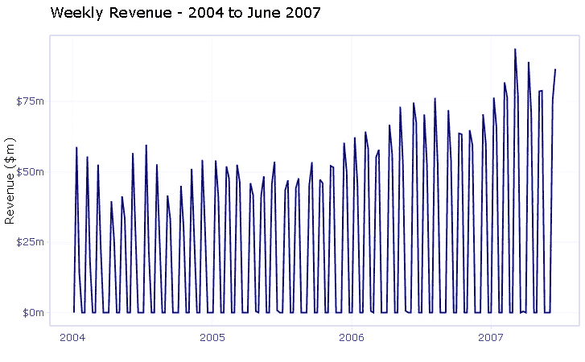****

****如前所述，该系列是人为生成的，并不一定反映现实生活中会发生什么。如果这是一个实际的分析咨询项目，我肯定会质疑我的客户每周的销售频率。****

****但假设这是真实的交易，**这里的挑战**是构建一个经过深思熟虑选择的**有意义的特征**，并在**几个机器学习模型**上测试它们，以找到一个能够**产生良好预测的模型**。****

****挑战除外！****

# ****探索性分析****

****在这一部分，我将探索时间序列，检查其组成部分和季节性结构，并进行相关性分析，以确定该序列的主要特征。****

****在将我的系列转换成一个`ts`对象之前，我需要定义系列的`start`(或`end`)参数。我希望从一年的第一周开始计算周数，这样可以确保所有事情都符合`ts`框架。****

```
**start_point_wk <- c(1,1) start_point_wk 
## [1] 1 1**
```

****我通过选择响应变量(`revenue`)作为数据参数并指定 52 周的频率来创建`ts`对象。****

```
**ts_weekly <- 
  revenue_tbl %>% 
    select(revenue) %>% 
    ts(start = start_point_wk, frequency = 52)ts_info(ts_weekly) ## The ts_weekly series is a ts object with 1 variable and 181 observations 
## Frequency: 52 
## Start time: 1 1 
## End time: 4 25**
```

****用`ts_info()`函数检查系列属性显示，该系列是一个包含 1 个变量和 181 个观察值的每周`ts`对象。****

# ****时间序列组件****

****现在让我们借助`TSstudio`的图形功能来绘制我们的时间序列。****

****`ts_decompose`将序列分解为其元素:**趋势**、**季节性**和**随机**成分。****

```
**ts_decompose(ts_weekly, type = 'additive')**
```

****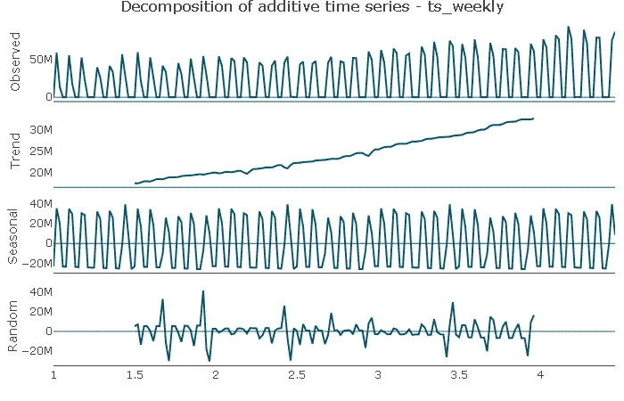****

*   ******趋势**:该系列似乎没有*周期性成分*，但显示出明显的*上升趋势*。趋势可能不是线性的，我将通过在特性中包含一个平方趋势元素来捕捉这一点。****
*   ******季节性**:这个情节显示了一个明显的*季节性模式*，我将在接下来探究。****
*   ******随机**:随机成分*看起来是随机分布的。*****

# ****季节性成分****

****现在让我们放大这个系列的**季节性部分******

```
**ts_seasonal(ts_weekly, type = 'normal')**
```

****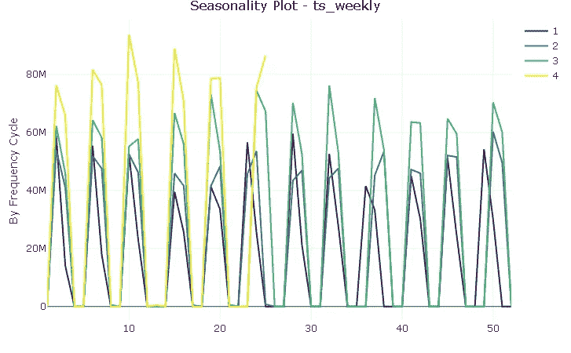****

****尽管有 12 个不同的“峰值”(一年中的每个月一个)，但该图并不表明存在典型的季节性。然而，除了极少数例外，销售记录在每年的同一周，我将尝试用一个特征变量来捕捉这种规律性。****

# ****相关分析****

******自相关函数(ACF)** 描述了序列与其滞后之间的相关程度。****

****由于手头的系列的奇怪性质，AC 图不是很容易阅读和解释:它表明存在滞后结构，但由于系列中的噪声，很难拾取有意义的模式。****

```
**ts_acf(ts_weekly, lag.max = 52)**
```

****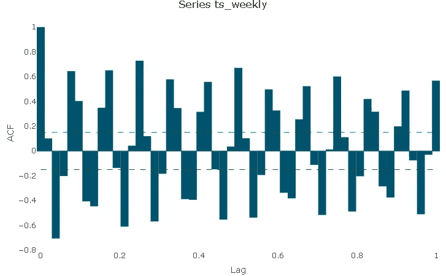****

****然而，我可以利用**滞后可视化**和玩滞后数字，以确定序列和它的滞后之间的潜在相关性。****

****在这种情况下，将周数与**季度频率**对齐显示了与季度滞后的明显的**线性关系**。为简单起见，我将只在模型中包括**滞后 13** ，以控制上一季度销售水平的影响。****

```
**ts_lags(ts_weekly, lags = c(13, 26, 39, 52))**
```

****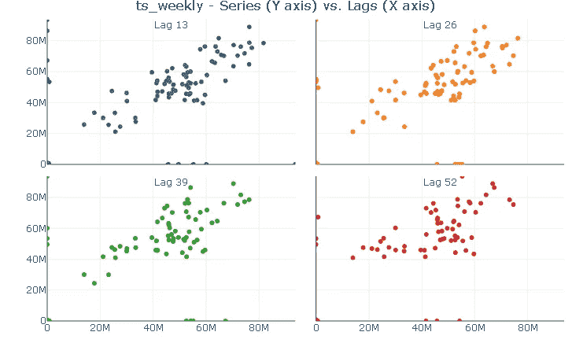****

****使用相同的技巧揭示了**与**第一年滞后**的强线性关系**。同样，我将在模型中只包括一个**滞后 52** 。****

```
ts_lags(ts_weekly, lags = c(52, 104, 156))
```

**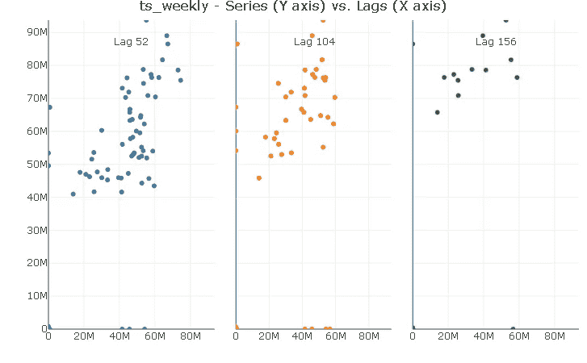**

# **探索性分析总结**

*   **该系列的购买频率为两周一次，两周一次，没有典型的季节性**。然而，除了极少数的例外情况，每年的销售额都大致记录在同一个星期。****
*   ****该系列似乎没有**周期性成分**，但显示出明显的**上升趋势**以及潜在的**非线性趋势**。****
*   ****由于数据嘈杂，ACF 很难解释，但滞后图暗示了年度**和季度**滞后结构**。******

# **系统模型化**

****建模和预测**策略是:**

*   **使用 **Q1 2007** 训练并交叉验证 **Q1 2007** 之前的所有车型，并比较其样本内**预测性能**。**
*   **假设我没有 **Q2 2007** 的数据，使用所有合适的模型生成该期间的预测，并将它们的**预测性能**与 **Q2 2007 实际值**进行比较**

**下面是该策略的可视化表示。我从经验中发现，用一个好的形象化来支持解释是一个让你的观点变得生动的好方法，尤其是在进行时间序列分析的时候。**

**所有**模型精度**将与**性能指标**和**实际与预测**图进行比较。**

**我将使用的**绩效指标**是:**

*   ****R** 是一个*拟合优度指标*，它以百分比的形式解释了由于特征变量的变化而导致的响应变量的变化量。**
*   ****RMSE** (或*均方根误差*)是残差的标准差，衡量预测误差的平均大小。基本上，它告诉你残差是如何分布的。**

```
revenue_tbl %>% 
  filter(order_date >= "2005-01-03") %>% 
  ggplot(aes(order_date, revenue)) + 
  geom_line(colour = 'black', size = 0.7) + 
  geom_point(colour = 'black', size = 0.7) + 
  geom_smooth(se = FALSE, 
              colour = 'red', 
              size = 1,  
              linetype = "dashed") + 
  theme_light() + 
  scale_y_continuous(limits = c(0, 11.5e7), 
                     labels = scales::dollar_format(scale = 1e-6, 
                     suffix = "m")) + 
  labs(title = 'Weekly Revenue - 2005 to June 2007', 
       subtitle = 'Train, Test and Forecast Data Portions', 
       x = "", y = 'Revenue ($m)') + # Train Portion 
  annotate(x = ymd('2005-12-01'), y = (10.5e7), fill = 'black', 
           'text', label = 'Train\nPortion', size = 2.8) + # Test Portion 
  annotate(x = ymd('2007-02-05'), y = (10.5e7), 
           'text', label = 'Test\nPortion', size = 2.8) + 
  geom_rect(xmin = as.numeric(ymd('2006-12-18')), 
            xmax = as.numeric(ymd('2007-03-25')), 
            ymin = -Inf, ymax = Inf, alpha = 0.005, 
            fill = 'darkturquoise') + # Forecast Portion 
  annotate(x = ymd('2007-05-13'), y = (10.5e7), 
           'text', label = 'Forecast\nPortion', size = 2.8) +
  geom_rect(xmin = as.numeric(ymd('2007-03-26')), 
            xmax = as.numeric(ymd('2007-07-01')), 
            ymin = -Inf, ymax = Inf, alpha = 0.01, 
            fill = 'cornflowerblue')
```

**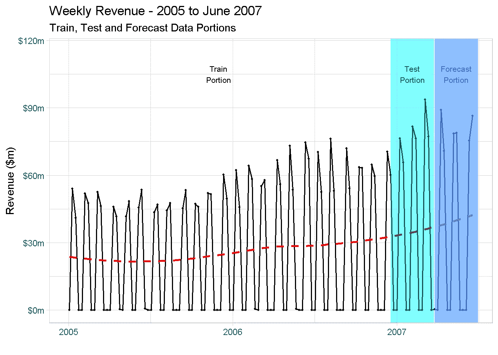**

****非常重要的一点:**如你所见，我没有在图中显示 2004 年的数据。这是因为，每当您在模型中包含滞后变量时，用于计算滞后的第一个周期**【drop off】**数据集，将无法用于建模。在**有年度滞后**的情况下，所有观察值**都提前**一年，并且由于没有 2003 年的销售记录，这导致前 52 周被从分析中删除。**

# **特征创建**

**现在，我可以开始将时间序列探索的结果整合到我的特征变量中。为此，我创造了:**

****趋势**特征:(一个*趋势*和*趋势平方*)。这是通过一个简单的数字指数来控制上升趋势和潜在的非线性趋势。**

****Lag** 特性:(a _lag *13* 和 _lag *52* )捕捉观察到的收入与其季度和年度季节性滞后的相关性。**

****季节性**特性，用于处理*两周工作、两周休息*的采购频率**

```
model_data_tbl <- 
  revenue_tbl %>% 
  mutate(trend      = 1:nrow(revenue_tbl), 
         trend_sqr  = trend^2, 
         rev_lag_13 = lag(revenue, n = 13), 
         rev_lag_52 = lag(revenue, n = 52), 
         season     = case_when(revenue == 0 ~ 0, 
                            TRUE ~ 1)
         ) %>% 
filter(!is.na(rev_lag_52))
```

**下一步是创建**训练**、**测试**和**预测**数据帧。**

**事实上，**测试数据**集合是**不是严格要求的**，因为`H2O`允许**多重交叉验证**自动执行。**

**然而，正如上一段所暗示的，为了评估和比较装配模型的**样品内性能**，我正在从列车数据中“切割”一个**测试集**。**

```
train_tbl <- 
  model_data_tbl %>% 
  filter(order_date <= "2007-03-19") test_tbl <- 
  model_data_tbl %>% 
  filter(order_date >= "2006-10-02" & 
          order_date <= "2007-03-19")train_tbl %>% head()

## # A tibble: 6 x 7
##   order_date   revenue trend trend_sqr rev_lag_13 rev_lag_52 season
##   <date>         <dbl> <int>     <dbl>      <dbl>      <dbl>  <dbl>
## 1 2005-01-03        0     53      2809         0          0       0
## 2 2005-01-10 54013487\.    54      2916  45011429\.  58814754\.      1
## 3 2005-01-17 40984715\.    55      3025  30075259\.  13926869\.      1
## 4 2005-01-24        0     56      3136         0          0       0
## 5 2005-01-31        0     57      3249         0          0       0
## 6 2005-02-07 51927116\.    58      3364  51049952\.  55440318\.      1
```

**创建**预测数据集**时的主要考虑围绕着对预测变量的可能值和水平进行计算**假设****

*   **说到`trend`特性，我只是从 _model_data *tbl* 数据集中选择它们。它们是基于数字索引的，这样就很好了**
*   **假设有订单的周数几乎都是年复一年一致的(还记得探索性分析吗？)我将`season`和`rev_lag_52`设置为一年前(52 周前)的值**
*   **`rev_lag_13`的值被设置为等于其上一季度的值(即 Q1 2007)**

```
forecast_tbl <- 
  model_data_tbl %>% 
  filter(order_date > "2007-03-19") %>%
  select(order_date:trend_sqr) %>%
  cbind(season     = model_data_tbl %>%
               filter(between(order_date,
                              as.Date("2006-03-27"),
                              as.Date("2006-06-19"))) %>% 
                        select(season),
        rev_lag_52 = model_data_tbl %>%
               filter(between(order_date,
                              as.Date("2006-03-27"),
                              as.Date("2006-06-19"))) %>% 
                        select(rev_lag_52),
        rev_lag_13 = model_data_tbl %>%
               filter(between(order_date,
                              as.Date("2006-12-25"),
                              as.Date("2007-03-19"))) %>% 
                        select(rev_lag_13)
         ) forecast_tbl %>% head()

##   order_date  revenue trend trend_sqr season rev_lag_52 rev_lag_13
## 1 2007-03-26   449709   169     28561      0        0.0          0
## 2 2007-04-02        0   170     28900      0        0.0          0
## 3 2007-04-09 89020602   171     29241      1 45948859.7   63603122
## 4 2007-04-16 70869888   172     29584      1 41664162.8   63305793
## 5 2007-04-23        0   173     29929      0   480138.8          0
## 6 2007-04-30        0   174     30276      0        0.0          0
```

# **和 H2O 一起做模特**

**终于准备好开始做模特了！**

**`H2O`是一个面向机器学习应用的高性能开源库，致力于分布式处理，这使得它适合于较小的内存项目，并且可以通过外部处理能力快速扩展以实现更大的目标。**

**它基于 Java，具有与 *R* 和 *Python* 的专用接口，并整合了许多监督和非监督的机器学习模型。在这个项目中，我特别关注 4 种算法:**

*   ****广义线性模型(GLM)****
*   ****梯度推进机(GBM)****
*   **我还使用了 **AutoML** 工具，并使用 leader 模型来比较性能**

**首先:启动一个`H2O`实例！**

**当 R 通过`h2o.init`命令启动 H2O 时，我可以指定内存分配池集群的大小。为了加快速度，我把它设置为“16G”。**

```
h2o.init(max_mem_size = "16G")

## H2O is not running yet, starting it now...
## 
## Note:  In case of errors look at the following log files:
##     C:\Users\LENOVO\AppData\Local\Temp\RtmpSWW88g/h2o_LENOVO_started_from_r.out
##     C:\Users\LENOVO\AppData\Local\Temp\RtmpSWW88g/h2o_LENOVO_started_from_r.err
## 
## 
## Starting H2O JVM and connecting: . Connection successful!
## 
## R is connected to the H2O cluster: 
##     H2O cluster uptime:         4 seconds 712 milliseconds 
##     H2O cluster timezone:       Europe/Berlin 
##     H2O data parsing timezone:  UTC 
##     H2O cluster version:        3.26.0.10 
##     H2O cluster version age:    2 months and 4 days  
##     H2O cluster name:           H2O_started_from_R_LENOVO_xwx278 
##     H2O cluster total nodes:    1 
##     H2O cluster total memory:   14.22 GB 
##     H2O cluster total cores:    4 
##     H2O cluster allowed cores:  4 
##     H2O cluster healthy:        TRUE 
##     H2O Connection ip:          localhost 
##     H2O Connection port:        54321 
##     H2O Connection proxy:       NA 
##     H2O Internal Security:      FALSE 
##     H2O API Extensions:         Amazon S3, Algos, AutoML, Core V3, TargetEncoder, Core V4 
##     R Version:                  R version 3.6.1 (2019-07-05)
```

**我也喜欢关闭进度条，因为在某些情况下，输出消息可能会非常冗长。**

```
h2o.no_progress()
```

**下一步是安排**响应**和**预测**变量集。为了进行回归，您需要确保响应变量不是一个因子(否则`H2O`将进行分类)。**

```
# response variable
y <- "revenue"

# predictors set: remove response variable and order_date from the set
x <- setdiff(names(train_tbl %>% as.h2o()), c(y, "order_date"))
```

# **随机森林**

**我将从安装一个`random forest`开始。**

**注意，我包括了`nfolds`参数。无论何时指定，该参数使交叉验证能够在不需要`validation_frame`的情况下执行——例如，如果设置为 5，它将执行 5 重交叉验证。**

**我还使用了一些控制参数来处理模型的运行时间:**

*   **我将`stopping_metric`设置为`RMSE`作为提前停止的误差度量(当度量停止改善时，模型将停止构建新的树)**
*   **通过`stopping_rounds`，我指定了考虑提前停止前的训练轮数**
*   **我使用`stopping_tolerance`来设置训练过程继续所需的最小改进**

```
# random forest model
rft_model <- 
  h2o.randomForest(
    x = x, 
    y = y, 
    training_frame = train_tbl %>% as.h2o(),
    nfolds = 10,
    ntrees = 500,
    stopping_metric = "RMSE",
    stopping_rounds = 10,
    stopping_tolerance = 0.005,
    seed = 1975
  )
```

**我现在用`h2o.varimp_plot`可视化变量重要性，它返回一个每个变量的排名贡献图，标准化为 0 到 1 之间的范围。**

```
rft_model %>% h2o.varimp_plot()
```

**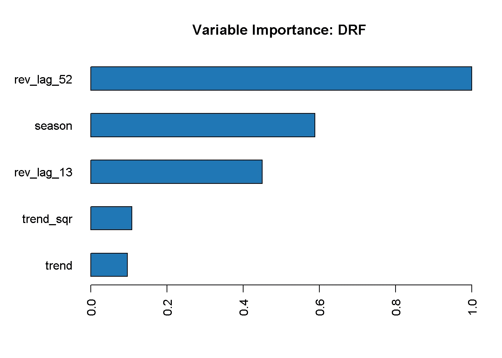**

**`model_summary`功能允许访问关于模型参数的信息。**

```
rft_model@model$model_summary

## Model Summary: 
## number_of_trees number_of_internal_trees model_size_in_bytes min_depth
## 1            27                       27               12560         7
## max_depth mean_depth min_leaves max_leaves mean_leaves
## 1      14   10.29630         12         45    32.37037
```

**这里我们可以看到，随机森林只使用了允许估计的最多 500 棵树中的 26 棵树(我用`ntrees`参数设置了这一点)。我们还可以估算出树的深度范围从 7 到 14(不是特别深的森林),每棵树的叶子数量范围从 12 到 45。**

**最后但同样重要的是，我可以用`h2o.performance`查看模型的性能**

```
h2o.performance(rft_model, newdata = test_tbl %>% as.h2o())

## H2ORegressionMetrics: drf
## 
## MSE:  3.434687e+13
## RMSE:  5860620
## MAE:  3635468
## RMSLE:  9.903415
## Mean Residual Deviance :  3.434687e+13
## R^2 :  0.9737282
```

**该模型实现了 *97.4%* 的高`R^2`，这意味着特征变量的变化解释了响应变量的几乎所有可变性。**

**另一方面，`RMSE`显得相当大！RMSE 的高值可能是由于少量高误差预测的存在(如异常值的情况)，考虑到响应变量的波动性，这并不奇怪。**

**谈到基于误差的指标，如 RMSE、平均误差、均方误差等。没有好坏的绝对值，因为它们是用响应变量的单位表示的*。通常，你想要实现一个更小的`RMSE`，因为这意味着更高的预测能力，但是对于这个项目，我将简单地使用这个指标来比较不同模型的相对性能。***

# **扩展到许多型号**

**让我们以编程的方式概括性能评估，一次性计算、评估和比较多个模型。**

**首先，我安装了几个型号，并确保我为所有型号启用了`cross-validation`。注意，对于 *GBM* ，我指定了与用于*随机森林*相同的参数，但是有大量的参数可以用来控制模型估计的几个方面(我不会涉及这些，因为这超出了本项目的范围)**

```
# gradient boosting machine model
gbm_model <-  
  h2o.gbm(
    x = x, 
    y = y, 
    training_frame = as.h2o(train_tbl),
    nfolds = 10,
    ntrees = 500,
    stopping_metric = "RMSE",
    stopping_rounds = 10,         
    stopping_tolerance = 0.005,
    seed = 1975
  )

# generalised linear model (a.k.a. elastic net model)
glm_model <- 
  h2o.glm(
    x = x, 
    y = y, 
    training_frame = as.h2o(train_tbl),
    nfolds = 10,
    family = "gaussian",
    seed = 1975
  )
```

**我还运行了非常方便的`automl`功能，可以安装多个模型并优化网格搜索。就像我对其他模型所做的那样，我可以指定一系列参数来指导这个函数，比如几个`stopping`度量和`max_runtime_secs`来节省计算时间。**

```
automl_model <-
  h2o.automl(
    x = x,
    y = y,
    training_frame     = as.h2o(train_tbl),
    nfolds             = 5,
    stopping_metric    = "RMSE",
    stopping_rounds    = 10,
    stopping_tolerance = 0.005,
    max_runtime_secs   = 60,
    seed               = 1975
 )
```

**检查引导板将显示适合的模型**

```
automl_model@leaderboard

##                                              model_id 
## 1                        GBM_2_AutoML_20200112_111324 
## 2                        GBM_4_AutoML_20200112_111324  
## 3 StackedEnsemble_BestOfFamily_AutoML_20200112_111324  
## 4                        GBM_1_AutoML_20200112_111324 
## 5  DeepLearning_grid_1_AutoML_20200112_111324_model_1 
## 6  DeepLearning_grid_1_AutoML_20200112_111324_model_5   
##
##   mean_residual_deviance      rmse          mse     mae rmsle
## 1           1.047135e+14  10232963 1.047135e+14 5895463   NaN
## 2           1.070608e+14  10347021 1.070608e+14 5965855   NaN
## 3           1.080933e+14  10396794 1.080933e+14 5827000   NaN
## 4           1.102083e+14  10498016 1.102083e+14 5113982   NaN
## 5           1.104058e+14  10507419 1.104058e+14 6201525   NaN
## 6           1.146914e+14  10709407 1.146914e+14 6580217   NaN
## 
## [22 rows x 6 columns]
```

**如你所见，顶部的模型是一个**梯度推进机**模型。还有几个**深度学习**模型和一个**堆叠合奏**，`H2O`迎战**超级学习者**。**

# **性能评价**

**首先，我将所有模型保存在一个文件夹中，这样我就可以访问它们，并通过一系列函数以编程方式处理性能指标**

```
# set path to get around model path being different from project path
path = "/02_models/final/"

# Save GLM model
h2o.saveModel(glm_model, path)

# Save RF model
h2o.saveModel(rft_model, path)

# Save GBM model
h2o.saveModel(gbm_model, path)

# Extracs and save the leader autoML model
aml_model <- automl_model@leader

h2o.saveModel(aml_model, path)
```

# **可变重要性图**

**让我们从可变重要性图开始。之前我在`random forest`模型中使用了绘图功能，但是现在我想一次将它们全部绘制出来，这样我就可以比较和对比结果了。**

**有许多库(如 *IML* 、 *PDP* 、 *VIP* 、 *DALEX* 等更受欢迎的库)有助于**机器学习模型可解释性**、**特征解释**和**一般性能评估**。在这个项目中，我使用的是`vip`包。**

**这些库的主要优势之一是它们与其他 R 包如`gridExtra`的兼容性。**

```
p_glm <- vip(glm_model) + ggtitle("GLM")
p_rft <- vip(rft_model) + ggtitle("RF")
p_gbm <- vip(gbm_model) + ggtitle("GBM")
p_aml <- vip(aml_model) + ggtitle("AML")

grid.arrange(p_glm, p_rft, p_gbm, p_aml, nrow = 2)
```

**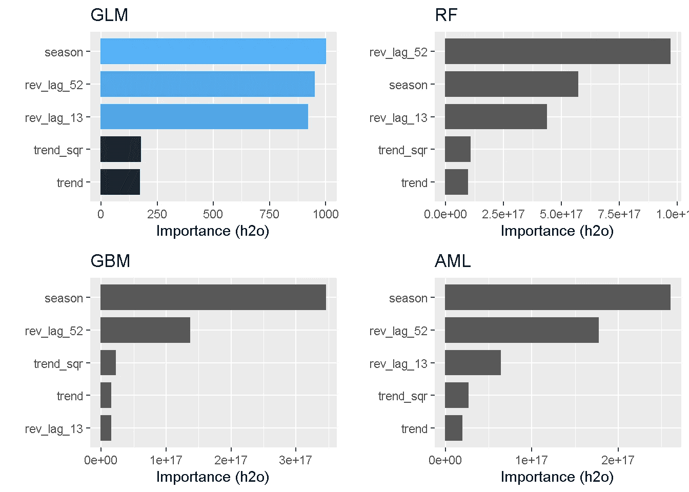**

**`Seasonality`和以前的收入水平(`lags`)在几乎所有车型中都排在前 3 位(唯一的例外是 *GBM* )。相反，没有一个模型发现`trend`及其对应的`squared`是反应变量变化的有力解释者。**

# **性能指标**

```
perf_gbm_model <- 
  h2o.performance(gbm_model, newdata = as.h2o(test_tbl))

perf_gbm_model

## H2ORegressionMetrics: gbm
## 
## MSE:  1.629507e+13
## RMSE:  4036716
## MAE:  2150460
## RMSLE:  9.469847
## Mean Residual Deviance :  1.629507e+13
## R^2 :  0.9875359
```

**然而，为了评估和比较模型的性能，我将重点关注`RMSE`和`R^2^`。**

**使用`h20.metric`函数可以一次提取所有性能指标，由于某种原因，这似乎不适用于`H2ORegressionMetrics`对象。**

```
perf_gbm_model %>% 
  h2o.metric()

## Error in paste0("No ", metric, " for ",
## class(object)) : argument "metric" is missing, with
##  no default
```

**此外，在这种情况下，错误消息不是特别有用，因为“metric”参数是可选的，默认情况下应该返回所有指标。这个问题似乎与执行回归有关，因为它实际上可以很好地处理`H2OClassificationMetrics`对象。**

**幸运的是，提供了一些有用的助手函数来单独提取单个指标，它们工作正常！**

```
perf_gbm_model %>% h2o.r2()
## [1] 0.9875359

perf_gbm_model %>% h2o.rmse()
## [1] 4036716
```

**因此，我将使用这些单独的助手来编写一个小函数，该函数对测试数据上的所有模型运行**预测，并返回一个包含所有性能指标的简便 tibble。****

```
performance_metrics_fct <- function(path, data_tbl) {

    model_h2o <- h2o.loadModel(path)
    perf_h2o  <- h2o.performance(model_h2o, newdata = as.h2o(data_tbl)) 

    R2   <- perf_h2o %>% h2o.r2()  
    RMSE <- perf_h2o %>% h2o.rmse()

    tibble(R2, RMSE)
}
```

**现在我可以将这个公式传递给`purrr`包中的`map`函数，以迭代计算并编译所有模型中的`RMSE`和`R^2^`。为了正确地识别每个模型，我还确保从路径中提取模型的名称。**

```
perf_metrics_test_tbl <- fs::dir_info(path = "/02_models/final_models/") %>%
    select(path) %>%
    mutate(metrics = map(path, performance_metrics_fct, data_tbl = test_tbl),
           path = str_split(path, pattern = "/", simplify = T)[,2] 
                            %>% substr(1,3)) %>%
    rename(model = path) %>% 
    unnest(cols = c(metrics))perf_metrics_test_tbl %>% 
  arrange(desc(R2)) 

model 	          R2 	      RMSE
AML 	   0.9933358 	   2951704
GBM 	   0.9881890 	   3929538
DRF 	   0.9751434 	   5700579
GLM 	  -0.0391253 	  36858064
```

****所有基于树的模型**都达到非常高的`R^2`，其中有 autoML 模型(这是一个 GBM，记得吗？)达到惊人的 *99.3%* 并达到最低`RMSE`。另一方面， *GLM* 得到一个**负 R^2** 。**

**负 R 并非闻所未闻:R 将模型的拟合与水平直线的拟合进行比较，并计算模型解释的方差与直线(零假设)解释的方差的比例。如果拟合实际上比仅仅拟合一条水平线差，那么 R 平方可以是负的。**

# **实际与预测图**

**最后但同样重要的是，为了提供模型性能的额外和更直观的显示，我将绘制所有模型的**实际与预测**。**

**我正在使用一个类似于我用来计算性能指标的函数，因为基本原理是相同的。**

```
predict_fct <- function(path, data_tbl) {

    model_h2o <- h2o.loadModel(path)
    pred_h2o  <- h2o.predict(model_h2o, newdata = as.h2o(data_tbl)) 

    pred_h2o %>% 
      as_tibble() %>% 
      cbind(data_tbl %>% select(order_date))

}
```

**正如我之前所做的，我将公式传递给一个`map`函数来迭代计算，并使用所有模型的`test`数据子集来编译`prediction`。**

```
validation_tmp <- fs::dir_info(path = "/02_models/final_models/") %>%
    select(path) %>%
    mutate(pred = map(path, predict_fct, data_tbl = test_tbl),
           path = str_split(path, pattern = "/", simplify = T)[,2] %>% 
             substr(1,3)) %>%
    rename(model = path)
```

**然而，得到的`validation_tmp`是一个嵌套的 tibble，每个单元格中的预测都存储为列表。**

```
validation_tmp

## # A tibble: 4 x 2
##   model pred             
##   <chr> <list>           
## 1 AML   <df[,2] [25 × 2]>
## 2 DRF   <df[,2] [25 × 2]>
## 3 GBM   <df[,2] [25 × 2]>
## 4 GLM   <df[,2] [25 × 2]>
```

**这需要几个额外的操作来获得一个可用于绘图的形状:取消列表嵌套，围绕`order_date`旋转预测，并将收入添加为`actual`。**

```
validation_tbl <- 
    validation_tmp %>% 
    unnest(cols = c(pred)) %>% 
    pivot_wider(names_from = model, 
                values_from = predict) %>%
    cbind(test_tbl %>% 
            select(actual = revenue)) %>% 
    rename(date = order_date)
```

**现在，我要把这个绘图函数直接写在*里 plotly***

```
validation_tbl %>% 
  plot_ly() %>% 
    add_lines(x = ~ date, y = ~ actual, name = 'Actual') %>% 
    add_lines(x = ~ date, y = ~ DRF, name = 'Random Forest', 
              line = list(dash = 'dot')) %>% 
    add_lines(x = ~ date, y = ~ GBM, name = 'Gradient Boosting Machine', 
              line = list(dash = 'dash')) %>% 
    add_lines(x = ~ date, y = ~ AML, name = 'Auto ML', 
              line = list(dash = 'dot')) %>% 
    add_lines(x = ~ date, y = ~ GLM, name = 'Generalised Linear Model', 
              line = list(dash = 'dash')) %>% 
    layout(title = 'Total Weekly Sales - Actual versus Predicted (various models)',
           yaxis = list(title = 'Millions of Dollars'),
           xaxis = list(title = ''),
           legend = list(orientation = 'h')
           )
```

**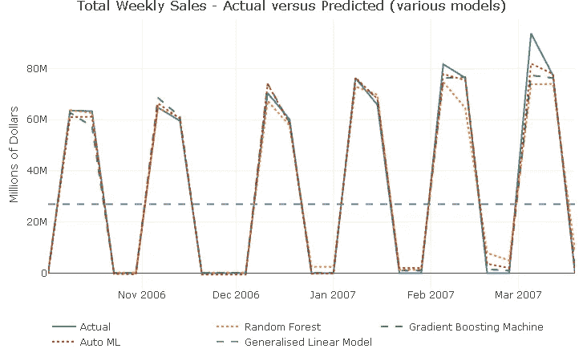**

**除了 GLM 模型，它产生了一条看似平坦的预测线(还记得负面的 *R* ？)，所有模型都很好地捕捉到了系列中的波峰和波谷。预测仅开始错过最后 2 个尖峰周围的响应变化的全部范围。**

# **预测**

**无需编写任何新函数，因为`performance_metrics_fct`和`predict_fct`也可用于预测。**

**首先，我看一下性能指标**

```
perf_metrics_cast_tbl <- fs::dir_info(path = "/02_models/final_models/") %>%
    select(path) %>%
    mutate(metrics = map(path, performance_metrics_fct, 
           data_tbl = forecast_tbl),
           path = str_split(path, pattern = "/", simplify = T)[,2] 
                            %>% substr(1,3)) %>%
    rename(model = path) %>% 
    unnest(cols = c(metrics)) perf_metrics_cast_tbl %>% 
  arrange(desc(R2)) 

model 	      R2 	      RMSE
GBM 	    0.8678649 	  14544327
AML 	    0.8363565 	  16185792
DRF 	    0.8042526 	  17702414
GLM 	   -0.0617160 	  41227664
```

**有趣的是，在顶部位置有一点互换，与 autoML 模型相比,“手动”GBM 在预测中表现更好。与验证指标相比，所有模型的性能指标都恶化了。**

**然后，我计算预测…**

```
cast_tbl <- fs::dir_info(path = "/02_models/final_models/") %>%
    select(path) %>%
    mutate(pred = map(path, predict_fct, data_tbl = forecast_tbl),
           path = str_split(path, pattern = "/", simplify = T)[,2] %>% 
             substr(1,3)) %>%
    rename(model = path) %>% 
    unnest(cols = c(pred)) %>% 
    pivot_wider(names_from = model, values_from = predict) %>%
    cbind(forecast_tbl %>% select(actual = revenue)) %>% 
    rename(date = order_date)
```

**…并想象它**

```
cast_tbl %>% 
  plot_ly() %>% 
    add_lines(x = ~ date, y = ~ actual, name = 'Actual') %>% 
    add_lines(x = ~ date, y = ~ DRF, name = 'Random Forest', 
              line = list(dash = 'dot')) %>% 
    add_lines(x = ~ date, y = ~ GBM, name = 'Gradient Boosting Machine', 
              line = list(dash = 'dash')) %>% 
    add_lines(x = ~ date, y = ~ AML, name = 'Auto ML', 
              line = list(dash = 'dot')) %>% 
    add_lines(x = ~ date, y = ~ GLM, name = 'Generalised Linear Model', 
              line = list(dash = 'dash')) %>% 
    layout(title = 'Total Weekly Sales - Actual versus Forecast (various models)',
           yaxis = list(title = 'Millions of Dollars'),
           xaxis = list(title = ''),
           legend = list(orientation = 'h')
           )
```

**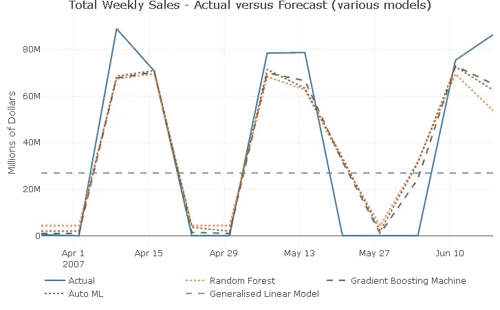**

**除了不出所料产生持平预测的 **GLM** 之外，所有车型都继续很好地捕捉 2 周开工、2 周停工的购买模式。此外，所有模型预测都未能捕捉到所有 3 个峰值的反应变量运动的全部范围，这表明在 2007 年可能有另一种动态在起作用，而当前的预测者无法控制这种动态。**

```
forecast_tbl %>% 
  select(-trend, -trend_sqr) %>% 
  tail(10) 

    order_date 	 revenue 	season 	rev_lag_52 	rev_lag_13
4   2007-04-16 	70869888 	    1 	41664162.8 	  63305793
5   2007-04-23 	       0 	    0 	  480138.8 	         0
6   2007-04-30 	       0 	    0 	       0.0 	         0
7   2007-05-07 	78585882 	    1 	41617508.0 	  64787291
8   2007-05-14 	78797822 	    1 	48403283.4 	  59552955
9   2007-05-21 	       0 	    1 	       0.0 	         0
10  2007-05-28 	       0 	    0 	       0.0 	        0
11  2007-06-04 	       0 	    0 	45696327.2 	         0
12  2007-06-11 	75486199 	    1 	53596289.9 	  70430702
13  2007-06-18 	86509530 	    1 	  774190.1 	  60094495
```

**最后一件事:完成后不要忘记关闭`H2O`实例！**

```
h2o.shutdown(prompt = FALSE)
```

# **结束语**

**在这个项目中，我经历了建立时间序列机器学习管道和生成每周收入预测所需的各个步骤。**

**特别是，我用`TSstudio`和**进行了一个更“传统”**的探索性时间序列分析**，并利用我收集的洞察力创建了许多预测器**。然后**我用开源库`H2O`训练并验证了**一系列机器学习模型，并且**使用**性能指标**和**实际与预测**图比较了模型的准确性**。**

# **结论**

**这只是制作每周收入预测的第一次尝试，显然还有很大的改进空间。尽管如此，一旦你有了这样的建模和预测管道，创建和测试几个模型和不同的预测集就会变得更加容易和快速。**

**数据序列是人工生成的这一事实并不理想，因为它不一定包含您在现实生活数据集中会遇到的动态。尽管如此，这促使我发挥创造力，让整个练习变得更加愉快。**

**预测总收入可能不是最好的策略，例如，通过`product line`或`country`分解响应变量可能会带来更好、更准确的预测。这超出了本项目的范围，但也可能是未来项目的主题！**

**我从这个练习中学到的一件事是`H2O`是**绝对聪明的**！它的设置快速、直观，并具有广泛的定制选项。 **AutoML** 非常棒，支持 **R** 、 **Python** 和 **Java** 并且任何人都可以免费使用它的事实给了像 **Google AutoML** 和 **AWS SageMaker AutoML** 这样的平台一个机会！**

# **代码库**

**完整的 R 代码可以在 [**我的 GitHub 简介**](https://github.com/DiegoUsaiUK/Customer_Analytics/tree/master/time_series_machine_learning) 中找到**

# **参考**

*   **对于 H2O 网站[T5 H2O 网站 ](https://www.h2o.ai/)**
*   **对于 H2O 文档 [**H2O 文档**](http://docs.h2o.ai/h2o/latest-stable/index.html)**
*   **有关在 R [**中使用 R**](https://www.packtpub.com/big-data-and-business-intelligence/hands-time-series-analysis-r) 进行时间序列分析和预测的详细讨论**
*   **关于 TSstudio 的介绍 [**关于 TSstudio 包的介绍**](https://diegousai.io/2019/12/time-series-machine-learning-analysis-and-demand-forecasting/Introduction for the TSstudio Package)**
*   **[T21 简介机器学习可解释性](https://www.h2o.ai/wp-content/uploads/2019/08/An-Introduction-to-Machine-Learning-Interpretability-Second-Edition.pdf)**

***原载于 2019 年 12 月 11 日*[*https://diegousei . io*](https://diegousai.io/2019/12/time-series-machine-learning-analysis-and-demand-forecasting/)*。***