# 时间序列机器学习回归框架

> 原文：<https://towardsdatascience.com/time-series-machine-learning-regression-framework-9ea33929009a?source=collection_archive---------1----------------------->

## 构建时间序列预测管道来预测每周销售交易


Most commonly, a **time** series is a **sequence** taken at successive equally spaced points in **time**. Thus it is a **sequence** of discrete-**time** data. Photo by [Justin Campbell](https://unsplash.com/photos/2bIQ87pf6DM?utm_source=unsplash&utm_medium=referral&utm_content=creditCopyText) on [Unsplash](https://unsplash.com/search/photos/sequence?utm_source=unsplash&utm_medium=referral&utm_content=creditCopyText)

# 介绍

Fig.1) Let’s borrow the concept of time from Entropy & thermodynamics: **Entropy** is the only quantity in the physical sciences that seems to imply a particular direction of progress, sometimes called an arrow of **time**. As **time** progresses, the second law of **thermodynamics** states that the **entropy** of an isolated system never decreases in large systems over significant periods of **time**. Can we consider our Universe as an isolated large system? Then what?

时间！宇宙中最具挑战性的概念之一。我研究物理学多年，看到大多数杰出的科学家都在努力处理时间的概念。在机器学习中，即使我们远离那些复杂的物理理论，在这些理论中，对时间概念的共同理解会改变，时间的存在和 ML 问题中的观察序列会使问题变得更加复杂。

# 时间序列的机器学习；

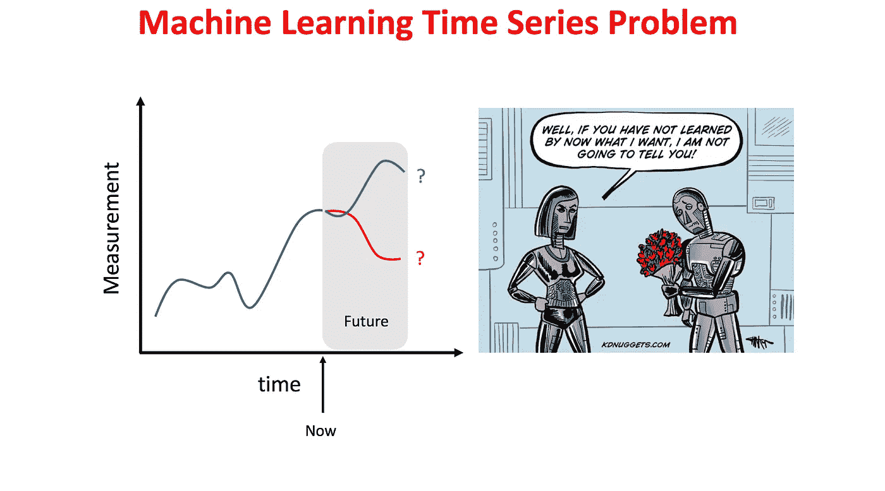

Fig.2) In time series forecasting, we use historical data to forecast the future. George Santayana: Those Who Do Not Learn History Are Doomed To Repeat It. The right figure is taken from [https://www.kdnuggets.com/2018/02/cartoon-valentine-machine-learning.html](https://www.kdnuggets.com/2018/02/cartoon-valentine-machine-learning.html)

时间序列是按时间顺序进行的一系列观察。时间序列预测包括采用模型，然后根据历史数据进行拟合，然后用它们来预测未来的观测值。因此，例如，测量的分钟(秒)、天(秒)、月(秒)、前(秒)被用作预测

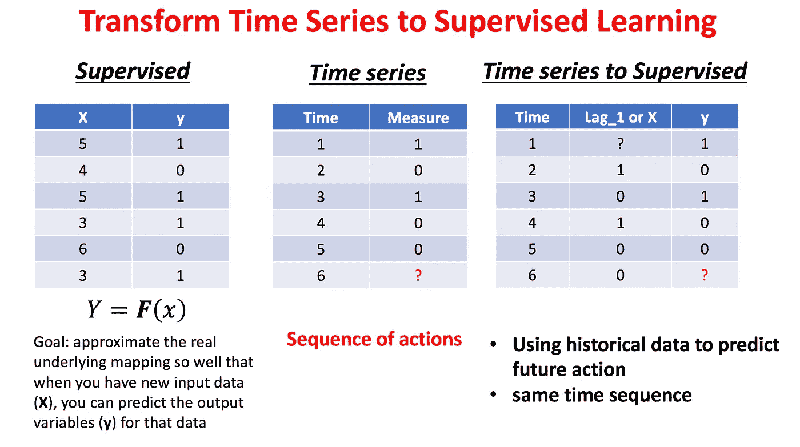

Fig.3) Transform Time Series to Supervised Machine Learning.

接下来的分钟、天、月。被认为是在时间(序列)上向后移动数据的步骤，称为滞后时间或滞后。因此，通过添加测量的滞后作为监督 ML 的输入，可以将时间序列问题转化为监督 ML。见图 3 右侧。一般来说，探索滞后的数量作为一个超参数。

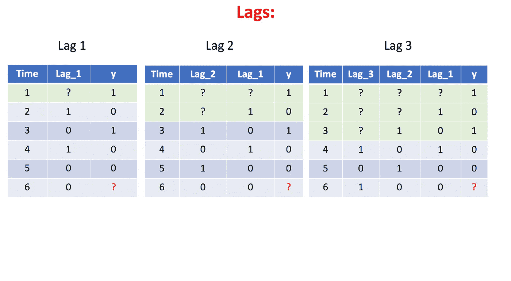

Fig.4) Transform the time series to supervised machine learning by adding lags. Lags are basically the shift of the data one step or more backward in the time.

# 时间序列的交叉验证

时间序列的交叉验证不同于不涉及时间或序列的机器学习问题。在没有时间的情况下，我们选择一个随机的数据子集作为验证集来估计测量的准确性。在时间序列中，我们经常预测未来的某个值。因此，验证数据总是必须在训练数据的之后*出现。有两种模式**滑动窗口**和**前向链接验证方法**，可用于时间序列 CV。*

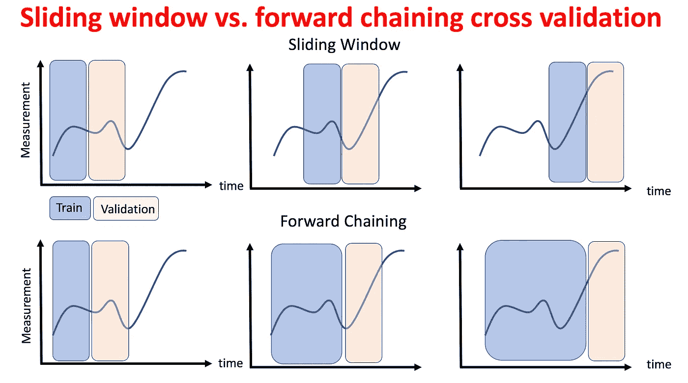

Fig. 5) Basically, there are two kinds of cross-validation for the time series sliding window and forward chaining. In this post, we will consider forward chaining cross-validation method

图 5 顶部显示了滑动窗口方法。对于这种方法，我们在 n 个数据点上训练，并在接下来的 n 个数据点上验证预测，为下一步及时滑动 2n 训练/验证窗口。图 5 底部显示了正向链接方法。对于这种方法，我们在最后 n 个数据点上训练，并在接下来的 m 个数据点上验证预测，在时间上滑动 n+m 训练/验证窗口。这样，我们就可以估计我们模型的参数了。为了测试模型的有效性，我们可能会在时间序列的末尾使用一个数据块，该数据块是为用学习到的参数测试模型而保留的。

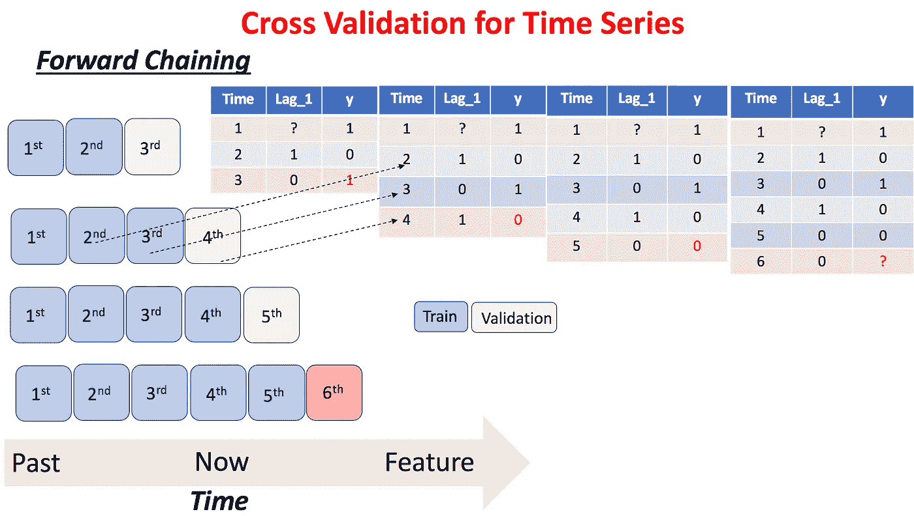

Fig.6) Forward chaining cross-validation.

图六。显示了正向链接 CV 的工作方式。在这里，有一个滞后。因此，我们从第一秒到第三秒/分钟/小时/天等来训练模型。然后验证第四个，以此类推。既然现在我们已经熟悉了 TS 问题，让我们选择一个时间序列问题并建立一个预测模型。

# 预测每周销售交易

假设一家商店的经理要求我们建立一个 ML 模型来预测下周的销售额。该模型必须每周日运行，预测结果必须在每周一上午报告。然后，经理可以决定一周的订单数量。经理给我们提供了 52 周 811 产品的销售数据。销售数据可以在 [*UCI 仓库*](https://archive.ics.uci.edu/ml/datasets/Sales_Transactions_Dataset_Weekly) 或 [*kaggle*](https://www.kaggle.com/crawford/weekly-sales-transactions) 中找到。

我们来看数据。

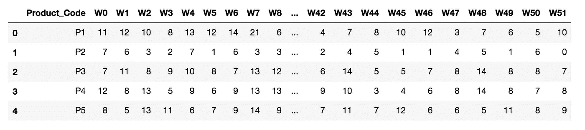

许多数据科学家可能会为每种产品创建一个模型来预测销售数量。虽然这可以很好地工作，但我们可能会有问题，因为每个模型只有 52 个数据点，这真的很低！尽管这种方法是可行的，但它可能不是最佳解决方案。此外，如果两种或更多产品的销售数量之间存在交互，我们可能会因为为每种产品构建一个模型而错过它们的交互。因此，在这篇文章中，我们将探讨如何建立一个多时间序列预测模型。

# 数据准备

原始数据有一个产品代码列和 52 周销售额列。首先，我们将通过融合周数据来创建一个新的数据框架。因此，新的数据框架有三列，产品代码、周和销售额。此外，“W”和“P”分别从星期和产品中删除。那么，让我们看看新数据帧的头部和尾部

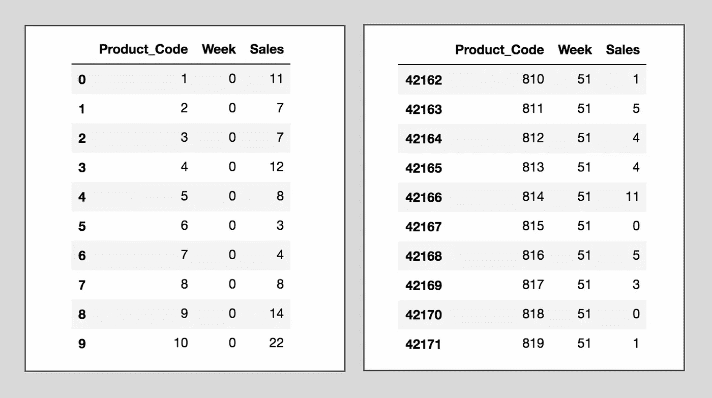

为了熟悉数据集，销售分布绘制在图 7 中。可以看出，有大量产品的销售额很低，数据也向左倾斜。这个问题对建模的影响将在后面讨论。

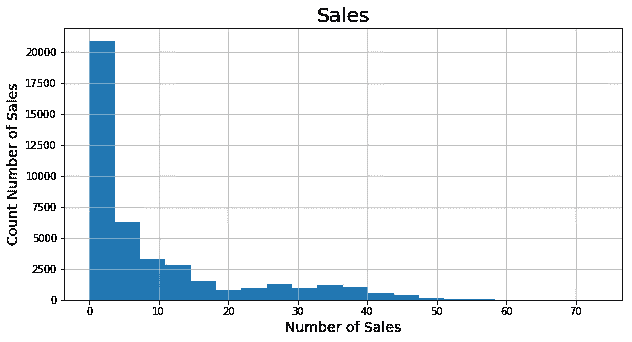

Fig. 7) Sales distribution. There are many product sales items with very low sales.

# 基础特征工程

因为这篇文章的目标不是 TS 的特性工程，我们将尽量保持这部分简单。让我们创建两个通常用于时间序列的特征。时间上后退一步，1-lag(shift =1)和一周前(W 1)的购买数量与其前一周的购买数量之差，意味着，两周前(W2)。此后，由于 lag 和 diff 导致数据集中的值为空，参见图 4，我们将其删除。因此，当我们查看数据帧的头部时，它从 week = 2 开始。


“ToSupervised”和“ToSupervisedDiff”类，代码 1 和代码 2，如编码部分所示，用于通过简单的管道获得新的数据帧:

```
steps = [('1_step',
          ToSupervised('Sales','Product_Code',1)),
         ('1_step_diff',
          ToSupervisedDiff('1_Week_Ago_Sales',
          'Product_Code',1,dropna=True))]super_1 = Pipeline(steps).fit_transform(df)
```

现在，数据有了适当的形状，可以在受监督的 ML 中使用。

# 正向链接交叉验证:

另一个问题是，当我们处理时间序列时，我们必须处理时间序列的 CV。我们选择前向链接进行模型验证。为了避免在很少的几周内有一个非常好的模型，我们将使用从 40 到 52 的每一周，每次重复一个过程，并计算分数。因此，这个模式下的 k 倍代码可以在 C. 3 中找到。

```
kf = Kfold_time(target='Sales',date_col = 'Week', 
                   date_init=40, date_final=52)
```

因为这篇文章只是一个演示，所以我不打算分离一个测试数据集。在实际项目中，总是保留一些时间段作为测试数据集，以根据看不见的数据评估模型。

# 公制的

由于问题是回归，有几个众所周知的指标来评估模型，如均方误差(MSE)，平均绝对误差(MAE)，均方根误差(RMSE)，均方根对数误差(RMSLE)，R 平方，等等。这些度量标准中的每一个都有自己的用例，它们以不同的方式惩罚错误，但它们之间也有一些相似之处。在本文中，我们选择 RMSLE 来评估这个模型。

# 基线:

通常，当我们构建一个模型时，我们可能会提出一个非常简单的假设，认为使用 ML 可以改进它。在这里，让我们假设每种产品的数量在本周售出，下周也是如此。这意味着，如果产品-1 在第 1 周销售了 10 次，那么它在第 2 周的销售数字也将是相同的。这通常是一个不错的假设。所以，让我们把这个假设当作我们的基线模型。

基线模型用 C. 5 编码，让我们看看基线模型是如何工作的

```
base_model = BaseEstimator('1_Week_Ago_Sales')
errors = []
for indx,fold in enumerate(kf.split(super_1)):
    X_train, X_test, y_train, y_test = fold
    error = base_model.score(X_test,y_test,rmsle)
    errors.append(error)
    print("Fold: {}, Error: {:.3f}".format(indx,error))

print('Total Error {:.3f}'.format(np.mean(errors)))
```

> 折:0，误差:0.520
> 折:1，误差:0.517
> 折:2，误差:0.510
> 折:3，误差:0.508
> 折:4，误差:0.534
> 折:5，误差:0.523
> 折:6，误差:0.500
> 折:7，误差:0.491
> 折:8，误差:0.506 【T8

这里，折叠 0 到 11 表示周= 40 到周= 52。基线模型在这 12 周内的 RMSLE 平均值为 0.51。这可以被认为是一个很大的错误，这可能是由于图 7 所示的大量商品的销售量很少造成的

# 机器学习模型:

现在，我们将应用 ML 来改进基线预测。让我们定义一个时间序列回归器类 C. 5，它与我们的时间序列交叉验证一起工作。该类获取 cv 和模型，并返回模型预测及其得分。有很多种最大似然算法可以用作估计器。这里，我们选择一个随机的森林。简单地说，RF 可以被认为是装袋和在决策树顶部随机选择特征列的组合。因此，它减少了决策树模型预测的方差。因此，它通常比单个树具有更好的性能，但比旨在减少决策树模型的偏差误差的集成方法具有更弱的性能。

```
model = RandomForestRegressor(n_estimators=1000,
                               n_jobs=-1,
                                random_state=0)steps_1 = [('1_step',
              ToSupervised('Sales','Product_Code',1)),
           ('1_step_diff',
              ToSupervisedDiff('1_Week_Ago_Sales',
                       'Product_Code',1,dropna=True)),
           ('predic_1',
              TimeSeriesRegressor(model=model,cv=kf))]super_1_p = Pipeline(steps_1).fit(df)
Model_1_Error = super_1_p.score(df)
```

我们得到了

> 倍:0，误差:0.4624
> 倍:1，误差:0.4596
> 倍:2，误差:0.4617
> 倍:3，误差:0.4666
> 倍:4，误差:0.4712
> 倍:5，误差:0.4310
> 倍:6，误差:0.4718
> 倍:7，误差:0.4494
> 倍:8，误差:

似乎模型起作用了，误差减小了。让我们添加更多的滞后，并再次评估模型。因为我们构建了管道，所以添加更多的 lag 会非常简单。

```
steps_3 = [('1_step',
            ToSupervised('Sales','Product_Code',3)),
           ('1_step_diff',
            ToSupervisedDiff('1_Week_Ago_Sales','Product_Code',1)),
           ('2_step_diff',
            ToSupervisedDiff('2_Week_Ago_Sales','Product_Code',1)),
           ('3_step_diff',
            ToSupervisedDiff('3_Week_Ago_Sales',
                  'Product_Code',1,dropna=True)),
           ('predic_3',
            TimeSeriesRegressor(model=model,cv=kf,scoring=rmsle))]
super_3_p = Pipeline(steps_3).fit(df)
```

> 倍:0，误差:0.4312
> 倍:1，误差:0.4385
> 倍:2，误差:0.4274
> 倍:3，误差:0.4194
> 倍:4，误差:0.4479
> 倍:5，误差:0.4070
> 倍:6，误差:0.4395
> 倍:7，误差:0.4333【T15

似乎预测的误差再次减小，并且模型学习得更多。我们可以继续添加滞后，看看模型的性能如何变化；然而，我们将推迟这个过程，直到我们使用 LGBM 作为一个估计。

# 统计转换:

销售的分布，图 7 显示数据向低销售数字或左边倾斜。通常，对数变换在应用于偏斜分布时很有用，因为它们倾向于扩展较低幅度范围内的值，并倾向于压缩或减少较高幅度范围内的值。当我们进行统计变换时，模型的可解释性会发生变化，因为系数不再告诉我们原始特征，而是变换后的特征。因此，当我们对销售数字应用 np.log1p 来转换其分布以使其更接近正态分布时，我们也对预测结果应用 np.expm1，参见 C. 6，TimeSeriesRegressorLog。现在，我们用提到的变换重复计算

```
steps_3_log = [('1_step',
                 ToSupervised('Sales','Product_Code',3)),
               ('1_step_diff',
                 ToSupervisedDiff('1_Week_Ago_Sales',
                                    'Product_Code',1)),
               ('2_step_diff',
                 ToSupervisedDiff('2_Week_Ago_Sales',
                                    'Product_Code',1)),
               ('3_step_diff',
                 ToSupervisedDiff('3_Week_Ago_Sales',
                                    'Product_Code',1,dropna=True)),
               ('predic_3',
                 TimeSeriesRegressorLog(model=model,
                                     cv=kf,scoring=rmsle))]
super_3_p_log = Pipeline(steps_3_log).fit(df)
```

所以我们有

> 倍:0，误差:0.4168
> 倍:1，误差:0.4221
> 倍:2，误差:0.4125
> 倍:3，误差:0.4035
> 倍:4，误差:0.4332
> 倍:5，误差:0.3977
> 倍:6，误差:0.4263
> 倍:7，误差:0.4122【T33

这表明模型的性能提高了，误差又减小了。

# 套装 ML:

现在，是时候使用更强的 ML 估计量来改进预测了。我们选择 LightGBM 作为新的估计器。所以让我们重复计算

```
model_lgb = LGBMRegressor(n_estimators=1000, learning_rate=0.01)steps_3_log_lgbm = [('1_step',
                       ToSupervised('Sales','Product_Code',3)),
                    ('1_step_diff',
                       ToSupervisedDiff('1_Week_Ago_Sales',
                                          'Product_Code',1)),
                    ('2_step_diff',
                       ToSupervisedDiff('2_Week_Ago_Sales',
                                          'Product_Code',1)),
                    ('3_step_diff',
                       ToSupervisedDiff('3_Week_Ago_Sales',
                                          'Product_Code',1,
                                                dropna=True)),
                   ('predic_3',
                       TimeSeriesRegressorLog(model=model_lgb, 
                                              cv=kf,scoring=rmsle))] super_3_p_log_lgbm = Pipeline(steps_3_log_lgbm).fit(df)
```

然后，

> 倍:0，误差:0.4081
> 倍:1，误差:0.3980
> 倍:2，误差:0.3953
> 倍:3，误差:0.3949
> 倍:4，误差:0.4202
> 倍:5，误差:0.3768
> 倍:6，误差:0.4039
> 倍:7，误差:0.3868 【T43

我们再次成功地改进了预测。

# 调整步骤数:

在这一部分，我们将调整步数(滞后/差异)。在使用 LGBM 作为回归变量后，我有意推迟了本节的步骤，因为它比 RF 更快。图 8 清楚地显示，通过向模型添加更多的步骤，误差减小；然而，正如我们预期的那样，在超过步长= 14 左右的阈值后，增加更多的步长不会显著降低误差。您可能有兴趣定义一个错误阈值来停止这个过程。剩余的计算选择步长= 20。请检查代码 C 7。a 和 B 用于调谐。

```
model_lgbm = LGBMRegressor(n_estimators=1000, learning_rate=0.01)list_scores2 = stepsTune(df,TimeSeriesRegressorLog(model=model_lgbm,
                           scoring=rmsle,cv=kf,verbosity=False),20)
```

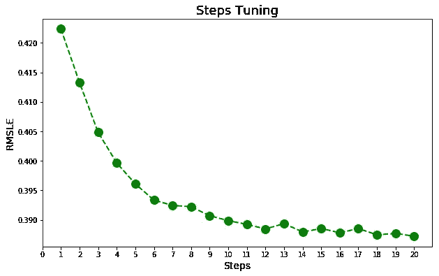

Fig 8) Tuning the number of lags/diff is shown. The x-axis shows the RMSLE error as a function of the steps (number of lags/diffs). The model improves by adding more steps; however, steps more than 14 do not improve the model significantly.

# 调整超参数:

在这一部分，我们将实现网格搜索方法，我们可以通过管道应用它，参见代码 8 A 和 B. C.8.A 代码是从 Sklearn 库借来的。这一部分的目的不是构建一个完全调优的模型。我们试图展示工作流程。稍加调整后，误差变为

> RMSLE= 0.3868

对于这两个超参数{'learning_rate': 0.005，' n_estimators': 1500}。

```
params = {'n_estimators':[100,500,1000,1500,2000],
         'learning_rate':[0.005,.01,.1]}steps_20 = getDataFramePipeline(20)
super_20 = Pipeline(steps_20).fit_transform(df)model_lgbm2 = LGBMRegressor(random_state=0)tune_lgbm =TimeSeriesGridSearch(model = model_lgbm2, cv = kf,
                  param_grid=params,verbosity=False,scoring=rmsle)
```

当最佳调整超参数处于调整参数的边缘时，意味着我们必须重新考虑超参数的范围并重新计算模型，尽管在本文中我们不会这样做。

# 预测与实际销售

图九。显示第 52 周的预测值与销售额。可以看出，该模型对于高达 15 的销售数字工作良好；然而，它对 30 左右的销量预测很差。正如我们在图 7 中所讨论的，我们可能会为不同的销售范围建立不同的模型来克服这个问题，并拥有一个更强大的预测模型，尽管进一步的建模超出了本文的范围，并且本文已经很长了。

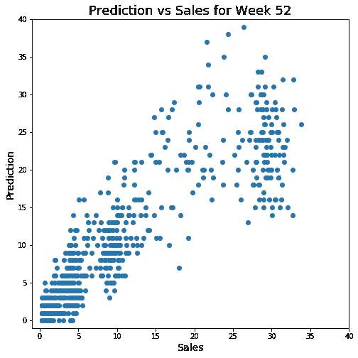

Fig. 9) Prediction of sales vs. real sales number. It is seen that the model works properly for the low number of sales (less than 15); however, it does not work well for a large number of sales. Therefore, this might be a good motivation to build two models for low and high sales items.

最后，图 10 显示了我们预测销售的所有尝试。我们从一个非常简单的假设作为基线开始，并试图通过使用不同的 lags/diff、统计转换和应用不同的机器学习算法来改进预测。基线误差为 0.516，调整后的模型误差为 0.3868，这意味着误差减少了 25%。

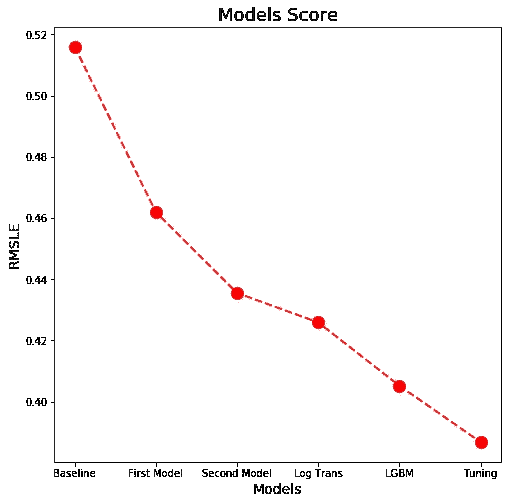

Fig. 10) Our different models score are shown. We could reduce the error of the baseline by 25%.

仍然有许多方法来改进所提出的模型，例如，适当地将产品作为分类变量来处理，更广泛的特征工程，调整超参数，使用各种机器学习算法以及混合和堆叠。

# 结论:

我们建立了一个时间序列预测管道来预测每周的销售交易。我们从一个简单的逻辑假设作为基线模型开始；然后，我们可以通过构建一个包括基本特征工程、统计转换和应用随机森林和 LGBM 并最终对其进行调优的管道，将基线误差降低 25%。此外，我们还讨论了不同的时间序列交叉验证方法。此外，我们展示了如何使用 Sklearn 基类来构建管道。

# 编码:

这篇帖子的完整代码可以在我的 [GitHub](https://github.com/pourya-ir/Medium/blob/master/Time%20Series%20Machine%20Learning%20Regression%20Framework.ipynb) 上找到。

代码 1。

```
class ToSupervised(base.BaseEstimator,base.TransformerMixin):

    def __init__(self,col,groupCol,numLags,dropna=False):

        self.col = col
        self.groupCol = groupCol
        self.numLags = numLags
        self.dropna = dropna

    def fit(self,X,y=None):
        self.X = X
        return self

    def transform(self,X): tmp = self.X.copy()
        for i in range(1,self.numLags+1):
            tmp[str(i)+'_Week_Ago'+"_"+self.col] =
              tmp.groupby([self.groupCol])[self.col].shift(i) 

        if self.dropna:
            tmp = tmp.dropna()
            tmp = tmp.reset_index(drop=True)

        return tmp
```

代码 2。

```
class ToSupervisedDiff(base.BaseEstimator,base.TransformerMixin):

    def __init__(self,col,groupCol,numLags,dropna=False):

        self.col = col
        self.groupCol = groupCol
        self.numLags = numLags
        self.dropna = dropna

    def fit(self,X,y=None):
        self.X = X
        return self

    def transform(self,X):
        tmp = self.X.copy()
        for i in range(1,self.numLags+1):
            tmp[str(i)+'_Week_Ago_Diff_'+"_"+self.col] = 
               tmp.groupby([self.groupCol])[self.col].diff(i) 

        if self.dropna:
            tmp = tmp.dropna()
            tmp = tmp.reset_index(drop=True)

        return tmp
```

代码 3。

```
from itertools import chain
class Kfold_time(object):

    def __init__(self,**options):

        self.target     = options.pop('target', None)
        self.date_col   = options.pop('date_col', None)
        self.date_init  = options.pop('date_init', None)
        self.date_final = options.pop('date_final', None) if options:
            raise TypeError("Invalid parameters passed: %s" %
                               str(options))

        if ((self.target==None )|(self.date_col==None )|
            (self.date_init==None )|(self.date_final==None )):

             raise TypeError("Incomplete inputs")

    def _train_test_split_time(self,X):
        n_arrays = len(X)
        if n_arrays == 0:
            raise ValueError("At least one array required as input") for i in range(self.date_init,self.date_final): train = X[X[self.date_col] < i]
            val   = X[X[self.date_col] == i] X_train, X_test = train.drop([self.target], axis=1),
                                val.drop([self.target], axis=1) y_train, y_test = train[self.target].values,
                               val[self.target].values yield X_train, X_test, y_train, y_test def split(self,X):
        cv_t = self._train_test_split_time(X)
        return chain(cv_t)
```

代码 4。

```
class BaseEstimator(base.BaseEstimator, base.RegressorMixin):
    def __init__(self, predCol):
        """
            As a base model we assume the number of sales 
            last week and this week are the same
            Input: 
                    predCol: l-week ago sales
        """
        self.predCol = predCol def fit(self, X, y):
        return self def predict(self, X):
        prediction = X[self.predCol].values
        return prediction def score(self, X, y,scoring):

        prediction = self.predict(X)

        error =scoring(y, prediction) return error
```

代码 5。

```
class TimeSeriesRegressor(base.BaseEstimator, base.RegressorMixin):

    def __init__(self,model,cv,scoring,verbosity=True):
        self.model = model
        self.cv = cv
        self.verbosity = verbosity
        self.scoring = scoring 

    def fit(self,X,y=None):
        return self

    def predict(self,X=None):

        pred = {}
        for indx,fold in enumerate(self.cv.split(X)): X_train, X_test, y_train, y_test = fold    
            self.model.fit(X_train, y_train)
            pred[str(indx)+'_fold'] = self.model.predict(X_test)

        prediction = pd.DataFrame(pred)

        return prediction def score(self,X,y=None): errors = []
        for indx,fold in enumerate(self.cv.split(X)): X_train, X_test, y_train, y_test = fold    
            self.model.fit(X_train, y_train)
            prediction = self.model.predict(X_test)
            error = self.scoring(y_test, prediction)
            errors.append(error) if self.verbosity:
                print("Fold: {}, Error: {:.4f}".format(indx,error)) if self.verbosity:
            print('Total Error {:.4f}'.format(np.mean(errors))) return errors
```

代码 6。

```
class TimeSeriesRegressorLog(base.BaseEstimator,
                                 base.RegressorMixin):

    def __init__(self,model,cv,scoring,verbosity=True):
        self.model = model
        self.cv = cv
        self.verbosity = verbosity
        self.scoring = scoring

    def fit(self,X,y=None):
        return self

    def predict(self,X=None):

        pred = {}
        for indx,fold in enumerate(self.cv.split(X)): X_train, X_test, y_train, y_test = fold    
            self.model.fit(X_train, y_train)
            pred[str(indx)+'_fold'] = self.model.predict(X_test)

        prediction = pd.DataFrame(pred)

        return prediction def score(self,X,y=None):#**options): errors = []
        for indx,fold in enumerate(self.cv.split(X)): X_train, X_test, y_train, y_test = fold    
            self.model.fit(X_train, np.log1p(y_train))
            prediction = np.expm1(self.model.predict(X_test))
            error = self.scoring(y_test, prediction)
            errors.append(error) if self.verbosity:
                print("Fold: {}, Error: {:.4f}".format(indx,error)) if self.verbosity:
            print('Total Error {:.4f}'.format(np.mean(errors))) return errors
```

代码 7。

答:

```
def getDataFramePipeline(i):
    steps = [(str(i)+'_step',
              ToSupervised('Sales','Product_Code',i))]
    for j in range(1,i+1):
        if i==j: pp = (str(j)+'_step_diff',
                  ToSupervisedDiff(str(i)+'_Week_Ago_Sales',
                                   'Product_Code',1,dropna=True)) steps.append(pp)
        else: pp = (str(j)+'_step_diff',  
                  ToSupervisedDiff(str(i)+'_Week_Ago_Sales',
                                   'Product_Code',1)) steps.append(pp)

    return steps
```

乙:

```
from tqdm import tqdm
def stepsTune(X,model,num_steps,init=1):
    scores = []
    for i in tqdm(range(init,num_steps+1)):
        steps = []
        steps.extend(getDataFramePipeline(i))
        steps.append(('predic_1',model))
        super_ = Pipeline(steps).fit(X)
        score_ = np.mean(super_.score(X))
        scores.append((i,score_))

    return scores
```

代码 8。

答:

```
from collections.abc import Mapping, Sequence, Iterable
from itertools import product
from functools import partial, reduce
import operatorclass TimeGridBasic(base.BaseEstimator, base.RegressorMixin):

    def __init__(self,param_grid):

        if not isinstance(param_grid, (Mapping, Iterable)):
                raise TypeError('Parameter grid is not a dict or '
                                'a list ({!r})'.format(param_grid)) if isinstance(param_grid, Mapping):
                # wrap dictionary in a singleton list to support
                  either dict
                # or list of dicts
                param_grid = [param_grid] if isinstance(param_grid, Mapping):
                # wrap dictionary in a singleton list to support
                  either dict
                # or list of dicts
                param_grid = [param_grid] # check if all entries are dictionaries of lists
        for grid in param_grid:
            if not isinstance(grid, dict):
                raise TypeError('Parameter grid is not a '
                                'dict ({!r})'.format(grid))
            for key in grid:
                if not isinstance(grid[key], Iterable):
                    raise TypeError('Parameter grid value is not
                                     iterable '
                                    '(key={!r}, value={!r})'
                                    .format(key, grid[key])) self.param_grid = param_grid

    def __iter__(self):
        """Iterate over the points in the grid.
        Returns
        -------
        params : iterator over dict of string to any
            Yields dictionaries mapping each estimator parameter to
            one of its
            allowed values.
        """
        for p in self.param_grid:
            # Always sort the keys of a dictionary, for
             reproducibility
            items = sorted(p.items())
            if not items:
                yield {}
            else:
                keys, values = zip(*items)
                for v in product(*values):
                    params = dict(zip(keys, v))
                    yield params
```

乙:

```
class TimeSeriesGridSearch(TimeGridBasic,base.BaseEstimator,
                              base.RegressorMixin):

    def __init__(self,**options):

        self.model      = options.pop('model', None)
        self.cv         = options.pop('cv', None)
        self.verbosity  = options.pop('verbosity', False)
        self.scoring    = options.pop('scoring', None)
        param_grid      = options.pop('param_grid', None)
        self.param_grid = TimeGridBasic(param_grid)

        if options:
            raise TypeError("Invalid parameters passed: %s" %
                              str(options)) if ((self.model==None )| (self.cv==None)):
            raise TypeError("Incomplete inputs")

    def fit(self,X,y=None):
        self.X = X
        return self def _get_score(self,param): errors = []
        for indx,fold in enumerate(self.cv.split(self.X)): X_train, X_test, y_train, y_test = fold    
            self.model.set_params(**param).fit(X_train, y_train)
            prediction = self.model.predict(X_test)
            error = self.scoring(y_test, prediction)
            errors.append(error) if self.verbosity:
                print("Fold: {}, Error: {:.4f}".format(indx,error)) if self.verbosity:
            print('Total Error {:.4f}'.format(np.mean(errors)))

        return errors def score(self): errors=[]
        get_param = []
        for param in self.param_grid:

            if self.verbosity:
                print(param)

            errors.append(np.mean(self._get_score(param)))
            get_param.append(param) self.sorted_errors,self.sorted_params = 
          (list(t) for t in zip(*sorted(zip(errors,get_param))))

        return self.sorted_errors,self.sorted_params

    def best_estimator(self,verbosity=False): if verbosity:
            print('error: {:.4f} \n'.format(self.sorted_errors[0]))
            print('Best params:')
            print(self.sorted_params[0]) return self.sorted_params[0]
```