# 价格异常检测的时间序列

> 原文：<https://towardsdatascience.com/time-series-of-price-anomaly-detection-13586cd5ff46?source=collection_archive---------1----------------------->


Photo credit: Pixabay

## 异常检测会检测数据中与其余数据不匹配的数据点。

也称为异常检测，异常检测是一个数据挖掘过程，用于确定在数据集中发现的异常类型，并确定其发生的详细信息。在当今世界，自动异常检测至关重要，因为海量数据使得无法手动标记异常值。自动异常检测有着广泛的应用，如欺诈检测、系统健康监控、故障检测以及传感器网络中的事件检测系统等。

但我想对酒店房价进行异常检测。原因有些自私。

你有过这样的经历吗，比如说，你经常去某个目的地出差，并且总是住在同一家酒店。虽然大多数情况下，房价几乎是相似的，但偶尔对于同一家酒店，同一种房间类型，房价高得令人无法接受，你必须换到另一家酒店，因为你的差旅补助不包括该房价。我已经经历过几次了，这让我想到，如果我们可以创建一个模型来自动检测这种价格异常会怎么样？

当然，有些情况下，一些异常现象一生只会发生一次，我们已经提前知道了它们，并且很可能在未来几年内不会在同一时间发生，例如 2019 年 2 月 2 日至 2 月 4 日亚特兰大荒谬的酒店价格。


Figure 1

在这篇文章中，我将探索不同的异常检测技术，我们的目标是用无监督学习来搜索酒店房价时间序列中的异常。我们开始吧！

# 数据

很难得到数据，我能得到一些，但数据并不完美。

我们将要使用的数据是[个性化 Expedia 酒店搜索](https://www.kaggle.com/c/expedia-personalized-sort/data)数据集的子集，可以在[这里](https://www.kaggle.com/c/expedia-personalized-sort/data)找到。

我们将对 training.csv 集合的子集进行切片，如下所示:

*   选择一家拥有最多数据点`property_id = 104517`的酒店。
*   选择`visitor_location_country_id = 219`，因为我们从另一个分析中知道国家 id 219 是美国。我们这样做的原因是为了统一`price_usd`栏目。因为不同的国家有不同的关于显示税费和费用的惯例，并且该值可以是每晚或整个住宿。我们知道展示给我们游客的价格总是每晚不含税。
*   选择`search_room_count = 1`。
*   选择我们需要的特征:`date_time`、`price_usd`、`srch_booking_window`、`srch_saturday_night_bool`。

```
expedia = pd.read_csv('expedia_train.csv')
df = expedia.loc[expedia['prop_id'] == 104517]
df = df.loc[df['srch_room_count'] == 1]
df = df.loc[df['visitor_location_country_id'] == 219]
df = df[['date_time', 'price_usd', 'srch_booking_window', 'srch_saturday_night_bool']]
```

经过切片和切块后，这是我们将要处理的数据:

```
df.info()
```

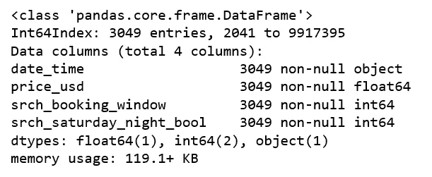

Figure 2

```
df['price_usd'].describe()
```

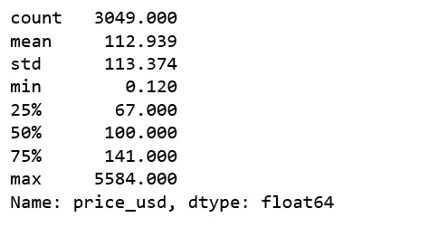

在这一点上，我们已经发现了一个极端的异常情况，即最高价格为 5584 美元。

如果一个单独的数据实例相对于其余的数据可以被认为是异常的，我们称之为*(例如，大额交易的采购)。我们可以回去查看日志，看看是关于什么的。经过一点点调查，我猜想这要么是一个错误，要么是用户偶然搜索了一个总统套房，并没有打算预订或查看。为了找到更多不极端的异常，我决定去掉这个。*

```
*expedia.loc[(expedia['price_usd'] == 5584) & (expedia['visitor_location_country_id'] == 219)]*
```

*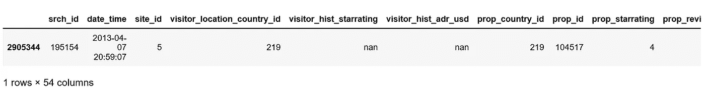*

*Figure 3*

```
*df = df.loc[df['price_usd'] < 5584]*
```

*在这一点上，我相信您已经发现我们遗漏了一些东西，也就是说，我们不知道用户搜索的房间类型，标准房的价格可能与海景特大床房的价格相差很大。记住这一点，为了演示的目的，我们必须继续。*

# *时间序列可视化*

```
*df.plot(x='date_time', y='price_usd', figsize=(12,6))
plt.xlabel('Date time')
plt.ylabel('Price in USD')
plt.title('Time Series of room price by date time of search');*
```

*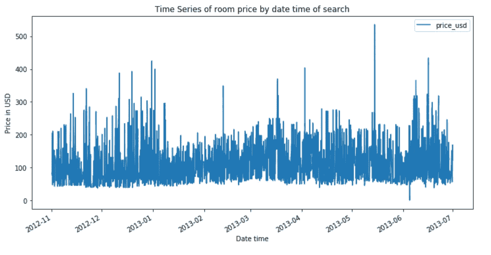*

*Figure 4*

```
*a = df.loc[df['srch_saturday_night_bool'] == 0, 'price_usd']
b = df.loc[df['srch_saturday_night_bool'] == 1, 'price_usd']
plt.figure(figsize=(10, 6))
plt.hist(a, bins = 50, alpha=0.5, label='Search Non-Sat Night')
plt.hist(b, bins = 50, alpha=0.5, label='Search Sat Night')
plt.legend(loc='upper right')
plt.xlabel('Price')
plt.ylabel('Count')
plt.show();*
```

*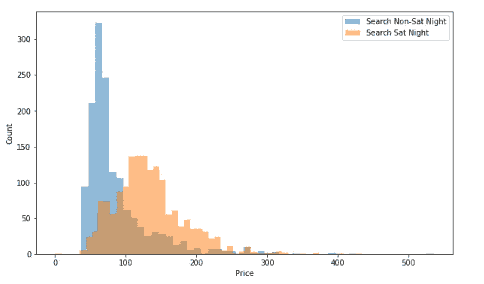*

*Figure 5*

*总的来说，非周六晚上搜索，价格更稳定，更低。周六晚上搜索时价格会上涨。似乎这家酒店在周末很受欢迎。*

# ***基于聚类的异常检测***

## ***k 均值算法***

*k-means 是一种广泛使用的聚类算法。它创建了“k”个相似的数据点聚类。不属于这些组的数据实例可能会被标记为异常。在开始 k-means 聚类之前，我们使用 elbow 方法来确定最佳的聚类数。*

*elbow_curve.py*

*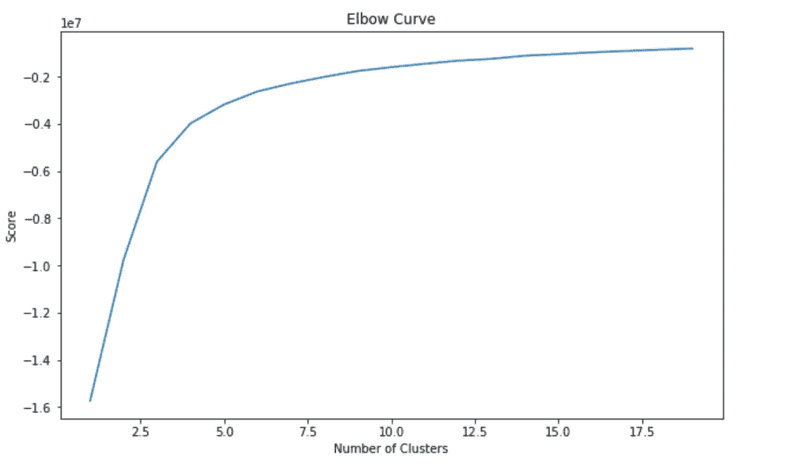*

*Figure 6*

*从上面的肘形曲线中，我们看到该图在 10 个聚类之后变平，这意味着增加更多的聚类并不能解释我们的相关变量中更多的变化；在这个案例中`price_usd`。*

*我们设置`n_clusters=10`，并在生成 k-means 输出时使用数据来绘制 3D 聚类。*

*k-means_3D.py*

*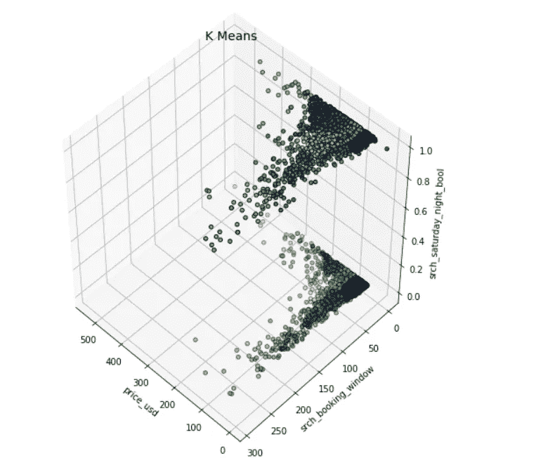*

*Figure 7*

*现在我们需要找出要保留的组件(特性)的数量。*

*PCA.py*

*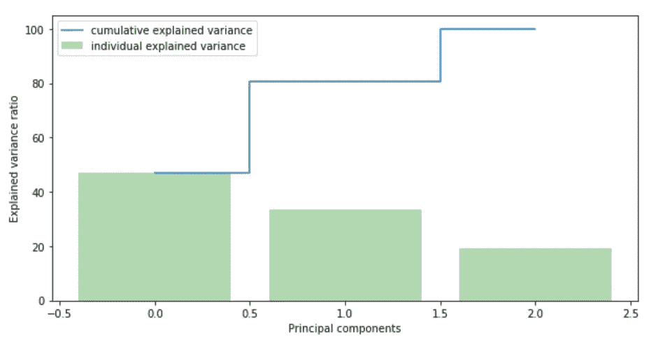*

*Figure 8*

*我们看到第一个因素解释了将近 50%的差异。第二个成分解释了 30%以上。然而，我们必须注意到，几乎没有一个组件是真正可以忽略的。前两个组件包含 80%以上的信息。所以，我们将设置`n_components=2`。*

*基于聚类的异常检测中强调的假设是，如果我们对数据进行聚类，正常数据将属于聚类，而异常将不属于任何聚类或属于小聚类。我们使用以下步骤来查找和可视化异常。*

*   *计算每个点与其最近质心之间的距离。最大的距离被认为是异常。*
*   *我们使用`outliers_fraction`向算法提供关于数据集中异常值比例的信息。不同数据集的情况可能有所不同。然而，作为一个起始数字，我估计了`outliers_fraction=0.01`，因为它是在标准化正态分布中，Z 得分距离平均值超过绝对值 3 的观察值的百分比。*
*   *使用`outliers_fraction`计算`number_of_outliers`。*
*   *将`threshold`设为这些异常值的最小距离。*
*   *`anomaly1`的异常结果包含上述方法簇(0:正常，1:异常)。*
*   *使用集群视图可视化异常。*
*   *用时序视图可视化异常。*

*viz_cluster_view.py*

*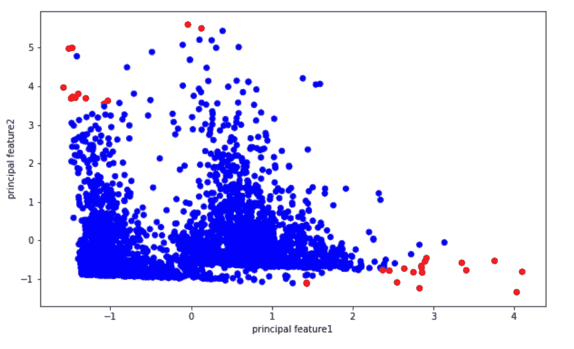*

*Figure 9*

*viz_time_series_view.py*

*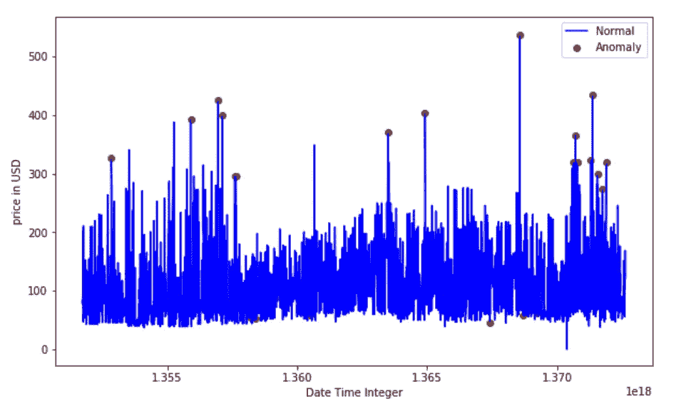*

*Figure 10*

*似乎 k-均值聚类检测到的异常要么是一些非常高的比率，要么是一些非常低的比率。*

# ***隔离森林**进行**正常检测***

*[隔离林](https://scikit-learn.org/stable/modules/generated/sklearn.ensemble.IsolationForest.html)纯粹基于异常是少量且不同的数据点这一事实来检测异常。异常隔离是在不采用任何距离或密度测量的情况下实现的。这种方法从根本上不同于基于聚类或基于距离的算法。*

*   *当应用一个 [IsolationForest](https://scikit-learn.org/stable/modules/generated/sklearn.ensemble.IsolationForest.html) 模型时，我们设置`contamination = outliers_fraction`，也就是告诉模型数据集中异常值的比例是 0.01。*
*   *`fit`和`predict(data)`对数据进行离群点检测，正常返回 1，异常返回-1。*
*   *最后，我们用时间序列视图可视化异常。*

*IsolationForest.py*

*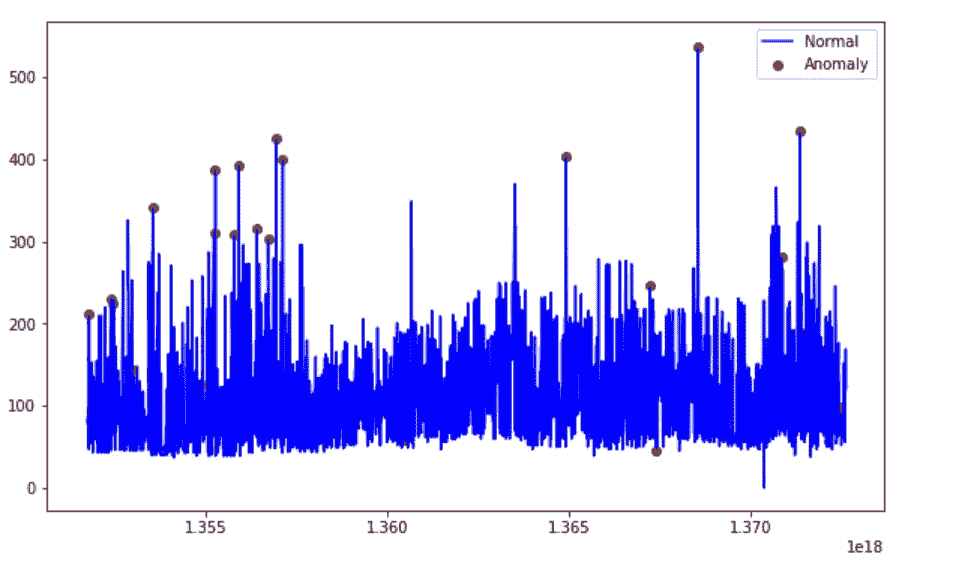*

*Figure 11*

# ***基于支持向量机的异常检测***

*一个 [SVM](https://en.wikipedia.org/wiki/Support-vector_machine) 通常与监督学习相关联，但 [OneClassSVM](https://en.wikipedia.org/wiki/Support-vector_machine) 可用于将异常识别为一个非监督问题，该问题学习异常检测的决策函数:将新数据分类为与训练集相似或不同。*

## *OneClassSVM*

*根据论文:[支持向量机方法进行新颖性检测](http://users.cecs.anu.edu.au/~williams/papers/P126.pdf)。支持向量机是最大边际方法，即它们不模拟概率分布。用于异常检测的 SVM 的思想是找到一个函数，该函数对于具有高密度点的区域是正的，而对于低密度点的区域是负的。*

*   *在拟合 [OneClassSVM](https://scikit-learn.org/stable/modules/generated/sklearn.svm.OneClassSVM.html#sklearn.svm.OneClassSVM) 模型时，我们设置`nu=outliers_fraction`，它是训练误差分数的上界，也是支持向量分数的下界，必须在 0 到 1 之间。基本上这意味着在我们的数据中我们期望的异常值的比例。*
*   *指定算法中使用的内核类型:`rbf`。这将使 SVM 能够使用非线性函数将超空间投影到更高维度。*
*   *`gamma`是 RBF 内核类型的参数，控制单个训练样本的影响——这会影响模型的“平滑度”。通过实验，我没有发现任何显著的差异。*
*   *`predict(data)`对数据进行分类，由于我们的模型是单类模型，所以返回+1 或-1，-1 为异常，1 为正常。*

*OneClassSVM.py*

*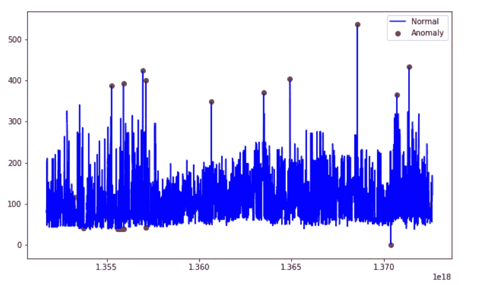*

*Figure 12*

# *使用高斯分布的异常检测*

*高斯分布也叫正态分布。我们将使用高斯分布来开发异常检测算法，也就是说，我们将假设我们的数据是正态分布的。这是一个假设，不能适用于所有的数据集，但当它适用时，它证明了一个发现异常值的有效方法。*

*Scikit-Learn 的`[**covariance.EllipticEnvelope**](https://scikit-learn.org/stable/modules/generated/sklearn.covariance.EllipticEnvelope.html)`是一个函数，它试图通过假设我们的整个数据是一个潜在的多元高斯分布的表达式来计算出我们数据的总体分布的关键参数。过程大概是这样的:*

*   *基于前面定义的类别创建两个不同的数据集，search_Sat_night，Search_Non_Sat_night。*
*   *在每个类别应用`EllipticEnvelope`(高斯分布)。*
*   *我们设置`contamination`参数，它是数据集中异常值的比例。*
*   *我们使用`decision_function`来计算给定观测值的决策函数。它等于移动后的马氏距离。作为异常值的阈值是 0，这确保了与其他异常值检测算法的兼容性。*
*   *`predict(X_train)`根据拟合的模型预测 X_train 的标签(1 个正常，-1 个异常)。*

*EllipticEnvelope.py*

*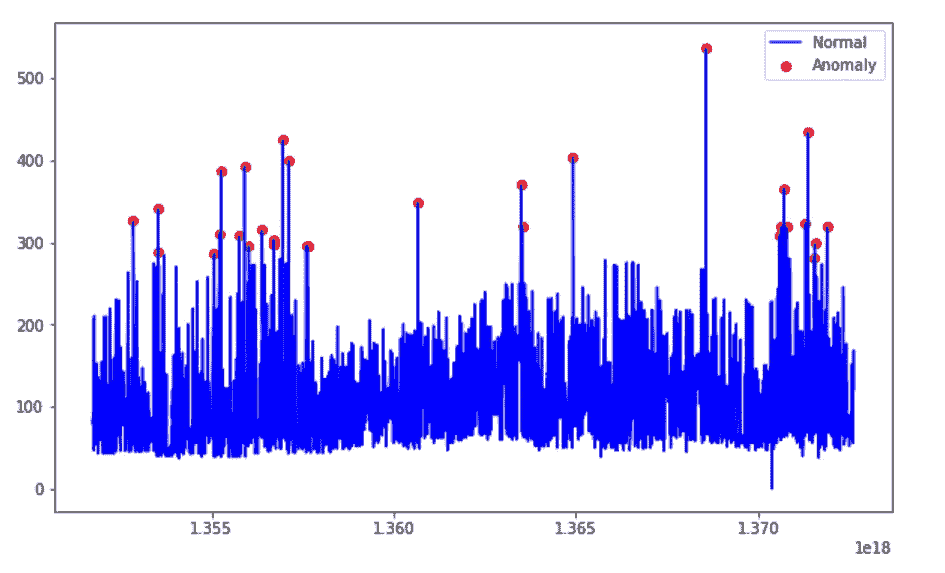*

*Figure 13*

*有趣的是，通过这种方式发现的异常只观察到了异常高的价格，而没有观察到异常低的价格。*

*到目前为止，我们已经用四种不同的方法进行了价格异常检测。因为我们的异常检测是无监督学习。在建立模型之后，我们不知道它做得有多好，因为我们没有任何东西可以测试它。因此，在将这些方法应用于关键路径之前，需要对其结果进行实地测试。*

*[Jupyter 笔记本](https://github.com/susanli2016/Machine-Learning-with-Python/blob/master/Time%20Series%20of%20Price%20Anomaly%20Detection%20Expedia.ipynb)可以在 [Github](https://github.com/susanli2016/Machine-Learning-with-Python/blob/master/Time%20Series%20of%20Price%20Anomaly%20Detection%20Expedia.ipynb) 上找到。享受这周剩下的时光吧！*

*参考资料:*

*[](https://www.datascience.com/blog/python-anomaly-detection) [## 异常检测简介

### 特定主题的经验:新手专业经验:无行业经验本概述旨在…

www.datascience.com](https://www.datascience.com/blog/python-anomaly-detection) [](https://scikit-learn.org/stable/modules/generated/sklearn.ensemble.IsolationForest.html) [## sk learn . ensemble . isolation forest-sci kit-learn 0 . 20 . 2 文档

### decision_function 的行为可以是“旧的”或“新的”。传递行为= '新'使…

scikit-learn.org](https://scikit-learn.org/stable/modules/generated/sklearn.ensemble.IsolationForest.html) [](https://scikit-learn.org/stable/modules/generated/sklearn.svm.OneClassSVM.html) [## sk learn . SVM . oneclasssvm-sci kit-learn 0 . 20 . 2 文档

### 指定要在算法中使用的内核类型。它必须是“线性”、“多边形”、“rbf”、“sigmoid”中的一个…

scikit-learn.org](https://scikit-learn.org/stable/modules/generated/sklearn.svm.OneClassSVM.html) [](https://scikit-learn.org/stable/modules/generated/sklearn.covariance.EllipticEnvelope.html) [## sklearn .协方差. elliptic envelope-sci kit-learn 0 . 20 . 2 文档

### 如果为真，则计算稳健位置和协方差估计的支持，并且重新计算协方差估计…

scikit-learn.org](https://scikit-learn.org/stable/modules/generated/sklearn.covariance.EllipticEnvelope.html)  [## 无监督异常检测| Kaggle

### 编辑描述

www.kaggle.com](https://www.kaggle.com/victorambonati/unsupervised-anomaly-detection)*