# Python 中使用 Prophet 进行时间序列预测

> 原文：<https://towardsdatascience.com/time-series-prediction-using-prophet-in-python-35d65f626236?source=collection_archive---------1----------------------->

***在本帖中我们将探讨 facebook 的时间序列模型先知。我们将了解什么是先知和它的优势。我们探索 Prophet 使用一个数据集来了解变化点，如何包括假期，最后使用多个回归变量进行时间序列预测。***


# 什么是先知？

Prophet 是 facebooks 的开源时间序列预测。Prophet 将时间序列分解为趋势性、季节性和假日性。它有直观的超级参数，很容易调整。

> 先知时间序列=趋势+季节性+假日+误差

*   趋势对时间序列值的非周期性变化进行建模。
*   季节性是周期性变化，如每日、每周或每年的季节性。
*   在一天或一段时间内不定期发生的假日效应。
*   误差项是模型无法解释的。

# 使用 Prophet 的优势

*   适应多个时期的季节性
*   先知对缺失的价值观有弹性
*   处理 Prophet 中异常值的最佳方法是删除它们
*   模型的拟合是快速的
*   易于调整的直观超级参数

# 安装 Prophet

使用命令提示符或使用 pip 的 Anaconda 提示符安装 Prophet

```
**pip install fbprophet**
```

我们也可以安装 plotly 为 prophet 绘制数据

```
**pip install plotly**
```

# 为 Prophet 创建输入数据

**Prophet 的输入是一个至少有两列的数据帧:ds 和 y。**

**ds 是日期戳列**，应该符合 pandas **datatime 格式，时间戳为 YYYY-MM-DD 或 YYYY-MM-DD HH:MM:SS。**

**y 是我们要预测或预报的数值列。**

Prophet 遵循 sklearn 模型 API 创建 Prophet 的实例，拟合 Prophet 对象上的数据，然后预测未来值。

*我们现在直接进入代码，看看变化点，如何包括假期，然后添加多个回归变量。*

[文章中使用了鳄梨数据集](https://www.kaggle.com/neuromusic/avocado-prices#avocado.csv)

## 导入所需的库

```
from fbprophet import Prophet
from fbprophet.plot import plot_plotly
import numpy as np
import pandas as pdimport matplotlib.pyplot as plt
import plotly.offline as py
py.init_notebook_mode()
%matplotlib inline
```

## 从 csv 文件中读取数据

```
dataset= pd.read_csv(“C:\\avocado-prices\\avocado.csv”)
```

## 理解数据

让我们首先来看看列和数据

```
dataset.head(2)
```

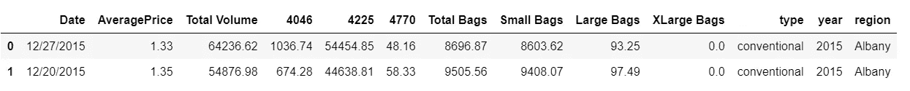

让我们打印关于数据集的信息，包括列、列的数据类型以及列是否为空

```
dataset.info()
```

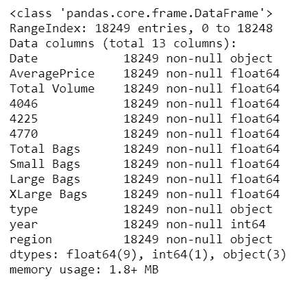

我们看到两个分类变量，类型和地区。让我们检查一下

```
dataset.describe(include=’O’)
```

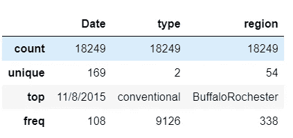

## 使用 LabelEncoder 将分类变量转换为数值

我们将具有两个不同值的分类变量 type 转换为数值。为了将分类变量转换成数值，我们使用了 LabelEncoder。在这个例子中，我们没有转换分类变量 region。

```
**from sklearn.preprocessing import LabelEncoder**le = LabelEncoder()
dataset.iloc[:,10] = le.fit_transform(dataset.iloc[:,10])
dataset.head(2)
```

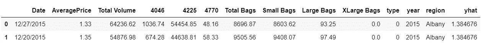

type is now converted to numeric

## 创建输入要素(X)和目标变量(y)

```
X= dataset[['Date',‘Total Volume’, ‘4046’, ‘4225’, ‘4770’,
 ‘Small Bags’, ‘Large Bags’, ‘XLarge Bags’, ‘type’]]
y= dataset.iloc[:,1]
```

**为 Prophet 创建数据集**

如前所述，Prophet 的输入是一个至少包含两列的数据帧:ds 和 y

```
train_dataset= pd.DataFrame()
train_dataset['ds'] = pd.to_datetime(X["Date"])
train_dataset['y']=y
train_dataset.head(2)
```

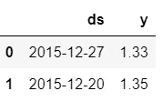

## 使用默认值创建和拟合 Prophet 模型

我们将首先探索默认的 Prophet 模型。使用所有默认值创建 Prophet 实例，以适应数据集。

```
**prophet_basic = Prophet()
prophet_basic.fit(train_dataset)**
```

## 预测未来的价值

为了使用 Prophet 预测值，我们需要创建一个带有 ds(datetime stamp)的 dataframe，其中包含我们要进行预测的日期。

我们用***make _ future _ data frame()***给我们指定的天数延伸到未来。默认情况下，它包括历史记录中的日期

```
**future= prophet_basic.make_future_dataframe(periods=300)
future.tail(2)**
```

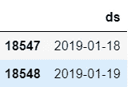

原始数据集中的总行数是 18249，我们看到我们为预测创建的未来数据框包含历史日期和另外 300 个日期。

```
**forecast=prophet_basic.predict(future)**
```

## 绘制预测数据

```
fig1 =prophet_basic.plot(forecast)
```

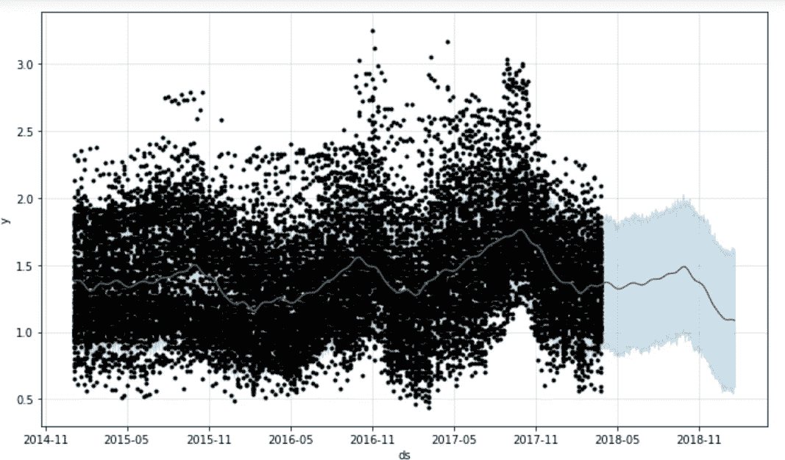

## 绘制预测组件

我们可以绘制趋势和季节性，预测的组成部分。

```
fig1 = prophet_basic.plot_components(forecast)
```

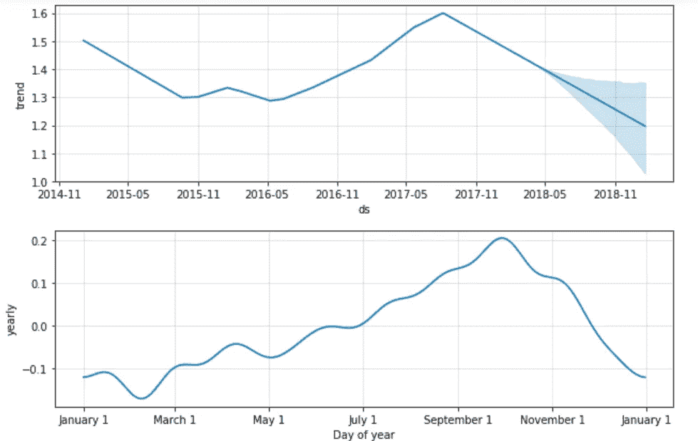

Components of the forecast

## 给先知增加改变点

变点是时间序列在轨迹中发生突变的日期时间点。

默认情况下，Prophet 向数据集的最初 80%添加 25 个变点。

让我们画出发生潜在变化点的垂直线

```
**from fbprophet.plot import add_changepoints_to_plot**fig = prophet_basic.plot(forecast)
**a = add_changepoints_to_plot(fig.gca(), prophet_basic, forecast)**
```

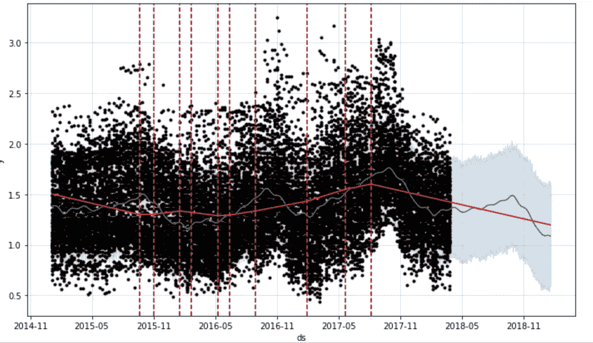

Vertical lines are where changepoints occurred

我们可以查看变化点发生的日期

```
**prophet_basic.changepoints**
```

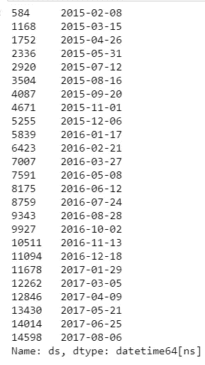

我们可以通过设置 ***变点 _ 范围*** 来改变推断的变点范围

```
**pro_change= Prophet(changepoint_range=0.9)**forecast = pro_change.fit(train_dataset).predict(future)
fig= pro_change.plot(forecast);
a = add_changepoints_to_plot(fig.gca(), pro_change, forecast)
```

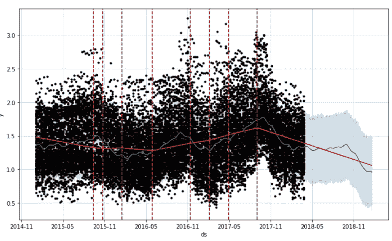

在初始化 prophet 时，可以使用***n _ change points***参数设置变点数

```
**pro_change= Prophet(n_changepoints=20, yearly_seasonality=True)**forecast = pro_change.fit(train_dataset).predict(future)
fig= pro_change.plot(forecast);
a = add_changepoints_to_plot(fig.gca(), pro_change, forecast)
```

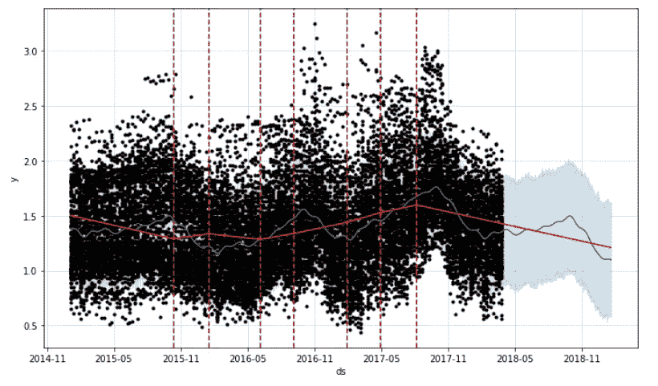

## 调整趋势

Prophet 允许您调整趋势，以防过度拟合或拟合不足。***change point _ prior _ scale***帮助调整趋势的强弱。

***change point _ prior _ scale 的默认值为*** 0.05。减小该值会降低趋势的灵活性。增加***change point _ prior _ scale***的值，使趋势*更加*灵活。

将***change point _ prior _ scale***增加到 0.08，使趋势更加灵活

```
**pro_change= Prophet(n_changepoints=20, yearly_seasonality=True, changepoint_prior_scale=0.08)**
forecast = pro_change.fit(train_dataset).predict(future)
fig= pro_change.plot(forecast);
a = add_changepoints_to_plot(fig.gca(), pro_change, forecast)
```

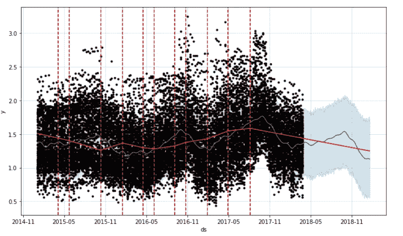

将***change point _ prior _ scale***减小至 0.001，以降低趋势的灵活性

```
**pro_change= Prophet(n_changepoints=20, yearly_seasonality=True, changepoint_prior_scale=0.001**)
forecast = pro_change.fit(train_dataset).predict(future)
fig= pro_change.plot(forecast);
a = add_changepoints_to_plot(fig.gca(), pro_change, forecast)
```

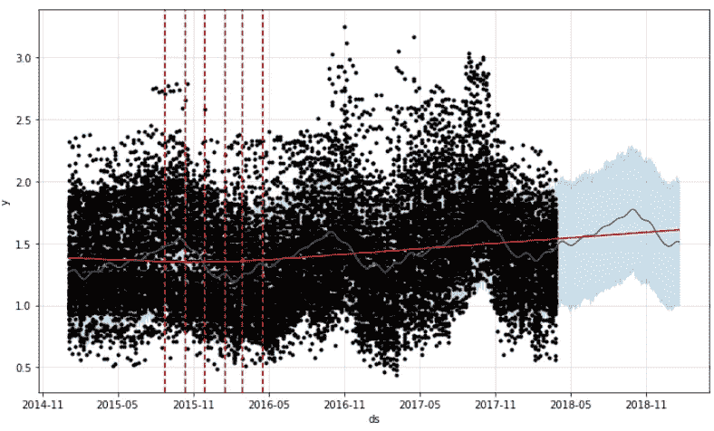

## 添加假日

节假日和事件会导致时间序列发生变化。在我们的例子中，7 月 31 日的全国鳄梨日和 9 月 16 日的鳄梨日会影响鳄梨的价格。

我们可以通过创建一个包含两列 ds 和 holiday 的 dataframe 来为 Prophet 创建一个定制的假日列表。假日的每一个事件占一行

```
**avocado_season = pd.DataFrame({
  'holiday': 'avocado season',
  'ds': pd.to_datetime(['2014-07-31', '2014-09-16', 
                        '2015-07-31', '2015-09-16',
                        '2016-07-31', '2016-09-16',
                        '2017-07-31', '2017-09-16',
                       '2018-07-31', '2018-09-16',
                        '2019-07-31', '2019-09-16']),
  'lower_window': -1,
  'upper_window': 0,
})**
```

下部窗口和上部窗口将假期延长至日期前后的天。如果我们想包含国家鳄梨日和鳄梨酱日之前的一天，我们设置***lower _ window:-1 upper _ window:0***

如果我们想使用假期后的一天，那么设置***lower _ window:0 upper _ window:1***

```
pro_holiday= Prophet(**holidays=avocado_season**)
pro_holiday.fit(train_dataset)
future_data = pro_holiday.make_future_dataframe(periods=12, freq = 'm')

#forecast the data for future dataforecast_data = pro_holiday.predict(future_data)
pro_holiday.plot(forecast_data);
```

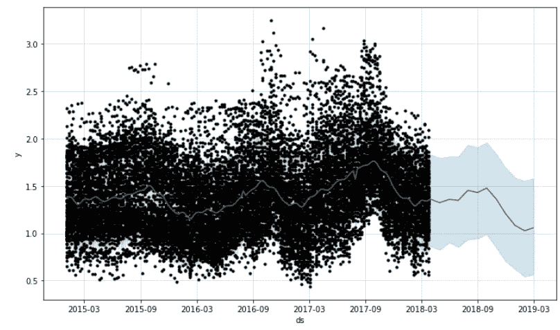

## 添加多个回归变量

可以向 Prophet 模型中添加额外的回归变量。这是通过使用 ***add_regressor 来完成的。拟合和预测数据框架中都需要有额外的回归变量*** 列值。

使用附加回归量创建拟合和预测数据集

```
train_dataset[‘type’] = X[‘type’]
train_dataset[‘Total Volume’] = X[‘Total Volume’]
train_dataset[‘4046’] = X[‘4046’]
train_dataset[‘4225’] = X[‘4225’]
train_dataset[‘4770’] = X[‘4770’]
train_dataset[‘Small Bags’] = X[‘Small Bags’]train_X= train_dataset[:18000]
test_X= train_dataset[18000:]
```

我们对数据集进行了分割，以展示额外回归变量的使用，因为我们需要拟合和预测数据框中所有额外回归变量的值

```
#Additional Regressor
**pro_regressor= Prophet()
pro_regressor.add_regressor('type')
pro_regressor.add_regressor('Total Volume')
pro_regressor.add_regressor('4046')
pro_regressor.add_regressor('4225')
pro_regressor.add_regressor('4770')
pro_regressor.add_regressor('Small Bags')**#Fitting the data
**pro_regressor.fit(train_X)
future_data = pro_regressor.make_future_dataframe(periods=249)**#forecast the data for Test  data
**forecast_data = pro_regressor.predict(test_X)**
pro_regressor.plot(forecast_data);
```

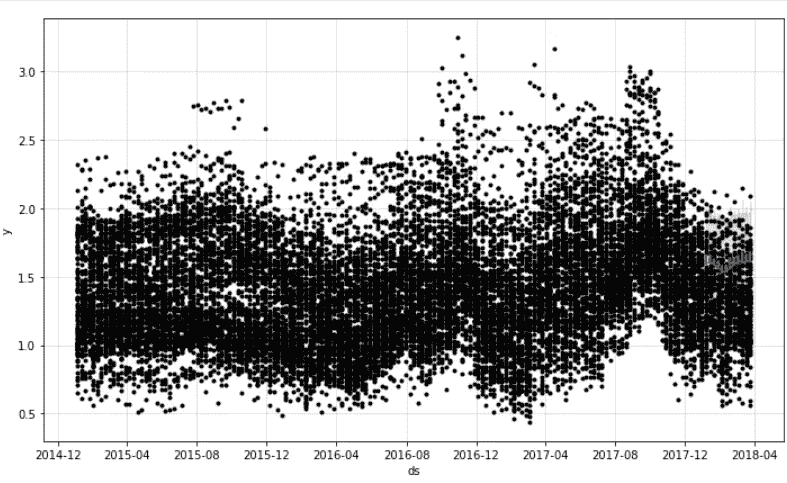

Prediction using additional regressor

预测数据是最后的蓝色阴影区域。

Jupyter 笔记本可用[此处](https://github.com/arshren/TimeSeries/blob/master/Prophet_Avacado.ipynb)

# 参考资料:

[https://facebook.github.io/prophet/docs/quick_start.html](https://facebook.github.io/prophet/docs/quick_start.html)

[https://peerj.com/preprints/3190.pdf](https://peerj.com/preprints/3190.pdf)