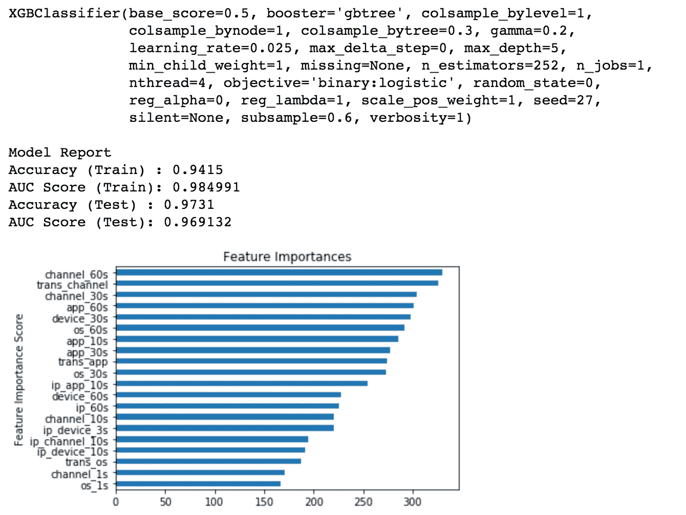

# 是时候停止在虚假点击上浪费金钱了！

> 原文：<https://towardsdatascience.com/time-to-stop-wasting-money-on-fake-clicks-83040d2ec0c2?source=collection_archive---------20----------------------->

## 用机器学习处理点击欺诈

Image source: [https://www.bankinfosecurity.com/click-fraud-kingpin-receives-7-year-sentence-a-9072](https://www.bankinfosecurity.com/click-fraud-kingpin-receives-7-year-sentence-a-9072)

# 什么是点击欺诈？

隐藏在 300×250 像素横幅后面的是一个复杂的数字广告生态系统。与传统广告业相比，互联网时代的新商业模式涉及广告专员(也称为广告网络)，充当广告商和内容出版商之间的经纪人。

广告商计划预算，向专员提供广告，并就每个客户行为(例如，点击广告、填写表格、在拍卖中出价等)商定佣金。内容发行商与专员签订合同，在他们的网站上显示广告，并根据它给广告商带来的流量获得佣金。然而，这种模式可能会刺激不诚实的出版商在他们的网站上产生非法点击——这是一个被称为**点击欺诈**的主要问题。

# 数据介绍

这篇文章描述了我的个人机器学习项目，即针对移动应用广告的点击欺诈预测。所有的源代码都可以在我的 Github 上找到:[https://github.com/jystacy/Click_Fraud](https://github.com/jystacy/Click_Fraud)。这个项目来源于 Kaggle 的 [TalkingData AdTracking 欺诈检测挑战赛](https://www.kaggle.com/c/talkingdata-adtracking-fraud-detection/overview)，旨在预测用户点击移动应用广告后是否会下载某个应用。这个人工数据集的整个时间范围包括 27 分钟。

数据集的每一行都包含一条点击记录，具有以下特征:

*   `ip`:点击的 ip 地址。
*   `app`:营销用 app id。
*   `device`:用户手机的设备类型 id(如 iphone 6 plus、iphone 7、华为 mate 7 等。)
*   `os`:用户手机的 os 版本 id
*   `channel`:移动广告发布商的渠道 id
*   `click_time`:点击时间戳(UTC)
*   `is_attributed`:要预测的目标，表示已经下载了 app

Summary of five original categorical features

检查标记特征的分布总是很重要的。这是一个非常不平衡的数据集，99.65%的点击都没有导致应用程序下载。为了避免即使随机猜测也能达到 99%以上的准确率，我将在数据分割后处理不平衡的挑战。

# 数据准备

## 高基数属性

数据是干净的，没有应用任何技术，因为具有七个特征的所有数据记录都是完整的。但是，值得注意的是，具有超过 100 个不同值的分类特性(应用程序、设备、操作系统和渠道)可能具有很强的预测性，同时会对包含在预测模型中造成问题。

包含这种高基数属性的一种优雅而简单的方法是将名义变量转换为一个连续变量，其值与目标标签相关。我选择了**监督比率**来转换这些分类特征:用一个类别中正面实例的百分比(is_attributed = 1)替换名义上的表示值。

## 特征工程

给定原始变量可以提供的有限信息，特征生成将对模型性能产生强烈影响。以点击计数为导向的收入分享系统为虚假点击提供了肥沃的土壤，所以我试图创建一系列特征来捕捉点击行为的异常行为模式。某段时间内来自某个 ip、某个设备、某个操作系统、某个应用程序或某个渠道的点击次数都可能是很好的预测指标。我利用(然后删除)前 60 秒内的点击记录来为所有样本生成额外的预测值。

我创建了 **25** (=5*5)功能，通过计算特定 ip、操作系统或设备或通过特定应用程序或渠道产生的点击记录之前 1、3、10、30 和 60 秒内的点击计数。对于这五个原始分类特征(ip、os、app、频道和设备)的每个组合，**40**(= 5 *(5–1)* 2)更多创建的交互时间窗口计数特征集中在每个点击记录之前的 10 秒和 3 秒的时间间隔。例如， *ip_channel_10s* 表示在过去 10 秒内对特定频道做出点击的唯一 ip 的计数，而 *channel_ip_10s* 表示特定 ip 在过去 10 秒内点击的频道的计数。

通过使用 python 中的多处理库**并行计算**对超过 1 亿个值的特征工程实现过程进行了超过 10000%的优化。我的 Github 上也有代码。

## 误差分配

我执行了 80/20 的训练-测试分割，使用前 80%的点击进行训练，后 20%作为测试数据，因为没有点击和欺诈的时间序列模式(如 EDA 部分的前两个图表所示)。然后，我对大多数进行随机下采样，以组成一个平衡的训练数据集。在平衡数据之后，我再次输出类分布来可视化差异。

## 数据缩放

在这个项目中，数字特征的范围变化很大。如果数据集中的某个要素与其他要素相比规模较大，则此大规模要素将成为主导要素，需要针对测量欧氏距离的算法(如 KNN 和 SVC)进行归一化。我使用 scikit-learn 库中的 StandardScaler 进行数据缩放。

# 探索性数据分析

我是从点击记录和欺诈点击的**时间序列**分布开始 EDA 的。然而，在这种情况下，数据收集的持续时间太短，无法显示时间序列模式。因此，我没有从点击时间特性中提取小时或分钟属性。相反，我根据时间序列分割数据集，而不考虑偏差。

在生成了数百万个基于点击计数的数值变量之后，需要检查属性之间的相关性。从**相关性**热图来看，这些累计计数属性之间存在高度的正相关性，比如一个 app 或一个频道在过去 1 秒和 3 秒内获得的点击计数。因此，在线性模型的模型训练期间，主成分分析(PCA)将有助于更好的模型性能。

作为可视化探索的最后一步，我们来检查一下数据的可分性。为了可视化高维数据集，我选择了 [t 分布随机邻居嵌入](http://jmlr.org/papers/volume9/vandermaaten08a/vandermaaten08a.pdf) ( **t-SNE** )，这是另一种比 PCA 更适合可视化的降维技术，旨在" [*最小化两种分布之间的差异:一种分布测量输入对象的成对相似性，另一种分布测量嵌入*](http://jmlr.org/papers/volume9/vandermaaten08a/vandermaaten08a.pdf)*中相应低维点的成对相似性。*

*具有两个结果维度的平衡训练数据的散点图可以在模型选择方面提供提示。例如，图表显示，在这种情况下，SVM 极有可能表现不佳。*

**

# *模特培训*

## *性能赋值*

*如何评估模型的性能应该与项目的目标相匹配。这种情况下的目标是从不平衡的数据集中检测虚假点击，并预测用户在点击移动应用广告后是否会下载应用。因此，我使用了 **ROC-AUC** (受试者操作特征-曲线下面积)性能指标。ROC 是概率曲线，AUC(0 和 1 之间的值)代表可分性的程度或度量。它告诉我们模型在多大程度上能够区分不同的类。如果一个算法的 ROC-AUC 得分高于 0.5，则它比随机猜测获得了更高的性能。*

## *型号选择*

*本项目中考虑的模型包括最流行的分类算法:*

*   *逻辑回归*
*   *线性判别分析*
*   *k 最近邻(KNN)*
*   *分类树*
*   *支持向量分类器*
*   *XGBoost 分类器*
*   *随机森林分类器*

*模型选择的输入数据是所有的数字计数特征。我使用 10 重交叉验证来评估模型在训练数据集上的性能。我为不同类型的分类模型定制了输入数据。我将 PCA 生成的 13 个特征(保留了 95%的方差)输入线性模型——逻辑回归和 LDA。对于基于距离的算法(KNN 和 SVC)，所有输入数据都是标准化的。*

**

*由于在点击欺诈的情况下强调的是预测欺诈点击的能力，而不是可解释性，XGBoost 在 ROC-AUC 得分方面无疑优于其他模型。此外，SVM 的 ROC-AUC 评分验证了 t-SNE 可视化产生的猜测。*

# *XGBoost 的模型训练*

*XGBoost 本质上不受特征量和多重共线性的影响。我的 XGBoost 性能改进策略包括向模型中添加转换后的高基数分类变量以增加分类特征提供的信息量，使用验证数据集仔细调整超参数以在过度拟合和欠拟合之间进行权衡，以及根据特征重要性分析优化输入特征的数量。*

*   *没有分类特征的优化模型:*

**

*   *具有高基数分类特性的优化模型:*

**

*   *具有转换的高基数分类特征的优化模型:*

**

# *结论*

*我最终选择了经过良好调优的 XGBoost 模型，它有 20 个最重要的属性，包括数字点击计数变量和转换后的高基数分类特性。测试数据集上的 ROC-AUC 得分达到 0.969132，同时避免了过拟合。*

*在记录点击的频道方面的特征在特征重要性方面排名最高的发现表明**不诚实的移动广告发布者倾向于集中而不是分散某些频道上的欺诈点击，以便为高点击计数要求更高的奖励**。*

# *下一步*

## *类别特征的实体嵌入*

*说到分类特征，有几种处理特征包含的技术。由于高基数特征一键编码的计算效率低和潜在的稀疏性问题，一种源于神经网络的新技术——实体嵌入受到越来越多的关注。*

*实体嵌入与我在项目中使用的转换方法(监督比率)有相似的原则，即产生的嵌入向量是类别的表示，其中相似的类别(相对于任务)彼此更接近，而实体嵌入在嵌入向量的维度上更灵活。后一个特征提高了揭示范畴变量内在连续性的能力，同时可以保留不同基数之间的更多差异。所以我计划将实体嵌入应用于分类特征的转换，作为下一步的改进。*

*请随时查看我的 Github 上的所有代码以供参考:[https://github.com/jystacy/Click_Fraud](https://github.com/jystacy/Click_Fraud)。*

*热烈欢迎所有的反馈和讨论。😊*