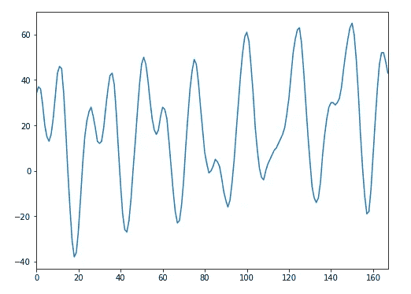
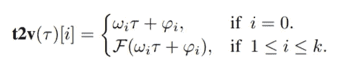
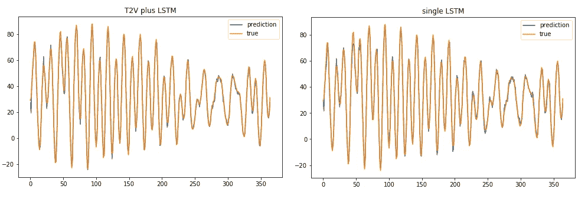

# Time2Vec 用于时间序列特征编码

> 原文：<https://towardsdatascience.com/time2vec-for-time-series-features-encoding-a03a4f3f937e?source=collection_archive---------3----------------------->

## 为您的机器学习模型学习一个有价值的时间表示


Photo by [Luca Micheli](https://unsplash.com/@lucamicheli?utm_source=medium&utm_medium=referral) on [Unsplash](https://unsplash.com?utm_source=medium&utm_medium=referral)

在每个涉及时间序列的机器学习问题中，时间是黄金信息。作为数据科学家，我们必须尽最大努力提取时间模式，让我们的数据自己说话。在预处理过程中，常见的程序有标准化(平稳性检查、自相关消除…)、创建和编码分类时间特征(日、周、月、季…)、人工特征工程(傅立叶变换…)。我们的努力并不总是有回报的，因为在模型化过程中，我们选择的模型可能无法正确地将时间本身视为一个特征。

在这篇文章中，我试图再现论文' [**Time2Vec:学习时间的向量表示法**](https://arxiv.org/abs/1907.05321) **' 【T5，中提出的方法，其最终目标是*开发一种通用的模型不可知的时间表示法，这种表示法可以潜在地用在任何架构中*(我在 Keras 中开发了一个神经网络，采用了这种解决方案)。作者不想为时间序列分析提出一个新的模型，相反，他们的目标是以向量嵌入的形式提供时间的表示，以便以更好的方式自动化特征工程过程和建模时间。**

# 数据集

为了给出证据和整个解决方案的具体效用，我们需要一个足够的数据集。在我的例子中，我需要时间序列格式的数据，没有任何额外特征形式的冗余信息。这种情况在自回归问题中很典型，在这种情况下，我们只有一个时间序列，并将其作为预测未来的一个特征。在现实生活中这是一个常见的任务，所以不难找到一个数据集。我在 [Kaggle](https://www.kaggle.com/lbronchal/venezia#Punta_Salute_1983_2015.zip) 上发现了一个不错的。它储存了威尼斯大量的历史水位。预测这些值是一项严肃的任务；每天游客都可以获得该城市不同地区海平面的详细而准确的报告。

我爱威尼斯，我的目标不是和他们竞争。我们也没有足够的信息来提供真正明显的表现(额外的回归因素，如温度、月相、天气条件等，提供了足够的推动)。在这里，我们不得不利用仅有的历史数据来预测下一个小时的水位。



Example of hourly water level (cm) in a week

# 时间 2 秒实现

从数学角度来说，实现 Time2Vec 非常容易:



from: [https://arxiv.org/pdf/1907.05321.pdf](https://arxiv.org/pdf/1907.05321.pdf)

其中 *k* 是时间 2 维，*τ*是原始时间序列， *F* 是周期性激活函数，*ω*和*φ*是一组可学习的参数。在我的实验中，我将 *F* 设置为一个 sin 函数，以使选定的算法能够捕捉数据中的周期性行为。同时，*线性项代表时间的进程，可用于捕捉依赖于时间的输入中的非周期性模式*。

这种简单性使得这种时间向量表示很容易被不同的架构所使用。在我的例子中，我试图在修改简单 Keras 密集层的神经网络结构中转移这个概念。

```
class T2V(Layer):

    def __init__(self, output_dim=None, **kwargs):
        self.output_dim = output_dim
        super(T2V, self).__init__(**kwargs)

    def build(self, input_shape): self.W = self.add_weight(name='W',
                      shape=(input_shape[-1], self.output_dim),
                      initializer='uniform',
                      trainable=True) self.P = self.add_weight(name='P',
                      shape=(input_shape[1], self.output_dim),
                      initializer='uniform',
                      trainable=True) self.w = self.add_weight(name='w',
                      shape=(input_shape[1], 1),
                      initializer='uniform',
                      trainable=True) self.p = self.add_weight(name='p',
                      shape=(input_shape[1], 1),
                      initializer='uniform',
                      trainable=True) super(T2V, self).build(input_shape)

    def call(self, x):

        original = self.w * x + self.p
        sin_trans = K.sin(K.dot(x, self.W) + self.P)

        return K.concatenate([sin_trans, original], -1)
```

该自定义层的输出维度是用户指定的隐藏维度 *(1 ≤ i ≤ k)* ，即从网络学习的正弦曲线，加上输入的线性表示 *(i = 0)。有了这个工具，我们只需将它与其他层堆叠在一起，并在我们的案例研究中尝试它的威力。*

# 模型

Time2Vec 是一个很好的时间表示吗？为了回答这个问题，我比较了在我们的预测任务中实现的性能，建立了两个不同的序列神经网络模型。第一个将我们定制的 Time2Vec 层作为输入，叠加在一个简单的 LSTM 层上。第二层仅由先前结构中使用的简单 LSTM 层组成。

```
def T2V_NN(param, dim):

    inp = Input(shape=(dim,1))
    x = T2V(param['t2v_dim'], dim)(inp)
    x = LSTM(param['unit'], activation=param['act'])(x)
    x = Dense(1)(x)

    m = Model(inp, x)
    m.compile(loss='mse', optimizer=Adam(lr=param['lr']))

    return mdef NN(param, dim):

    inp = Input(shape=(dim,1))
    x = LSTM(param['unit'], activation=param['act'])(inp)
    x = Dense(1)(x)

    m = Model(inp, x)
    m.compile(loss='mse', optimizer=Adam(lr=param['lr']))

    return m
```

我们执行拟合程序操作超参数优化。这是使用[**keras-hype tune**](https://github.com/cerlymarco/keras-hypetune)完成的。该框架以非常直观的方式提供了神经网络结构的**超参数优化**。我们对一些参数组合进行标准网格搜索。所有涉及的两个训练程序都要这样做。

# 结果

我使用前 70%的数据作为训练集，剩下的 30%作为测试集。在拟合过程中，该系列还分为验证，以便进行超参数调整。最佳和优化的 T2V + LSTM 在测试中实现了大约 1.67 MAE，而简单和优化的 LSTM 实现了大约 2.02。



这两个网络似乎都能很好地识别数据中的模式。使用 T2V 编码可以稍微提高性能。

# 摘要

在这篇文章中，我介绍了一种自动学习时间特征的方法。特别是，我复制了 [Time2Vec](https://arxiv.org/pdf/1907.05321.pdf) ，一个时间的向量表示，使其适应神经网络架构。最后，我能够在一个真实的任务中展示这种表现的有效性。我想指出的是，正如论文作者所建议的，T2V 不是时间序列分析的新模型，而是一种简单的向量表示，可以很容易地导入到许多现有和未来的架构中，并提高它们的性能。

**如果你对题目感兴趣，我建议:**

*   [**Word2Vec 带时间序列:一种迁移学习方法**](/word2vec-with-time-series-a-transfer-learning-approach-58017e7a019d)
*   [**Corr2Vec:金融市场特征工程的 WaveNet 架构**](/corr2vec-a-wavenet-architecture-for-feature-engineering-in-financial-market-94b4f8279ba6)

[**查看我的 GITHUB 回购**](https://github.com/cerlymarco/MEDIUM_NoteBook)

保持联系: [Linkedin](https://www.linkedin.com/in/marco-cerliani-b0bba714b/)

**参考文献**

Time2Vec:学习时间的向量表示法*。赛义德·迈赫兰·卡泽米、里沙卜·戈埃尔、塞佩赫尔·埃格巴利、贾纳汉·拉曼南、贾斯普里特·萨霍塔、桑杰·塔库尔、斯特拉·吴、卡塔尔·史密斯、帕斯卡尔·普帕特、马库斯·布鲁贝克*