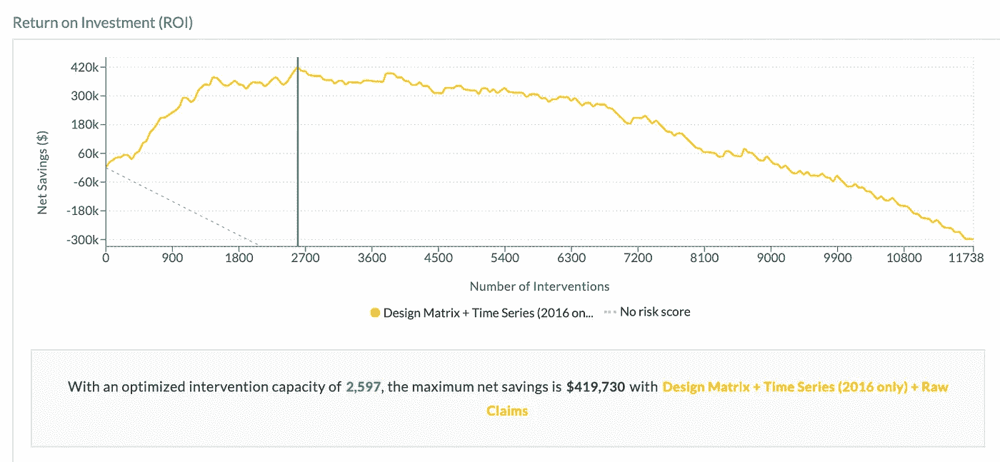

# 时代在变，成员在变动

> 原文：<https://towardsdatascience.com/times-are-changing-and-members-are-churning-a90932e56166?source=collection_archive---------26----------------------->

## 预测成员退出健康计划的最佳实践

Photo by [**rawpixel.com**](https://www.pexels.com/@rawpixel?utm_content=attributionCopyText&utm_medium=referral&utm_source=pexels)

每年健康计划和提供者花费大量的时间、资源和金钱来留住他们的成员。实际上，有专门关注会员参与度和忠诚度的会议，允许组织从行业领导者那里学习技巧和诀窍。

留住会员的一个策略是问“谁可能退出我的计划”这个问题。预测会员退保(“流失”)在任何计划选择由个人决定的会员群体中都是一个极其常见的用例，我将在下面解释原因。

让我来布置舞台。

每年有 11%的 Medicare Advantage 计划参与者自愿转投另一项计划([凯撒家庭基金会](https://www.kff.org/report-section/medicare-advantage-plan-switching-exception-or-norm-issue-brief/))。为了取整数，我们就把它定为 10%吧。为了说明 10%的退保率对计划收入的实际意义，假设您有 50，000 名成员，平均每个成员每月支付 700 美元(每个成员每年 8400 美元)的保费。如果你的组织分享了全国平均 10%的会员流失率，这意味着 5000 名会员将选择退出你的计划——损失你 4200 万美元的补偿。是的，你没看错——4200 万美元！

年复一年保持 100%的会员是不现实的，但是如果你能把退保率从 10%降低到 9%会怎么样？1%的人口对你的计划收入有多大影响？

当你减少 1%的会员流失率，你就能保留**每年 420 万美元的收入！**

Photo by [Ben White](https://unsplash.com/@benwhitephotography?utm_source=unsplash&utm_medium=referral&utm_content=creditCopyText)

1%有如此大的影响，可以理解的是，健康计划和提供者正在寻找解决方案，以确定哪些成员最有可能退出他们的计划。被认定为“高风险”的成员可以加入激励/干预计划，以期改变预测的结果。

如果您希望在内部构建这一模型，或者希望使用预测分析解决方案，我们已经找到了一些最佳实践，希望您在尝试预测会员流失时谨记在心。

# 1.快速创建基线模型

在他在 Coursera 的[机器学习课程中，吴恩达解释说，当建立一个新的机器学习模型时，你应该尽可能快地得到第一个结果，最好是在 24 小时内。我们同意！](https://www.coursera.org/learn/machine-learning)

这一切都是为了展示潜在的投资回报率。获取您可用的数据源，并获得将作为基线预测模型的第一个结果。我们经常看到团队一开始就试图构建最复杂的模型。但是如果你的数据中没有足够的信号来预测你想要的结果呢？从一个轻量级模型开始，看看最初的预测是什么样的。仅使用现成的数据流快速获得基线模型，有助于证明是否有足够的 ROI，并确定为提高模型准确性而付出的额外努力的价值。

具体到会员流失，从一年的索赔和录取数据开始。仅这些数据源就应该产生一个简单而有洞察力的基线模型。它可能没有你理想中想要的那么准确，但是它将能够识别风险极高的成员，并证明是否应该花更多的时间来更深入地开发模型。

当与您的主管、人口健康副总裁、首席财务官或首席执行官交谈时，交流投资回报看起来有所不同。为了帮助向您的组织传达您的预测模型的明确价值，ClosedLoop 在平台中内置了 ROI 图。有许多不同的观点可以根据你的受众来定制信息。

Image from ClosedLoop.ai Platform

在[闭环](http://www.closedloop.ai)，我们用一些主要参数计算 ROI。人口规模、结果成本(您的组织将花费多少干预成本)、干预成本(您的组织运行特定干预的成本)和干预功效(干预的有效性)。

# 2.使用所有可用的患者数据

机器学习从多个数据源中提取有用的模式，以建立更准确和全面的风险评分。一旦建立了基线模型，就开始测试额外的患者可链接数据(ADT feeds、EMR、社会因素、实验室等)的预测价值。).这里的一行外卖— ***使用所有可用的患者数据*** 。

如果你计划在内部建立这个模型，这个过程就变得非常昂贵和劳动密集。首先，想想你的数据来自多少不同的内部部门和外部组织，然后想想每个来源中的数据是如何以自己特定的方式格式化的。以索赔中的患者 ID 列为例。它将位于数据集中数百列中的一列。现在，看看您的 ADT 提要或 EHR，不仅这个患者 ID 不在同一列，而且它可能有完全不同的列标题。如果这还不够混乱的话，还有一个病人 ID 栏，但它与您声明中的 ID 不同。手动搜索多个数据源中的数百列既耗时又令人困惑，而且没有数据科学家愿意这样做！

ClosedLoop 在平台中内置了许多不同的功能，可以自动接收不同的数据源，包括定制的专有数据集。在这种自动化方法中，测试和试验哪些数据源会产生增量预测值只需最少的工作。因为工作量很小，所以尽可能多地测试数据源！

在预测会员流失时，我们发现了几个可以提高模型准确性的外部数据源。例如社会决定因素数据，如美国农业部食物图谱和人口普查数据(也是公开的！)可以提供大量的价值，让你了解你的人口的营养和经济状况。现在，从这些数据源本身开始不会产生很好的结果(这是非常棘手的)，但是将它们放在一个基线模型之上是非常有效的，该模型包含带有患者人口统计数据的声明。为你的预测模型提供支持的数据源越多，你的风险评分和预测就越全面，越有解释力。

# 3.采取行动

太好了，你已经确定了有风险的成员。但是，预测谁最有可能退出你的计划只是拼图的第一部分。你打算如何处理这些预测？

对处于危险中的成员进行干预，是您的组织采取行动并试图改变预测结果的机会。但是你的干预应该是什么呢？它可能会打电话给高风险会员，询问他们是否喜欢他们的医生，如果不喜欢，就提议安排下一次与新医生的预约。也许这是一个真正的来自护理经理的电话提醒，而不是来自自动线路。对于退出网络的会员，干预措施可以是建议转介给网络内提供者。

我们建议以多种方式利用分析。同样，如果你计划在内部建立这个模型，这一块是相当棘手的。通过为相似的患者群体提供个性化的护理方法，提供多种干预措施是非常有益的，但是您如何决定哪个患者从哪种干预措施中受益最大呢？

当针对特定的患者群组采取不同的干预措施时，了解某个成员被确定为高风险的原因会有所帮助。ClosedLoop 正是提供了对预测的人类可读的解释，称为起作用的因素。这些因素使您可以看到某人被确定为高风险的确切原因，从而更容易将特定的成员群组与不同的干预措施相关联。

预测会员流失是所有健康计划的首要任务，会员选择是个人的决定，在看到 1%的会员可能产生的影响后，很容易明白为什么会这样。如果您希望构建这种预测模型或与解决方案提供商合作，我们希望您记住这些最佳实践。

**快速建立模型:**尽可能快地建立一个新模型，然后进行迭代以提高模型的准确性。

**使用所有可用的患者数据:**添加标准和专有数据集，为每个成员创建更准确和全面的风险评分。

**采取行动:**没有行动的预测是对时间、金钱和资源的巨大浪费。让会员参与不同的干预措施，以期主动改变预测的结果。

作者:[Allyson CIA burri](https://www.linkedin.com/in/allysonciaburri/)| closed loop . ai |医疗保健营销

*原载于 2019 年 6 月 13 日*[*https://closed loop . ai*](https://closedloop.ai/best-practices-for-predicting-member-churn/)*。*