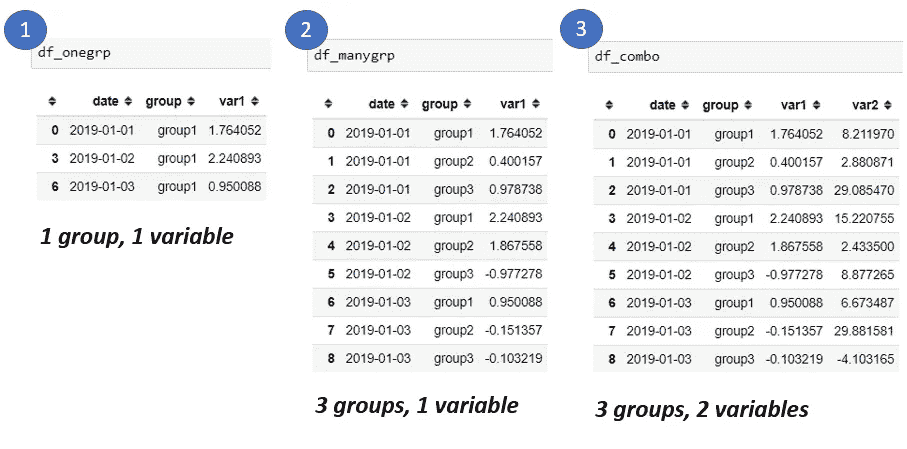
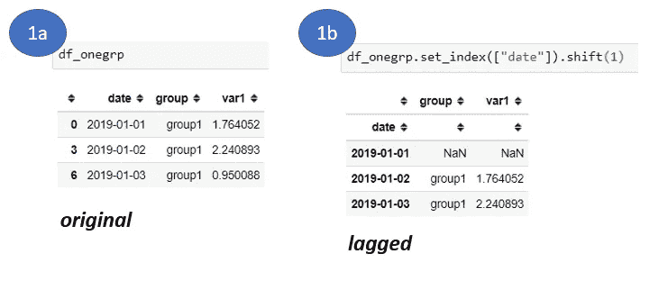
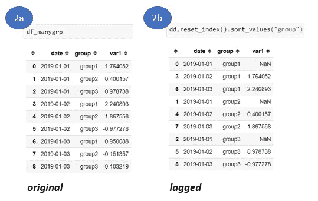
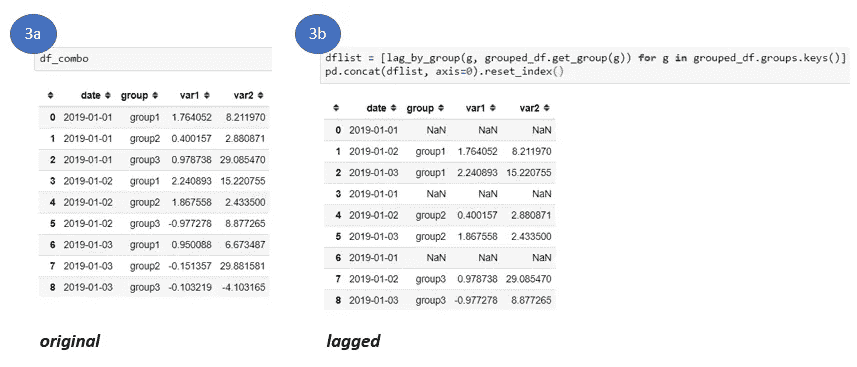

# 时间序列数据管理—分布在多个组中的滞后变量

> 原文：<https://towardsdatascience.com/timeseries-data-munging-lagging-variables-that-are-distributed-across-multiple-groups-86e0a038460c?source=collection_archive---------10----------------------->


Photo by [Jon Tyson](https://unsplash.com/@jontyson?utm_source=unsplash&utm_medium=referral&utm_content=creditCopyText) on [Unsplash](https://unsplash.com/?utm_source=unsplash&utm_medium=referral&utm_content=creditCopyText)

## 方法链接、分组和索引操作

对时间序列数据建模可能具有挑战性，因此一些数据爱好者(包括我自己)推迟学习这个主题直到他们绝对必须这样做是有道理的。在将机器学习模型应用于时间序列数据之前，您必须将其转换为模型的“可吸收”格式，这通常涉及计算滞后变量，这可以测量自相关，即变量的过去值如何影响其未来值，从而释放预测值。以下是我最近用来生成熊猫滞后变量的三种不同方法:

**1。在一组中滞后一个或多个变量—使用** *移位* **方法**

**2。跨多个组延迟一个变量—使用** *分解* **方法**

**3。跨多个组延迟多个变量—使用** *groupby*

首先，让我们生成一些虚拟时间序列数据，因为它将“在野外”出现，并将它放入三个*数据帧*中用于说明目的([所有代码在一个地方](https://tichmangono.github.io/tutorials/2018/05/04/time-series-data-munging-lagging-variables-across-multiple-groups))。

其次，做一些转换，让 pandas 将您的 dates 列识别为一个 *datetime* 变量。这对我们以后会有帮助。旁注，显然是熊猫的策划者，韦斯·麦金尼，特别发明了熊猫来解决处理时间索引数据的问题。因此，在生成虚拟数据并转换日期列之后，您现在应该有 3 个*数据帧*，如下所示。



现在是有趣的部分！第一种方法非常简单，如下所示。

# **1。在一个组/类别中滞后一个或多个变量——使用“移位”方法**

这里，我们简单地使用可用于 *dataframe* 的 *shift* 方法，并指定在将日期列设置为索引后要延迟的步数(在我们的例子中，是 1“天”)。记住，你也可以使用负数作为位移，这意味着未来的值正在影响过去(时间机器，有人知道吗？😊).

```
df_onegrp.set_index(["date"]).shift(1)
```



注意第一行现在有空值，表明我们确实滞后了数据。如果您落后两步，前两行将为空等。对于这个例子，索引已经是惟一的了，但是您可能希望对其他数据进行检查，以避免意外的后果。

# **2。将一个变量延迟到多个组——使用“拆分”方法**

这种方法稍微复杂一些，因为有几个组，但易于管理，因为只有一个变量需要滞后。总的来说，我们应该意识到，我们希望首先对数据进行索引，然后在应用 lag 函数之前，通过 T2 分解来分离组。不这样做实际上会对您的数据做错误的事情。例如，它可以将前一个组的最后一个值移动到下一个组的第一个值上，从而跨组混合数据。想象一下，如果这些群体是国家，变量是以年为单位的人口。如果你犯了这样的错误，这就像假设宾夕法尼亚州晚年的人口会影响罗德岛早年的人口，因为这两个州按字母顺序相邻。这说不通。这可能是一个巨大的陷阱，会导致完全错误的分析。

因此，将索引设置为您的日期和组。然后使用*拆垛*拉出组，然后*移动*列，就像前面的方法一样。更多关于*堆叠*、*拆解*技巧的信息，请看我的另一篇 [**文章这里**](/seven-clean-steps-to-reshape-your-data-with-pandas-or-how-i-use-python-where-excel-fails-62061f86ef9c) **。**

现在*将*组放回行中。注意如何保存空值，然后对它们做任何你想做的事情(*替换*，*删除*等等)。)

为了便于说明，我选择保留空值/缺失值并重新排列数据

```
df.reset_index().sort_values("group")
```



好的，如果你密切关注，你会注意到这种方法也适用于许多组中的许多变量，但是我想把这个场景留给另一种技术，在下一节中使用 *groupby* 来代替。所以，你可以停止阅读，使用上面的方法。但是你很好奇，所以我们继续…


Photo by [Joakim Honkasalo](https://unsplash.com/@jhonkasalo?utm_source=unsplash&utm_medium=referral&utm_content=creditCopyText) on [Unsplash](https://unsplash.com/s/photos/curious?utm_source=unsplash&utm_medium=referral&utm_content=creditCopyText)

# **3。** **同时延迟分布在多个组中的多个变量——使用“分组依据”方法**

这个方法依赖于 pandas *groupby* 函数结合我们在前面的方法中学到的所有招数。所以我不会花时间解释我们已经讨论过的概念。关键步骤是使用“组”列对数据进行分组；制作一个函数，使*对*进行排序，*按日期对*进行索引，*对每组中的数据进行移位*，然后*通过*对象对*组中的*进行迭代，将函数应用于每组。最后，我们使用便利的*列表理解*，然后*将这个列表连接*回其原始格式。

这种方法中使用的一些很酷的概念是:

*   ***赋值* :** 我最近发现了*数据帧*可用的*赋值*方法。它清理了您的代码，允许您生成一个新列并为其分配新值，而不必使用中间的 *dataframe* 。它会自动返回数据的副本。
*   ***方法链接* :** 该函数还在返回语句中使用括号，以便允许方法链接，这是编写干净、易读代码的另一种方式。

将数据分组:

```
grouped_df = df_combo.groupby(["group"])
```

使用*赋值*和*方法-链接*创建功能:

使用列表理解对每个组应用函数，然后垂直连接:

```
dflist = [lag_by_group(g, grouped_df.get_group(g)) for g in grouped_df.groups.keys()]pd.concat(dflist, axis=0).reset_index())
```



这就对了。滞后时间序列的三种不同方法。可能还有更多，例如，您可以通过 *x* 步骤移动数据，然后删除每个组的第一个 *x* 步骤，但是我认为上述解决方案更加健壮和灵活，允许您对空值做任何您想做的事情。下面让我知道你的想法。

编码快乐！