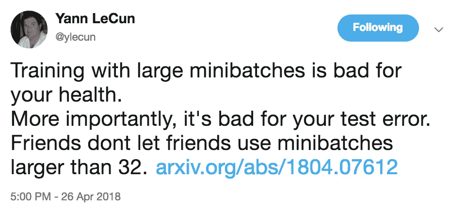

# 修补张量和其他伟大的冒险

> 原文：<https://towardsdatascience.com/tinkering-with-tensors-and-other-great-adventures-260572a403e8?source=collection_archive---------32----------------------->

Source: [www.pexels.com](http://www.pexels.com)

## 在(不严格地)保持理智的同时，思考如何实现你的第一篇深度学习论文。

在 2018 年底一个普遍不起眼的周三，我听从了互联网明智的建议，踏上了通往人工智能中心的痛苦旅程；我开始在自然语言处理(NLP)中实现深度学习研究论文。

经过许多天驯服怪物、追捕真正科学家的材料、凝视黑暗之心，我出现了[疲惫，但胜利](https://github.com/SudoSharma/bimpm_implementation)。接下来是对解决这样一个项目的动机和期望的描述。

如果你也敢冒险进入深海，那就加入我吧。

> …正如 Ilya 喜欢说的那样，你需要做好遭受痛苦的准备:预计将花费数小时调试拒绝学习的模型，许多遍重新构造你的代码，并为改变各种超参数建立你自己的约定。但是每次你遭受痛苦的时候，要知道你已经积累了一点技能，这对未来是无价的。
> 
> ——格雷格·布罗克曼， [Quora 05/16](https://www.quora.com/What-are-the-best-ways-to-pick-up-Deep-Learning-skills-as-an-engineer)

# 动机

为什么要实现一篇研究论文？为什么是 NLP？

先说后者。

假设你想为人类的持续利益创造[有益的人工智能](https://futureoflife.org/ai-principles/)(我的意思是，谁不想呢？)，你就必须创造一个具有高级推理能力的系统，并且能够更好地向人类解释其意识的内容。自然语言理解(NLU)是处理这些基本问题的人工智能的一个子领域，它本身嵌套在更大的自然语言处理学科中。

更简单地说， ***教机器理解语言对于安全解开智能本身的奥秘至关重要。***

此外，如果你关注了 2018 年发布的[flurry](https://arxiv.org/abs/1802.05365)[论文](https://s3-us-west-2.amazonaws.com/openai-assets/research-covers/language-unsupervised/language_understanding_paper.pdf) [，你就会知道，尽管计算机视觉凭借其在深度学习方面的突破和应用长期以来一直吸引着公众的注意力，](https://arxiv.org/abs/1810.04805)[NLP 的时代已经到来](http://ruder.io/nlp-imagenet/)。这一点，以及我在硅谷一家对话式人工智能初创公司担任机器学习工程师的角色，极大地激发了我对这一领域的兴趣。

所以，这里有两个令人信服的理由来尝试和实现一篇研究论文:

1.  **增进你的理解。不弄脏自己的手，你根本无法获得理论在实践中如何运作的良好直觉，而完成一篇论文会弄脏自己的手。** 如果你一直在利用 [书籍](https://www.deeplearningbook.org/)、[在线](https://course.fast.ai/) [课程](https://www.deeplearning.ai/)、[和](https://deeplearning.mit.edu/) [录制的](https://www.youtube.com/playlist?list=PLC1qU-LWwrF64f4QKQT-Vg5Wr4qEE1Zxk) [讲座](https://www.youtube.com/playlist?list=PL3FW7Lu3i5Jsnh1rnUwq_TcylNr7EkRe6)自学深度学习的课题[，这是一个必不可少的](http://neuralnetworksanddeeplearning.com/)[下一步](https://www.quora.com/How-can-beginners-in-machine-learning-who-have-finished-their-MOOCs-in-machine-learning-and-deep-learning-take-it-to-the-next-level-and-get-to-the-point-of-being-able-to-read-research-papers-productively-contribute-in-an-industry)，它会无情地暴露你知识中的任何缺口。
2.  成为一个坏蛋。复制一篇论文的表现并不简单，这将考验你工程能力的极限以及你的毅力。无论你已经做了一段时间，还是你刚刚开始做这个领域，最终完成这样一个项目可以作为你的“成年”仪式。 ***它将标志着你从一个被动的观察者转变为人工智能研究社区的积极参与者。你还会积累谦逊和自信，这样你就可以在未来面对更具挑战性的项目。***

如果这些听起来有一点点有趣，那么你来对地方了。卷起袖子，涂上防晒霜，我们上路吧。

Let’s hit the road! Source: [www.pexels.com](http://www.pexels.com)

但是首先，像任何这种性质的冒险一样，我们要确保我们意识到前面的任何危险…

# 预期

你复制一篇研究论文的经历将受到你实现个人目标的成功程度的影响。因此，当你开始你的旅程时，要记住的最重要的事情是为自己设定合理的期望，当然，要保持水分充足。

## 期望#1:研究与工程

即使在阅读了其他人的经验之后，我仍然惊讶地发现，完成一篇论文会让你学到更多的工程知识，而不是研究知识。

许多在线课程将创建美丽的环境，在其中你可以玩深度学习概念。这些可以运行从预加载库的云实例到浏览器中完全集成的运动场的所有范围(想想[fast . ai](https://course.fast.ai/)vs[uda city](https://www.udacity.com/course/deep-learning-nanodegree--nd101))。这对于降低新人的准入门槛是必要的，让他们在职业生涯的早期享受人工智能的全部荣耀。

There are many details safely hidden in online AI courses. Source: [www.pexels.com](http://www.pexels.com)

不幸的是，就像那些过度保护但用心良苦的父母的孩子一样，这种溺爱让小约翰尼对现实世界毫无准备。该由我们年轻人用实际知识来填补空白了。

我的意思是:

我不仅严重低估了这个项目需要的总时间，还错误地估计了工作的分配。我最初假设我会在周末完成这个实现，花大约五天的时间测试不同的假设，其中有 20/80 的时间。

实际上，我大约 40%的时间花在操作开销上，40%的时间花在实现、调试和测试模型架构上，最后 20%的时间花在实验上。

我花了两周半的时间，在工作前和工作后编码，在周末，这个项目总共花了我大约 60 个小时。我花了额外的 20 个小时处理模型部署，稍后会花更多的时间。

对于你的第一篇论文，假设你选择了一篇在你已经相当熟悉的学科中有点挑战性的论文，那么这种分布和时间承诺并不是不合理的。

总的来说:

1.  **为运作准备**、**预算比你认为需要的更多的时间，尤其是你的第一篇论文。**利用这个机会提高你的软件工程技能和解决问题的能力。
2.  **在实施阶段，不断地在适当的检查点通过网络运行虚拟数据。**让自己相信输出是有意义的，如果不合理就修复它。绝对不要等到所有东西都构建好了才开始调试。
3.  为了记录你的实验，以及追溯过去，做详细的笔记。一个快乐的副作用是能够深情地回顾你所取得的一切。

简而言之，好好计划，闻一闻玫瑰花香，多拍几张照片。

## 期望#2:再现性

复制危机是一种经常折磨社会和医学科学的疾病，因为进行人体实验研究是有风险的。当学者们无法复制同行的成果时，科学发现的引擎本身就会停止运转。

如果巨人没精打采，你不可能很好地站在他们的肩膀上。

发生这种情况有很多原因，包括软弱无力的研究标准，“发表或灭亡”的激励，以及在极限情况下，彻头彻尾的欺诈活动。即使好的科学是怀着最美好的愿望进行的，它也不总是一帆风顺的。在人工智能研究中，这通常以算法论文的形式出现，这些论文带有未记录的代码(如果发表的话)，其性能会随着敏感的训练条件而波动。

这对你来说意味着什么，勇敢的旅行者，如果你的结果看起来不完全像你选择的论文，你一定不要气馁。我很快发现 ***作者经常会省略细节，因为它们不重要(它们很重要)或者因为它们非常明显(它们不重要)。***

Authors can leave out seemingly unimportant, but crucial, details. Source: [www.pexels.com](http://www.pexels.com)

为了克服这一点，你不能仅仅将你的研究论文局限于原文。你必须汇集外部资源(GitHub、StackOverflow、你的邻居)，并对影响每篇论文但并不总是显而易见的关键概念培养良好的直觉。这将帮助你智能地填补空白，以最终进行复制，并有望甚至超越深度学习算法的性能。

以下是作者没有回答的最常见的问题，但你仍然必须努力解决:

**权重是如何初始化的？**

在任何给定的层中，你都不希望你的权重相同、太大或太小。如果所有的权重彼此相同，你的更新(学习率乘以每个权重的导数)将具有相同的方向和幅度。

不太好。

***不同的“神经元”需要有不同的变化，以便你的网络学习输入和输出之间的复杂关系***——这被称为[打破对称](https://stackoverflow.com/questions/20027598/why-should-weights-of-neural-networks-be-initialized-to-random-numbers)，也是单层神经网络有可能[逼近任何连续函数](https://en.wikipedia.org/wiki/Universal_approximation_theorem)的原因。本质上，这就是为什么[深度学习这么有用](http://neuralnetworksanddeeplearning.com/chap4.html)。

您的权重值太大或太小将导致[爆炸/消失梯度](http://neuralnetworksanddeeplearning.com/chap5.html)，最终使训练过程不稳定、缓慢或完全无效。如果你在高速公路上开车，坡度大的话，你会以每小时 120 英里的速度飞驰，坡度小的话，你会以每小时 5 英里的速度缓慢前行。

你要么错过退路，要么无聊而死...在这两种情况下，你都会被开罚单。

因此，为了得到完美的权重，我们必须确保它们是从[一个合适的概率分布](https://medium.com/usf-msds/deep-learning-best-practices-1-weight-initialization-14e5c0295b94)中抽取的。因为这种特别的洞察力是如此重要，许多真正聪明的人已经就这个主题写了完整的论文。因此， ***当前的最佳实践是分别对 ReLUs(校正线性单位)或 tanh/sigmoid 激活函数使用 He 或 Xavier 初始化。***

不幸的是，这些初始化方案本质上是随机的，因为权重是从分布中随机选择的。这意味着，即使神经网络可以用固定的初始权重和输入来确定，论文的复制也变得不确定。你的体重，以及随后你的结果，会略有不同，现在，我们将不得不接受这一点。

Initializations can be robust, but ultimately stochastic. Source: [www.pexels.com](http://www.pexels.com)

然而，使用上面的直觉，如果你的结果与论文的结果完全不同，你至少知道不要责怪权重。如果作者没有提到任何初始化过程，你也不会束手无策。

使用了哪些超参数？

有相当多的超参数在将深度学习算法带入生活中发挥着不可或缺的作用，其中大多数你会毫不费力地发现。

在大多数研究论文中，对隐藏层的大小和数量、正则化系数和其他建筑地标的描述与令人信服的理论基础讨论无缝地交织在一起。

这些 ***设计*** 超参数为您提供了成功实施的蓝图，但不会带您走得更远。为了配合论文的表现，你必须寻找不同种类的 ***训练*** 超参数。

这是你开始出汗的地方。

学习率在哪里？批量大小，时代？超越传统的超参数，使用了什么优化器？数据集中的训练和测试拆分是什么？

对于那些满足于仅仅跟上人工智能世界的最新进展的人来说，这些细节是无关紧要的。“我就看看报纸，然后继续前进！”他们会说，“更好的是，有没有我可以看一下的摘要？”

但对于那些头发花白、想要追逐疯狂、让现实屈从于我们意志的少数人来说，这些特征至关重要。你的目标不仅仅是简单地理解这些论文，而是将它们重新组合在一起，甚至是在它们成功的基础上再接再厉。

一种方法是在互联网上搜寻这些训练超参数。您可以在 GitHub 上找到相关的实现，并提取相关的值。不幸的是，涉水通过互联网代码可以非常令人沮丧和误导。

更好的策略是从基本原则开始，确定最佳实践，并磨练您对这些反复出现的主题的直觉:

**批量:**32 左右从[开始。使用较少的训练样本来更新权重会产生一个“嘈杂的”梯度信号。与直觉相反，这种噪音对你的网络产生了一种](https://arxiv.org/abs/1804.07612)[规则效应](https://arxiv.org/abs/1609.04836)，允许它很好地推广到看不见的测试数据。

Source: [www.twitter.com](https://twitter.com/ylecun/status/989610208497360896)

**历元数:**这个很简单。从足够多的历元开始(完全遍历您的数据),当验证错误开始变得更糟时停止训练。假设你一直在定期保存你的体重，选择那些给你最低验证损失的——这就是所谓的[提前停止](https://machinelearningmastery.com/early-stopping-to-avoid-overtraining-neural-network-models/)。

**训练/验证/测试集:**一个好的经验法则是将你的数据集分成 80/10/10。然而，你拥有的数据点越少，你投入训练的数据点就越多，所以这个比例是可变的。对数据如何在这些不同的集合中分布持怀疑态度并不是一个坏主意，但是如果你的论文使用了一个众所周知的基准，那么细节很可能已经提前为你处理好了。

**优化器:**与 [AdamW](https://arxiv.org/pdf/1711.05101.pdf) ，[Adam](https://www.fast.ai/2018/07/02/adam-weight-decay/)的更好变体。基本原理是选择一个优化器，该优化器使用梯度信号的一部分，根据它们的“需要”更新各个参数。想想社会主义。AdamW 将这种自适应更新与动量相结合，动量是先前梯度的移动平均。这可以智能地改变参数，同时防止当前批次的损耗大幅波动。

**学习率:**这是一个系数，优化器将其与梯度相乘以抑制误差信号(在 AdamW 的情况下是自适应的)。首先，使用任何[学习率(lr)探测器](https://docs.fast.ai/basic_train.html#lr_find)获得最大和最小值。然后使用[周期策略](https://www.fast.ai/2018/04/30/dawnbench-fastai/)来调整你的学习速度和动力。这里的直觉是，在慢慢收敛到最佳参数之前，网络将在开始时快速探索解决方案。

再现性对科学进步非常重要，所以当人工智能研究人员让其他人更难跟随他们的脚步时，这是一种耻辱。掌握以上这些概念会给你前进的信心，即使你论文的作者没有明确说明训练程序。

更重要的是，你会注意到观点的转变，不再只是阅读一篇论文并思考，“这很有道理”，而是“我同意这个观点”或“我会用不同的方式来做这件事”。完成一篇研究论文将从一项纯粹的教育活动演变成同行评议。

Welcome to the scientific enterprise! Source: [www.pexels.com](http://www.pexels.com)

## 期望#3:个人舒适

虽然这无疑将是一次有趣的经历，但是您可以做一些事情来确保您的第一次实现之旅进展顺利。

1.  **选择培训时间在 5 小时以下的纸张。**这可能有助于减少您在第一次实施上花费的资金(取决于您运行的 GPU 实例)。更重要的是，后续训练之间更快的反馈循环可以让你快速实验，并且不会在出现问题时摧毁你的自尊。
2.  **从小处着手，逐步积累，直至全面实施。**绝对不要试图构建论文的完整架构，却发现自己犯了一些小错误，导致你的网络无法访问。解决这个问题的方法是一点一点地构建，通过网络运行一批数据，并说服自己事情是有意义的。在继续前进之前，解决你为自己构建的更简单的问题。
3.  **等到原来的结果接近可复制的时候再做实验。我一让事情运转起来，就开始运行迷你实验来戳戳我的网络，最终观察它的行为。这不一定是一件坏事，因为它可能会帮助您发展直觉，但是这些直觉与您的实现应该如何工作没有关系。所以先复制，后实验。**
4.  确保选择一个你知道一些或愿意探索的、启发智力的话题。我选择复制 NLP 上的一篇论文的结果，我觉得这很有趣，也与我的工作相关。这让我即使在材料具有挑战性的时候也能保持专注，我甚至能够将我学到的知识应用到工作中的算法中。

# 结束语

你是应该先一头扎进去，边走边学，还是应该在 试图完成一篇研究论文之前 ***尽你所能地学习？答案真的取决于你为什么要这么做，你希望从这次经历中得到什么。***

不管你的策略是什么，重要的是要认识到，你的问题的答案并不总是在论文本身，当作者不明确时，概念性的理解可以帮助填补空白。或许，在你上船之前，一条让你具备基本知识的中间道路，会给你毫发无损地浮出水面的最佳机会。

到目前为止，我已经避免引用我的实际实现，因为这个讨论主要是关于动机和期望。然而，如果你感兴趣，我实现了 IBM 的[双边多视角匹配](https://arxiv.org/pdf/1702.03814v3.pdf)模型，这是我第一次尝试复制深度学习算法。你可以在 [GitHub](https://github.com/SudoSharma/bimpm_implementation) 上找到我的实验、代码和测试。所有的东西都有详细的文档记录，而且我让事情变得非常容易理解。挖的开心！

关于复制深度学习论文的性能，当然还有更多可以说的(工具、调试策略、测量实验等)。)，也许我会在以后的文章中深入探讨其中的一些。但是现在，希望你发现这篇文章对计划你的冒险有指导意义，并且理解在你的旅途中等待你的一些惊喜(愉快的或其他的)。

所以，勇敢的旅行者，保持安全但好奇，轻装上阵，记得把一切都带进去！一路顺风！

Bon Voyage! Source: [www.pexels.com](http://www.pexels.com)