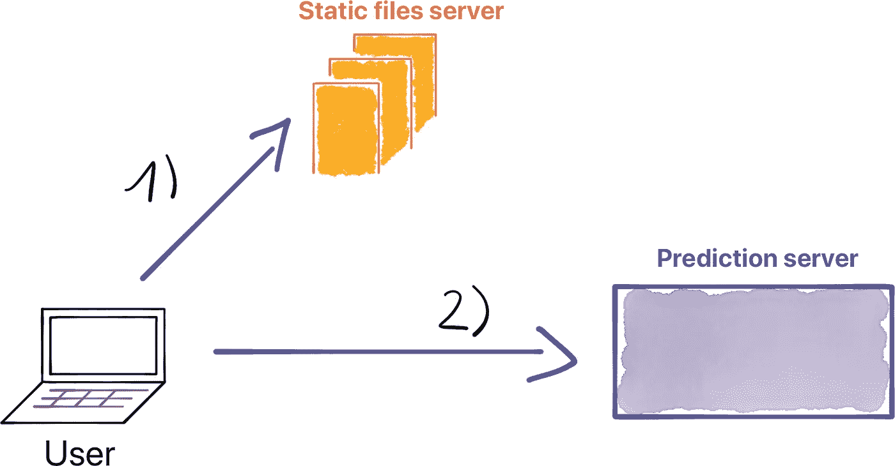

# 经济高效的机器学习项目提示

> 原文：<https://towardsdatascience.com/tips-for-cost-effective-machine-learning-project-6dbc715e7c59?source=collection_archive---------19----------------------->

剧透:你不需要一个 24/7 运行的虚拟机一天处理 16 个请求。

Street art by [Mike Mozart](https://www.instagram.com/MikeMozart/)

你刚刚发布了一个机器学习项目。它可以是你刚起步的新产品，可以是客户演示的概念验证，也可以是丰富你的投资组合的个人项目。你不是在寻找一个生产级网站；你想完成工作。为了便宜。这样一些用户就可以测试你的产品。

*如何经济高效地提供您的项目？*

这篇文章是对[这篇](/how-to-build-and-deploy-a-lyrics-generation-model-framework-agnostic-589f3026fd53?source=friends_link&sk=654cb3e2e52eccb7aead2a374311d13a)前一篇文章的后续和更新，在那篇文章中，我介绍了 [raplyrics.eu](https://raplyrics.eu/?utm_source=medium&utm_medium=cost-effective-ml&utm_campaign=medium-october) ，这是一个使用 ML 生成说唱音乐歌词的文本生成网络应用。

到目前为止，这个项目已经提供了一年的笑点。我在此分享更新的架构，它使我们将云提供商的账单从每月 50 美元减少到每月不到 1 美元。

我使用这个项目作为例子，但是这里讨论的建议适用于每个具有灵活延迟需求的类似项目。

## 期待什么？

首先，我描述了服务的架构以及我们想要交付的内容。然后，我定义实现我们目标的可能方法。最后，我重点介绍了我们如何使用无服务器功能大幅降低计算成本。

# 服务剖析

First the user fetches the static assets, then locally executes the JS that calls the prediction server to generate lyrics.

1.  首先，用户获取静态文件。
2.  然后，用户在本地调用预测服务器。
3.  最后，服务器返回预测。

在最初的解决方案和下面介绍的新解决方案之间，关注点的逻辑分离保持不变。我们只更新底层技术。

# 初始解决方案设计

What paying 600$ a year for a porftolio project feels like — Photo by [Jp Valery](https://unsplash.com/@jpvalery?utm_source=unsplash&utm_medium=referral&utm_content=creditCopyText) on [Unsplash](https://unsplash.com/collections/8753032/cost-effective-ml-project/e9374c4c44b5cb16687580df803c7459?utm_source=unsplash&utm_medium=referral&utm_content=creditCopyText)

当我们开发 raplyrics 时，我们希望它非常简单。它最初是一个在我们的机器上构建和测试的项目。然后，我们把它推到了云端。

目前，有几种服务于机器学习模型的方法。以前，我们想弄脏自己的手，所以我们实施了*我们的*服务策略。

建议:不要开发*你自己的*机器学习模型服务框架——成熟的解决方案，如 [tensorflow serving](https://www.tensorflow.org/tfx/guide/serving) 已经存在。TF Serving 有详尽的文档，会比自己动手更有效率。

话虽如此，让我们回到我们的项目。我们把前面和后面分开；

1.  客户端层是一个 Apache Http 服务器
2.  服务器层是运行歌词生成模型的 Python flask 应用程序。

我们购买了一个领域模型，将我们的代码部署到一个 EC2 上，并且准备好为用户服务。

## 问题是

在*免费试用期到期*之前，一切都是乐趣和游戏。在最初的 12 个月之后，在 2019 年 9 月为 32 个用户服务时，这个单个项目的每月账单飙升至 **~每月 45/50 美元**。

事实是，我们有一个 2GB Ram 的虚拟机，全天候运行，为几十个用户提供服务。

# 更新的解决方案设计

在免费试用之后，很明显我们处理这个项目的方式中有些地方*出了问题*。

我们服务的典型用户知道这个网站是一个个人项目；它设定了期望的水平。

典型的用户生成一打歌词，然后离开。

我们知道*我们想要实现什么*，服务一个两层架构，前端处理调用服务生成歌词的用户输入。前后松耦合。(仅指前端的后端端点)。

有哪些可能性，可能的*如何？*

## **列出选项**

*   A —将同一个项目部署到另一个提供免费积分的云提供商。重复一遍。

那是可能的。例如，如果你来自 AWS，GCP 的 300 美元信用可以让你运行一段时间。也许你只需要在有限的时间内为客户提供这个投资组合项目或概念证明。

我们想把我们的项目保留一段时间；选项 A 不太适合。

*   B —为客户端层使用静态网站，通过对[无服务器计算](https://en.wikipedia.org/wiki/Serverless_computing)的 API 调用来服务请求。

**什么是无服务器计算？**

> 无服务器计算是一种按需提供后端服务的方法。服务器仍在使用，但从无服务器供应商那里获得后端服务的公司是根据使用情况收费的，而不是固定的带宽量或服务器数量。—来自 [CloudFare](https://www.cloudflare.com/learning/serverless/what-is-serverless/)

我们选择了选项 B，使用静态网站并在无服务器计算服务上公开我们的 API。选项 B 的缺点是增加了冷启动时的延迟。冷启动是无服务器计算服务的第一次运行；它通常需要比 W *臂启动*更长的时间。

## 静态网站和运行中无服务器计算机

既然我们已经定义了我们想要如何去做，我们可以专注于技术的选择。

**托管静态页面**

存在多种静态托管解决方案。我们选择了 Netlify。很容易在最少的时间内完成这项工作。在 Netlify 上，使用自定义域名的基本主机和 SSL 证书是免费的。

**用无服务器计算服务 API**

每个云提供商都提供无服务器计算服务；我们选择了谷歌云及其云功能。

Google cloud 有一个[教程](https://cloud.google.com/blog/products/ai-machine-learning/how-to-serve-deep-learning-models-using-tensorflow-2-0-with-cloud-functions)是关于如何通过云功能来服务机器学习模型的。以本教程为基础，我们可以通过一点点重构来服务我们的模型。

每个云提供商倾向于以略微不同的方式处理他们如何提供云功能。谷歌云还提供基于 Dockerfile 的无服务器计算服务 Cloud Run。使用 Dockerfiles 可以更容易地将项目从一个云提供商转移到另一个云提供商。

**冷启动延迟**

对于冷启动，我们必须从桶中装载模型重量(150Mb)。然后，python 应用程序加载权重。在这些情况下，响应时间最长可达 40 秒。对于热启动，响应时间通常低于 2 秒。对于投资组合项目，我们可以接受这种成本/延迟权衡。
我们在前端添加了一些用户界面元素，使第一次预测更加清晰，这可能需要一些时间。

# 外卖食品

你不需要一个完整的生产规模来为你的小项目服务。以最具成本效益的解决方案为目标。

*   投资组合项目的延迟需求与生产服务的延迟需求不同。
*   静态网站和使用基于无服务器计算的 API 是服务于你的项目的一个划算的解决方案。

需要一些技巧来处理状态，有效地从网络加载资源，但是这样做的经济性值得一试。

感谢 Cyril 对这篇文章的深思熟虑的反馈。

## 资源

Raplyrics 源代码可在 [GithHub](https://github.com/cyrilou242/RapLyrics-Back/tree/fast_lyricst) 上获得。

**托管静态网站**

*   在亚马逊 S3 上托管一个静态网站， [aws doc](https://docs.aws.amazon.com/AmazonS3/latest/dev/WebsiteHosting.html)
*   您和您的项目的网站， [GitHub 页面](https://pages.github.com)
*   托管一个静态网站， [gcloud doc](https://cloud.google.com/storage/docs/hosting-static-website)
*   在几秒钟内部署您的站点， [netlify](https://www.netlify.com)

**无服务器计算服务**

*   AWS——运行代码时不考虑 AWS 上的服务器，
*   Google Cloud——事件驱动的无服务器计算平台， [gcloud functions](https://cloud.google.com/functions/)
*   Azure——事件驱动的无服务器计算， [Azure functions](https://azure.microsoft.com/en-us/services/functions/)
*   阿里巴巴——全托管无服务器运行环境，[函数计算](https://www.alibabacloud.com/products/function-compute)