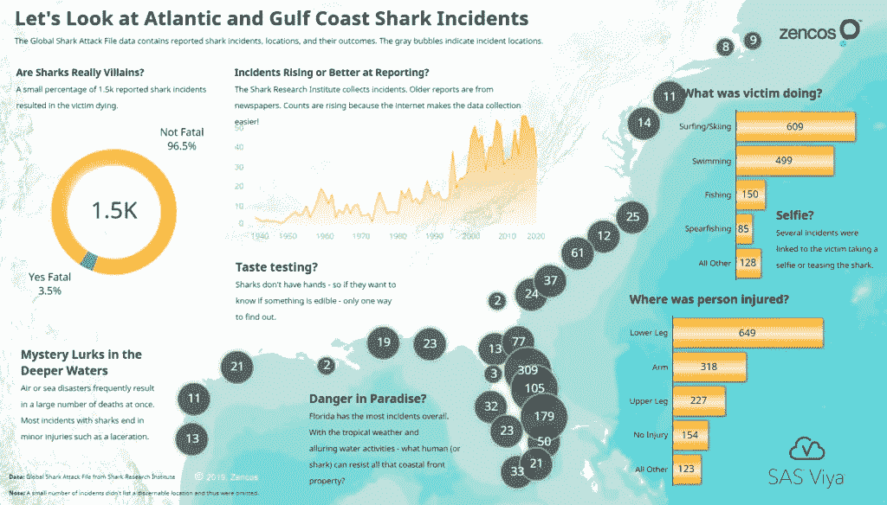
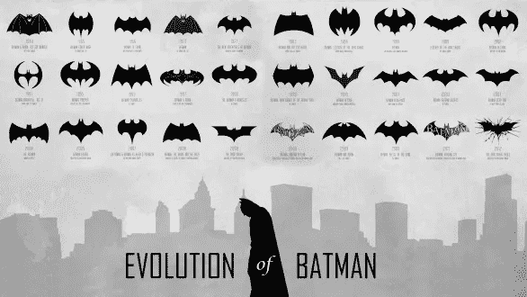
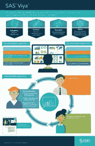
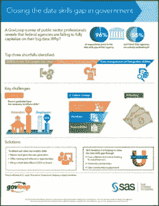
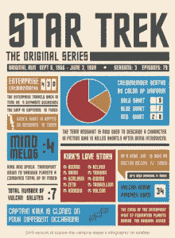
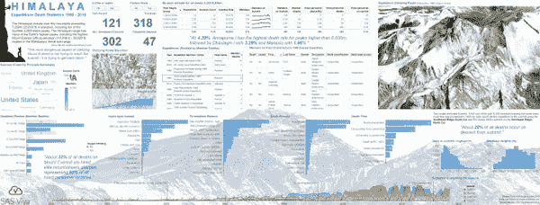

# 信息图能讲述数据故事吗？

> 原文：<https://towardsdatascience.com/tips-infographic-getting-started-43c4b5471e1d?source=collection_archive---------26----------------------->

Author

## 创建第一个信息图的想法和技巧

让每个人都专注于你的数据分析是一项挑战。您面临着各种各样的挑战:糟糕的数据素养、不感兴趣，甚至注意力持续时间的缩短。

您是否考虑过在数据通信中添加信息图表？

这种技术以一种视觉上令人兴奋的方式讲述了一个数据故事，让用户按照自己的节奏消化数据。让我们回顾一些信息图示例来寻找灵感，然后是一些入门提示。

# 什么是信息图？

信息图(或信息图)用图像、数据可视化和文本讲述一个故事。这种技术有很多优点，但我喜欢它，因为它很容易抓住注意力持续下降的观众。信息图表可以让你将大量的数据浓缩成易于理解的片段。你可以把它看作是仪表盘和数据故事的结合。这些作品讲述了一个关于所选主题的快速而清晰的故事。

在广告中使用信息图表，或在社交媒体上分享，以吸引人们对你的分析的注意。一个设计良好的信息图的视觉本质能够抓住浏览者的注意力。我认为这种方法比其他数据表示方法更随意。这是一种有趣的方式来打开一个话题进行更多的探索。

但是，您也可以在内部使用这种技术！也许你有一个重点领域，你想突出。客户服务部门可能会显示客户在过去 30 天内致电的前 5 个原因，并突出显示有关这些电话的一些关键事实。

精明的数据分析师可以与工程或产品管理团队分享该信息图，以帮助他们了解他们如何影响客户。

# 了解信息图表类型

Travis Murphy 在他的书《SAS 支持的信息图表:商业报告的数据可视化技术 中描述了两种信息图表:艺术和商业。

***艺术信息图*** 特色图片和极简文字。你经常会在厨房的墙上或青少年卧室的天花板上发现这些信息图表。想想展示各种可食用花卉或福特野马多年来如何变化的海报。艺术信息图是高度视觉化的。

> 你用你的眼睛去学习和比较什么是相似的，什么是不同的。

下面这张由 [Cathryn Lavery](http://www.cathrynlavery.com/) 设计的信息图展示了[蝙蝠侠标志这些年来是如何变化的](http://www.upcomingvfxmovies.com/2013/10/evolution-of-batman-logocharactersbatmobile/)。令人好奇的是，这个标志是如何变化的，却又保持不变。

# 快速消息的信息图表

SAS 用这张信息图解释了 SAS Viya 的主要特点。[他们在社交媒体](https://www.sas.com/es_pe/news/press-releases/locales/2017/sas-viya-sgf17.html)上使用了这张信息图，并在 SAS 全球论坛上发布。虽然它有一个商业主题，但它的内容并不侧重于分享统计数据，而是允许观众探索 [SAS Viya](https://www.zencos.com/services/sas-viya-quickstart/) 产品的功能和用途。

信息图中的信息很简单，该产品有四个主要特点。该产品非常适合多种分析角色。他们传达的信息是*这款产品非常灵活，适用于多种角色*。

它使用公司主题的颜色来传达信息，并引导你的视线向下。

商业信息图比艺术信息图更加结构化。这些更像 web 报告，因为它们包含统计数据和数据可视化。这些信息图表用数据讲述了一个故事。

# 信息图讲述数据故事

下图显示了一个业务信息图。你可以看到图片和图形比文字更流行。

生命统计数据被用来用一条短消息来启发观众。

考虑一下 SAS 的这张信息图，它可以帮助您[了解数据技能差距。](https://blogs.sas.com/content/sascom/2015/02/24/big-data-and-analytics-demand-a-bigger-skills-commitment-from-the-federal-government/)它讲述了一个关于问题的故事，以及他们需要什么来解决问题。

他们会带您浏览每个元素，并提供支持信息和有趣的数据可视化以供探索。

# 信息图表带领观众踏上探索之旅

罗伯特·艾利森的下面这张信息图从定量的角度帮助你理解《星际迷航》。

这里的艺术品是色块。请注意，该信息图引用了原始电视连续剧的颜色和字体。

这些字体与片头序列中使用的字体相同。颜色和原来 60 年代的船员穿的一样。颜色传达了如此强烈的信息！

所有有用的信息图表都需要一个外卖，例如作为一名红衫军成员是危险的，柯克船长不仅仅是一个人类女士的男人。这些数据引起了激烈的争论——成为一名黄衫军是危险的。]但是饼状图在这里看起来很好吃！

在下面的信息图中， [Falko Schulz](https://blogs.sas.com/content/author/falkoschulz/) 用 SAS 视觉分析软件讲述了珠穆朗玛峰的故事。他使用各种图片、数据对象和文本字段来引导您浏览数据。你的眼睛滑过数据，发现了一些小细节。

这张信息图是让人们回答下一个问题的绝佳方式:“如果这项活动如此危险，人们为什么要这么做？”你注意到底部的折线图了吗？这是一个非常棒的信息图表！

想象一下，如果我试图用幻灯片给你同样的信息！虽然这个话题很有趣(尽管有点病态)，但是想想看，如果你看完了 25 张幻灯片，看完了我对喜马拉雅探险队数据库的分析，或者翻阅了 PDF 文件，你会怎么想？

通过使用信息图，您的受众可以探索信息的详细程度。也许知道下山比登顶更危险就足够了。

> 也许当你得知雪崩比坠落更致命时会感到惊讶。

当你查看上山路线时，你可以清楚地看到登山者的路径覆盖了一个雪崩的完美地点。然而，Falko 让你发现了那种洞察力。

# 信息图表娱乐并吸引观众

在创建我的信息图时，我想突出一个让我好奇的主题——鲨鱼。虽然我同意这是一个性感的话题，但这张信息图可以让你说服自己，鲨鱼事件是否如此普遍或致命。

我在 SAS 可视化分析 8.3 中创建了这个信息图。我们想用一个**数据故事**来庆祝鲨鱼周。这张地图看起来很漂亮。

# 创建有效信息图的技巧

与其他数据交流方式相比，信息图表更能挑战你的编辑、设计和布局技能。对于那些可能更擅长机器学习的人来说，这是一种全新的设计体验。

为了取得成功，请牢记这些最佳实践:

*   确定主要信息和支持该信息的数据事实。由于篇幅有限，每个页面元素都很重要。此外，用户还可以从图形在页面上的显示方式中得出结论。
*   视觉元素越大，用户认为信息越重要。
*   在纸上创建页面元素的布局。你可以用纸和笔记下你的想法，并预先组织好你的事实。
*   考虑每个元素给故事增加了什么，以及它如何引导用户浏览故事。
*   你的图形或网页设计技能在这个练习中很有用。如果你没有接受过培训，可以考虑阅读设计原则。互联网上有许多免费的课程，如 [Udemy](http://www.udemy.com/) 、 [Skillshare](http://www.skillshare.com/) 以及其他类似的网站。
*   如果你在 SAS Visual Analytics 中创建信息图，[使用 Travis Murphy 的这些有用的提示](https://communities.sas.com/t5/SAS-Communities-Library/How-to-create-an-infographic-in-SAS-Visual-Analytics/ta-p/494247)。如果你用的是基地 SAS，那么[用 Robert Allison](https://blogs.sas.com/content/sastraining/2018/02/14/building-a-sas-global-forum-infographic/) 的流程。

如果你第一次尝试制作信息图感觉有点僵硬，你一定不要气馁；你的技能会随着练习而提高。

当您希望快速传达信息并吸引观众时，请将信息图表添加到您的数据通信组合中。信息图表允许你的用户以一种有趣而悠闲的方式探索数据。这种技术让用户问下一个问题，同时仍然有一些重要的收获。

*最初在 https://www.zencos.com 出版。*