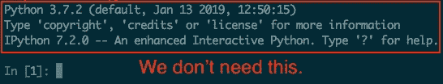
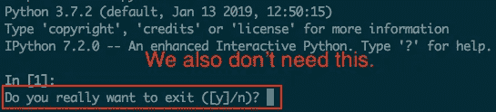

# IPython Alias 预加载您喜爱的模块并激活自动加载

> 原文：<https://towardsdatascience.com/tips-ipython-d5ea85c5e9be?source=collection_archive---------23----------------------->

## 用一种非常简单的方法获得您自己的强大的 IPython

# TL；速度三角形定位法(dead reckoning)

您只需复制下面的别名，并将其粘贴到您的`.bashrc`、`.zshrc`或某个配置文件中:

```
alias ipy="ipython --no-confirm-exit --no-banner --quick --InteractiveShellApp.extensions=\"['autoreload']\" --InteractiveShellApp.exec_lines=\"['%autoreload 2', 'import os,sys']\""
```


Photo by [Geetanjal Khanna](https://unsplash.com/photos/8CwoHpZe3qE?utm_source=unsplash&utm_medium=referral&utm_content=creditCopyText) on [Unsplash](https://unsplash.com/?utm_source=unsplash&utm_medium=referral&utm_content=creditCopyText)

我经常使用 IPython 来开发我的库或做一些研究，因为 IPython 有如下非常好的特性:

*   运行常见的 shell 命令:ls、cp、rm 等。
*   此外，运行任何 shell 命令！(一些命令)。
*   IPython 提供了许多[神奇的命令](https://ipython.readthedocs.io/en/stable/interactive/magics.html#built-in-magic-commands) : run、debug、timeit 等
*   伟大的自动完成
*   **在 Python 中预装你喜欢的模块**
*   [**自动重装扩展**](https://ipython.readthedocs.io/en/stable/config/extensions/autoreload.html#autoreload)

我想你已经知道 IPython 提供了一个很好的 Python 解释器，但是也知道你需要准备`profile`来定制 IPython，比如预加载或者激活一个扩展。我觉得这有点麻烦。所以我在这篇文章中解释了预加载你喜欢的模块或者激活`autoreload`而不需要配置文件的方法。

# 在 Python 中预装你喜欢的模块

当 IPython 启动时，您可以像下面这样执行 Python 代码。在这种情况下，我预加载 os 和 sys 模块。

```
ipython --InteractiveShellApp.exec_lines="['import os,sys']"
```

如果你想预装 PyTorch 或 Tensorflow，这里是你想要的:

```
ipython --InteractiveShellApp.exec_lines="['import torch', 'import tensorflow as tf']"
```

# 激活自动重新装入扩展

`autoreload`在执行代码之前自动重新加载模块。您可以按如下方式激活`autoreload`:

```
ipython --InteractiveShellApp.extensions="['autoreload']" --InteractiveShellApp.exec_lines="['%autoreload 2']"
```

通过使用`--InteractiveShellApp.extensoins`，可以加载 IPython 扩展。要启用`autoreload`，需要执行`%autoreload 2`。

# 其他提示



您可以删除横幅:

```
ipython --no-banner
```



此外，您还可以删除确认:

```
ipython --no-confirm-exit
```

# 获取您自己的强大 IPython

我建议您将所有内容组合起来，并使其成为别名:

```
alias ipy="ipython --no-confirm-exit --no-banner --quick --InteractiveShellApp.extensions=\"['autoreload']\" --InteractiveShellApp.exec_lines=\"['%autoreload 2', 'import os,sys']\""
```

注意`--quick`是一个无需配置文件的快速启动选项。现在，您可以轻松地以自己喜欢的方式更改这个别名。您可能想要加载额外的模块，如`PyTorch`、`TensorFlow`、`Keras`、`scikit-learn`等等。

我的帖子到此为止。在这篇文章中，我解释了用一种非常简单的方法定制你的 IPython 并使它强大的方法。这篇文章是写给那些不喜欢建立自己的配置文件，并且想要一个更简单的方法来做这件事的人的。希望我的帖子能帮到你。如果你想更多地定制 IPython 或使用 Jupyter，请查看这篇精彩的帖子:[如何将你最喜欢的库自动导入 IPython 或 Jupyter 笔记本](/how-to-automatically-import-your-favorite-libraries-into-ipython-or-a-jupyter-notebook-9c69d89aa343)。感谢您的阅读。