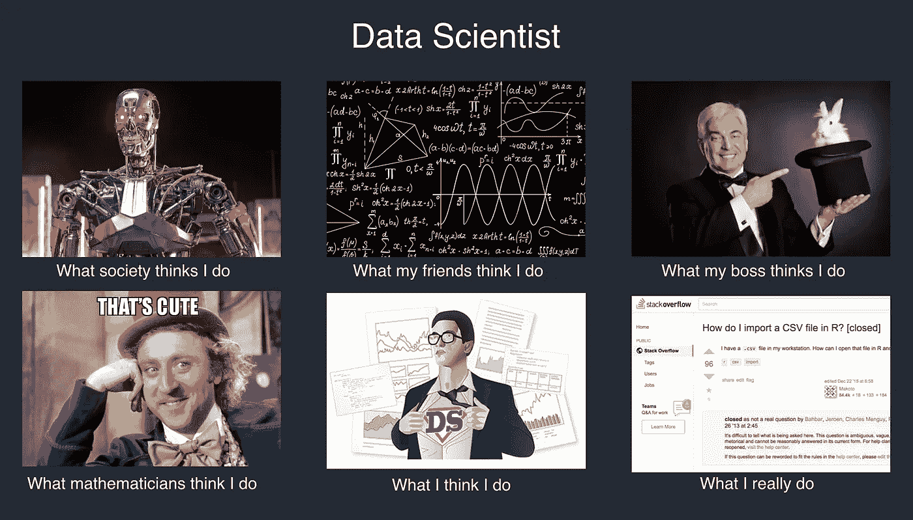
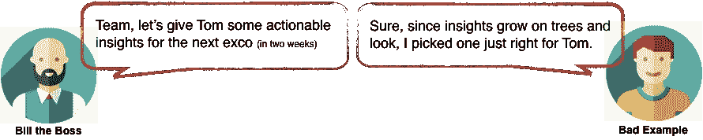
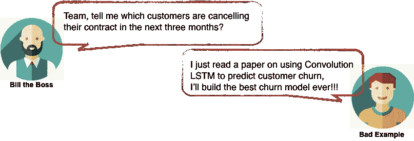
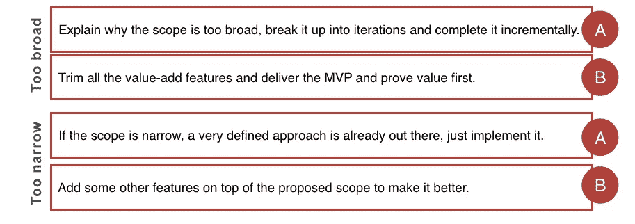
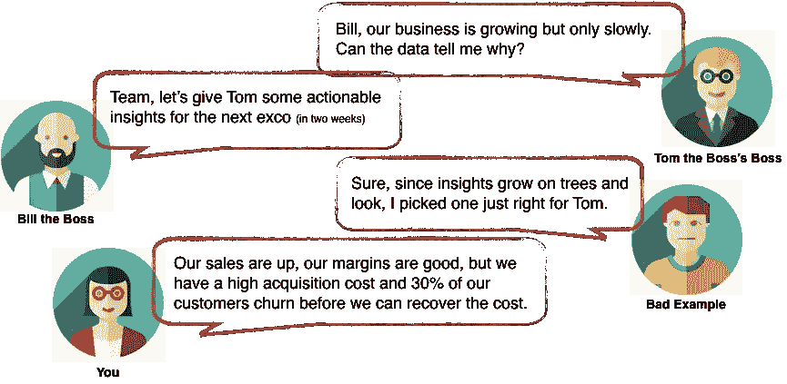
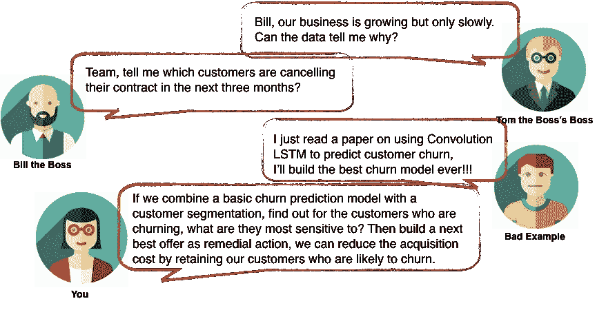
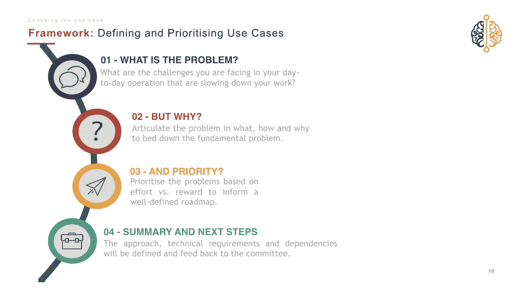
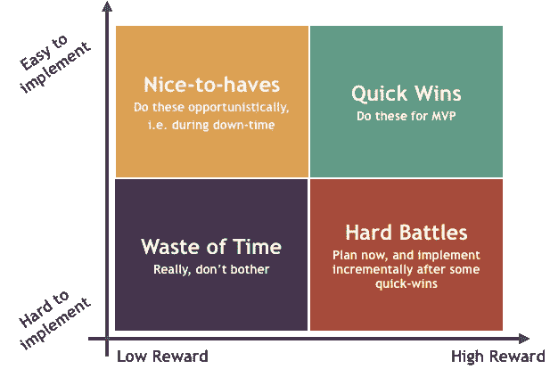
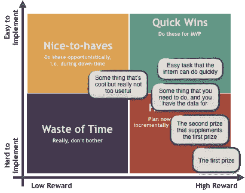

# 关于与企业一起定义数据科学项目范围的 3 个提示

> 原文：<https://towardsdatascience.com/tips-on-defining-a-data-science-project-scope-with-business-baa5a5b652b7?source=collection_archive---------15----------------------->

## 如何以数据科学家的身份与企业交流

## 永远不要因为在错误的时间把错误的东西送给错误的人而陷入麻烦

作为一名数据科学家，你希望得到一份能让你做酷事情的工作——大数据、大机器(或者像成年人一样的云)和深度神经网络。当你意识到你的模型、你的项目经理的时间表和你的利益相关者的期望之间的不匹配时，现实很快就来了。他们(通常)需要的不是一个 128 层的 ResNet，而是一个简单的 select & group by 查询，提供**可操作的洞察力**。

你的新工作已经进行了两个月，你的闪亮模型刚刚被束之高阁，嘟囔着:“什么是可操作的见解。谁的洞察力？用什么行动？”

本文概述了在(不)定义数据科学项目范围中的**常见陷阱**，以及如何分散或防止这些情况发生的技巧和框架。

# 陷阱 1:范围太广或未定义

使用数据主导、数据驱动和数据优先的方法的人数激增，分析领域的每个人都遇到过这一(或)著名的业务需求:

> “告诉我数据怎么说。”

不要误会我；我非常支持根据历史模式和精心设计的预测做出决策。然而，作为数据从业者，我们也知道有各种各样的数据类型:通常管理不善的内部数据，每个人都认为是分析圣杯的外部数据和什么都不说的内向数据。

操纵数据的表示来传达您想要发送的信息甚至容易得令人不安。例如，通过稍微挤压图表，你的收入增长突然**看起来像**5 倍，而不是 0.5 倍。更糟糕的是，通过不提出正确的问题和开发强有力的假设测试，数据甚至可以用来增强你现有的信念。

范围宽泛且不明确的危险就在于此。这对于你先前的信念来说是非常主观的，大多数时候，企业和科学家在理解和解释不同的事情。

# 陷阱 2:范围过窄或定义过窄

与过于宽泛的范围相反，你可能还会遇到一些非常热情的利益相关者，他们在**哈佛商业评论**上阅读了一些关于客户流失建模或客户细分的文章，并要求你构建一些非常具体的东西。

当这种情况发生时，我们的第一反应往往是进入求解模式，开始幻想两周前你读过的那篇论文中的卷积 LSTM。然后我们开始卷起袖子，掰着手指头想…

> 嘿，我知道怎么做。

在经历了血、汗和泪之后，你终于有东西可以展示了。在演示会上，利益相关者看着你，你回头看着他，期望得到奖金或至少拍拍他的背，但他困惑地问道:

> 好吧，那很酷，但是仪表板在哪里？

等等什么？原来他从来没有想要一个客户流失模型。

他想要的只是一个仪表板，上面有合同将在未来三个月内到期的客户。其目的不是预测谁会续签合同，而是让一线呼叫中心跟踪他们与这些客户的接触情况。

你站起来，收拾好你构造精美、优化高效的模型，然后走出来。

> 现在深呼吸(不要打你的电脑)

让我们在这里暂停一下，回想一下这是什么时候发生在你身上的。看看下面两个与范围过宽或过窄相关的选项。如果你能回到过去选一个，你会怎么做？

这里(或者永远)没有正确或错误的答案，这些都是优秀的敏捷方法，可以在需求不明确的时候使用。

但是，我希望你做的不是专注于如何缩小或重新定义范围，而是提出更多的问题。无论是太宽泛还是太狭窄的场景都假设问题是正确的，并且是我们不舒服的解决方案，但是如果问题甚至不是真实的呢？如果没有问足够多的问题，你可能会无意中掩盖症状，掩盖根本原因。

因此，如果你从这篇文章中拿走一样东西，我希望你再次记住这一点:**企业不知道他们想要什么。**

> 你的工作是帮助企业找到他们想要的东西。

# 技巧 1:找出企业真正想要的是什么

事实是，我们的大多数业务利益相关者不了解数据科学项目的可能性。在构建他们的问题时，通常有很多假设但没有明确地说出来，所以从表面上接受他们的请求会导致无数次的范围变化。

作为你所在领域的专家，*你的工作是*引导企业通过术语的丛林，将他们的征服世界的神奇按钮业务问题转化为可以解决的问题，*数学上*，以及*他们的数据*。

想象一下，在对想要的可操作的见解进行一些探究之后，你发现他们所关注的是**【缓慢增长】**。咻，至少它限制了对与成长相关的神奇事物的探索。然后，您可以提供一些与增长相关的出色见解，如收购成本和流失率。

不幸的是，读懂另一个人的想法并不容易，但幸运的是，你可以使用一些试探性的问题:

> 1.是什么让你夜不能寐？
> 2。你想证明或反驳什么？
> 3。你的直觉告诉你什么？
> 4。如果你有预算做好一件事，那会是什么？

# 技巧 2:不要只是被抛给一个问题，帮助定义它

作为一个技术人员，你对解决问题的热情定义了你。与此同时，这个特征最终会阻碍你解决真正的问题。幸运的是，帮助定义问题不仅可以防止范围的改变，而且非常有趣*。*

*有时，问题不是立即可以解决的，需要多个步骤才能实现——但同样，企业可能不知道这一点。与其被指责为你的流失模型无助于减少流失，你可以掌握自己的事情，为自己(或你的利益相关者，因为你*应该*更了解)构建一个路线图。*

**

*这是你释放所有创造力的时候，你又回到了五岁:*

> *1.你为什么想知道是谁取消了他们的合同？
> 2。如果你知道这些，你会怎么做？
> 3。但是为什么，为什么为什么？*

*有大量的方法可以帮助你发现真正的问题(例如 [5 个为什么](https://en.wikipedia.org/wiki/5_Whys)、[根本原因分析](https://en.wikipedia.org/wiki/Root_cause_analysis)和[石川(鱼骨)图)](https://en.wikipedia.org/wiki/Ishikawa_diagram)，所以我将跳过这篇文章来节省我们的时间。我鼓励你们研究并熟悉它们。*

*最后，我想分享我用来揭示我的利益相关者有什么问题的研讨会框架。*

# *研讨会框架:定义用例并确定优先级*

*今年早些时候，我参与了一个“帮助我们创建 XYZ 滚动预报”的项目。这似乎是一个直接的时间序列预测问题，但当试图最终确定需求时，我意识到每个人都认为这种“预测模型”将提供巨大的差距。它包括每日预报(每月的时间序列？！)到用户必须执行的具体行动要求，以缩小差距。*

*我召集了一大群来自不同业务部门的人，开了一个研讨会，了解他们真正想要的是什么。最后，每个人都同意他们**需要**一个时间序列预测模型，但是他们**现在**想要的是一个场景规划工具。*

*这个 3 小时的研讨会让我发现:*

**

## *让每个人都发泄出来*

*这是你问每个人他们生活中有什么问题的部分。这些可以是大的或小的，长期的或短期的，他们观察到的或他们经历的，他们想要的或他们需要的。*

**

*The actual screenshot from the actual workshop #provingithappened*

*将他们所有的愤怒和挫折分成不同的主题，并向听众总结。*

## *第二步:让每个人都思考*

*最重要的部分不是他们想要什么，而是 ***为什么*** 他们想要。第一步的全部目的是唤醒他们对世界上所有问题的记忆。练习的这一部分迫使他们理解为什么他们会感到沮丧。他们想实现却无法实现的是什么？*

**

## *第三步:让每个人都为此而战*

*然而可悲的是，有些梦想注定永远是梦想，企业自己认识到这一点是至关重要的。通常，不同的利益相关者在奖励水平上会有分歧:信贷团队想要所有最有可能违约的用户，呼叫中心想要最有可能升级的用户，而财务团队想要终身价值最高的用户。你可以解释为什么有些项目很难实现，但是对于回报，商业利益相关者必须自己解决。*

**

## *最后:有一个路线图。*

*有一个路线图，如果不是为业务，那么为自己。*

*当然，需求总是会变化的，但是具有前瞻性的观点有助于让每个人都保持在正确的轨道上。最终的目标往往是一条漫长而艰辛的路，所以眼睛盯着球，放开那 0.2%的准确度。*

**

> *有时候在现实生活中，够好就够好了*

*如果你喜欢这篇文章，我将在接下来的几周发表以下内容:*

*   *如何用业务管理数据科学项目范围*
*   *如何向企业传达数据科学项目进展*

*我会确保这些帖子出来后我会超链接它们:)*