# 多元线性回归的技巧和窍门

> 原文：<https://towardsdatascience.com/tips-tricks-in-multiple-linear-regression-b5e83a4e73f1?source=collection_archive---------21----------------------->

## 收集分析数据、诊断模型和可视化结果的方法

这个分析是我决定在学校回归分析模块中承担的一个项目。我已经学习并收集了几种方法，你可以在 R 中使用，使你的分析更深入。像往常一样，我总是自学最有发现的东西。

# 数据

回应变量:承认的机会

预测因素:GRE 成绩，托福成绩，大学评级，SOP，LOR，CGPA，研究

[链接到 csv](https://github.com/jasonyip184/regression_analysis/blob/master/Admission_Data.csv)

# 图书馆

```
library(dplyr);
library(ggplot2);
library(GGally);
library(vioplot);
library(corpcor);
library(ppcor);
library(mctest);
library(ggfortify);
library(lmtest);
library(MASS);
library(car);
library(DAAG);
library(jtools);
library(relaimpo);
```

# 描述性统计

`summary(df)`

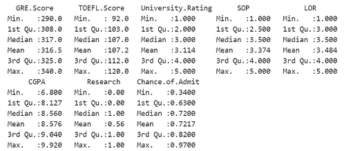

# 分布图

```
par(mfrow=c(4, 2))
colnames = names(df)
for(name in colnames) {
  vioplot(df[name], horizontal=TRUE, col='gold', lineCol='gold', lty=0, colMed='floralwhite', yaxt='n',rectCol='dodgerblue4')
  title(main=name)
}
```


There is no extreme skew for the variables. this makes the confidence intervals for estimating parameters for our predictors and estimating the mean response more meaningful.

# 检查 1)DV 和每个 iv 之间的线性 2)iv 之间的多重共线性

`ggpairs(df, progress=FALSE)`

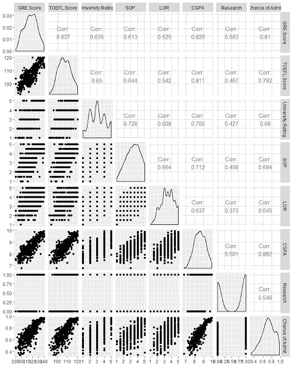

From the last row, we can observe that most of the IVs seem to have a linear relationship with our response variable except for the binary variable Research. Therefore the assumption for linearity between DV and each of IVs hold.

所有变量的成对相关性都相当高。这似乎违反了多元线性回归没有多重共线性的假设。

# 偏相关系数

考虑到其他预测因素的混杂效应。

```
pcorr = as.data.frame(cor2pcor(cov(df)))
names(pcorr) = names(df)
rownames(pcorr) = names(df)
pcorr = format(pcorr, digits=1)
print.data.frame(pcorr)
```


The partial correlation coefficients suggest otherwise, that there is less multicollinearity with only GRE.Score & TOEFL.Score having a value > 0.4\. Partial correlation between CGPA and our response variable Chance.of.Admit is fairly high but it does not violate the “No Multicollinearity between its IVs assumption” of MLR.

# 使用个别多重共线性诊断测量

```
imcdiag(df[,1:7],df$Chance.of.Admit)
```

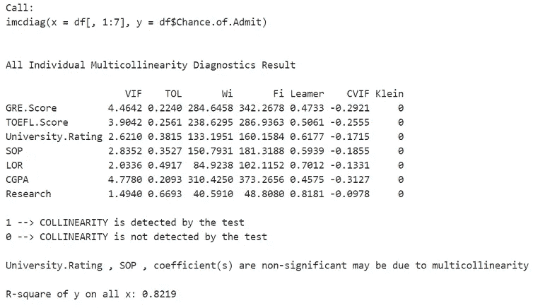

All the predictors have a VIF (=1/(1-R²)) value of <5 which indicates that the multicollinearity is not so problematic.

# 安装 MLR

```
fit = lm(Chance.of.Admit ~ ., data=df)
summary(fit)
```

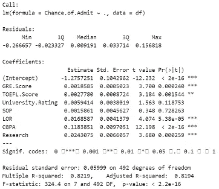

Fit: Chance.of.Admit = -1.28 + 0.00186(GRE.Score) + 0.00278(TOEFL.Score) + 0.00594(University.Rating) + 0.00159(SOP) + 0.0169(LOR) + 0.118(CGPA) + 0.0243(Research) (3s.f.)

这表明平均而言，GRE 每增加一个单位。分数/托福。分数/大学。Rating/SOP/LOR/CGPA/Research 在保持所有其他变量不变的情况下，将录取机会增加 0.00186/0.00278/0.00594/0.00159/0.0169/0.118/0.0243。

F 统计量的 p 值是<2.2e-16, indicating that we can reject the null hypothesis that the intercept-only model is the same fit as the MLR model even at alpha=0.001\. Therefore, the MLR model is highly statistically significant at the 0.01 significance level.

The Adjusted R-squared: 0.8194 is high which suggests that the model is a good fit.

The coefficients for GRE.Score, TOEFL.Score, LOR, CGPA, Research are statistically significant at alpha=0.01 where the respective pvalues < 0.01 as we reject the null that their coeffs is 0 at the 0.01 significance level.

The coefficients for University.Rating (0.118) and SOP (0.728263) are > 0.01，我们无法在 0.01 的显著性水平上拒绝它们的系数为 0 的空值。

# 模型诊断

```
autoplot(fit)
```

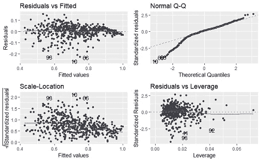

**(1)残差 vs 拟合**

蓝线(每个拟合值的残差平均值)几乎是平的。这表明残差没有明显的非线性趋势。残差看起来是随机分布的，但当接近较高的拟合值时，它会收敛。这似乎是方差的减少，它违反了 MLR 的同方差假设。

```
bptest(fit)
```


Using the Breusch-Pagan test, we can reject the null hypothesis at the 0.05 significance level that variance of the residuals is constant and infer that heteroscedasticity is present. Therefore, this makes our coefficient estimates less precise and increases the likelihood that the estimates are further from the true population value.

**(2)正常 Q-Q** (分位数-分位数图)

残差似乎偏离较低尾部的对角线很多。残差的分布向左倾斜。这表明 MLR 模型对残差正态性的假设被违反。

使用 Box-Cox 幂变换变换响应变量，使其正常并处理异方差

```
bc = boxcox(Chance.of.Admit ~ ., data=df);
```

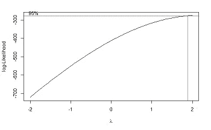

The procedure identifies an appropriate exponent (Lambda = l) to use to transform data into a “normal shape. The Lambda value indicates the power to which all data should be raised and it is suggested to use lambda=2.

```
lambda = bc$x[which.max(bc$y)]
powerTransform <- function(y, lambda1, lambda2 = NULL, method = "boxcox") {
  boxcoxTrans <- function(x, lam1, lam2 = NULL) {
    # if we set lambda2 to zero, it becomes the one parameter transformation
    lam2 <- ifelse(is.null(lam2), 0, lam2)
    if (lam1 == 0L) {
      log(y + lam2)
    } else {
      (((y + lam2)^lam1) - 1) / lam1
    }
  }
  switch(method
         , boxcox = boxcoxTrans(y, lambda1, lambda2)
         , tukey = y^lambda1
  )
}
# re-run with transformation
bcfit <- lm(powerTransform(Chance.of.Admit, lambda) ~ ., data=df)summary(bcfit)
```

调整后的 R 平方从 0.8194 增加到 0.8471，而预测因子仍然显著。然而，这个模型的可解释性较差，我们希望我们的模型尽可能简洁。我们将在以后探索更多的模型。

**(3)残差与杠杆**

```
cooksd <- cooks.distance(fit)
sample_size <- nrow(df)
plot(cooksd, pch="*", cex=2, main="Influential Obs by Cooks distance")
abline(h = 4/sample_size, col="red")
text(x=1:length(cooksd)+1, y=cooksd, labels=ifelse(cooksd>4/sample_size, names(cooksd),""), col="red")
```

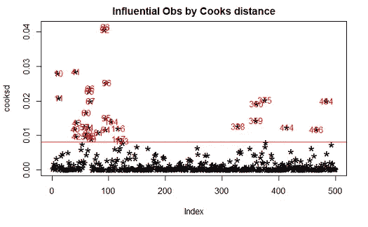

This helps us to find influential outliers. They are points above the dashed line which are not approximated well by the model (has high residual) and significantly influences model fit (has high leverage). By considering Cook’s D > 4/sample size criterion, we identify influential outliers to remove.

# 移除异常值后重新拟合 MLR

```
influential = as.numeric(names(cooksd)[(cooksd > (4/sample_size))])
df2 = df[-influential, ]
fit2 = lm(Chance.of.Admit ~ ., data=df2)
summary(fit2)
```

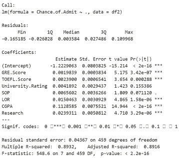

By removing the highly influential outliers, we refitted the model on the filtered data and the Adjusted R-squared increased to 0.8194 to 0.8916 without introducing complexity to the model.

# 使用响应变量的函数来拟合模型

```
fit3 = lm(exp(Chance.of.Admit) ~ ., data=df2)
summary(fit3)
```

通过回归我们对预测因子的反应指数，我们得到了调整后的 R 平方从 0.8916 增加到 0.9023，而预测因子仍然保持显著性。

# 通过添加交互项来说明交互

```
fit4 = lm(exp(Chance.of.Admit) ~ GRE.Score*University.Rating+TOEFL.Score+Research+SOP+LOR+CGPA, data=df2)
summary(fit4)
```

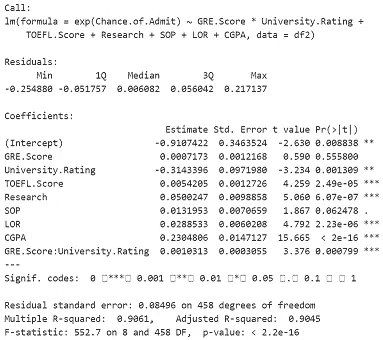

Interaction arises as the relationship between Chance.of.Admit and the IVs: GRE.Score and University.Rating is affected by the interaction between the GRE.Score & University.Rating. This makes it hard to predict the consequence of changing the value of GRE.Score & University.Rating without controlling for this interaction.

该模型显示了 GRE 之间的显著交互作用。分数&大学。评级为 p 值=0.000799 < 0.001 and is significant at the 0.001 significance level.

# Comparing nested models with ANOVA

```
anova(fit3, fit4)
```

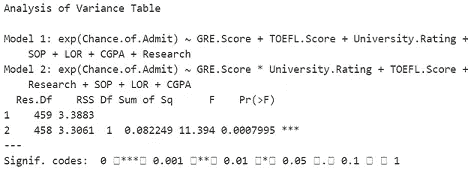

The first order model is nested within the interaction model. By using ANOVA to compare the simpler first order model vs the more complex model with interaction term, the p-value=0.0007995 is <0.001\. The null hypothesis that the reduced simpler model is adequate is rejected at the 0.001 significance level. Therefore, the complex model did significantly improve the fit over the simpler model.

# Drop insignificant predictor SOP

```
fit5 = lm(exp(Chance.of.Admit) ~ GRE.Score*University.Rating+TOEFL.Score+Research+LOR+CGPA, data=df2)
summary(fit5)
```

Previously, SOP was insignificant at the 0.05 significance level and even after removing it, the model’s Adjusted R-squared is still 0.904.

# Variable selection using stepwise model selection by AIC

```
step <- stepAIC(fit5, direction="both")
```

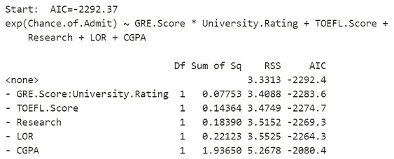

A model with fewer parameters is to be preferred to one with more. AIC considers both the fit of the model and the number of parameters used. Having more parameters result in penalty. AIC helps to balance over- and under-fitting. The stepwise model comparison iteratively adds/removes variables one at a time and compares the AIC. The lowest AIC is selected for the final model.

```
step$anova
```

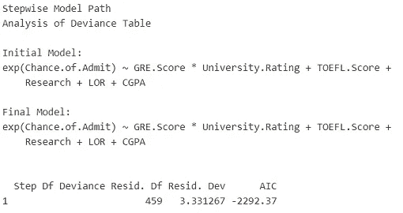

In our case, there no further addition or removal of variables required by AIC.

# Relative feature importance

```
calc.relimp(fit5,type="lmg", rela=TRUE)
```

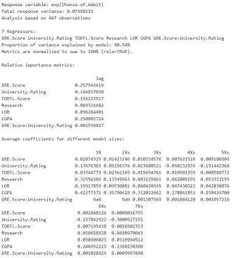

Relative importance is measured by an algorithm by Lindemann, Merenda and Gold (lmg; 1980) which decomposes total R-squared and observe the increase in R-squared by adding the predictors sequentially. The order of adding predictors matters and therefore, the algorithm takes the average of the R-squared across all orderings.

Relative importance is measured by an algorithm by Lindemann, Merenda and Gold (lmg; 1980) which decomposes total R-squared and observe the increase in R-squared by adding the predictors sequentially. The order of adding predictors matters and therefore, the algorithm takes the average of the R-squared across all orderings.

The features are ranked in this order with highest relative importance first: GRE.Score, CGPA, University.Rating, TOEFL.Score, LOR, Research and GRE.Score*University.Rating.

# K-Fold cross-validation results on final model

```
cv_new = CVlm(data=df2, fit5, m=3, printit=FALSE)attr(cv_new, "ms")[1] 0.007749426
```

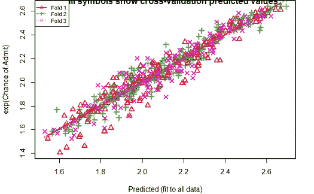

Each of the k-fold model’s prediction accuracy isn’t varying too much for any one particular sample, and the lines of best fit from the k-folds don’t vary too much with respect the the slope and level. The average mean square error of the predictions for 3 portions is 0.00775\. The value is low and represents a good accuracy result.

# 95% CIs for every IV’s estimates

```
export_summs(fit5, error_format = "[{conf.low}, {conf.high}]", digits=5)
```

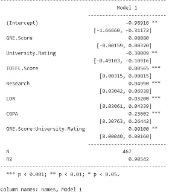

```
plot_summs(fit5)
```

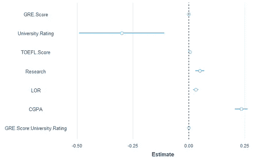

# Individual CI plots

```
effect_plot(fit4, pred = CGPA, interval = TRUE, plot.points = TRUE)
```

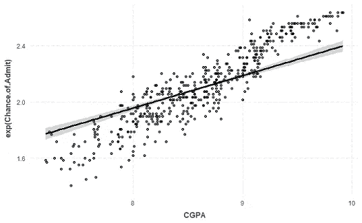

I hope this has helped improve your analysis one way or another. Please do not take any of it as a perfect example or as entirely correct and accurate as I am still learning as well. This has certainly liven up my otherwise dull module 😃.

[链接到笔记本](https://jasonyip184.github.io/regression_analysis/)

请在 [LinkedIn](http://linkedin.com/in/jasonyip184) 或通过 jasonyip184@gmail.com 与我进一步讨论！