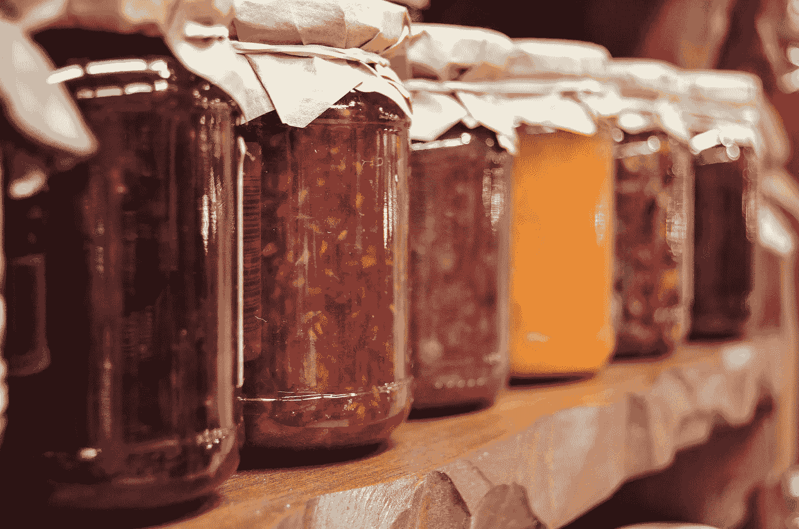

# 清理你的 R 代码！更好的特征工程的秘密

> 原文：<https://towardsdatascience.com/tired-of-nested-ifelse-in-dplyr-look-no-further-ebf7166b5289?source=collection_archive---------25----------------------->



by jarmoluk at pixabay.com

# 使用变异特征设计新的分类

`dplyr`中最有用的函数是`mutate`；它允许您创建新的变量——通常是通过在数据集中的其他变量之上分层放置一些逻辑。

# 快速示例

假设您正在分析用户数据，并希望根据使用量对用户进行分类。

您决定需要四个等级——非活动用户、受限用户、健康用户和高级用户。

您的代码可能如下所示。您将在这里看到的是，为了创建新的`user_type`变量，我们使用`mutate`函数，声明新的变量名，然后利用`ifelse`来确定在什么波段下应用不同的值。正如你在下面看到的，如果应用程序中的动作少于 5，这是最低的阈值，那么我们称之为非活动...如果该标准不为真，那么我们将进入下一个`ifelse`语句来建立下一组标准。

```
df %>% 
    mutate(user_type = ifelse(
                app_actions <= 5, 'inactive user', ifelse(     
                    app_actions <= 10, 'limited user', ifelse(
                        app_actions <= 15, 'healthy user', 'active user' ) ) ) )
```

虽然`ifelse`是一个主要工具并且非常有用，但是当你开始嵌套太多`ifelse`时，就会出现一些问题。

1.  难以解释和编辑的混乱代码
2.  你写了很多多余的代码

我应该补充一下，我上面写的并不太疯狂，但是你可能很快就需要两位数的`ifelse`语句，这就产生了我们正在讨论的问题。

# `case_when`化险为夷

在许多方面，R 比 sql 提供了更多的灵活性，但是也就是说，许多人不必要错过的一个 SQL 命令是`case_when`。幸运的是，`case_when`实际上是 r 中的一个东西。

查看用`case_when`呈现的完全相同的代码片段。

```
df %>% 
    mutate(user_type = case_when(
                           app_actions <= 5 ~ 'inactive user',
                           app_actions <= 10 ~ 'limited user',
                           app_actions <= 15 ~ 'healthy user', 
                           TRUE ~ 'active user' ) )
```

同样，这是一个非常简单的示例，但是当您必须进行二十种条件/值组合时，这可以节省大量时间，并且清晰易读。这里的主要区别在于，左侧实际上是为条件保留的，`~`符号用作比较值&之间的分隔符，显然右侧是要给出匹配标准的值。最后一点，`TRUE`作为最终的总括，类似于`else`语句。

# 结论

简而言之，虽然`ifelse`有它们的位置并且非常有用，但是当你面对无数的`ifelse`陈述时，`case_when`让一个简单的&变得容易解释。

我希望这在你所有的特性工程工作中对你有用！如果你觉得这有用而且有趣，来看看我们在 datasciencelessons.com 的其他数据科学帖子吧！祝数据科学快乐！

*原载于 2019 年 11 月 22 日【http://datasciencelessons.com】[](https://datasciencelessons.com/2019/11/22/tired-of-nested-ifelse-in-dplyr/)**。***