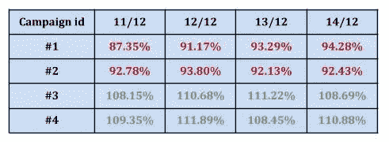

# 是时候了:使用决策树来解释模型行为

> 原文：<https://towardsdatascience.com/tis-the-season-using-decision-trees-to-explain-model-behavior-41a7348cb1e9?source=collection_archive---------33----------------------->

## 如何用一个简单的决策树来帮助你理解什么让你的深度模型表现好，什么不好？


在 Taboola，我们每天都在努力改进我们基于深度学习的内容推荐模型。我们使用它每天向数亿用户建议个性化的新闻文章和广告，因此自然地，我们必须坚持最先进的深度学习建模方法。但我们的工作并没有就此结束，分析我们的结果也是必须的，然后我们有时会回到数据科学的根本，应用一些非常基本的技术。

让我们来解决这样一个问题。我们正在研究一个行为相当奇怪的深度模型:对于看起来像是随机的一组广告客户，它赢过了我们的默认模型，而对于另一组广告客户，它输了。这种行为每天都是稳定的，所以看起来可能有一些内在的广告商品质(我们称之为活动特征)要对此负责。您可以在下面看到 4 个活动的典型模型行为。



*Daily results for selected campaigns, compared to a baseline of 100%. We can see the new model is very stable. But, how can we predict which campaign is going to succeeded?*

因此，我们假设，这场运动的某些因素使得这个模型要么成功，要么失败。会不会是竞选使用的出版商类型？他们的观众规模？他们的每次点击成本？也许所有这些都在一起？圣诞老人还没来帮忙，所以我们应该调查一下！

如果我们认为可能有一个数字特征对此负责，我们可以用 python 编写一个简单的脚本来寻找不同活动特征和我们的标签之间的相关性。但是我们认为这不仅仅是一个竞选特征造成的，而且我们有许多分类特征——所以我们不能简单地联系起来。怎么办？让我们利用机器学习的力量！因此，我们将使用机器学习算法(特别是决策树)来帮助解释我们的深度学习模型结果:


在我们继续之前，您可能会有一些问题:

*   为什么要使用树，而不是像 SHAP 一样使用深度学习解释工具？我们在这里试图隔离活动特征，通用模型使用了许多现在不相关的其他特征(用户特征、上下文特征)。此外，我们可能有更多的元数据可以使用，而不是进入深度模型——比如，活动的语言，它已经运行了多长时间等。
*   **为什么要用一棵树，而不是另一个深度模型来解决这个问题呢？**我们寻求最大的可解释性，即使我们的模型不是 100%准确——只要它能指出让我们赢/输的主要疑点。
*   **为什么使用简单的决策树，而不是随机森林或 xgboost？**就像上一个问题一样。决策树足够强大，可以抓住主要的坏人，它只有几行代码，你可以绘制它！
*   我们如何选择树的深度？尽量保持简单，如果你认为你可能有 1-3 个主要特征要寻找，深度为 2 的树就足够了。你可以看看深度 3，看看你没有错过什么。再多可能就太多了。

因此，概括一下，我们生成一个包含我们所有活动特征的表格，并添加一个带有 0/1 的标签列，这取决于我们比默认模型做得更好还是更差(这是我们试图预测的)。使用此表来拟合树分类器。然后画出树，看看它找到了什么，或者只看按重要性排序的特征。只需大约 15 行代码就能得到结果，而且你阅读这篇文章的时间也更短。

这项技术最终变得非常有用:如果确实有使模型工作的特征，我们几乎可以立即发现它们。对于我们的情况，我们可以精确地指出我们需要多少流量来积累足够的数据以使我们的模型成功。更重要的是，在其他情况下，如果树只找到嘈杂的无法解释的列，这意味着我们的假设是错误的。

下面是我们粘贴实际代码之前的一些亮点。

*   树可以处理分类特征，但是你必须首先对它们进行编码。不用辛苦自己实现，用下面的熊猫内置函数。
*   小心与你的标签列相关的奇怪的列！记住可解释性是这里的关键——所以如果你突然发现某个随机的分类值在你的决策树上非常高，那很可能是噪音！去掉它，从头开始。
*   不需要在训练和测试之间分割数据，使用一个低的深度应该可以解决过度拟合的问题。

就是这样。有时，简单的解决方案甚至对令人困惑的问题也足够了。树是快速的，可解释的，它们的图形在演示中看起来非常好🙂

祝大家圣诞快乐，节日快乐！


正如承诺的那样，这里是 python 代码示例:

```
# Imports
from sklearn.tree import DecisionTreeClassifier
from sklearn import tree
import pandas as pd# Read the files
data = pd.read_csv(“your_file_here.csv”)
label = “your label column”# Split data from label
y = data[label]
X = data.drop(label, axis=1)# Data preprocessing:
# Fill in NaN
X = X.fillna(0)# Turn categorical features to 1 hot encoded columns
X = pd.get_dummies(X)# Fit tree
max_depth=2
classifier = DecisionTreeClassifier(random_state=0, max_depth=max_depth)
classifier.fit(X, y)# Print top 5 features by importance
print(“max depth:”, max_depth)
print(sorted(zip(X.columns, classifier.feature_importances_), key=lambda x: x[1])[-5:])# Plot tree
from sklearn.tree import export_graphviz
import graphviz
export_graphviz(classifier, out_file=”mytree.dot”,feature_names=X.columns)
with open(“mytree.dot”) as f:
dot_graph = f.read()
graphviz.Source(dot_graph)
```

*本帖原载于 2019 年 12 月 18 日 https://engineering.taboola.com**的* [*。*](https://engineering.taboola.com/tis-season-fun-decision-trees/?fbclid=IwAR0cePIozZb0mPPpKitWlwcmLC7td-zSgShPglQ58Hpyyy5caYxHwGqZiRw)