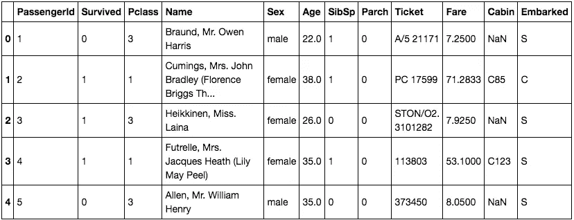
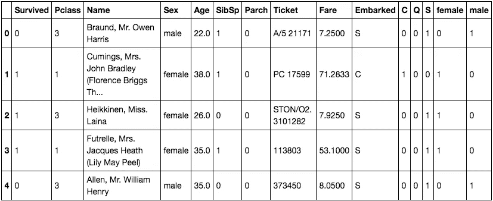

# 泰坦尼克号:数据分析中的爱情

> 原文：<https://towardsdatascience.com/titanic-love-in-data-analytics-1b38b40d7247?source=collection_archive---------24----------------------->

《泰坦尼克号》一直是我最喜欢的电影之一。自从这部电影在 1997 年被搬上大银幕以来，我已经看过至少 10 遍了。这部电影本质上是一个爱情故事，围绕着 1912 年在这艘臭名昭著的船上的两个主角。一个 17 岁的贵族在一艘豪华的、命运多舛的船上爱上了一个善良但贫穷的艺术家。

结局浪漫又悲伤。当我们为杰克和罗斯短暂的爱情悲伤时，1912 年泰坦尼克号上其余的 891 名乘客发生了什么？为了回答这个问题，我使用了 Kaggle 的乘客名单数据集，用机器学习算法预测生存或死亡困境。

**这是一个比较两种机器学习算法应用结果的简单练习:** [**K 近邻(KNN)**](https://www.analyticsvidhya.com/blog/2018/03/introduction-k-neighbours-algorithm-clustering/) **和** [**随机森林**](https://www.datascience.com/resources/notebooks/random-forest-intro) **。**你可以在这里 找到数据集 [**的副本来试用。**](https://www.kaggle.com/c/titanic)

为什么 [KNN](https://en.wikipedia.org/wiki/K-nearest_neighbors_algorithm) 和[随机森林](/the-random-forest-algorithm-d457d499ffcd)？两者都是 [**二进制分类算法**](https://en.wikipedia.org/wiki/Binary_classification) 根据一个对象是否具有某些定性属性的决定，将给定集合的元素标记为两组(预测每组属于哪一组)。两者都是这一类中最流行的算法；其他的只是 KNN 和兰登森林的衍生物。你可以在这里阅读其他二进制分类算法[。](https://www.google.com/search?q=types+of+binary+classification+models&oq=types+of+binary+classi&aqs=chrome.0.0j69i57j0l2.3784j1j4&sourceid=chrome&ie=UTF-8)

> 当您的问题的答案落在一组有限的可能结果中时，二元分类在数据集上最有效。

一个例子是确定患者是否患有某种疾病的医学测试——分类属性是疾病的存在。在泰坦尼克号数据集中，我的目标是根据一组属性，如年龄、性别、机票等级等，预测乘客是否在悲惨的事故中幸存。这是一个经典的二元分类，因为只有两种可能的结果:生存或死亡。

让我们深入研究代码。请注意，有许多方法可以执行 Python 代码。为了简单和易用，我更喜欢 Python 的 Jupyter 笔记本。

**数据准备**

第一项任务是从文件中加载训练数据集。Python 提供了一种使用 Pandas 库加载和操作数据集的简单方法。让我们从导入实用程序库和训练数据集开始。

```
**import** **pandas** **as** **pd**df = pd.read_csv('titanic_dataset.csv')
df.head()
```



Top 5 rows of the data frame

使用数据集时，一些记录可能不完整。由于我们的示例包含几十年前的数据，因此会有一些信息丢失。

幸运的是，有一些方法可以填补一些缺失的数据。对于所进行的分析，年龄是表征因素之一。因此，数据集包含所有记录的年龄非常重要。下面的代码将从数据集中计算平均年龄，然后用计算出的平均值填充任何缺失的记录。它还会将始发港未知的乘客的港口设置为“S”。

```
*# Fill the missing age with mean*
mean_age = df['Age'].mean()
df['Age'] = df['Age'].fillna(mean_age)*# Fill the missing embarked port with S*
embarked_port = 'S'
df['Embarked'] = df['Embarked'].fillna(embarked_port)
```

客舱位置可能会潜在地影响乘客存活率。但是，值的数量不太理想，最好删除。可能其他信息如 PassengerID 和 Name 可能不相关。因此，其他列可以从我们的数据集中删除，因为它们没有增加任何实际价值。

```
*# Drop Cabin & PassengerID columns*
df = df.drop(['PassengerId', 'Cabin', 'Name'], axis = 1)
```

尽管人类更喜欢文字，但计算机喜欢和数字打交道。我们数据准备的下一个任务是将人类可读的标签转换成算法可以解释的数字。下面的代码将字符串转换为整数，为每个表示的值添加新列，并根据特定值是否在行中表示，将值 0 或 1 分配给每个列。这将把性别(Sex)和装载列从字符串更改为整数，并将它们作为男性/女性和 CQS(字母代表装载的始发港)添加回数据帧。

```
df_sex = pd.get_dummies(df['Sex'])
df_em = pd.get_dummies(df['Embarked'])
df2 = pd.concat([df, df_em, df_sex], axis = 1)df2.head()
```



Top 5 rows of data frame after data preparation

在上表中，我们可以看到第一排的乘客是一名男性，他从一个未知的始发港上船。因此，S 和男性列被设置为 1，C/Q/女性被设置为 0。

**K-最近邻**

我们将回顾的第一个算法是 K-最近邻算法。你可以在[维基百科](https://en.wikipedia.org/wiki/K-nearest_neighbors_algorithm)中找到更多关于该算法的信息。

在下面的代码中，我实例化了算法，并使用 StandardScaler 将数据转换为使用相同范围的值。接下来确定如何在不同的训练数据集之间拆分数据，随后使用 cross_val_score 函数调用算法，并在拆分的数据集中找到算法的准确性。

```
*# instantiating a K Nearest Neighbor model*
**from** **sklearn.neighbors** **import** KNeighborsClassifier
clf = KNeighborsClassifier(n_neighbors = 5)*# import classes and functions from the library to be used in cross validation*
**from** **sklearn.preprocessing** **import** StandardScaler
**from** **sklearn.pipeline** **import** Pipeline
**from** **sklearn.model_selection** **import** StratifiedKFold, cross_val_scoress = StandardScaler() *# packages scaler and model together*
pipeline = Pipeline([('transformer', ss), ('estimator', clf)])*# how we want to split up the data*
skf = StratifiedKFold(n_splits=5,random_state=42)*# using cross_val_score to train 80% of data and test remaining 20%. Generate 5 scores as it tests 5 different times*
scores = cross_val_score(pipeline, X, y, cv = skf)scores
```

输出:数组([0.79888268，0.78212291，0.82022472，0.84269663，0.83050847])

cross_val_score 函数将我们之前从文件中加载的初始数据集分成 5 个子集，并对每个子集运行 KNN 算法。然后计算算法的精度。换句话说，它检查算法是否成功地计算出了实际发生的结果。阵列显示，对于每个子集，该算法的准确率为 79–84%。

何时使用 KNN:

*   数据被标记
*   数据是无噪声的
*   数据集很小，因为算法被认为是“懒惰的学习者”

**随机森林**

我们要讨论的下一个算法是随机森林。同样，你可以在[维基百科](https://en.wikipedia.org/wiki/Random_forest)中找到更多关于该算法的信息。

在 Python 中使用该算法非常简单。我们再次使用具有相同输入和预期输出的 cross_val_score 函数。

```
*# instantiating a K Random Forest model with the default arguments*
**from** **sklearn.ensemble** **import** RandomForestClassifier
clf_rf = RandomForestClassifier()**from** **sklearn.model_selection** **import** cross_val_score, StratifiedKFold *# how we want to split up the data* 
skf_rf = StratifiedKFold(n_splits = 5, shuffle = **True**, random_state = 42)*# using cross_val_score to train 80% of data and test remaining 20%. Generate 5 scores as it tests 5 different times*
score_rf = cross_val_score(clf_rf, X, y, cv = skf_rf)score_rf
```

输出:数组([0.81005587，0.77094972，0.80898876，0.85393258，0.82485876])

如前所述，对于 KNN，cross_val_score 函数对随机森林的作用类似。它分割初始数据集，对每个子集运行算法，然后计算算法的准确性。阵列显示，对于每个子集，该算法的准确率为 77–85%。

何时使用随机福里斯特:

*   大型数据集
*   不要过度拟合
*   数据集包含缺失数据，因为算法可以自动估计它们。可以使用的其他度量是切比雪夫、余弦等。

**外卖:**

在我的 KNN 模型中，一个值得注意的观察是 [StandardScaler](https://scikit-learn.org/stable/modules/generated/sklearn.preprocessing.StandardScaler.html) 的加入，这是包含不同规模变量的数据集中的一个必要步骤。在《泰坦尼克号》中，值为 5 到 50 的年龄列与 3 美元到 125 美元的票价列相比具有不同的比例。StandardScaler 执行**标准化**的任务。我发现这种利用极大地提高了我 KNN 模型的准确性，从基线的 62%提高到平均 81%。

具有最小训练阶段的 KNN 对于像泰坦尼克号这样的较小数据集是理想的，因为 KNN 在测试阶段保留所有的训练数据。在超过 100k 行的大型数据集中，随机森林可能更理想。与 KNN 相比，随机森林模型建立标签/分类所需的初始训练时间更长。然而，应用程序要快得多，因为事实模型是在新对象通过时创建的。

海难导致如此多生命损失的原因之一是没有足够的救生艇容纳乘客和船员。虽然幸存有一些运气成分，但是一些群体比其他群体更有可能幸存。女性性别和存活率之间有很强的相关性。尽管男性乘客比女性乘客多 84%,但女性幸存者比男性多。

当面对种类繁多的机器学习算法时，初学者提出的一个典型问题是“我应该使用哪种算法？”这个问题的答案取决于许多因素，包括:(1)数据的大小、质量和性质；(2)可用的计算时间；(3)任务的紧迫性；以及(4)你想用这些数据做什么。

这个有用的 scikit-learn 流程图为您提供了一个映射指南，帮助您根据数据大小、数据类型、预期结果和数据结构来确定最佳算法。


Credit: © 2007–2018, scikit-learn developers (BSD License)

**参考文献:**

二元分类。在*维基百科*中。检索于 2019 年 2 月 23 日，来自 https://en.wikipedia.org/wiki/Binary_classification

选择正确的评估者。在 *Scitkit-Learn* 中。检索于 2019 年 2 月 23 日，来自[https://sci kit-learn . org/stable/tutorial/machine _ learning _ map/index . html](https://scikit-learn.org/stable/tutorial/machine_learning_map/index.html)

[sci kit-learn:Python 中的机器学习](http://jmlr.csail.mit.edu/papers/v12/pedregosa11a.html)，Pedregosa *等人*，JMLR 12，第 2825–2830 页，2011 年。