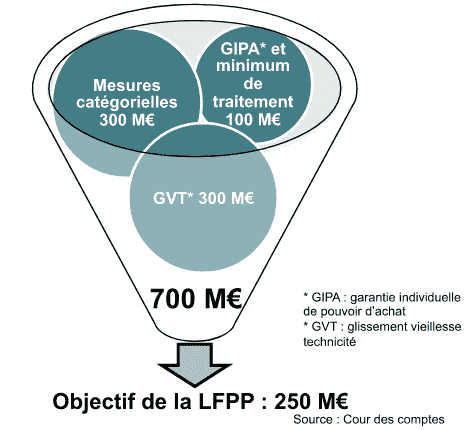
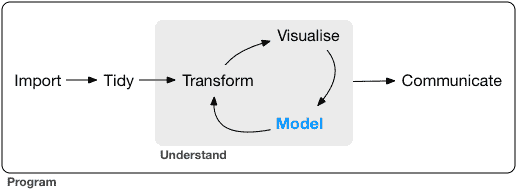
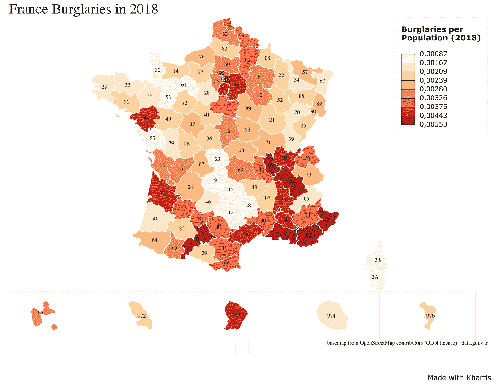
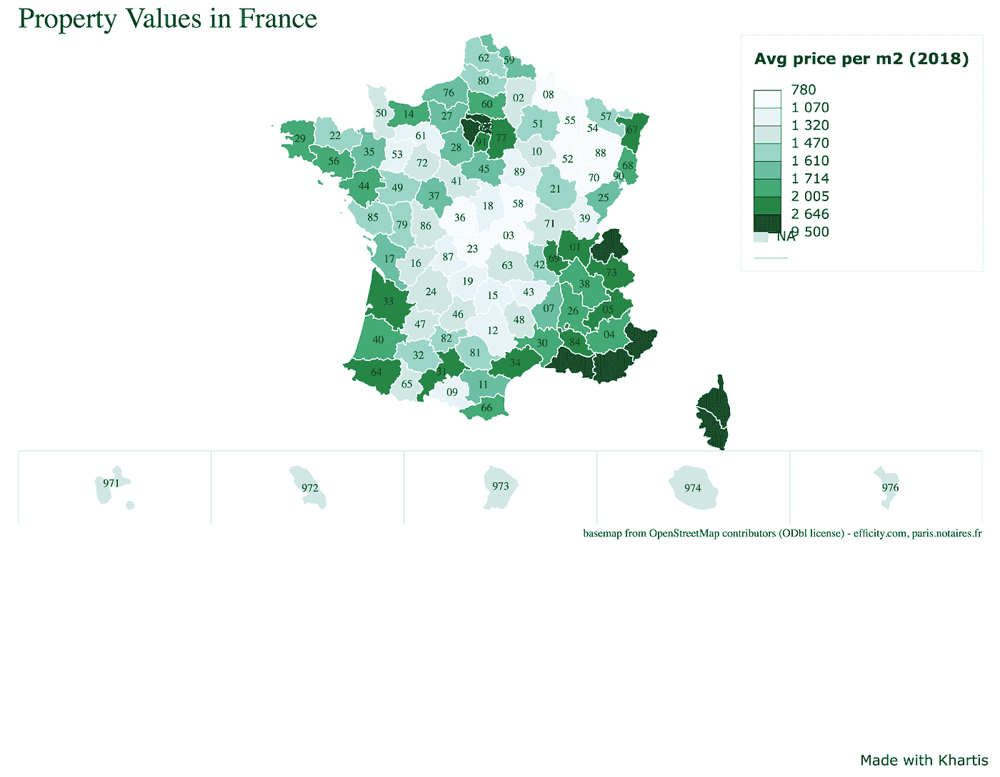
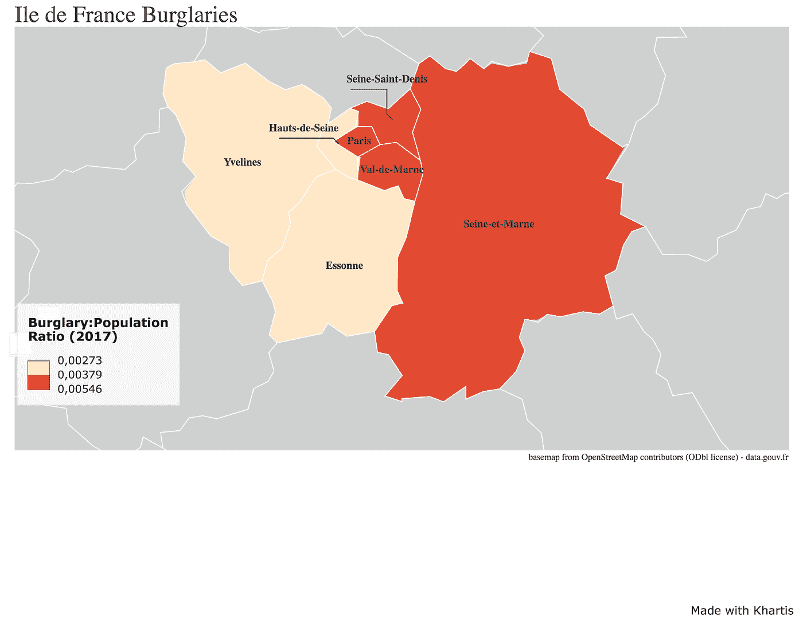
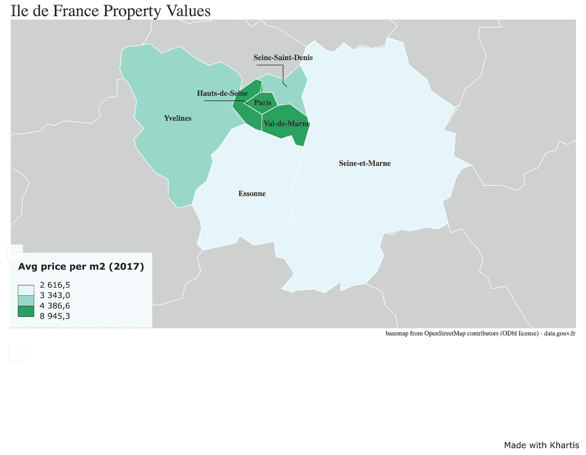
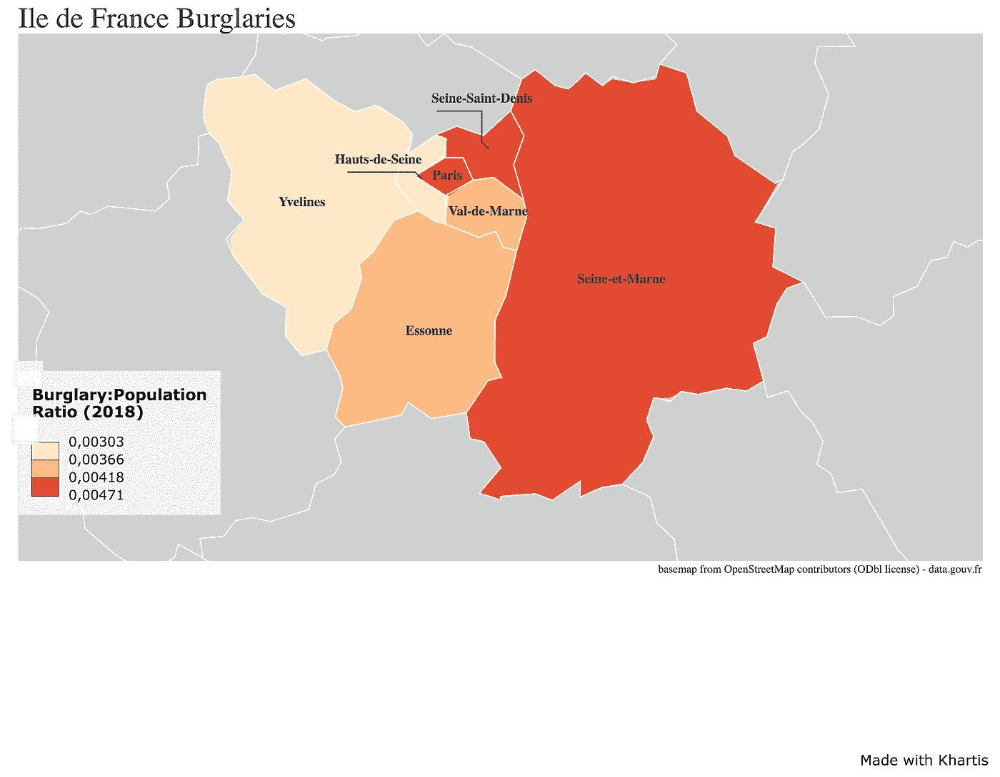
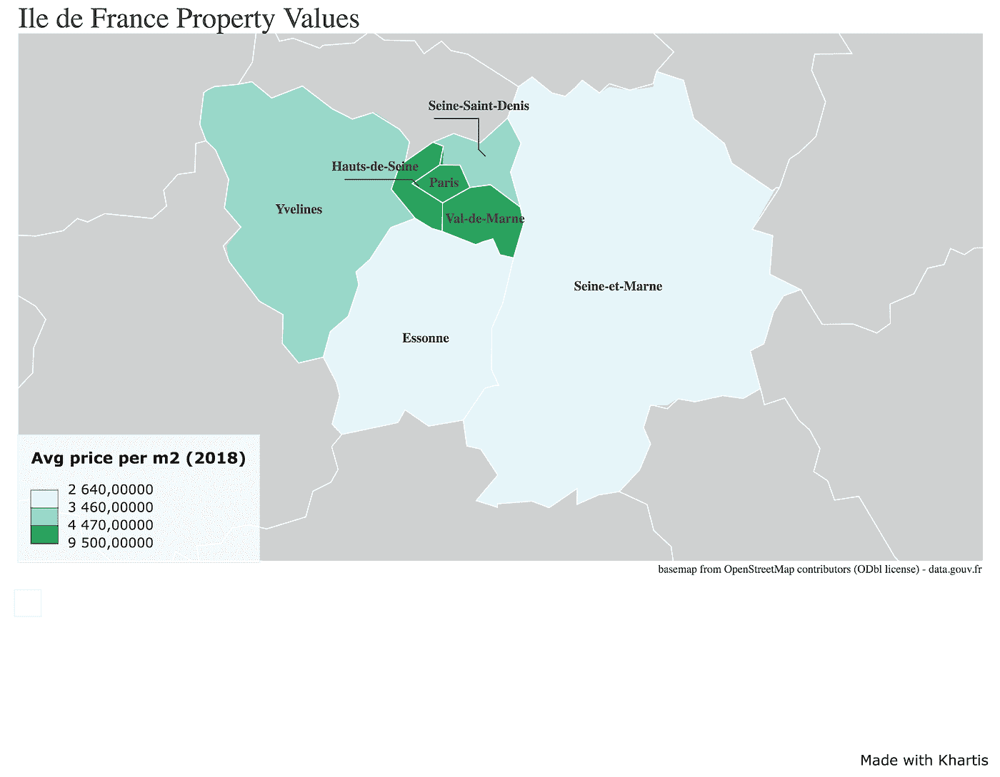

# 抓住一个剑桥:监管法国的公开数据

> 原文：<https://towardsdatascience.com/to-catch-a-cambrioleur-policing-frances-open-data-13d9d4154de8?source=collection_archive---------18----------------------->

## 由[吉娜·阿克鲁特](https://medium.com/u/bb9abc2c26e3?source=post_page-----13d9d4154de8--------------------------------)、[萨曼莎·班西尔](https://medium.com/u/341ec718a2bf?source=post_page-----13d9d4154de8--------------------------------)、[马克西米利安·德·弗雷兹](https://medium.com/u/12c052d6cad6?source=post_page-----13d9d4154de8--------------------------------)、[亚斯米恩·莫罗](https://medium.com/u/d48dfc2e1bbc?source=post_page-----13d9d4154de8--------------------------------)、[阿加特·R](https://medium.com/u/60160775b20e?source=post_page-----13d9d4154de8--------------------------------)和[尼古拉·乌尔施勒格](https://medium.com/u/ed70e3337c86?source=post_page-----13d9d4154de8--------------------------------)

# 六名政治学院的学生寻求利用法国公开的犯罪数据来获得更大的利益。

经过两天的激烈竞争，我们这些掌握数字和新技术科学专业的学生参加了一个数据马拉松，旨在对来自法国公共服务的开放数据集的研究和计算进行实验。我们中的六个人决定研究公务员的费用问题。

# **寻找正确数据的挑战**

我们的公共政策问题最初集中在法国公务员的成本上。为了成功回答我们的研究问题，我们试图在互联网上找到准确可靠的数据，然而，我们很快意识到许多数据集要么不可用、不完整，要么格式不正确。例如，我们在经合组织网站上找到的一个数据库提供了许多经合组织国家预算支出的详细数据，但没有法国的数据。似乎能提供我们正在寻找的信息的其他来源要么有过时的链接，要么由于缺乏正确的凭证而无法访问。

一份 [Cour des Comptes](https://www.ccomptes.fr/fr/documents/30438) 文件提供了图表，但是图表中使用的数据无法获取，因此无法核实。这揭示了透明度问题，并可能导致一些人质疑提供给已经过滤和“分析”的人的信息的真实性。通过向人们提供对简化信息的访问，理论上任何人都应该容易阅读和/或理解这条信息，但这阻止了那些想要实际挖掘迪普并出于学术原因或仅仅为了验证而使用“公开公共数据”的个人。

我们试图将话题转移到公务员养老金的成本上，希望我们能为这个更具体的话题找到高质量的数据。我们最终也面临着同样的问题。这些数据要么丢失了，要么已经被处理成让人们在无法接触到初始数据的情况下就能简单地阅读的形式。

甚至法国开放数据门户网站( [data.gouv.fr](https://www.data.gouv.fr/fr/) )也提供了无法访问或无法使用的数据。例如，来自*Caisse national de retraites des agents des collective s localés*网站上的许多信息都是不可下载的。

# **改变话题**

因此，我们被迫选择一个新的研究问题。有了对完整/干净数据集重要性的更好理解，我们试图解决另一个相关的公共政策问题:犯罪。我们选择犯罪作为一个问题，是因为它对公众福利的深远影响，也因为对这些数据的地理分析似乎是相关的。**我们的目标是分析入室盗窃背后的相关数据和模式，**以及更好地了解各部门之间的差异，以确定关键因素，如:警力密度、住房类型和社区财富水平。这一次，我们意识到这样一个事实，即我们的研究问题很可能必须根据我们所能找到的可用数据稍作调整。

为了创建一个完整的概览并探索整个国家的模式，我们分析了[警方报告的数据](https://www.data.gouv.fr/fr/datasets/chiffres-departementaux-mensuels-relatifs-aux-crimes-et-delits-enregistres-par-les-services-de-police-et-de-gendarmerie-depuis-janvier-1996/),这些数据描述了自 1996 年以来每个月各省 107 起不同犯罪的警方档案数量。这些数据是最新的、完整的、可访问的，并且还提供了关于数据收集方式的[描述](https://www.data.gouv.fr/s/resources/chiffres-departementaux-mensuels-relatifs-aux-crimes-et-delits-enregistres-par-les-services-de-police-et-de-gendarmerie-depuis-janvier-1996/20170420-162130/Documentation_des_chiffres_mensuels_departementaux.docx)，这对于找出可能影响数据集数量的偏差很有意思。

尽管警方报告提供的数据完整且质量良好，但我们知道其潜在的局限性。首先，并非所有罪行都被宣布，因此没有被纳入数据库。第二，日期是指它们被报告的时间，而不是它们发生的时间。最后，犯罪登记流程在过去几年发生了变化，即随着 2015 年 4 月 LRPPN 的实施，这意味着犯罪数量的部分变化实际上可能是由于登记流程的变化。我们试图绕过这些限制，把重点放在一类犯罪上，这类犯罪不应该被警方数据低估实际犯罪数量的问题过于关注。

考虑到大多数保险公司要求入室盗窃的受害者向警方提交报告才能获得赔偿，我们决定把重点放在入室盗窃上。网上公布的数字和统计数据以及法国内政部提供的数据证实，窃贼仍然以个人住宅为目标实施入室盗窃。回到法国大都市的规模，盗窃率相当于平均每天 667 起记录在案的盗窃案。换句话说，**每两分钟就发生一起盗窃案。**

我们决定专注于这一类别(更具体地说是针对主要住宅的盗窃)的原因之一是，事实上，如今追踪人们的活动越来越容易，例如，他们住在哪里，他们的习惯以及他们可能何时去度假。此外，为了不受犯罪登记流程演变的影响，我们选择将重点放在数据库中最近的两年，即 2017 年和 2018 年。

# 数据分析工作流程

Source: [Joel Gombin via Github](https://github.com/joelgombin)

从完整的警察犯罪数据集中，我们根据各个部门的盗窃总数对数据进行了过滤。我们将这些数据与 INSEE 提供的每个部门的人口数据进行了合并。因为入室盗窃与人口有关，我们进一步计算了入室盗窃与人口的比率，作为更准确的比较基础。然后，我们将这些数据集与这些部门的平均房产价值相结合，以每平方米的平均价格来衡量。由于我们在 data.gouv.fr 和 INSEE 的网站上都找不到关于房价的数据集，我们不得不手动创建它们，对法兰西岛地区使用来自 [http://paris.notaires.fr](http://paris.notaires.fr) 的估计，对其余省份使用来自[https://www.efficity.com](https://www.efficity.com)的估计。

最后，为了可视化数据，我们使用了 Science Po ' s Atelier de Cartographie 开发的 [**Khartis 地图 app**](http://www.sciencespo.fr/cartographie/khartis/app/project/new/step1) 。在可视化数据后，我们使用多元线性回归来模拟财产价值和盗窃之间的关系，同时检查人口。

# 结果:

***法国***

法国 2018 年的入室盗窃/人口比例与房价的相关系数相对较高(0.5)。回归结果证实了房价与入室盗窃之间的正相关关系，在 99%的显著性水平上显著。**即使在控制人口规模的情况下，房价变量仍然与入室盗窃数量呈正相关**，并且仍然具有统计显著性(也处于 99%的水平)。我们还检查了多重共线性和异方差，没有发现多重共线性的证据，但有轻微的异方差。当校正异方差时，我们发现我们的结果仍然具有统计学意义。

***法兰西岛大区(2017)***

*法兰西岛地区(2018)*

我们对法兰西岛地区进行了回归分析，但没有足够的观察数据来证明相关性检验结果的显著性。因此，我们不能对法兰西岛地区的入室盗窃和房产价值之间的潜在联系做出任何结论。

# 我们的解决方案:电子警察

虽然法国国家相对来说是开放数据最好的供应商之一，但我们在网上找到的数据并没有给我们提供现成的数据。从为正确的研究问题获取适当的数据，到处理数据以供进一步使用，这一具有挑战性的过程对公共政策的制定和随后的实施具有重要意义。在我们的设计实验中，我们努力应用通过计算数据集收集的知识。

首先，为了形成一套多样化和创新的政策解决方案来解决我们的问题，我们试图通过集思广益来促进思想的自由流动。我们站在利益相关者的角度，更好地理解各方的观点，并以全面的方式处理问题。这一重要步骤提高了我们对数据处理复杂性的认识，从房主打电话到警察局报案开始创建数据，到警官为同事或上级写报告处理数据。然后，通过写下我们的想法，相互交流，并阐述彼此的想法，我们能够就我们的最佳选择达成一致:**一个允许公民跟踪盗窃案件并在数据归档过程中成为更积极参与者的平台。**

该数据库可在线访问，也可通过手机访问，具有简单的用户友好界面，允许利益攸关方通过多种途径访问，并与当局和保险公司建立沟通渠道。利用从不完整和/或难以使用的数据中吸取的经验教训，这一解决方案提高了收集数据的简单性和质量，以及透明度，有可能更有效地利用公共警察资源。

## 结论

总之，我们在访问数据集的复杂性方面的经验使我们更加意识到这些不可访问的数据对于公民和公共利益攸关方所代表的潜在损失。在我们的旅程中，我们仍然能够使用完整的数据库，这使我们能够根据部门研究盗窃的发生率，我们研究了与住房价格的关系。使用**设计思维模型，**我们为法国政府概述了可能的政策解决方案，以改善数据收集，作为一个简单且受监控的盗窃报告流程。最终，所收集数据的质量可以提高对入室盗窃模式的认识，帮助警方解决这些问题。