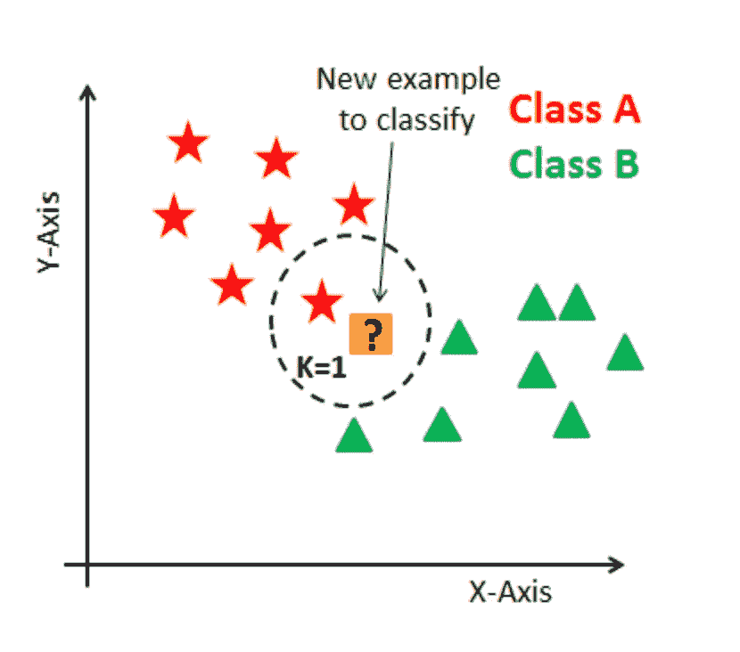
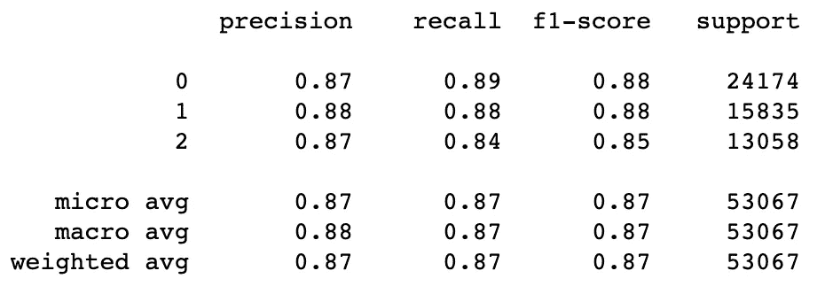
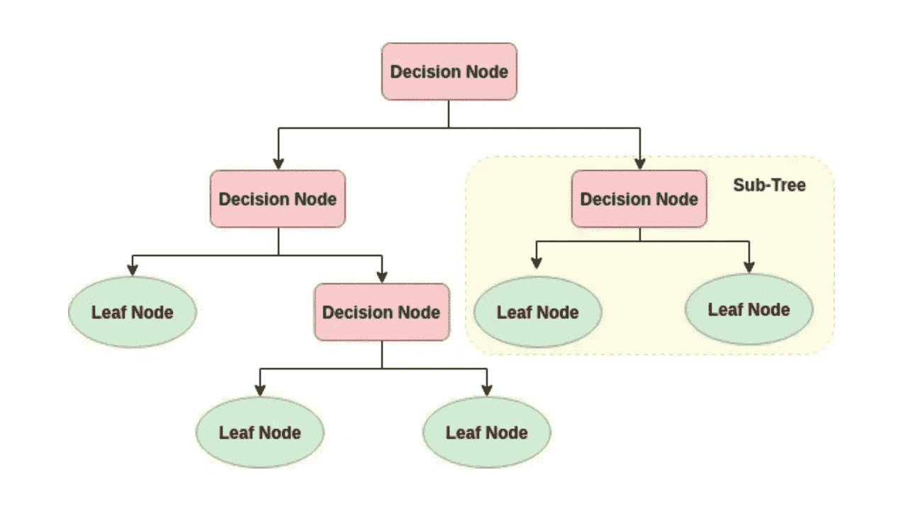
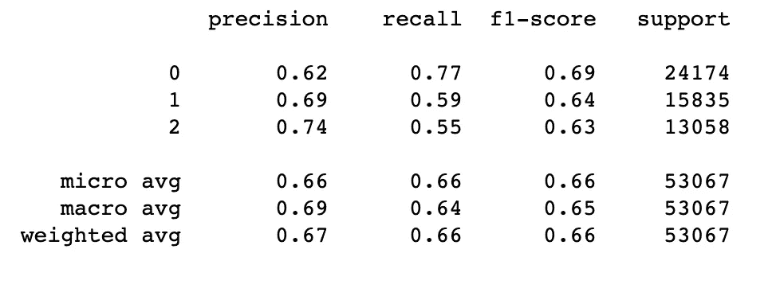
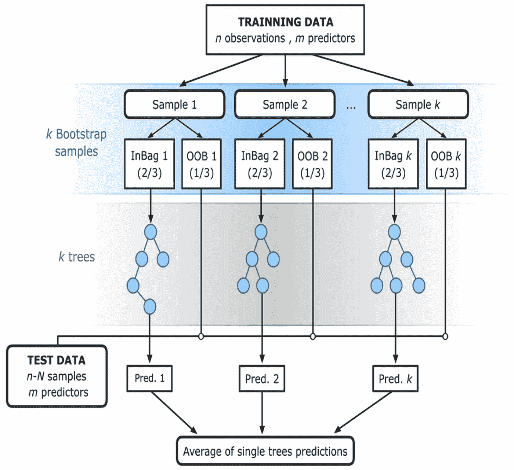

# 跳舞还是不跳舞？—机器学习方法。

> 原文：<https://towardsdatascience.com/to-dance-or-not-to-dance-the-machine-learning-approach-decc2a7782b5?source=collection_archive---------13----------------------->

我爱跳舞！好了，我说了。尽管我可能不想一直跳舞，但我发现自己经常滚动播放列表，寻找最适合跳舞的歌曲。事情是这样的，它与流派无关——至少对我来说是这样。但这一切都与音乐有关。

# 这一切是如何开始的

我有一个问题:**我能根据歌曲的属性预测我是否能随着歌曲跳舞吗？**所以，我开始寻找一些答案——但在我与你分享我的旅程之前，让我们讨论一些将在整个项目中出现的关键概念。

**可舞性** [*根据歌曲的音频特征，如节奏、拍子、效价*](https://developer.spotify.com/documentation/web-api/reference/tracks/get-audio-features/) 等，描述歌曲适合舞蹈的程度。我选择 danceability 是因为它是一首歌的音频特征的直接产物，因此是这些特征的准确表达——因为我喜欢跳舞，我认为这将是创建播放列表和提供推荐的一个很好的选择。

> 许多歌曲已经有了与之相关的可跳性指数，我们将使用这些数据来预测之前没有被分类的歌曲的可跳性水平。

**音频特征**是用于表征音频信号 的 [*特征。在这种情况下，这些特征是调、调式、拍号、声音、能量、乐器感、活跃度、响度、语速、效价和速度。*](http://what-when-how.com/video-search-engines/audio-features-audio-processing-video-search-engines/)

于是旅程开始了…

# 进入机器学习

来自[机器学习大师](https://machinelearningmastery.com/about/)的 [Jason Brownlee](https://www.linkedin.com/in/jasonbrownlee/) 所讨论的预测建模，指的是 [*从输入变量(X)到输出变量(y)逼近一个映射函数(f)的数学问题。这就是所谓的函数逼近问题*](https://machinelearningmastery.com/classification-versus-regression-in-machine-learning/) *。换句话说，我们正在使用历史数据对新数据进行预测。*

一般来说，我们可以将大多数[函数逼近](https://en.wikipedia.org/wiki/Function_approximation)问题分为两大类:回归和分类。由于我想练习分类算法，所以我决定将其设置为分类问题。

# 分类到底是什么？

斯蒂芬·马斯兰德(Stephen Marsland)在他的书《机器学习，算法视角，*中定义的分类问题包括* *获取输入向量，并根据每个类别的样本训练来决定它们属于 N 个类别中的哪一个。*

分类问题是离散的，这意味着每个输入向量属于一个类别[，类别集覆盖整个输出空间](https://www.amazon.com/Machine-Learning-Algorithmic-Perspective-Recognition/dp/1466583282/ref=asc_df_1466583282/?tag=hyprod-20&linkCode=df0&hvadid=266235278092&hvpos=1o3&hvnetw=g&hvrand=16178119349816662508&hvpone=&hvptwo=&hvqmt=&hvdev=c&hvdvcmdl=&hvlocint=&hvlocphy=9004358&hvtargid=aud-801381245258:pla-433512936611&psc=1)。

有几种方法可以解决分类问题，每种方法的解决方法可能不同，但本质上都是试图找到将一个类与另一个类分开的[决策边界](https://en.wikipedia.org/wiki/Decision_boundary)。

# 数据

这个项目中使用的数据集是使用 [Spotify 的 API](https://developer.spotify.com/) 构建的。它由 266，000 个观察值(歌曲)和以下预测属性组成:

*   轨道名称
*   艺术家姓名
*   相册名称
*   歌曲所属的播放列表
*   发布日期
*   流行
*   持续时间(分钟)
*   声学
*   拍子
*   方式
*   钥匙
*   效价
*   工具性
*   语音
*   活性
*   活力
*   音量
*   时间签名

目标变量 danceability 是一个介于 0.0 和 1.0 之间的浮动值，为了对歌曲进行分类，该变量被离散化并分成三个类别，从而使这成为一个多类分类问题。

*   此处禁止跳舞(0.0–0.49)
*   稍微摆动一下(0.5-0.69)
*   像没有人观看一样跳舞(0.70-1.0)

# 探索性数据分析

**永远不要**低估 EDA 的重要性。您需要非常熟悉您的数据以理解它，为建模准备您的数据，为您的问题提供更好的背景，阐明您可能有的一些初始假设，并更好地解释您的模型的结果。另外，EDA 很有趣！在处理分类问题时，我至少会建议:

1.  绘制观察值的分布图，以检查类别不平衡。

Code for count plot to check for class imbalance.

2.使用箱线图检测预测要素中的异常值和异常值。

Code to create boxplots.

3.相关矩阵，用于研究不同变量之间的关系，并检查数据的多重共线性。

Code to create a correlation matrix.

4.检查连续变量的分布。

Code to generate histograms.

5.使用堆积图检查每个离散要素类别中的观察分布。

Code to create stacked plots.

# 考虑因素，然后是模型

正如我前面提到的，有一些分类模型可以尝试。我在这个项目中使用了 8 种不同的模型，但是今天我们将讨论其中的三种:[k-最近邻(KNN)](https://scikit-learn.org/stable/modules/generated/sklearn.neighbors.KNeighborsClassifier.html#sklearn.neighbors.KNeighborsClassifier) 、[决策树](https://scikit-learn.org/stable/modules/generated/sklearn.tree.DecisionTreeClassifier.html)和[随机森林](https://scikit-learn.org/stable/modules/generated/sklearn.ensemble.RandomForestClassifier.html#sklearn.ensemble.RandomForestClassifier)；我将使用 Scikit-Learn 库来实现它们。

在您进行任何建模之前，您应该使用您新发现的数据知识，现在您已经完成了彻底的 EDA，来查看您的功能并做出关于功能工程和功能转换的决策。我不会谈论我做了什么，因为这一步没有一个公式。**但这是非常重要的一步。如果你想了解更多这方面的知识，我强烈推荐:[Sinan Ozdemir 的《简单的特性工程》](https://www.amazon.com/Feature-Engineering-Made-Easy-Identify-ebook/dp/B077N6MK5W)。**

在这一点上，你也应该开始考虑如何评估你的机器学习模型的结果。当然，我还有另外一本书也很喜欢:Alice Zheng 的《机器学习模型评估》。有不同的评估标准，在不同的环境中，为不同的问题服务于不同的目的。谈到这些，人们也有他们的偏好和观点。因此，你的选择最终将取决于所有这些因素的组合，以及你试图回答的问题。

对于这个特定的项目，我决定测量 F1 的微观平均分数，并使用混淆矩阵。F1 分数是精确度和召回率之间的加权平均值。在评估多类问题时，这是一个非常常见的指标。混淆矩阵显示了每个类别的正确和错误分类的详细分类，这很重要，因为每个类别的错误分类可能会产生不同的成本。

# k-最近邻(KNN)

假设你要去看歌剧，但你以前从未去过。你出现在歌剧院，却不知道该做什么。所以你选一个和你最亲近的人，观察，模仿。然后你去找 5 到 10 个和你最亲近的人，观察并模仿。这是 KNN 背后的总体想法。

[Image from KNN Classification using Scikit-Learn by Datacamp.](https://www.datacamp.com/community/tutorials/k-nearest-neighbor-classification-scikit-learn)

KNN 存储整个数据集，并通过搜索 *k* 个最近的实例，并汇总这些实例的输出变量来预测新的数据点。为了确定实例之间的相似性，它计算距离的度量。这种度量可以是欧几里德距离、汉明距离、曼哈顿距离、闵可夫斯基距离、谷本距离、雅克卡距离、马哈拉诺比斯距离或余弦距离，仅举几个例子。

距离度量也是一种个人选择，取决于您的具体问题和数据；T2 k T3 号也是如此。通常，您会想要一起试验不同的数据度量和 k 的值，以查看哪种组合会产生最准确的模型。您可以在这里 查看使用 KNN 时可以调整的超参数列表。

在我的例子中，我决定使用 Scikit-Learn 中的[穷举网格搜索](https://scikit-learn.org/stable/modules/generated/sklearn.model_selection.GridSearchCV.html#sklearn.model_selection.GridSearchCV)方法来搜索超参数空间，以获得最佳的[交叉验证](https://scikit-learn.org/stable/modules/cross_validation.html#cross-validation)分数。

[KNN Classification: Model, Grid Search, Confusion Matrix and Classification Report.](https://scikit-learn.org/stable/modules/generated/sklearn.neighbors.KNeighborsClassifier.html#sklearn.neighbors.KNeighborsClassifier)

Classification Report for KNN

这是一个很好的 F1 微观平均分数，但有一个关于 KNN 的小细节我之前没有提到:它是 [**计算昂贵的**](https://machinelearningmastery.com/k-nearest-neighbors-for-machine-learning/) ，并且它遭受 [**维度诅咒**](https://en.wikipedia.org/wiki/Curse_of_dimensionality) 。

# 决策图表

决策树在机器学习中相当受欢迎，因为制作一棵树的计算成本很低，使用它的成本更低。

[Image from Decision Tree Classification with Python by Datacamp](https://www.datacamp.com/community/tutorials/decision-tree-classification-python)

借助决策树，我们将分类问题分解为一组决策，从*根*(基)开始，向下处理到*叶。*决策树不被视为黑盒型算法，因为它们共享内部决策逻辑。算法在给定节点上做出决策所依据的分割规则是您可以调整以优化决策树的超参数之一。其他流行的还有[分裂策略和树的最大深度](https://scikit-learn.org/stable/modules/tree.html#tree)。

与 KNN 一样，在使用决策树时，有许多超参数可供选择，所以我再次使用[穷举网格搜索](https://scikit-learn.org/stable/modules/generated/sklearn.model_selection.GridSearchCV.html#sklearn.model_selection.GridSearchCV)来找到交叉验证分数[最好的那些。](https://scikit-learn.org/stable/modules/cross_validation.html#cross-validation)

[Decision Tree: Model, Grid Search, Tree Visualization, Confusion Matrix, and Feature Importance.](https://scikit-learn.org/stable/modules/generated/sklearn.tree.DecisionTreeClassifier.html)

Classification Report for Decision Tree.

决策树的表现不如 KNN。如你所见，F1 的微观平均分数相当低。

# 随机森林

如果一个决策树是好的，那么许多树(因此，森林)一定更好，只要它们之间有足够的多样性。这是一个[随机森林](https://scikit-learn.org/stable/modules/ensemble.html#forest)背后的基本思想，一个 [*集成学习*](https://en.wikipedia.org/wiki/Ensemble_learning) 方法，在每个决策节点使用打包和约束特征选择的概念将随机性引入数据集。

[Image by Victor F. Rodriguez-Galiano.](https://www.researchgate.net/figure/The-flowchart-of-random-forest-RF-for-regression-adapted-from-Rodriguez-Galiano-et_fig3_303835073)

装袋，或 [*自举聚合*](https://en.wikipedia.org/wiki/Bootstrap_aggregating) 。bootstrap 样本是用替换样本进行*的样本，所以我们最终会不止一次地选取一些观察值，而另一些则完全不选取。**为什么？因为这样我们会得到很多表现稍有不同的弱学习者，这正是集成学习背后的想法。如前所述，随机森林也不同于常规决策树，它将学习算法限制在随机的特征样本上，以搜索每一棵单独的树；这样，每个子树都略有不同。在每个分割点可以搜索的特征数量是您可以使用的[超参数之一。](https://scikit-learn.org/stable/modules/generated/sklearn.ensemble.RandomForestClassifier.html#sklearn.ensemble.RandomForestClassifier)***

[Random Forest: Model, Grid Search, Confusion Matrix and Classification Report.](https://scikit-learn.org/stable/modules/generated/sklearn.ensemble.RandomForestClassifier.html#sklearn.ensemble.RandomForestClassifier)

Classification Report for Random Forest.

这里要注意的一件重要事情是，即使 KNN 的 F1 微平均分高于随机森林，它也需要两倍以上的时间和内存来运行。正如我之前提到的，KNN 的计算成本很高。

# 那么，我们跳舞好吗？

有人说流派已死，有人不以为然。事实是，用户消费音乐的方式在过去 10 年里发生了巨大的变化。

播放列表创建习惯对音频流媒体公司进行更好的音乐推荐非常有帮助。正是因为播放列表为用户提供了灵活性，我们才开始发现使用流派作为推荐的主要特征还有哪些其他选择。

其中一个选项是可跳舞性。正如我们从我们一起经历的三个模型中看到的，我们可以**准确地预测一首歌曲属于哪一个可跳舞类别**。这意味着我们现在可以使用这个模型来分类那些没有舞蹈指数的歌曲，仅仅使用它们的属性。

在大多数情况下，你会尝试许多不同的车型来寻找最好的——我说的最好，并不是指 F1 微观平均分数最高的车型。你会想要一个在你选择的任何度量上都有良好性能的模型，是的，但是你也会想要警惕计算的复杂性，以及你的项目的特定需求。