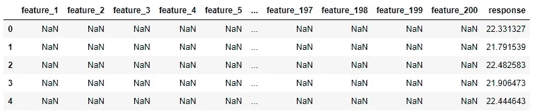

# 算还是不算？粗心的估算可能导致错误结论的实际例子

> 原文：<https://towardsdatascience.com/to-impute-or-not-to-impute-a-practical-example-when-imputation-could-lead-to-wrong-conclusions-fd1e340d779a?source=collection_archive---------31----------------------->

有了估算缺失数据的强大力量，就有了了解自己在做什么的巨大责任。


Photo by [Jean-Philippe Delberghe](https://unsplash.com/@jipy32?utm_source=medium&utm_medium=referral) on [Unsplash](https://unsplash.com?utm_source=medium&utm_medium=referral)

# 背景

近年来，我有幸与许多在该领域起步的数据专业人士进行了交流，并看到他们中的许多人都经历了类似的顿悟:

> 你在课程中学到的东西并没有为你在现实世界中可能遇到的各种场景做好充分的准备！

公平地说，有太多的角落案例，没有哪门课程能够全面涵盖。因此，作为一名数据专业人员，我们每个人都应该把自己发展到能够解决我们从未见过的问题的程度。这篇文章讲的就是这样一个例子，这个例子在课程中没怎么教过，但它可能意味着一个“普通”的数据专家和一个“超出预期”的数据专家之间的区别。

每当建模任务中出现缺失数据时，一种常用的技术是估算缺失数据，这是我们的建模代码工作所必需的。然而，在有大量缺失数据的情况下，如大批量生产测量，插补后的结果模型表面上看起来可能很弱。但是只要再深入一点，就可以发现这个模型相当强大，估算值扰乱了度量计算。这篇文章就是一个这样的例子，用一个典型的非常稀疏的数据集来展示这个场景，这个数据集就是统计过程控制测量数据。这篇文章的所有代码都在这里:[链接](https://github.com/stephenleo87/HVM-SPC)

## 统计过程控制

在现代大规模制造(HVM)工厂中，统计过程控制(SPC)系统对于确保所有制造设备交付符合客户规格的产品至关重要。例如，在自动化汽车装配厂，客户规格可能是平均汽车发动机应提供 22.5 英里每加仑(mpg)的燃料，并且是“响应”变量。

然而，自然界中没有一个过程会 100%的时间都在目标上。相反，正常的变化会导致一些发动机的输出功率高于 22.5 英里/加仑，一些发动机的输出功率低于 22.5 英里/加仑。假设客户理解这一点，可以容忍+/-1.5 英里/加仑的偏差。任何超出这些公差限制的发动机都不能出售给客户，需要报废或作为备件出售，从而给公司造成收入损失。因此，我们的响应变量的目标为 22.5 英里/加仑，控制上限(UCL)为 24 英里/加仑，控制下限(LCL)为 21 英里/加仑。

正如预期的那样，公司的高级管理层希望生产的发动机 100%符合这些规格(规范)。然而，在自然界中，除了死亡和税收，没有什么是 100%确定的。相反，作为工程师和统计学家，我们退而求其次:我们可以使用 SPC 系统和 6-sigma 流程来确保 99.73%的发动机符合规格。

## 延迟响应的困境

典型的 HVM 生产线从纯原材料到销售给客户的完整成品可能需要一周到几个月的时间。由于“响应”变量是客户规格，因此它们只能在产品已经制造完成并准备交付给客户时，在制造产品线的末端进行测试

这里的问题是，如果生产线早期的一台设备出现故障并生产出有缺陷的零件，只有在几周或几个月后我们测试这些产品的“反应”时才能发现因此，大量产品可能在流氓设备中加工，并在被检测到之前对公司的收入造成重大影响。所以很明显，这个策略是超级冒险的。

为了防止劣质设备造成巨大的收入损失，HVM 工厂在生产线的各个阶段持续测量产品的临界尺寸(CD)。然后，SPC 系统使用这些 CD 来跟踪测量值是否在 6-sigma 流程之后的可接受公差范围内运行。

## 最后，这个帖子的问题陈述

现在考虑下面的问题陈述:所有的 CDs 都在其指定的 6-sigma 容差范围内执行，但是响应变量有很大一部分落在客户规格之外。我们需要收紧一些 CD 中的变化，以加强响应。因此，有两个问题需要回答:

1.  考虑对产品测量的所有 CDs，哪一个对响应的变化影响最大，它们的贡献是什么？
2.  这些相关 CD 的变化应该收紧到什么程度，以确保响应符合客户规格？

让我们尝试使用数据分析来回答这两个问题。第一个问题将在这篇文章中回答，而第二个问题是我下一篇文章的主题:在这里保持警惕！

免责声明:本研究中使用的所有数据完全是综合生成的，以证明标准回归技术。

# 方法

让我们更详细地考虑第一个问题，并看看我们可以得到的数据。如下面的代码片段所示，我们的数据由 200 个特性列、一个响应列和 30K 行组成。

```
Dataset rows = 30000, columns = 201
```



df.head() shows a large number of NaN values

在我们对这些数据进行任何分析之前，让我们首先将数据帧分成训练集和测试集，这样，从训练集泄漏到测试集的信息的可能性最小。我们将“train”拆分为前 80% (24K)的行，将“test”拆分为后 20% (6K)的行，以模拟使用过去的数据进行培训，使用未来的数据进行测试。所有后续研究应在“训练”组上进行，并最终仅使用“测试”组来确认我们的模型在未知数据上的性能

```
X_train, y_train, X_test, y_test shapes = (24000, 200), (24000,), (6000, 200), (6000,)
```

## 反应研究:


response variable distribution

让我们先来看看我们的响应变量的分布，看看是否有什么问题首先值得解决。该响应符合良好的正态分布，约 10%的响应在规格范围之外。因此，我们生产的产品几乎有 10%都卖不出去。真是浪费！我们现在可以理解为什么高级管理层不高兴，并内化为我们需要做些什么来改善这种情况。

## 特征工程:

接下来，让我们更仔细地看看特性。我们的第一个观察结果是，有大量的“NaN”值表示数据集中缺少数据。我们与我们的领域工程师交谈，以了解为什么会这样。原因很简单。在制造工厂中，任何额外的测量都会占用有限的时间，而不会给产品增加任何价值。因此，生产工程师希望尽可能减少测量的产品数量。对于这种产品，数据告诉我们，平均来说，大约 80%的产品没有在每个特性上得到测量。

```
Mean missing = 81.39%; Min missing = 65.23% ; Max missing = 81.98%
```

不过没关系，我们对机器学习了如指掌，可以用插补让那些缺失的值神奇地重新出现，对吧？也许吧。也许不是。坚持这个想法，直到我们在这篇文章的后面讨论结果。让我们从使用来自`sklearn`的`SimpleImputer`类输入每一列的“平均值”开始。

```
# Impute missing values
from sklearn.impute import SimpleImputer
imputer = SimpleImputer(strategy='mean')
```

我们的下一个观察是，每个特征似乎在一个非常不同的尺度上。为了对哪些特征对响应影响最大进行排序，我们需要将它们标准化到相同的尺度。标准化确保了在我们的分析过程中它们都被平等对待。我们将使用`sklearn`中的`StandardScaler`类来实现这一点。


X_train.describe()

```
# Scaling
from sklearn.preprocessing import StandardScaler
scaler = StandardScaler()
```

## 建模:

向我们提出的问题陈述是，我们不仅需要解释哪些特征对反应有影响，而且我们还需要提供每个特征有多大影响的估计。由于这种可解释性要求，我们决定抛弃黑盒模型，坚持使用易于被工程团队解释的线性模型。我们将使用`sklearn`中的`LinearRegression, LassoCV, RidgeCV and ElasticNetCV`回归估计器来构建和测试最流行的线性模型。

```
# Linear model
from sklearn.linear_model import LinearRegression, LassoCV, RidgeCV, ElasticNetCV
alphas = np.logspace(-6, -0.1, 100)
lr_model = LinearRegression()
lass_model = LassoCV(alphas=alphas, cv=3, max_iter=10000)
rid_model = RidgeCV(alphas=alphas, cv=3)
elas_model = ElasticNetCV(alphas=alphas, cv=3, max_iter=10000, l1_ratio=0.5)
```

## 管道:

最后，为了将特征工程和建模部分联系在一起，我们使用了来自`sklearn`的`Pipeline`类。

```
model_pipeline = Pipeline([
        ('imputer', imputer), 
        ('scaling', scaler),
        (model, estimator)
        ])
```

# 结果


Summary of results for different linear models

对于每个估计量，我们在 10 次交叉验证(CV)分割中平均均方根误差(RMSE)和 R 平方(R2 ),以评估它们的性能。由于`Lasso, Ridge and ElasticNet`嵌入了`alpha`超参数搜索，我们还打印出每个估计量的最佳`alpha`。所有模型的结果都不好。均方根误差仅比响应的标准差低 0.1 左右。

现在，很容易在这一点上停下来，告诉高级管理层数据太稀疏(80%缺失)并完全放弃这个案例。但是，一个真正的数据科学家是不会这么快放弃的！我们决定进一步挖掘这些结果，看看是否还能提取一些有用的东西。毕竟，有志者事竟成！

## 实际与预测图


我最喜欢的可视化任何回归模型性能的方法之一是绘制实际与预测图。在这种情况下，我们立即看到有两个相关性。一些数据点落在“显著相关”线上，而许多其他数据点落在“弱相关”线上。如果我们能够消除那些落在弱相关线上的数据点，我们的性能指标应该会有很大的提高。

但是是什么导致了这种情况呢？嗯，一个很大的线索是所有这些数据点的预测值。是~22.5，也是我们实际反应数据的“均值”。如果你还记得，在这篇文章的特征工程部分，我们用每一列的“平均值”来估算所有缺失的数据。由于该数据非常稀疏，那些具有跨所有特征估算的“平均”数据的数据点将预测也接近“平均”的响应！

## 重要特征


Coefficients of the Lasso model: coef[coef[‘standardized_coefficient’] != 0]

在这一点上，我们可以删除所有等于“平均值”的预测，这将大大改善我们的预测。然而，为了获得最好的预测能力，我们首先研究影响反应的主要特征。由于我们将所有特征标准化为相同的尺度，因此我们可以简单地将所有特征的标准化线性系数的绝对值按降序排列。或者在 Lasso 回归的情况下，打印所有非零标准化系数。在数据集中的 200 个要素中，有五个要素与 Lasso 模型的响应变量最相关。有了这些信息，我们现在可以只删除 Lasso 模型用来防止插补噪声的这五个特征中包含插补值的行。

## 在测试集上检查性能

最后，我们在测试集上通过计算 RMSE、R2 和绘制实际与预测图来测试模型。回想一下，我们已经删除了在与回答相关的五个特征中的任何一个特征中具有估算数据的行。如您所见，一旦在预测过程中移除估算值，该模型就具有非常强的预测能力！这表明，在进行预测时，我们必须限制自己只预测那些包含所有 5 个重要特性的数据的行。


Actual vs Predicted plot on Test dataset after removing rows that have imputed data in any of the 5 important features

有了这种认识，我们就可以影响负责选择测量采样方式的工程团队。例如，由于每个特征是在 20%的行上测量的，工程团队可以实施一种抽样策略，以确保这些测量值的一半(10%)是在所有 5 个特征上测量的，而另一半(10%)保持随机。了解您的客户并利用数据影响他们的决策是任何数据专业人员的重要技能！

# 结论

在本帖中，我们看到了一个估算可能导致错误结论的实际例子，我们试图回答这个问题:*考虑对产品测量的所有 CDs，哪个对响应的变化影响最大，它们的贡献是什么*。然而，更深入的挖掘可以揭示一个有用的模型和额外的见解，可以用来影响客户行为。在我的下一篇文章中，我们将看到如何使用这个模型来回答第二个问题:*相关 CDs 的变化应该收紧多少，以确保响应符合客户规格*。这篇文章的所有代码都可以在这里找到:[链接](https://github.com/stephenleo87/HVM-SPC)