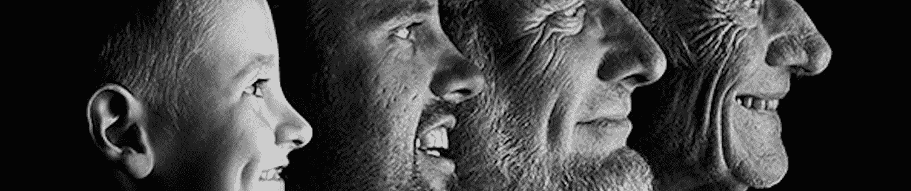

# 识别野外家庭(RFIW):大数据挑战

> 原文：<https://towardsdatascience.com/to-recognize-families-in-the-wild-a-machine-vision-tutorial-6d6ed85ca1c4?source=collection_archive---------33----------------------->

## 野外家庭的视觉识别

## 前方的路(第一部或多部)

Training machinery to identify relatives using visual cues like imagery, videos, and such.

## 相关链接

1.  [2020 识别野外家庭](https://web.northeastern.edu/smilelab/rfiw2020/) (RFIW) w [工作坊网页](https://web.northeastern.edu/smilelab/rfiw2020/)
2.  [RFIW-2019](https://web.northeastern.edu/smilelab/RFIW2019/) 、 [RFIW-2018](https://web.northeastern.edu/smilelab/RFIW2018/) 、 [RFIW-2017](https://web.northeastern.edu/smilelab/RFIW2017/) 挑战赛网站
3.  [野生家庭项目页面](https://web.northeastern.edu/smilelab/fiw/)
4.  [亲属关系验证:Python 熊猫教程(第二部分)](/demo-for-rfiw-2020-task-1-kinship-verification-8a8ed7081bcc)

## **概述**

我的博士研究涉及亲属识别和 FIW 数据集。在不久的将来，我们的目标是总结关键发现，同时在每年举行的顶级会议上提供数据挑战的经验教训和演示(即，这是未来的第一次)。概观

我的博士研究涉及亲属识别和 FIW 数据集。在不久的将来，我们的目标是总结关键发现，同时在每年举行的顶级会议上提供数据挑战的经验教训和演示(即，这是未来的第一次)。

要了解更多关于 FIW 的信息，请访问[项目页面](https://web.northeastern.edu/smilelab/fiw/)。要了解更多信息、注册并参与即将到来的 RFIW 2020，请访问[研讨会页面](https://web.northeastern.edu/smilelab/rfiw2020/)。

通过图像自动识别血亲(即亲属关系)的能力在大量应用中具有前景。仅举几个例子:法医(例如，人类追踪、失踪儿童、犯罪现场调查)、边境控制和安全、流离失所的难民家庭、历史和家谱血统研究、社交媒体、预测建模，以及减少面部识别的搜索空间。

在[微笑实验室](https://web.northeastern.edu/smilelab/)，我们是这个问题的最初开拓者之一【7-10】。2011 年，我们为基于亲属的视觉任务铺平了道路，这是一个最初的公共数据集， [UB KinFace](http://www1.ece.neu.edu/~yunfu/research/Kinface/Kinface.htm) 数据库。尽管如此，几年后，我们用第一个用于亲属识别的大规模图像数据库，即[野生家庭](https://web.northeastern.edu/smilelab/fiw/) (FIW)数据库[4，6]，推动了“深度学习”的热潮。FIW 为 1，000 个家庭提供图像，平均每个家庭有 5.6 个成员和 13.7 张家庭照片；每个家庭都有完整的标签，包括所有成员的姓名、性别和关系——FIW 从这些丰富的标签信息中服务于多任务目的[2]。

我们发起了第一次大规模的亲属识别数据挑战，*识别野外家庭* (RFIW) [4]。我们在 2017 年(即 [RFIW'17](https://web.northeastern.edu/smilelab/RFIW2017/index.html) )开始举办数据挑战研讨会，与 [ACM 多媒体](http://www.acmmm.org/2017/program/workshop/)的会议同时举行。在第一次 RFIW 成功后，101 个团队在两个任务之间注册(即[亲属关系验证](https://competitions.codalab.org/competitions/16745?secret_key=b6635609-11b5-47a0-8730-efd57fc7c083)和[家庭分类](https://competitions.codalab.org/competitions/16742?secret_key=aec0fcb8-3afa-42b7-af5a-6655db1c91a1))，七篇论文在[2017 RFIW 会议录](https://dl.acm.org/citation.cfm?id=3134421)中被接受并在研讨会上发表。为此，我们也很荣幸地邀请到了这样一位杰出的主题演讲人:DHS 的 Chris Myles 和 Salesforce 的研究员 Xiong。

自此，RFIW 转型为一个系列赛，在 [2018](https://web.northeastern.edu/smilelab/RFIW2018/) 和 [2019](https://web.northeastern.edu/smilelab/RFIW2019/) 举办的挑战赛为 [IEEE FG 挑战赛](https://fg2018.cse.sc.edu/Challenges.html)【3】。在我们的[开源报告](https://github.com/visionjo/FIW_KRT)中，公众可以获得作为基准记录并作为最先进技术发布的协议、实验和模型。要深入了解 FIW 数据，请参见我们的 PAMI [2]。

几个出版物被引用了 500 次，两个数据集，研讨会，挑战和最近的 [Kaggle 竞赛](https://www.kaggle.com/c/recognizing-faces-in-the-wild/)，我们预计这一势头只会从这里开始——研究人员被吸引到 RFIW，这已经形成了一个年度挑战。此外，FIW 作为一个整体，吸引了专家，新的博士，甚至其他领域的专业人士。此外，FIW 的数据在实际应用中有很多方法，比如给父母一对面孔，预测孩子的外貌[1]。

毫无疑问，这个问题现在需要从研究转向现实的资源关注。

## 文献学

[1]·高，·夏，约瑟夫·P·鲁宾逊，·张，，，和云复.“你的孩子会是什么样子？DNA-Net:年龄和性别意识的亲属脸合成器 *arXiv 预印本 arXiv:1911.07014* (2019)。[ [纸张](https://arxiv.org/pdf/1911.07014.pdf)

[2]约瑟夫·罗宾逊、邵明、刘洪福、吴越、蒂莫西·吉利斯和傅云。《野外家庭的视觉亲属识别》IEEE TPAMI 特别版:计算脸(2018)。[ [论文](https://web.northeastern.edu/smilelab/papers/fiw_pami.pdf)

[3]，，丁，，约瑟夫·P·鲁宾逊，和傅云。*通过潜在自适应子空间进行亲属分类*，*，*在*第十三届 IEEE 国际会议上*，*自动人脸&手势识别(FG 2018)。IEEE。*[论文](https://web.northeastern.edu/smilelab/papers/fiw_fg2018.pdf)

[4]约瑟夫·P·罗宾逊，，，，赵，，蒂莫西·吉利斯，傅云.*识别野外家庭(RFIW):结合 ACM MM 2017* 举办的数据挑战研讨会，载于ACM 多媒体会议:2017 年识别野外家庭研讨会会议录，第 5-12 页。ACM。【[论文](https://web.northeastern.edu/smilelab/papers/fiw_rfiw2017.pdf)、[论文集](https://dl.acm.org/citation.cfm?id=3134421&preflayout=flat#source)、[内容](https://web.northeastern.edu/smilelab/papers/rfiw2017_frontmatter.pdf)

[5]王淑洋、约瑟夫·罗宾逊和傅云。“利用边缘化去噪度量学习对野外家庭进行亲属关系验证”，第 12 届 IEEE 自动人脸和手势识别国际会议(FG 2017)。第 216–221 页。IEEE。[ [纸张](https://web.northeastern.edu/smilelab/papers/fiw_fg2017.pdf)

[6] Joseph Robinson，，，，和 Yun Fu，*野外家庭(FIW):大规模亲属图像数据库和基准*，，载于 2016 年 ACM 多媒体会议论文集(第 242-246 页)。ACM。

[7]夏，，罗杰波，傅云，*在一张照片中了解亲属关系*，载于 IEEE 多媒体汇刊(T-MM)，第 14 卷，第 4 期，第 1046–1056 页。IEEE，2012 年。

[8]夏，，傅云，*利用视觉属性进行亲属关系验证*，载于模式识别(ICPR)，2012 年第 21 届国际学术会议上(第 549–552 页)。IEEE。

[9]夏，，傅云，*通过迁移学习进行亲属关系验证，人工智能国际联合会议论文集。第 22 卷。№3.2011.*

*[10]，，夏，云复，*基于 UB KinFace 数据库的系谱人脸识别*，计算机视觉与模式识别研讨会(CVPRW)，2011 年 IEEE 计算机学会会议上。IEEE，2011 年。*