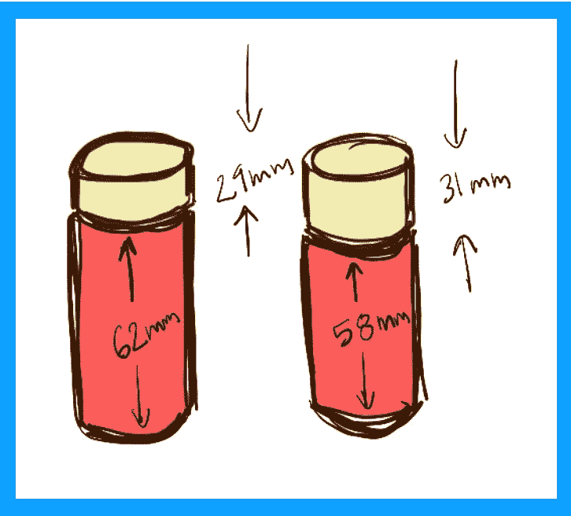
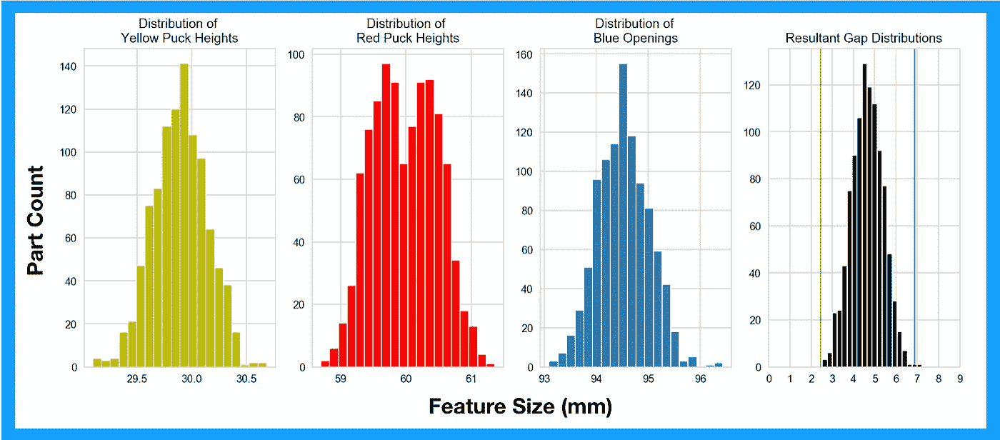
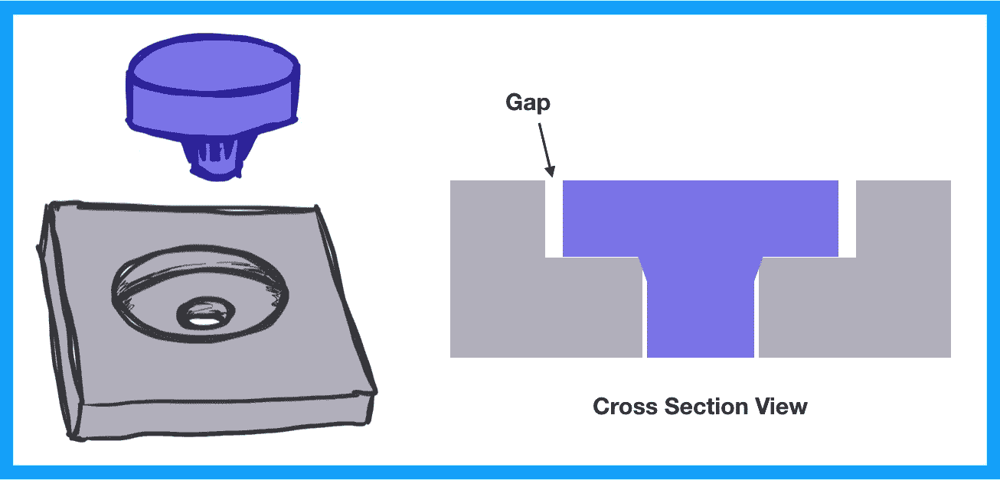
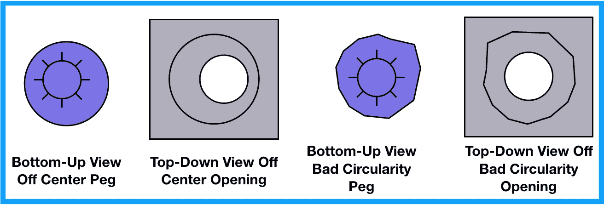
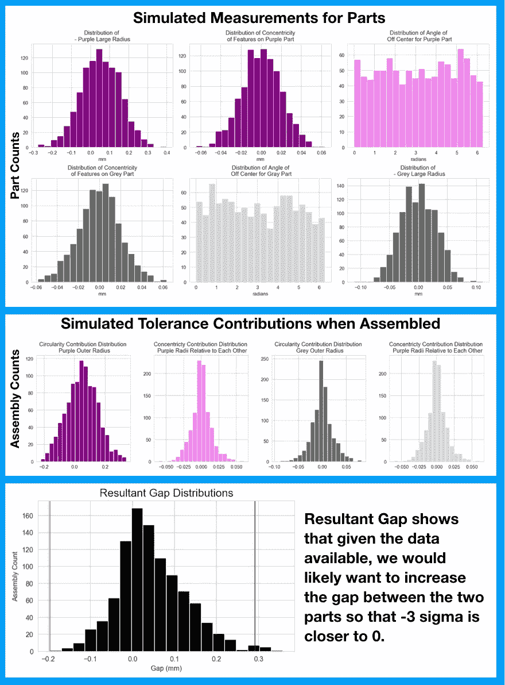

# 公差叠加

> 原文：<https://towardsdatascience.com/tolerance-stackups-ad568a8d4c15?source=collection_archive---------6----------------------->

## 以及如何使用蒙特卡罗模拟来代替

## 什么是公差叠加？


想象你有两个圆盘，你想把它们紧紧地放在一个开口里。如果你只需要将这三个部分装配在一起一次，你可以测量一下这些圆盘有多高，然后按照这个尺寸裁剪，调整到完美为止。如果你试图将这三个部分组合在一起很多次，那么事情就变得不确定了。你的一些冰球可能比你的开放和不适合。你的一些冰球堆可能比开口小得多，你的零件会比你想要的更松。



你可以把你的黄色冰球设计成 30 毫米高，但是冰球的尺寸更可能在 29 到 31 毫米之间。在这种情况下，黄色圆盘的高度公差为 1 毫米。

你可以测量每一个部分，将较大的黄色圆盘和较小的红色圆盘配对，强迫所有东西都工作。(这个过程被称为宁滨)。这确实有效，但是测量零件需要时间。俗话说，时间=金钱。顺便说一句，时间也等于时间。所以如果你想减肥，你需要愿意花很多时间和金钱去减肥。

这就是公差叠加的用武之地。当您有想要放入开口中的零件时，公差叠加是一种工具，允许您确定您的零件是否总是放入开口中，即使您正在制造成千上万个这样的组件。

公差叠加是一种创建循环的方法，该循环包括“堆栈”中的每个关键尺寸它使您能够查看这些值的尺寸和公差，以确定您的设计是否会相应地工作和更新。它通常看起来像这样:


## 那么，为什么不使用容错堆栈呢？

在类似上面例子的情况下，公差叠加很容易组合在一起，它给了你创建一个好的设计所需要的所有信息。如果出现以下情况，公差叠加就不再那么有用:

1.  在你的层叠中你有更多的维度
2.  您看到的是圆形零件的公差及其径向配合。
3.  你已经知道你的零件的分布情况

每一种情况都需要蒙特卡洛模拟。


FUN FACT: Monte Carlo simulations are named after the location because it is a gambling hot spot.

## 如何使用蒙特卡洛模拟来代替公差叠加？

在蒙特卡洛模拟中，您可以为包含在公差叠加中的每个尺寸生成真实值。一旦生成了这些值，就可以通过相同的循环来加减值，从而生成临界尺寸的分布(在我们的示例中，是从 4 到 1 的差距)。最后，你要设定一个预期的 yield⁴，看看你的产量的临界尺寸是多少。这可能会告诉你，你可以让你的设计差距变小，或者你需要让它变大。这种分布可能会告诉你，宁滨有很强的优势。



First three histograms show simulations based on the expected tolerances of the parts. Last histogram shows the expected resultant gaps. Green lines show ± 3 sigma from the mean.

请注意，零件遵循公差叠加中预期的零件规格。然而，最终的间隙分布得足够紧密，使得间隙上的公差比来自公差叠加的 RSS 值更紧密。

为了让事情更有趣，我们来看一个放射状的例子。

想象一下，你正在将一个塑料钉安装到一个金属开口中，如左图所示。这种联系汇率制度对 it⁵.有决定性的影响你想让顶部塑料部分和顶部金属部分之间的间隙在四周尽可能的小，而不要撞到它。



看起来很简单，对吧？可惜不是。如果一切都是完美的圆形，这将工作得很好。但是，如果您考虑下面画出的场景，您会发现公差叠加缺少一些信息。这些图像是对现实场景的夸大。



蒙特卡洛模拟允许您模拟每个零件偏离中心的径向角度和每个零件离圆角最远的径向角度。通过模拟您的结果，您可以考虑偏心特征同时导致零件配合的次数，以及它们同时导致零件干涉的次数。这通常会导致比公差叠加更紧密、更真实的合成公差。这是因为公差叠加迫使你假设问题维度都处于相同的径向角度，而实际上，它们几乎肯定不是。



我已经将用于生成此模拟的代码粘贴在下面:

```
# importing libraries
import numpy as np 
import pandas as pd 
import matplotlib.pyplot as plt%matplotlib inline # Generating part measurement data
df['purple_r'] = np.random.normal(15.05, .1, 1000)
df['purple_off_center'] = np.random.normal(0, .02, 1000)
df['angle_purple_off_center'] = np.random.uniform(0, 6.283185, 1000)
df['grey_off_center'] = np.random.normal(0, .02, 1000)
df['grey_r'] = np.random.normal(15.5, .03, 1000)
df['angle_grey_off_center'] = np.random.uniform(0, 6.283185, 1000) # Generating assembly measurement data
# Using df['angle_purple off center'] as direction of gap
df['Circularity Contribution Purple'] = df['purple_r']
df['Concentricity Contribution Purple'] = df['purple_off_center']df['Circularity Contribution Grey'] = df['grey_r'] 
df['Concentricity Contribution Purple'] = df['grey_off_center'] * \
np.cos(df['angle_purple_off_center']-df['angle_grey_off_center'])df['gap'] = np.abs(df['Circularity Contribution Purple']) + \
df['Concentricity Contribution Purple'] - np.abs(df['Circularity Contribution Grey']) \
- df['Concentricity Contribution Purple']# Part measurement data graphfig, ax = plt.subplots(2, ncols=3, figsize = (14, 8))
ax = ax.ravel()
ax[0].hist(df['purple_r'], bins =20, color='purple')
ax[0].set_title('Distribution of \n- Purple Large Radius')
ax[0].set_xlabel('mm')
ax[1].hist(df['purple_off_center'], bins =20, color='purple')
ax[1].set_title('Distribution of Concentricity\nof Features on Purple Part')
ax[1].set_xlabel('mm')
ax[2].hist(df['angle_purple_off_center'], bins =20, color='violet')
ax[2].set_title('Distribution of Angle of\n Off Center for Purple Part')
ax[2].set_xlabel('radians')
ax[3].hist(df['grey_off_center'], bins =20, color='dimgray')
ax[3].set_title('Distribution of Concentricity\nof Features on Grey Part')
ax[3].set_xlabel('mm')
ax[4].hist(df['angle_grey_off_center'], bins =20, color='lightgray')
ax[4].set_title('Distribution of Angle of\n Off Center for Gray Part')
ax[4].set_xlabel('radians')
ax[5].hist(df['grey_r'], bins =20, color='dimgray')
ax[5].set_title('Distribution of \n - Grey Large Radius')
ax[5].set_xlabel('mm')
plt.tight_layout(); # Assembly measurement data graph
fig, ax = plt.subplots(1, ncols=4, figsize = (14, 4))
ax = ax.ravel()
ax[0].hist(df['Circularity Contribution Purple'], bins =20, color='purple')
ax[0].set_title('Circularity Contribution Distribution \n Purple Outer Radius')
ax[1].hist(df['Concentricity Contribution Purple'], bins =20, color='violet')
ax[1].set_title('Concentricty Contribution Distribution \n Purple Radii Relative to Each Other')
ax[2].hist(df['Circularity Contribution Grey'], bins =20, color='dimgray')
ax[2].set_title('Circularity Contribution Distribution \n Grey Outer Radius')
ax[3].hist(df['Concentricity Contribution Purple'], bins =20, color='lightgray')
ax[3].set_title('Concentricty Contribution Distribution \n Purple Radii Relative to Each Other')
plt.tight_layout();# Final Gap Graph
mu = df['gap'].mean()
sigma = df['gap'].std()plt.hist(df['gap'], bins =20, color='black')
plt.title('Resultant Gap Distributions', fontsize = 16)
plt.axvline((mu-(3*sigma)), color='green', alpha=0.5)
plt.axvline((mu+(3*sigma)), color='green', alpha=0.5)
plt.axvline((mu+(3*sigma)), color='green', alpha=0.5)
plt.xlabel("Gap (mm)")
plt.ylabel("Assembly Count")
plt.tight_layout();
```

[1]公差通过多种方式确定。设计工程师将在零件图中规定每个关键尺寸的公差。该公差通常是基于该制造方法的零件公差的最佳实践以及来自制造零件的供应商的反馈而创建的。如果公差叠加表明它需要比最佳实践更严格，在许多情况下也可以这样做，但会增加零件的成本。

[2]我说的总是，是指几乎总是。离群值总是会发生。零件将超出规格。你甚至可能愿意在知道你会扔掉零件的情况下进行设计。对于这个博客来说，“总是”实际上意味着“你想要多少就有多少。”

[3]如果这是在数据可用之前完成的，那么你可以根据给定的制造过程和质量，根据你对这些数据的期望来生成值。如果您已经在制造零件，您可以使用每个工具的平均值和标准偏差来生成数据。

[4]如果你以前听说过“六个适马”这个词，并想知道它是什么意思，那么你从杰克·多纳吉那里听到的都不是真的。它指的是设定您的收益率，使 3 个标准差(六西格玛)符合规格(即您的收益率为 99.99966%)


[5]挤压肋是包含在较软零件中的小肋，当它被推入较硬零件时会被挤压。除非硬零件的圆度或小零件中的挤压肋有重大问题，否则这往往会创建一个足够接近挤压特征中心的配合，您可以假定配合的公差为零。