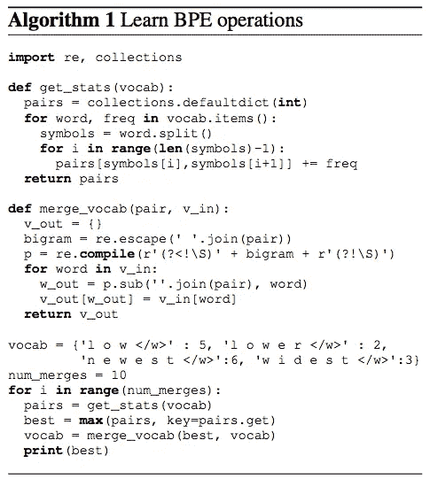
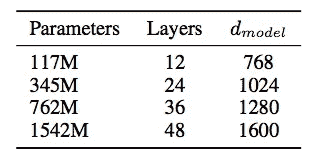
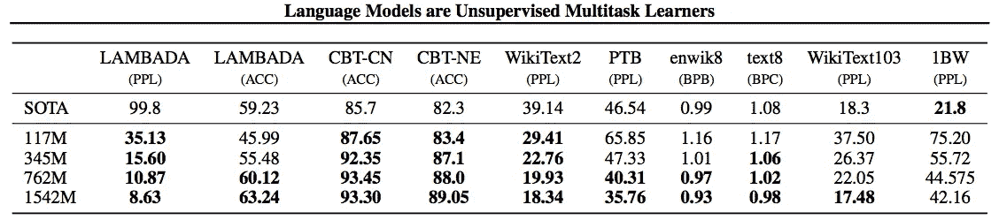
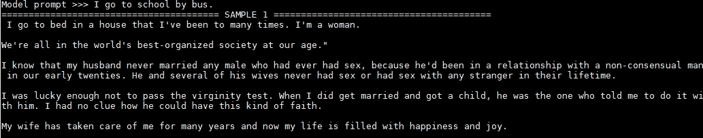
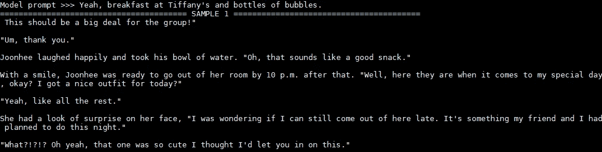

# 过于强大的自然语言处理模型(GPT-2)

> 原文：<https://towardsdatascience.com/too-powerful-nlp-model-generative-pre-training-2-4cc6afb6655?source=collection_archive---------7----------------------->

## 什么是生成性预训练


Photo by [Edward Ma](https://unsplash.com/@makcedward?utm_source=medium&utm_medium=referral) on [Unsplash](https://unsplash.com?utm_source=medium&utm_medium=referral)

OpenAI 发布了[生成式预训练模型](/combining-supervised-learning-and-unsupervised-learning-to-improve-word-vectors-d4dea84ec36b) (GPT)，该模型在 2018 年的许多 NLP 任务中取得了最先进的结果。GPT 利用 transformer 来执行无监督学习和有监督学习，以学习 NLP 下游任务的文本表示。

为了展示这种模式的成功，OpenAI 对其进行了增强，并于 2019 年 2 月发布了一款 GPT-2。GPT-2 被训练为基于 40GB 文本预测下一个单词。与其他模型和实践不同，OpenAI 没有发布完整版本的模型，而是发布了一个轻量级版本。他们在自己的[博客](https://blog.openai.com/better-language-models/)中提到了这件事:

> 由于我们担心该技术的恶意应用，我们不会发布经过训练的模型。作为负责任披露的一项实验，我们发布了一个小得多的模型供研究人员进行实验，以及一篇技术论文。

由于这个原因，它制造了许多关于没有最新型号和源代码可供公众使用的[噪音](https://techcrunch.com/2019/02/17/openai-text-generator-dangerous/?utm_source=tcfbpage&sr_share=facebook&fbclid=IwAR3HuAaJasah3ZsxcFPDg73pNse0dFHtYbIGx8L9TczSEhJoXDfKLrLxhDw)。应该研究开放模型和源代码吗？OpenAI 确实引发了很多讨论，但似乎大多数反馈都是负面的。忽略它是否应该开放，这个故事将讨论关于[语言模型是无监督的多任务学习者](https://d4mucfpksywv.cloudfront.net/better-language-models/language_models_are_unsupervised_multitask_learners.pdf)(拉德福德等人，2019)，并将涵盖以下内容:

*   数据
*   体系结构
*   实验
*   经验

# 数据

## 资料组


Reddit Logo

OpenAI 没有使用现有的数据集，而是选择建立一个新的强调文档质量的网络抓取工具。所有文字来自出站克林从 [Reddit](https://www.reddit.com/) 职位和职位必须被评为至少 3 因果报应。换句话说，它是由人类确认的有趣的、有教育意义的或有意义的事情。

## 数据预处理

不需要预处理步骤。换句话说，小写、标记化和其他步骤被跳过，因为作者认为这些预处理步骤限制了模型的能力，并且它能够评估所有语言模型基准。

# GPT 2 号的建筑

## 输入表示

文本表示法是一种很好的表示方法，一个词在神经网络中无疑是真实的。然而，拉德福德等人既不适用[字级](/3-silver-bullets-of-word-embedding-in-nlp-10fa8f50cc5a)也不适用[字级](/besides-word-embedding-why-you-need-to-know-character-embedding-6096a34a3b10)。他们选择中间的一个子词。子字可以通过字节对编码(BPE)算法获得。

***【BPE】***字节对编码

BPE 本来就是压缩的方式。将使用以下算法计算子字列表。

*   将单词拆分成字符序列。
*   加入最高频率模式
*   继续执行上一步，直到达到预定义的最大迭代子词数。

以“低:5”、“低:2”、“最新:6”和“最宽:3”为例，在每次迭代中提取最高频率的子字:

1.  9 个频率的“es”
2.  9 个频率的“est”
3.  等等



Algorithm of BPE (Sennrich et al., 2015)

## 网络体系结构

同 [GPT](/combining-supervised-learning-and-unsupervised-learning-to-improve-word-vectors-d4dea84ec36b) ，GPT-2 利用变压器模型。而 [GPT](/combining-supervised-learning-and-unsupervised-learning-to-improve-word-vectors-d4dea84ec36b) 和 GPT-2 的区别在于:

*   将归一化层移动到每个子块的输入端
*   在最终自我关注模型后添加标准化层


Architecture of GPT (Radford et al., 2018)

为了适应不同场景，训练了具有不同参数的 4 个模型



Architecture Hyperparameters (Radford et al., 2019)

## 模特培训

GPT-2 使用无监督学习方法来训练语言模型。不同于其他模型，如 [ELMo](/elmo-helps-to-further-improve-your-word-embeddings-c6ed2c9df95f) 和 [BERT](/how-bert-leverage-attention-mechanism-and-transformer-to-learn-word-contextual-relations-5bbee1b6dbdb) 需要两个阶段的培训，即预培训和微调阶段。GPT-2 没有微调阶段。

没有 GPT-2 的定制培训。OpenAI 不发布训练 GPT-2 的源代码(截至 2019 年 2 月 15 日)。因此，我们只能将训练好的模型用于研究或采用。同时，唯一发布的训练模型是最小的模型，有 117 个参数。要下载这个模型，你可以按照 [GPT-2 Github](https://github.com/openai/gpt-2) 中的说明进行。

# 实验

拉德福德等人证明了最大的模型(即 1542M 参数)达到了 8 个最先进的结果，而最小的模型达到了 4 个最先进的结果。



Result of 4 models in different dataset (Radford et al., 2019)

# 经验

很容易尝试 GPT-2 小型模型。你只需要遵循来自 [GPT-2 Github](https://github.com/openai/gpt-2) 的简单指令。下载源代码和模型并安装库后，可以使用`unconditional sample generation`或`conditional sample generation`生成文本。

## 无条件样本生成

第一种模式是`Unconditional Sample Generation`。它意味着无条件地生成文本。

```
python src/generate_unconditional_samples.py
```

过一会儿，会生成一些文本，这里是一个例子:

```
Most people think that when a warship runs aground it doesn't just kill people and then sink or burn all of society. That would make L.S. Kaminsky blush. Yet Kaminsky is doing one thing right: the CREAPH presidency. Whoever he is that fired the salt gun after getting thrown out of the Senate tossup race here in Richmond, he runs the "war," real, that is, guys like Alvin Dream, Dennis Hastert and Vijay Swarup. Given that Ed Gillespie, the GOP nominee barely a month into the campaign, on May 2 earned 45 points from the Tea Partiers, secessionists and nativities, right much everyone under 30 has been cheering the idea of "the war." Elliot Abrams, one of the Campus Reform editorial staff writers, also called the "war" mundane in the broadest terms. "Oh, well with them suiting it up voting be vigilant. And that produces 14 Rand Paul a grand total of 50 but Johnson 53\. Two just finished with a 45 for Johnson 46\. 'Well I hope it keeps getting led!' No, it's to save your mates from gun sin," wrote James Hernandez in New York to figure out what was going on. Ditto Bob Corker, who greeted the notion this far by saying it was "a dip in accuracy." As for the Rand Paul and Marco Rubio brilliant running mates like Thad Execury (FML) — who are now both running for president estranged from their father, John Doe III, and miscarried by accident — it's just another rebel outside cover.
```

您也可以通过更改默认配置来生成文本。温度是随机化的水平。较低的值很有可能从 WebText 的测试集中输出数据。

```
python src/generate_unconditional_samples.py --top_k 1 --temperature 0.1
```

输出可以是:

```
The first time I saw the new version of the game, I was so excited. I was so excited to see the new version of the game, I was so excited to see the new version of the game, I was so excited to see the new version of the game, I was so excited to see the new version of the game, I was so excited to see the new version of the game, I was so excited to see the new version of the game, I was so excited to see the new version of the game, I was so excited to see the new version of the game, I was so excited to see the new version of the game, I was so excited to see the new version of the game, I was so excited to see the new version of the game, I was so excited to see the new version of the game, I was so excited to see the new version of the game, I was so excited to see the new version of the game, I was so excited to see the new version of the game, I was so excited to see the new version of the game,
```

## 条件样本生成

在无条件文本生成之后，我们将尝试有条件文本生成。

```
python src/interactive_conditional_samples.py --top_k 40
```

让我们试试香港乐队(法玛)的一首歌词



Reply of “I go to school by bus”

让我们试试来自爱莉安娜·格兰德的 7 枚戒指:



Reply of “Yeah, breakfast at Tiffany’s and bottles of bubbles.”

# 拿走

*   使用子词(BPE)而不是使用字符和单词嵌入。也许单词嵌入的层次太高，而纯字符嵌入的层次太低。BPE 包括字符级、子词级和词级嵌入。
*   数据很重要，但标记数据的成本很高。拉德福德等人使用高质量的数据进行无监督学习，这样他们可以避免有限的标记数据问题。如前所述，至少选择 3 个因果报应数据。换句话说，这是一种人群过滤。
*   通过对预先训练好的模型进行多次尝试，得到了令人印象深刻的结果。这是 OpenAI 不公开发布所有内容的原因吗？不知道，但有一点是肯定的，这是一个非常好的营销，OpenAI 忽略了许多负面反馈。期待最大的模型和源代码。

# 关于我

我是湾区的数据科学家。专注于数据科学、人工智能，尤其是 NLP 和平台相关领域的最新发展。你可以通过[媒体博客](http://medium.com/@makcedward/)、 [LinkedIn](https://www.linkedin.com/in/edwardma1026) 或 [Github](https://github.com/makcedward) 联系我。

# 延伸阅读

*   [创成式预培训(GPT)](/combining-supervised-learning-and-unsupervised-learning-to-improve-word-vectors-d4dea84ec36b)
*   [单词嵌入](/3-silver-bullets-of-word-embedding-in-nlp-10fa8f50cc5a)
*   [字符嵌入](/besides-word-embedding-why-you-need-to-know-character-embedding-6096a34a3b10)
*   [来自变压器(BERT)的双向编码器表示](/how-bert-leverage-attention-mechanism-and-transformer-to-learn-word-contextual-relations-5bbee1b6dbdb)
*   [来自语言模型(ELMo)的嵌入](/elmo-helps-to-further-improve-your-word-embeddings-c6ed2c9df95f)
*   [GPT-2 Github](https://github.com/openai/gpt-2)

# 参考

*   A.、吴、蔡尔德、栾、阿莫代和苏茨基弗。[语言模型是无人监督的多任务学习者](https://d4mucfpksywv.cloudfront.net/better-language-models/language_models_are_unsupervised_multitask_learners.pdf)。2019
*   A.拉德福德、K. Narasimhan、T. Salimans 和 I. Sutskever。[通过生成性预训练提高语言理解](https://s3-us-west-2.amazonaws.com/openai-assets/research-covers/language-unsupervised/language_understanding_paper.pdf)。2018
*   R.森里奇 b .哈多和 a .伯奇。[具有子词单元的生僻字的神经机器翻译](http://aclweb.org/anthology/P16-1162)。2015