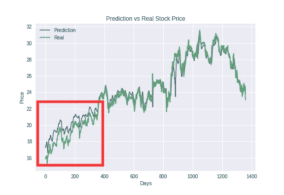

# 对任何机器学习项目至关重要的工具/技巧

> 原文：<https://towardsdatascience.com/tools-tips-critical-to-any-machine-learning-project-f01b59ad01e6?source=collection_archive---------22----------------------->


from pixabay [here](https://pixabay.com/vectors/a-i-ai-anatomy-2729781/)

这是[系列](https://medium.com/@asutoshnayak/predicting-stock-price-with-lstm-13af86a74944)“如何利用 LSTM 预测股价”的最后一篇帖子。在上一篇文章中，我们已经看到了[如何微调神经网络的超参数](https://medium.com/@asutoshnayak/finding-the-right-architecture-for-neural-network-b0439efa4587)。在这篇文章中，我将提到一些对于任何 ML 项目来说都是常见和不可或缺的组件，但是它们经常被忽略(甚至我最初也是这样做的)。

## 记录

在早期阶段，这似乎是一种开销，但是我们不能夸大日志在调试任何应用程序中的作用。[python 中的日志](https://docs.python.org/3/library/logging.html)很简单，但是我们必须做一些初始化来使它更有效。以下是我所做的。

这段代码带有注释，非常容易理解。您也可以添加其他处理程序。一旦您设置了日志程序，实际的日志记录就很简单了:

```
logging.debug("Train--Test size {} {}".**format**(**len**(df_train), **len**(df_test)))
```

当您有一个 bug，但不知道它来自哪里时，日志可以证明是一个分析残骸的黑盒。

## 形象化

视觉化是另一个有时被忽视的领域。绘制训练误差与验证误差以及预测与真实数据的关系图对于理解正在发生的事情是绝对必要的，尤其是在涉及如此多参数的神经网络中。为了绘制误差图，我们需要存储所有时期的所有误差。它真的有助于识别过度拟合/欠拟合。使用 Keras 非常简单:


同样，您可以绘制预测值与实际值的对比图，以寻找任何异常。我给你举个例子。对于这个项目，在最初的试验中，我只关注最初的预测值，它们总是不太好。但当我开始绘制整个预测时，我意识到由于某种原因，该模型仅在测试数据的初始部分做得不太好。但是时间线的其他部分都很好。见下文。



To realise that model performance over the complete test set is not so bad, we need bigger picture

虽然我很确定这可以通过更多的调整得到进一步的改善。

## 释放 Keras

虽然我在这里使用 Keras 作为例子，但是在您熟悉的任何其他工具中也应该有类似的工具。

1.  **CSVLogger** :顾名思义，它可以用来在每个时期结束时记录各种变量。默认情况下，它存储纪元编号、列车丢失和验证丢失。但是也可以存储你自己的变量。本节末尾包含所有要点的示例代码。
2.  **提前停止**:如果 Keras 检测到长时间没有改善，用于停止训练。有各种属性来定义系统何时应该停止，如“耐心”,它说明在宣布模型没有改善之前，Keras 应该允许运行多少个时期。类似地,“min_delta”是另一个有用的参数。可以想象，这些参数会因不同的问题而有所不同。例如，你必须监控你的验证损失随着时代的变化有多少(这也取决于你的学习速度)。这就是日志记录派上用场的地方。你可能会想，我的训练每一个时期需要 10 秒钟，如果我的训练不提前停止，再多跑 30 个时期，对我来说没问题；我可以抽出 5 分钟，或者我会手动停止。但是回想一下以前的文章，我们使用了各种自动化超参数调优工具和网格搜索。你不能控制每一次迭代。如果你要检查 50 个组合，并且每个组合节省了 5 分钟(这实际上比那个多得多，因为可能有许多组合只是*坏*)那么你就节省了 250 分钟！**但是不要为“耐心”使用太小的值**否则系统会过早停止，即使它可以在更多的时期后得到改善。
3.  **ModelCheckpoint** :如果‘save _ best _ only’为真，则该回调在每个时期后保存训练好的模型，或者只保存所有时期中最好的一个。同样，这在自动化大量参数组合搜索时非常方便。

## 以结构化的方式保存所有数据，以便以后分析

就像一般生活一样，在机器学习中，我们可以从回顾中学到很多东西。做得不太好的训练(有一些超参数组合)也能给出一些有价值的见解。例如，让我们假设您正在调整辍学率或学习率。如果您已经保存了以前训练的所有数据，那么您可以比较在 150 个纪元时的训练损失，从而决定模型是否学习得更快。或者你甚至会发现一些有趣的东西，可以应用到你的下一个项目中。

对于这个项目，我将每次更改/尝试的结果存储在一个文件夹结构中，如下所示:

我想以此结束这篇文章和我的博客系列。我希望我能对所有的 ML 粉丝有所帮助。

因为我是从预测 ML 公司的股票价格开始这个系列的，所以在结束之前我想说几句。虽然我们发现我们可以预测未来的价格有一定的准确性，但它仍然不适合捕捉特殊情况(基于其他市场因素的突然价格变化)。这里的目的不是完全解决问题(尽管如果我们找到一种方法将其他因素整合到我们的问题陈述中，我们可以做到)，而是意识到，我们可以用机器学习，坐在家里，用我们平庸的笔记本电脑做什么。这就是机器学习的力量。

继续编码。