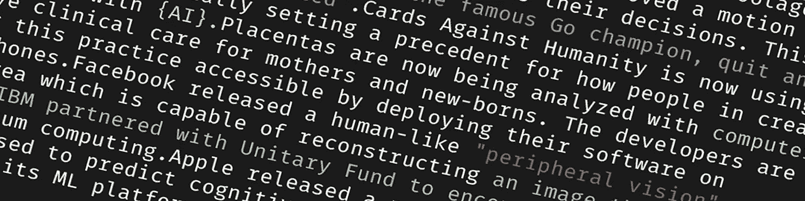

# 10 大人工智能新闻:11 月回顾

> 原文：<https://towardsdatascience.com/top-10-ai-news-november-in-review-f0f8bbe4a9c5?source=collection_archive---------50----------------------->

## 今年 11 月，人工智能世界发生了什么

1.  澳大利亚开始在交通摄像头上使用计算机视觉来检测人们在开车时使用手机的情况。
2.  英国批准了一项动议，对无法解释人工智能如何影响其决策的公司进行罚款。这预计将于 2020 年生效。
3.  著名围棋冠军李世石(Lee Se-dol)退出，并称 AI 是“无法被打败的实体”。
4.  反对人类的卡片现在正在使用人工智能来编写他们的卡片，这可能为如何用人工智能取代创造性工作的人开创了一个先例。
5.  现在，胎盘正在用计算机视觉进行分析，以改善对母亲和新生儿的临床护理。开发者的目标是通过在智能手机上部署他们的软件来实现这一实践。
6.  脸书发布了一种类似人类的“外围视觉”GAN，称为 DeepFovea，能够重建只有 10%像素的图像。
7.  IBM 与 Unitary Fund 合作，鼓励与量子计算相关的开源项目。
8.  苹果发布了一篇论文，其中他们表明智能手机的使用可以用来预测认知障碍。
9.  Python 3.8 现已推出。
10.  Lyft 以开源方式发布了它的 ML 平台 Flyte。

